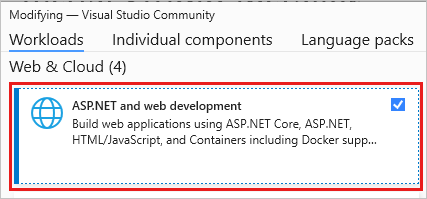
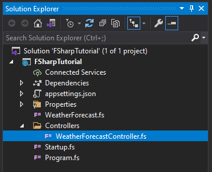

# Tutorial: Create an ASP.NET Core web service in F#

The Visual Studio Integrated Development Environment (IDE) supports F# for several product types.
You can easily create a full web services app.

For more information about coding in F#, see [What is F#](/dotnet/fsharp/what-is-fsharp).
To create a Hello World console app, see [Get started with F# in Visual Studio](/dotnet/fsharp/get-started/get-started-visual-studio).

In this tutorial, you learn how to:

> [!div class="checklist"]
> - Create an ASP.NET Core web service.
> - Add content to the **HttpGet** member in F#.
> - Build and run your program.

## Prerequisites

::: moniker range="vs-2019"
You need Visual Studio to complete this tutorial.
Visit the [Visual Studio downloads page](https://visualstudio.microsoft.com/vs/) for a free version.
::: moniker-end
::: moniker range=">=vs-2022"
You need Visual Studio to complete this tutorial.
Visit the [Visual Studio downloads page](https://aka.ms/vs/download/?cid=learn-onpage-download-cta) for a free version.
::: moniker-end

Be sure you have the necessary components installed:

1. Select the **Start** Windows icon and type *Visual Studio Installer*.
1. Select **Modify** to see your installed workloads.
1. Make sure that **ASP.NET and web development** is selected, or add it.

   

1. If you made any changes, select **Modify** to install the components.

## Create an ASP.NET Core web service

In this section, you'll create an ASP.NET Core Web API project.
The project type comes with template files that constitute a functional web service, before you've even added anything.

1. Start Visual Studio.

1. In the start window, select **Create a new project**.

1. On the **Create a new project** page, type **F# web** into the search box. Select the **ASP.NET Core Web API** project template, and then select **Next**.

1. In the **Configure your new project** dialog box, for **Project name**, enter *FSharpTutorial*.

1. In the **Additional information** dialog box, accept the default version for **Framework**.

   When you select **Create**, Visual Studio creates the new F# project. You can see the project components in the Solution Explorer window.
   Visual Studio presents an **Overview** page.

1. In the **Solution Explorer** toolbar, expand the **Controllers** folder, then choose the **WeatherForecastController.fs** controller to open the code file in the editor.

   

1. Next, modify the `Get()` member to be the following code:

   ```fsharp
   [<HttpGet>]
   member this.Get() =
       let values = [|"Hello"; "World"; "First F#/ASP.NET Core web API!"|]
       ActionResult<string[]>(values)
   ```

   This code contains an F# array of values that are is bound to the `values` name.
   It passes the values to the ASP.NET Core model-view-controller framework as an `ActionResult`.
   ASP.NET Core takes care of the rest for you.

1. Select the **F5** key to run your project.
   A browser window opens to display your Hello World message.

> [!NOTE]
> If you get a message that asks if you want to accept an IIS SSL Express certificate, choose **Yes** to view the code in a web browser, and then choose **Yes** if you receive a follow-up security warning message.

## Next steps

If you haven't already, check out the [Tour of F#](/dotnet/fsharp/tour).
This tour describes the core features of the F# language.
It provides an overview of some of the capabilities of F# and code samples that you can run.

> [!div class="nextstepaction"]
> [Tour of F#](/dotnet/fsharp/tour)

## See also

- [F# language reference](/dotnet/fsharp/language-reference/index)
- [Type inference](/dotnet/fsharp/language-reference/type-inference)
- [Symbol and operator reference](/dotnet/fsharp/language-reference/symbol-and-operator-reference/index)
