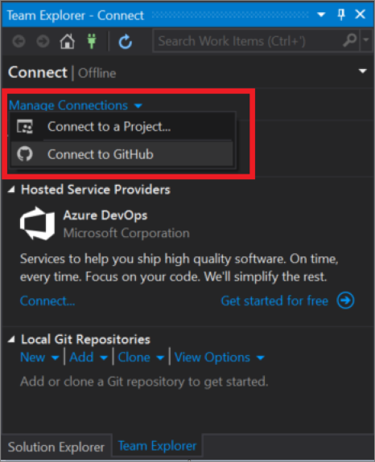

# Tutorial: Open a project from a repo

In this tutorial, you'll use Visual Studio to connect to a Git or Azure DevOps repository and then open a project.

> [!NOTE]
> If you've already connected to a repository by using Visual Studio, the user interface (UI) might look different than what appears in this tutorial.

## Open a project from Git

1. Open Visual Studio 2017.

1. From the top menu bar, choose **File** > **Open** > **Open from Source Control**.

   The **Team Explorer - Connect** pane opens.

    

1. In the **Local Git Repositories** section, choose **Clone**.

    

1. In the box that says ***Enter the URL of a Git repo to clone***, type or paste the URL for your repo, and then press **Enter**. (You might receive a prompt to log in to your Git repo; if so, do so.)

   After Visual Studio clones your repo, Team Explorer closes and Solution Explorer opens. A message appears that says *Click on Solutions and Folders above to view a list of Solutions*.

   

1. Choose **Solutions and Folders**. Then, make your selection from the drop-down list that appears.

   

   If you have a solution file available, it will appear here. Choose it, and Visual Studio opens your solution. (Alternatively, you can use the folder structure within Solution Explorer to navigate to and then open your solution file.) Then, to view your code in the Visual Studio code editor, choose **Program.cs**.

### Open a project from GitHub

You can use the same procedure in the previous section to open a project from GitHub. The following animation shows you an example of what that looks like to open a project in GitHub by using Visual Studio 2017:

   

If you're logged in to a [GitHub Enterprise](https://github.com/enterprise) account, you might be able to open your GitHub project from Visual Studio by using the **Manage Connections** drop-down list. Choose **Connect to GitHub**, if it appears. 

   

If it doesn't appear or you don't have a GitHub Enterprise account, use the **Local Git Repositories**  method, as listed in the previous procedure, to connect and open your project.

## Open a project from Azure DevOps

1. Open Visual Studio 2017.

1. From the top menu bar, choose **File** > **Open** > **Open from Source Control**.

   The **Team Explorer - Connect** pane opens.

    

1. There are two ways to connect to your Azure DevOps repo:

    a. In the **Hosted Service Providers** section, choose **Connect...**.

    b. In the **Manage Connections** drop-down list, choose **Connect to a Project...**.

1. What you see next depends on your environment and if you are logged in or not. In the **Connect to a Project" dialog box, choose the repo that you want to connect to.

    1. 

   If you are logged in to the account that you use 

1. In the box that says ***Enter the URL of a Git repo to clone***, type or paste the URL for your repo.

   Visual Studio opens your project.

## Next steps

If you're ready to code with Visual Studio, dive into any of the following language-specific tutorials:

- [Visual Studio tutorials | **C#**](./csharp/index.yml)
- [Visual Studio tutorials | **Visual Basic**](./visual-basic/index.yml)
- [Visual Studio tutorials | **C++**](/cpp/get-started/)
- [Visual Studio tutorials | **Python**](/visualstudio/python/)
- [Visual Studio tutorials | **JavaScript**, **TypeScript**, **Node.js**](/visualstudio/javascript/)

## See also

- [Visual Studio: Connect to projects by using Team Explorer](./ide/connect-team-project)
- [Azure DevOps Services: Connect to a project in Azure DevOps](/azure/devops/organizations/projects/connect-to-projects/)
- [Azure DevOps Services: Connect Azure Boards to GitHub](/azure/devops/boards/github/connect-to-github/)
