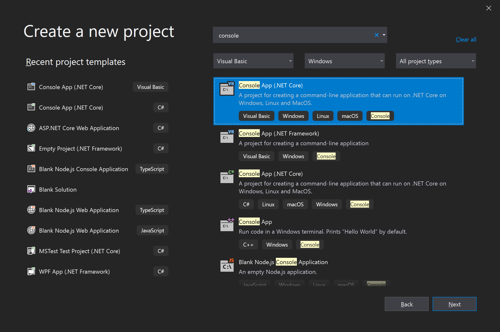
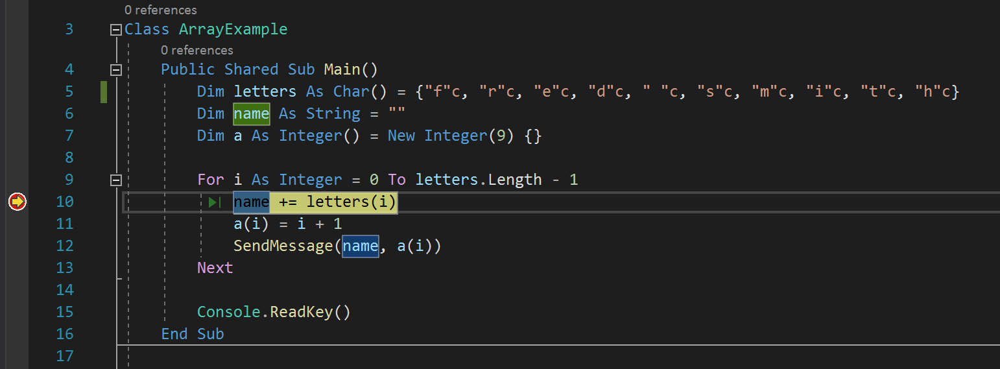
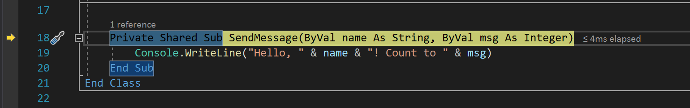
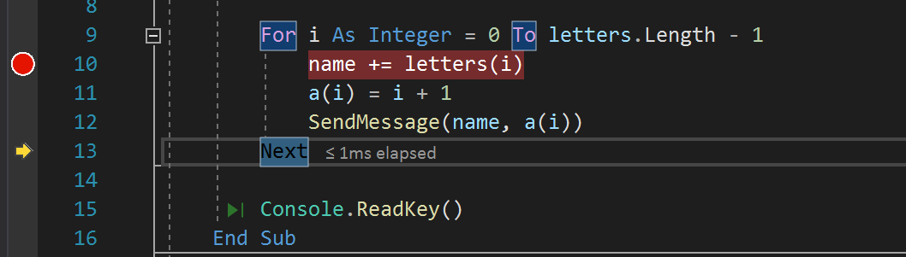
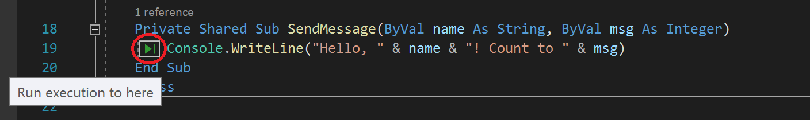
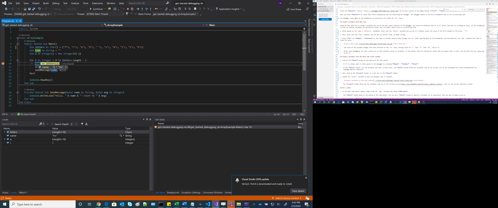
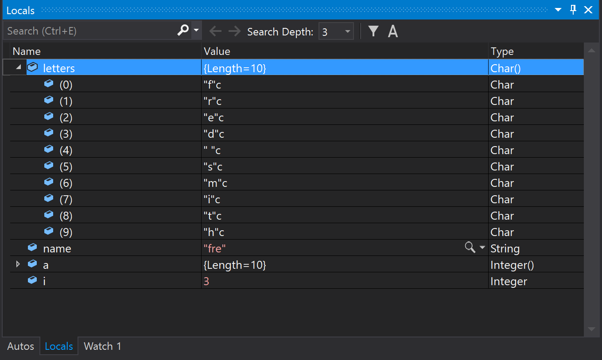
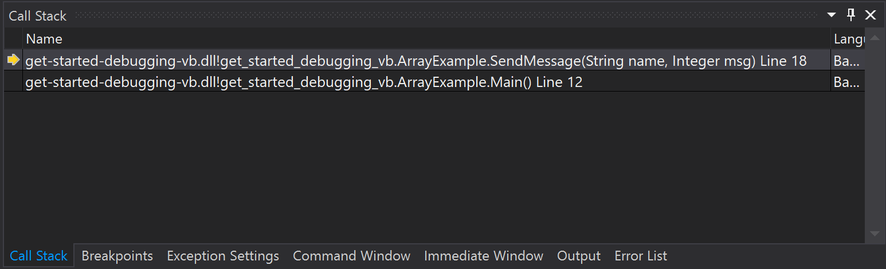

# Tutorial: Learn to debug Visual Basic code using Visual Studio

This article introduces the features of the Visual Studio debugger in a step-by-step walkthrough. If you want a higher-level view of the debugger features, see [First look at the debugger](../../debugger/debugger-feature-tour.md). When you *debug your app*, it usually means that you're running your application with the debugger attached. When you do this task, the debugger provides many ways to see what your code is doing while it runs. You can step through your code and look at the values stored in variables, you can set watches on variables to see when values change, you can examine the execution path of your code, see whether a branch of code is running, and so on. If this exercise is the first time that you've tried to debug code, you might want to read [Debugging for absolute beginners](../../debugger/debugging-absolute-beginners.md) before going through this article.

Although the demo app is Visual Basic, most of the features are applicable to C#, C++, F#, Python, JavaScript, and other languages supported by Visual Studio (F# doesn't support Edit-and-continue. F# and JavaScript don't support the **Autos** window). The screenshots are in Visual Basic.

In this tutorial, you will:

> [!div class="checklist"]
> * Start the debugger and hit breakpoints.
> * Learn commands to step through code in the debugger
> * Inspect variables in data tips and debugger windows
> * Examine the call stack

## Prerequisites

You must have Visual Studio 2019 installed and the **.NET Core cross-platform development** workload.

::: moniker range="vs-2019"

If you haven't already installed Visual Studio, go to the [Visual Studio downloads](https://aka.ms/vs/download/?cid=learn-onpage-download-cta) page to install it for free.

If you need to install the workload but already have Visual Studio, go to **Tools** > **Get Tools and Features...**, which opens the Visual Studio Installer. The Visual Studio Installer launches. Choose the **.NET Core cross-platform development** workload, then choose **Modify**.

::: moniker-end

::: moniker range=">=vs-2022"

If you haven't already installed Visual Studio, go to the [Visual Studio downloads](https://aka.ms/vs/download/?cid=learn-onpage-download-cta) page to install it for free.

If you need to install the workload but already have Visual Studio, go to **Tools** > **Get Tools and Features...**, which opens the Visual Studio Installer. The Visual Studio Installer launches. Choose the **.NET desktop development** workload, then choose **Modify**.

::: moniker-end

## Create a project

First, you create a .NET Core console application project. The project type comes with all the template files you need, before you've even added anything!

1. Open Visual Studio. If the start window isn't open, select **File** > **Start Window**.

2. On the start window, select **Create a new project**.

::: moniker range="vs-2019"
3. On the **Create a new project** window, enter *console* in the search box. Next, choose **Visual Basic** from the Language list, and then choose **Windows** from the Platform list. 

   After you apply the language and platform filters, choose the **Console App** template for .NET Core, and then select **Next**.

   

   > [!NOTE]
   > If you do not see the **Console App** template, you can install it from the **Create a new project** window. In the **Not finding what you're looking for?** message, choose the **Install more tools and features** link. Then, in the Visual Studio Installer, choose the **.NET Core cross-platform development** workload.

4. In the **Configure your new project** window, enter *get-started-debugging* in the **Project name** box. Then, select **Next**.

5. Select the recommended target framework (.NET 8.0 or Long-term support), and then select **Create**.
::: moniker-end

::: moniker range=">=vs-2022"
3. On the **Create a new project** window, enter *console* in the search box. Next, choose **Visual Basic** from the Language list, and then choose **Windows** from the Platform list. 

   After you apply the language and platform filters, choose the **Console App** template for .NET Core, and then select **Next**.

   :::image type="content" source="media/vs-2022/get-started-create-console-project.png" alt-text="Screenshot showing the Create a new project window with 'console' in the search box, and 'Visual Basic' and 'Windows' selected for the Language and Platform filters. The Console Application project template is selected.":::

   > [!NOTE]
   > If you don't see the **Console App** template, you can install it from the **Create a new project** window. In the **Not finding what you're looking for?** message, choose the **Install more tools and features** link. Then, in the Visual Studio Installer, choose the **.NET desktop development** workload.

4. In the **Configure your new project** window, enter *get-started-debugging* in the **Project name** box. Then, select **Next**.

5. In the **Additional information** window, ensure **.NET 8.0** is selected in the **Framework** dropdown menu, and then select **Create**.
::: moniker-end

Visual Studio opens your new project.

## Create the application

In *Program.vb*, replace all of the default code with the following code instead:

```vb
Imports System

Class ArrayExample
  Public Shared Sub Main()
    Dim letters As Char() = {"f"c, "r"c, "e"c, "d"c, " "c, "s"c, "m"c, "i"c, "t"c, "h"c}
    Dim name As String = ""
    Dim a As Integer() = New Integer(9) {}

    For i As Integer = 0 To letters.Length - 1
      name += letters(i)
      a(i) = i + 1
      SendMessage(name, a(i))
    Next

    Console.ReadKey()
  End Sub

  Private Shared Sub SendMessage(ByVal name As String, ByVal msg As Integer)
    Console.WriteLine("Hello, " & name & "! Count to " & msg)
  End Sub
End Class
```

## Start the debugger!

::: moniker range="<=vs-2019"

1. Press **F5** (**Debug > Start Debugging**) or the **Start Debugging** button :::image type="icon" source="../../debugger/media/dbg-tour-start-debugging.png"::: in the Debug Toolbar.

   **F5** starts the app with the debugger attached to the app process, but right now we haven't done anything special to examine the code. So the app just loads and you see the console output.

   ```cmd
   Hello, f! Count to 1
   Hello, fr! Count to 2
   Hello, fre! Count to 3
   Hello, fred! Count to 4
   Hello, fred ! Count to 5
   Hello, fred s! Count to 6
   Hello, fred sm! Count to 7
   Hello, fred smi! Count to 8
   Hello, fred smit! Count to 9
   Hello, fred smith! Count to 10
   ```

   In this tutorial, you take a closer look at this app using the debugger and get a look at the debugger features.

2. Stop the debugger by pressing the red stop button (**Shift** + **F5**). :::image type="icon" source="../../debugger/media/dbg-tour-stop-debugging.png"::: 

3. In the console window, press a key to close the console window.

::: moniker-end

::: moniker range=">=vs-2022"

1. Press **F5** (**Debug > Start Debugging**) or select the green **Start Debugging** button in the Debug Toolbar.

   :::image type="content" source="media/vs-2022/debug-toolbar-start-button.png" alt-text="Screenshot showing the Debug Toolbar with the green Start Debugging button highlighted.":::

   **F5** starts the app with the debugger attached to the app process, but right now we haven't done anything special to examine the code. So the app just loads and you see the console output.

   ```cmd
   Hello, f! Count to 1
   Hello, fr! Count to 2
   Hello, fre! Count to 3
   Hello, fred! Count to 4
   Hello, fred ! Count to 5
   Hello, fred s! Count to 6
   Hello, fred sm! Count to 7
   Hello, fred smi! Count to 8
   Hello, fred smit! Count to 9
   Hello, fred smith! Count to 10
   ```

   In this tutorial, you take a closer look at this app using the debugger and get a look at the debugger features.

2. Stop the debugger by pressing (**Shift** + **F5**) or select the red **Stop Debugging** button in the Debug Toolbar.

   :::image type="content" source="media/vs-2022/debug-toolbar-stop-button.png" alt-text="Screenshot showing the Debug Toolbar with the red Stop Debugging button highlighted.":::

3. In the console window, press a key to close the console window.

::: moniker-end
## Set a breakpoint and start the debugger

::: moniker range="<=vs-2019"

1. In the `For` loop of the `Main` function, set a breakpoint by clicking in the left margin on the following line of code:

   `name += letters(i)`

   A red circle :::image type="icon" source="../../debugger/media/dbg-breakpoint.png"::: appears where you set the breakpoint.

   Breakpoints are one of the most basic and essential features of reliable debugging. A breakpoint indicates where Visual Studio should suspend your running code so you can take a look at the values of variables, or the behavior of memory, or whether or not a branch of code is getting run.

2. Press **F5** or the **Start Debugging** button. :::image type="icon" source="../../debugger/media/dbg-tour-start-debugging.png"::: The app starts and the debugger runs to the line of code where you set the breakpoint.

   

   The yellow arrow represents the statement where the debugger paused. Code execution suspends at the same point (this statement isn't yet executed).

   If the app isn't yet running, **F5** starts the debugger and stops at the first breakpoint. Otherwise, **F5** continues running the app to the next breakpoint.

   Breakpoints are a useful feature when you know the line of code or the section of code that you want to examine in detail. For information on the different types of breakpoints you can set, such as conditional breakpoints, see [Using breakpoints](../../debugger/using-breakpoints.md).

::: moniker-end

::: moniker range=">=vs-2022"

1. In the `For` loop of the `Main` function, set a breakpoint by clicking in the left margin on the following line of code:

   `name += letters(i)`

   A red circle appears where you set the breakpoint.

   Breakpoints are one of the most basic and essential features of reliable debugging. A breakpoint indicates where Visual Studio should suspend your running code so you can take a look at the values of variables, or the behavior of memory, or whether or not a branch of code is getting run.

2. Press **F5** (**Debug > Start Debugging**) or the **Start Debugging** button in the Debug Toolbar, the app starts, and the debugger runs to the line of code where you set the breakpoint.

   :::image type="content" source="media/vs-2022/get-started-hit-breakpoint-vb.png" alt-text="Screenshot showing the Visual Studio Code editor window with execution stopped at a breakpoint.":::

   The yellow arrow represents the statement on which the debugger paused, which also suspends app execution at the same point (this statement isn't yet executed).

   If the app isn't yet running, **F5** starts the debugger and stops at the first breakpoint. Otherwise, **F5** continues running the app to the next breakpoint.

   Breakpoints are a useful feature when you know the line of code or the section of code that you want to examine in detail. For information on the different types of breakpoints you can set, such as conditional breakpoints, see [Using breakpoints](../../debugger/using-breakpoints.md).

::: moniker-end
## Navigate code in the debugger using step commands

::: moniker range="<=vs-2019"

Mostly, we use the keyboard shortcuts here, because it's a good way to get fast at executing your app in the debugger (equivalent commands such as menu commands are shown in parentheses).

1. While code execution is paused in the `For` loop in the `Main` method, press **F11** (or choose **Debug > Step Into**) twice to advance to the `SendMessage` method call.

   After pressing **F11** twice, you should be at this line of code:

   `SendMessage(name, a(i))`

1. Press **F11** one more time to step into the `SendMessage` method.

   The yellow pointer advances into the `SendMessage` method.

   

   F11 is the **Step Into** command and advances the app execution one statement at a time. F11 is a good way to examine the execution flow in the most detail. (To move faster through code, we show you some other options also.) By default, the debugger skips over nonuser code (if you want more details, see [Just My Code](../../debugger/just-my-code.md)).

   Let's say that you're done examining the `SendMessage` method, and you want to get out of the method but stay in the debugger. You can do this using the **Step Out** command.

1. Press **Shift** + **F11** (or **Debug > Step Out**).

   This command resumes app execution (and advances the debugger) until the current method or function returns.

   You should be back in the `For` loop in the `Main` method, paused at the `SendMessage` method call.

1. Press **F11** several times until you get back to the `SendMessage` method call again.

1. While code execution is paused at the method call, press **F10** (or choose **Debug > Step Over**) once.

   

   Notice this time that the debugger doesn't step into the `SendMessage` method. **F10** advances the debugger without stepping into functions or methods in your app code (the code still executes). By pressing **F10** on the `SendMessage` method call (instead of **F11**), we skipped over the implementation code for `SendMessage` (which maybe we're not interested in right now). For more information on different ways to move through your code, see [Navigate code in the debugger](../../debugger/navigating-through-code-with-the-debugger.md).

::: moniker-end

::: moniker range=">=vs-2022"

In this article, we use the keyboard shortcuts, because it's a good way to get fast at executing your app in the debugger (equivalent commands such as menu commands are shown in parentheses).

1. While code execution is paused in the `For` loop in the `Main` method, press **F11** (or choose **Debug > Step Into**) twice to advance to the `SendMessage` method call.

   After pressing **F11** twice, you should be at this line of code:

   `SendMessage(name, a(i))`

1. Press **F11** one more time to step into the `SendMessage` method.

   The yellow pointer advances into the `SendMessage` method.

   :::image type="content" source="media/vs-2022/get-started-f11-vb.png" alt-text="Screenshot showing a debug session in the Visual Studio Code editor with execution paused after stepping into the 'SendMessage' method.":::

   **F11** is the **Step Into** command and advances the app execution one statement at a time. **F11** is a good way to examine the execution flow in the most detail. (To move faster through code, we show you some other options also.) By default, the debugger skips over nonuser code (if you want more details, see [Just My Code](../../debugger/just-my-code.md)).

   Let's say that you're done examining the `SendMessage` method, and you want to get out of the method but stay in the debugger. You can do this using the **Step Out** command.

1. Press **Shift** + **F11** (or **Debug > Step Out**).

   This command resumes app execution (and advances the debugger) until the current method or function returns.

   You should be back in the `For` loop in the `Main` method, paused at the `SendMessage` method call.

1. Press **F11** several times until you get back to the `SendMessage` method call again.

1. While code execution is paused at the method call, press **F10** (or choose **Debug > Step Over**) once.

   :::image type="content" source="media/vs-2022/get-started-step-over-vb.png" alt-text="Screenshot showing a Debug session in the Visual Studio Code editor with execution paused after stepping over the 'SendMessage' method call.":::

   Notice this time that the debugger doesn't step into the `SendMessage` method. **F10** advances the debugger without stepping into functions or methods in your app code (the code still executes). By pressing **F10** on the `SendMessage` method call (instead of **F11**), we skipped over the implementation code for `SendMessage` (which maybe we're not interested in right now). For more information on different ways to move through your code, see [Navigate code in the debugger](../../debugger/navigating-through-code-with-the-debugger.md).

::: moniker-end

## Navigate code using Run to Click

::: moniker range="<=vs-2019"

1. Press **F5** to advance to the breakpoint again.

1. In the code editor, scroll down and hover over the `Console.WriteLine` method in the `SendMessage` method until the green **Run to Click** button appears. :::image type="icon" source="../../debugger/media/dbg-tour-run-to-click.png"::: The tooltip for the button shows "Run execution to here."

   

   > [!NOTE]
   > The **Run to Click** button is new in Visual Studio 2017. (If you don't see the green arrow button, use **F11** in this example instead to advance the debugger to the right place.)

2. Select the **Run to Click** button. :::image type="icon" source="../../debugger/media/dbg-tour-run-to-click.png":::

   The debugger advances to the `Console.WriteLine` method.

   Using this button is similar to setting a temporary breakpoint. **Run to Click** is handy for getting around quickly within a visible region of app code (you can select in any open file).

::: moniker-end

::: moniker range=">=vs-2022"

1. Press **F5** to advance to the breakpoint again.

1. In the code editor, scroll down and hover over the `Console.WriteLine` method in the `SendMessage` method until the green **Run to Click** button appears. The tooltip for the button shows "Run execution to here."

   :::image type="content" source="media/vs-2022/get-started-run-to-click-vb.png" alt-text="Screenshot showing the Run to Click button with tooltip highlighted on the left side of the code editor window.":::

2. Select the **Run to Click** button.

   The debugger advances to the `Console.WriteLine` method.

   Using this button is similar to setting a temporary breakpoint. **Run to Click** is handy for getting around quickly within a visible region of app code (you can select in any open file).

::: moniker-end

## Restart your app quickly

::: moniker range="<=vs-2019"

Select the **Restart** button :::image type="icon" source="../../debugger/media/dbg-tour-restart.png"::: in the Debug Toolbar (**Ctrl** + **Shift** + **F5**).

When you press **Restart**, it saves time versus stopping the app and restarting the debugger. The debugger pauses at the first breakpoint that is hit by executing code.

The debugger stops again at the breakpoint you previously set inside the `For` loop.

::: moniker-end

::: moniker range=">=vs-2022"

To restart your app, press the **Ctrl** + **Shift** + **F5** key combination, it saves time versus stopping the app and restarting the debugger. The debugger pauses at the first breakpoint that is hit by executing code.

The debugger stops again at the breakpoint you previously set inside the `For` loop.

::: moniker-end

## Inspect variables with data tips

::: moniker range="<=vs-2019"

Features that allow you to inspect variables are one of the most useful features of the debugger, and there are different ways to do it. Often, when you try to debug an issue, you're attempting to find out whether variables are storing the values that you expect them to have at a particular time.

1. While code execution is paused on the `name += letters[i]` statement, hover over the `letters` variable and you see its default value, the value of the first element in the array, `"f"c`.

1. Next, hover over the `name` variable, and you see its current value, an empty string.

1. Press **F5** (or **Debug** > **Continue**) a few times to iterate several times through the `For` loop, pausing again at the breakpoint, and hovering over the `name` variable each time to check its value.

   

   The value of the variable changes with each iteration of the `For` loop, showing values of `f`, then `fr`, then `fre`, and so on.

   Often, when debugging, you want a quick way to check property values on variables, to see whether they're storing the values that you expect them to store, and the data tips are a good way to do it.

::: moniker-end

::: moniker range=">=vs-2022"

Features that allow you to inspect variables are one of the most useful features of the debugger, and there are different ways to do it. Often, when you try to debug an issue, you're attempting to find out whether variables are storing the values that you expect them to have at a particular time.

1. While code execution is paused on the `name += letters[i]` statement, hover over the `letters` variable and you see its default value, the value of the first element in the array, `"f"c`.

1. Next, hover over the `name` variable, and you see its current value, an empty string.

1. Press **F5** (or **Debug** > **Continue**) a few times to iterate several times through the `For` loop, pausing again at the breakpoint, and hovering over the `name` variable each time to check its value.

   :::image type="content" source="media/vs-2022/get-started-data-tip-vb.png" alt-text="Screenshot showing debug execution stopped in the code editor with the name variable highlighted and a data tip showing the value.":::

   The value of the variable changes with each iteration of the `For` loop, showing values of `f`, then `fr`, then `fre`, and so on.

   Often, when debugging, you want a quick way to check property values on variables, to see whether they're storing the values that you expect them to store, and the data tips are a good way to do it.

::: moniker-end

## Inspect variables with the Autos and Locals windows

::: moniker range="<=vs-2019"

1. Look at the **Autos** window at the bottom of the code editor.

   If it's closed, open it while code execution is paused in the debugger by choosing **Debug** > **Windows** > **Autos**.

   In the **Autos** window, you see variables and their current value. The **Autos** window shows all variables used on the current line or the preceding line (Check documentation for language-specific behavior).

1. Next, look at the **Locals** window, in a tab next to the **Autos** window.

1. Expand the `letters` variable to show the elements that it contains.

   

   The **Locals** window shows you the variables that are in the current [scope](https://www.wikipedia.org/wiki/Scope_(computer_science)), that is, the current execution context.

::: moniker-end

::: moniker range=">=vs-2022"

1. Look at the **Autos** window at the bottom of the code editor.

   If it's closed, open it while code execution is paused in the debugger by choosing **Debug** > **Windows** > **Autos**.

   In the **Autos** window, you see variables and their current value. The **Autos** window shows all variables used on the current line or the preceding line (Check documentation for language-specific behavior).

1. Next, look at the **Locals** window, in a tab next to the **Autos** window.

1. Expand the `letters` variable to show the elements that it contains.

   :::image type="content" source="media/vs-2022/get-started-locals-window-vb.png" alt-text="Screenshot showing the Locals Window with the 'letters' variable expanded to show the value and type of the elements it contains.":::

   The **Locals** window shows you the variables that are in the current [scope](https://www.wikipedia.org/wiki/Scope_(computer_science)), that is, the current execution context.

::: moniker-end

## Set a watch

::: moniker range="<=vs-2019"

In the main code editor window, right-click the `name` variable and choose **Add Watch**.

The **Watch** window opens at the bottom of the code editor. You can use a **Watch** window to specify a variable (or an expression) that you want to keep an eye on.

Now, you have a watch set on the `name` variable, and you can see its value change as you move through the debugger. Unlike the other variable windows, the **Watch** window always shows the variables that you're watching (they're grayed out when out of scope).

::: moniker-end

::: moniker range=">=vs-2022"

You can specify a variable, or an expression, that you want to keep an eye on as you step through code&mdash;by adding it to the **Watch** window.

1. While the debugger is paused, right-click the `name` variable and choose **Add Watch**.

   The **Watch** window opens by default at the bottom of the code editor.

1. Now that you've set a watch on the `name` variable, step through your code to see the value of the `name` variable change with each `for` loop iteration. 

   Unlike the other variable windows, the **Watch** window always shows the variables that you're watching. Variables that are out of scope are displayed as unavailable.

For more information about the **Watch** window, see [Watch variables with Watch windows](/visualstudio/debugger/watch-and-quickwatch-windows?view=vs-2022&preserve-view=true).

::: moniker-end

## Examine the call stack

::: moniker range="<=vs-2019"

1. While code execution is paused in the `For` loop, select the **Call Stack** window, which is by default open in the lower right pane.

   If it's closed, open it while code execution is paused in the debugger by choosing **Debug** > **Windows** > **Call Stack**.

2. Select **F11** a few times until you see the debugger pause in the `SendMessage` method. Look at the **Call Stack** window.

   

   The **Call Stack** window shows the order in which methods and functions are getting called. The top line shows the current function (the `SendMessage` method in this app). The second line shows that `SendMessage` was called from the `Main` method, and so on.

   > [!NOTE]
   > The **Call Stack** window is similar to the Debug perspective in some IDEs like Eclipse.

   The call stack is a good way to examine and understand the execution flow of an app.

   You can double-click a line of code to go look at that source code and that also changes the current scope under inspection by the debugger. This action doesn't advance the debugger.

   You can also use right-click menus from the **Call Stack** window to do other things. For example, you can insert breakpoints into specified functions, advance the debugger using **Run to Cursor**, and go examine source code. For more information, see [How to: Examine the Call Stack](../../debugger/how-to-use-the-call-stack-window.md).

::: moniker-end

::: moniker range=">=vs-2022"

1. While code execution is paused in the `For` loop, select the **Call Stack** window, which is open by default in the lower right pane.

   If it's closed, open it while code execution is paused in the debugger by choosing **Debug** > **Windows** > **Call Stack**.

2. Select **F11** a few times until you see the debugger pause in the `SendMessage` method. Look at the **Call Stack** window.

   :::image type="content" source="media/vs-2022/get-started-call-stack-vb.png" alt-text="Screenshot showing the Visual Studio Call Stack window with a SendMessage method call highlighted in the top line.":::

   The **Call Stack** window shows the order in which methods and functions are getting called. The top line shows the current function (the `SendMessage` method in this app). The second line shows that `SendMessage` was called from the `Main` method, and so on.

   > [!NOTE]
   > The **Call Stack** window is similar to the Debug perspective in some IDEs like Eclipse.

   The call stack is a good way to examine and understand the execution flow of an app.

   You can double-click a line of code to go look at that source code and that also changes the current scope under inspection by the debugger. This action doesn't advance the debugger.

   You can also use right-click menus from the **Call Stack** window to do other things. For example, you can insert breakpoints into specified functions, advance the debugger using **Run to Cursor**, and go examine source code. For more information, see [How to: Examine the Call Stack](../../debugger/how-to-use-the-call-stack-window.md).

::: moniker-end

## Change the execution flow

1. Press **F11** twice to run the `Console.WriteLine` method.

1. With the debugger paused in the `SendMessage` method call, use the mouse to grab the yellow arrow or execution pointer (in the left margin), and drag the pointer up one line to the `Console.WriteLine` statement.

1. Press **F11**.

   The debugger reruns the `Console.WriteLine` method (you see this action in the console window output).

   By changing the execution flow, you can do things like test different code execution paths or rerun code without restarting the debugger.

   > [!WARNING]
   > Often you need to be careful with this feature, and you see a warning in the tooltip. You might see other warnings, too. Moving the pointer cannot revert your application to an earlier app state.

1. Press **F5** to continue running the app.

   Congratulations on completing this tutorial!

## Next steps

In this tutorial, you've learned how to start the debugger, step through code, and inspect variables. You might want to get a high-level look at debugger features along with links to more information.

> [!div class="nextstepaction"]
> [First look at the debugger](../../debugger/debugger-feature-tour.md)
