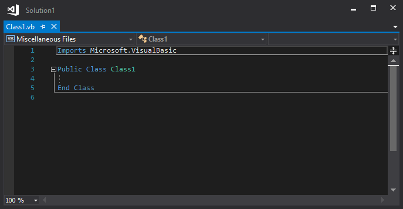
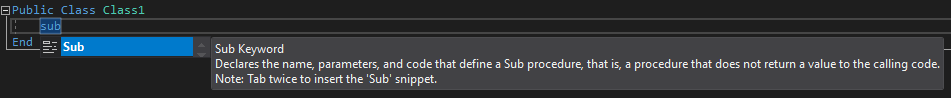
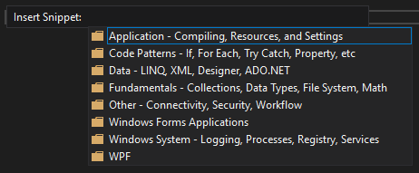
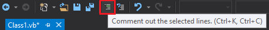
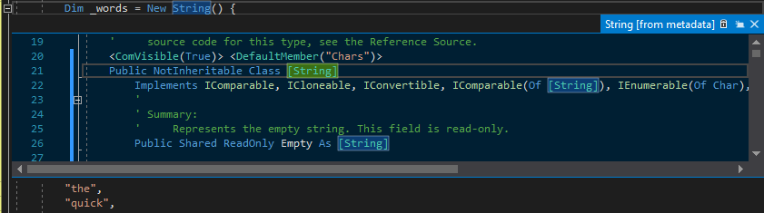
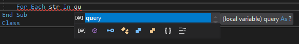
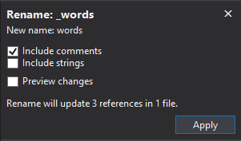

# Learn to use the code editor

In this 10-minute introduction to the code editor in Visual Studio, we'll add code to a file to look at some of the ways that Visual Studio makes writing, navigating, and understanding code easier.

::: moniker range="vs-2017"

> [!TIP]
> If you haven't already installed Visual Studio, go to the [Visual Studio downloads](https://visualstudio.microsoft.com/vs/older-downloads/?utm_medium=microsoft&utm_source=docs.microsoft.com&utm_campaign=vs+2017+download) page to install it for free.

::: moniker-end

::: moniker range="vs-2019"

> [!TIP]
> If you haven't already installed Visual Studio, go to the [Visual Studio downloads](https://visualstudio.microsoft.com/downloads) page to install it for free.

::: moniker-end

This article assumes you're already familiar with Visual Basic. If you aren't, we suggest you look at a tutorial such as [Get started with Visual Basic in Visual Studio](../../get-started/visual-basic/tutorial-console.md) first.

> [!TIP]
> To follow along with this article, make sure you have the Visual Basic settings selected for Visual Studio. For information about selecting settings for the integrated development environment (IDE), see [Select environment settings](visual-studio-ide.md#select-environment-settings).

## Create a new code file

Start by creating a new file and adding some code to it.

::: moniker range="vs-2017"

1. Open Visual Studio.

::: moniker-end

::: moniker range=">=vs-2019"

1. Open Visual Studio. Press **Esc** or click **Continue without code** on the start window to open the development environment.

::: moniker-end

2. From the **File** menu on the menu bar, choose **New File**.

3. In the **New File** dialog box, under the **General** category, choose **Visual Basic Class**, and then choose **Open**.

   A new file opens in the editor with the skeleton of a Visual Basic class. (You can already notice that you don't have to create a full Visual Studio project to gain some of the benefits that the code editor offers, such as syntax highlighting. All you need is a code file!)

   

## Use code snippets

Visual Studio provides useful *code snippets* that you can use to quickly and easily generate commonly used code blocks. [Code snippets](../../ide/code-snippets.md) are available for different programming languages including Visual Basic, C#, and C++. Let's add the Visual Basic **Sub** snippet to our file.

1. Place your cursor above the line that says `End Class`, and type **sub**.

   A pop-up dialog box appears with information about the `Sub` keyword and how to insert the **Sub** code snippet.

   

1. Press **Tab** twice to insert the code snippet.

   The outline for the Sub procedure `MySub()` is added to the file.

The available code snippets vary for different programming languages. You can look at the available code snippets for Visual Basic by choosing **Edit** > **IntelliSense** > **Insert Snippet** (or press **Ctrl**+**K**, **Ctrl**+**X**). For Visual Basic, code snippets are available for the following categories:



There are snippets for determining if a file exists on the computer, writing to a text file, reading a registry value, executing a SQL query, creating a [For Each...Next statement](/dotnet/visual-basic/language-reference/statements/for-each-next-statement), and many more.

## Comment out code

The toolbar, which is the row of buttons under the menu bar in Visual Studio, can help make you more productive as you code. For example, you can toggle IntelliSense completion mode, increase or decrease a line indent, or comment out code that you don't want to compile. ([IntelliSense](../../ide/using-intellisense.md) is a coding aid that displays a list of matching methods, amongst other things.) In this section, we'll comment out some code.


1. Paste the following code into the `MySub()` procedure body.

   ```vb
   ' _words is a string array that we'll sort alphabetically
   Dim _words = New String() {
   "the",
   "quick",
   "brown",
   "fox",
   "jumps"
   }

   Dim morewords = New String() {
   "over",
   "the",
   "lazy",
   "dog"
   }

   Dim query = From word In _words
               Order By word.Length
               Select word
   ```

1. We're not using the `morewords` array, but we may use it later so we don't want to completely delete it. Instead, let's comment out those lines. Select the entire definition of `morewords` to the closing curly brace, and then choose the **Comment out the selected lines** button on the toolbar. If you prefer to use the keyboard, press **Ctrl**+**K**, **Ctrl**+**C**.

   

   The Visual Basic comment character `'` is added to the beginning of each selected line to comment out the code.

## Collapse code blocks

You can collapse sections of code to focus just on the parts that are of interest to you. To practice, let's collapse the `_words` array to one line of code. Choose the small gray box with the minus sign inside it in the margin of the line that says `Dim _words = New String() {`. Or, if you're a keyboard user, place the cursor anywhere in the array definition and press **Ctrl**+**M**, **Ctrl**+**M**.


The code block collapses to just the first line, followed by an ellipsis (`...`). To expand the code block again, click the same gray box that now has a plus sign in it, or press **Ctrl**+**M**, **Ctrl**+**M** again. This feature is called [Outlining](../../ide/outlining.md) and is especially useful when you're collapsing long methods or entire classes.

## View symbol definitions

The Visual Studio editor makes it easy to inspect the definition of a type, method, etc. One way is to navigate to the file that contains the definition, for example by choosing **Go to Definition** anywhere the symbol is referenced. An even quicker way that doesn't move your focus away from the file you're working in is to use [Peek Definition](../../ide/go-to-and-peek-definition.md#peek-definition). Let's peek at the definition of the `String` type.

1. Right-click on the word `String` and choose **Peek Definition** from the content menu. Or, press **Alt**+**F12**.

   A pop-up window appears with the definition of the `String` class. You can scroll within the pop-up window, or even peek at the definition of another type from the peeked code.

   

1. Close the peeked definition window by choosing the small box with an "x" at the top right of the pop-up window.

## Use IntelliSense to complete words

[IntelliSense](../../ide/using-intellisense.md) is an invaluable resource when you're coding. It can show you information about available members of a type, or parameter details for different overloads of a method. You can also use IntelliSense to complete a word after you type enough characters to disambiguate it. Let's add a line of code to print out the ordered strings to the console window, which is the standard place for output from the program to go.

1. Below the `query` variable, start typing the following code:

   ```vb
   For Each str In qu
   ```

   You see IntelliSense show you **Quick Info** about the `query` symbol.

   

1. To insert the rest of the word `query` by using IntelliSense's word completion functionality, press **Tab**.

1. Finish off the code block to look like the following code.

   ```vb
   For Each str In query
       Console.WriteLine(str)
   Next
   ```

## Refactor a name

Nobody gets code right the first time, and one of the things you might have to change is the name of a variable or method. Let's try out Visual Studio's [refactor](../../ide/refactoring-in-visual-studio.md) functionality to rename the `_words` variable to `words`.

1. Place your cursor over the definition of the `_words` variable and choose **Rename** from the right-click or context menu.

   A pop-up **Rename** dialog box appears at the top right of the editor.

1. With the variable `_words` still selected, type in the desired name of **words**. Notice that the reference to `words` in the query is also automatically renamed. Before you press **Enter** or click **Apply**, select the **Include comments** checkbox in the **Rename** pop-up box.

   

1. Press **Enter** or click **Apply**.

   Both occurrences of `words` are renamed, as well as the reference to `words` in the code comment.

## Next steps

> [!div class="nextstepaction"]
> [Learn about projects and solutions](tutorial-projects-solutions.md)

## See also

- [Code snippets](../../ide/code-snippets.md)
- [Navigate code](../../ide/navigating-code.md)
- [Outlining](../../ide/outlining.md)
- [Go To Definition and Peek Definition](../../ide/go-to-and-peek-definition.md)
- [Refactoring](../../ide/refactoring-in-visual-studio.md)
- [Use IntelliSense](../../ide/using-intellisense.md)