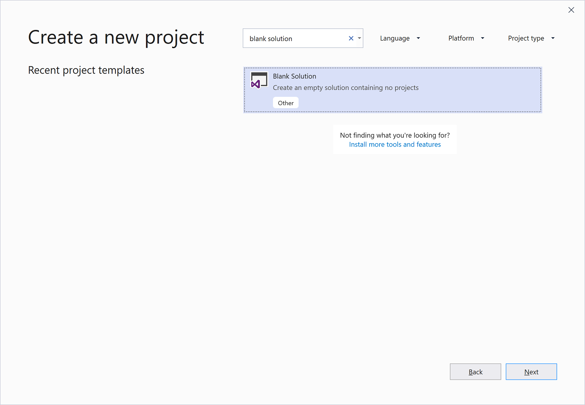
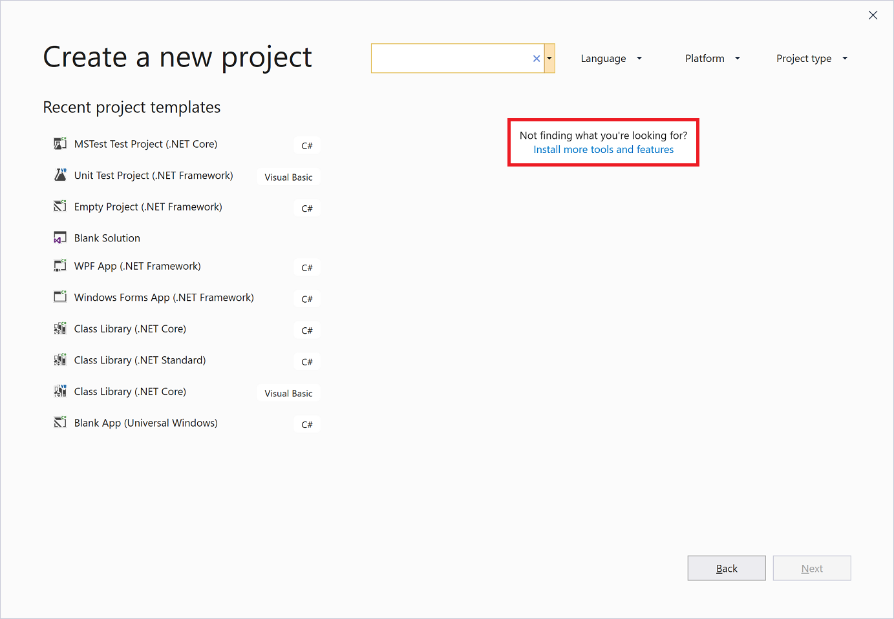
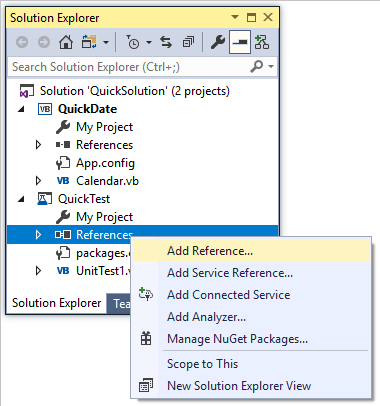
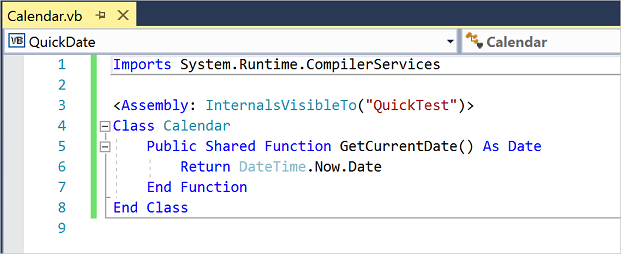
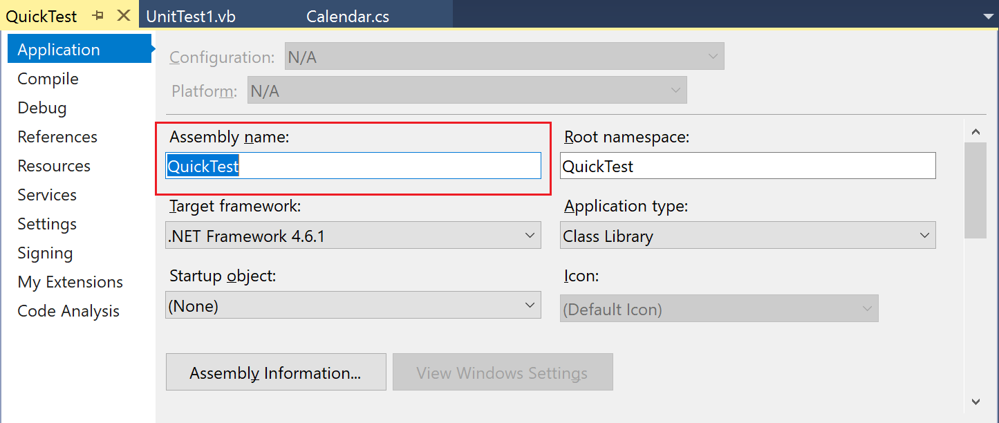
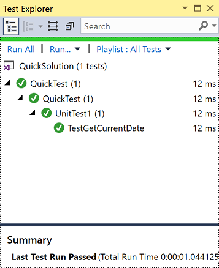

# Learn about projects and solutions using Visual Basic

In this introductory article, we'll explore what it means to create a *solution* and a *project* in Visual Studio. A solution is a container that's used to organize one or more related code projects, for example a class library project and a corresponding test project. We'll look at the properties of a project and some of the files it can contain. We'll also create a reference from one project to another.

> [!TIP]
> If you haven't already installed Visual Studio, go to the [Visual Studio downloads](https://aka.ms/vs/download/?cid=learn-onpage-download-cta) page to install it for free.

We'll construct a solution and project from scratch as an educational exercise to understand the concept of a project. In your general use of Visual Studio, you'll likely use some of the various project *templates* that Visual Studio offers when you create a new project.

> [!NOTE]
> Solutions and projects aren't required to develop apps in Visual Studio. You can also just open a folder that contains code and start coding, building, and debugging. For example, if you clone a [GitHub](https://github.com/) repo, it might not contain Visual Studio projects and solutions. For more information, see [Develop code in Visual Studio without projects or solutions](../../ide/develop-code-in-visual-studio-without-projects-or-solutions.md).

## Solutions and projects

Despite its name, a solution is not an "answer". A solution is simply a container used by Visual Studio to organize one or more related projects. When you open a solution in Visual Studio, it automatically loads all the projects that the solution contains.

### Create a solution

We'll start our exploration by creating an empty solution. After you get to know Visual Studio, you probably won't find yourself creating empty solutions often. When you create a new project, Visual Studio automatically creates a solution to house the project if there's not a solution already open.

::: moniker range="vs-2019"

1. Open Visual Studio.

2. On the start window, choose **Create a new project**.

3. On the **Create a new project** page, enter **blank solution** into the search box, select the **Blank Solution** template, and then choose **Next**.

   

4. Name the solution **QuickSolution**, and then choose **Create**.

   A solution appears in **Solution Explorer** on the right-hand side of the Visual Studio window. You'll probably use **Solution Explorer** often, to browse the contents of your projects.

::: moniker-end

::: moniker range=">=vs-2022"

1. Open Visual Studio.

1. On the start window, choose **Create a new project**.

1. On the **Create a new project** page, enter **blank solution** into the search box, select the **Blank Solution** template, and then choose **Next**.

   :::image type="content" source="media/vs-2022/tutorial-projects-blank-solution-template.png" alt-text="Screenshot showing the Create a new project window with 'blank solution' in the search box and the Blank Solution project template selected.":::

1. Name the solution **QuickSolution**, and then choose **Create**.

   A solution appears in **Solution Explorer** on the right-hand side of the Visual Studio window. You'll probably use **Solution Explorer** often, to browse the contents of your projects.

::: moniker-end

### Add a project

Now let's add our first project to the solution. We'll start with an empty project and add the items we need to the project.

::: moniker range="vs-2019"

1. From the right-click or context menu of **Solution 'QuickSolution'** in **Solution Explorer**, choose **Add** > **New Project**.

   A dialog box opens that says **Add a new project**.

1. Enter the text **empty** into the search box at the top, and then select **Visual Basic** under **Language**.

1. Select the **Empty Project (.NET Framework)** template, and then choose **Next**.

1. Name the project **QuickDate**, then choose **Create**.

   A project named QuickDate appears beneath the solution in **Solution Explorer**. Currently it contains a single file called *App.config*.

   > [!NOTE]
   > If you don't see the **Empty Project (.NET Framework)** template, you need to install the **.NET desktop development** Visual Studio *workload*. Visual Studio uses workload-based installation to only install the components you need for the type of development you do. An easy way to install a new workload when you're creating a new project is to choose the **Install more tools and features** link under the text that says **Not finding what you're looking for?**. After Visual Studio Installer launches, choose the **.NET desktop development** workload and then the **Modify** button.
   >
   > 

::: moniker-end

::: moniker range=">=vs-2022"

1. From the right-click or context menu of **Solution 'QuickSolution'** in **Solution Explorer**, choose **Add** > **New Project**.

   A dialog box opens that says **Add a new project**.

1. Enter the text **empty** into the search box at the top, and then select **Visual Basic** in the **All languages** drop-down list.

1. Select the **Empty Project (.NET Framework)** template, and then choose **Next**.

1. Name the project **QuickDate**, then choose **Create**.

   A project named QuickDate appears beneath the solution in **Solution Explorer**. Currently it contains a single file called *App.config*.

   > [!NOTE]
   > If you don't see the **Empty Project (.NET Framework)** template, you need to install the **.NET desktop development** Visual Studio *workload*. Visual Studio uses workload-based installation to only install the components you need for the type of development you do. An easy way to install a new workload when you're creating a new project is to choose the **Install more tools and features** link under the text that says **Not finding what you're looking for?**. After Visual Studio Installer launches, choose the **.NET desktop development** workload and then the **Modify** button.
   >
   > :::image type="content" source="media/vs-2022/tutorial-projects-open-installer.png" alt-text="Screenshot showing the Create a new project window with the 'Install more tools and features' link highlighted.":::

::: moniker-end

## Add an item to the project

We have an empty project. Let's add a code file.

1. From the right-click or context menu of the **QuickDate** project in **Solution Explorer**, choose **Add** > **New Item**.

   The **Add New Item** dialog box opens.

1. Expand **Common Items**, then choose **Code**. In the middle pane, choose the **Class** item template. Name the class **Calendar**, and then choose the **Add** button.

   A file named *Calendar.vb* is added to the project. The *.vb* on the end is the file extension that's given to Visual Basic code files. The file appears in the visual project hierarchy in **Solution Explorer**, and its contents open in the editor.

1. Replace the contents of the *Calendar.vb* file with the following code:

   ```vb
   Class Calendar
       Public Shared Function GetCurrentDate() As Date
           Return DateTime.Now.Date
       End Function
   End Class
   ```

   The `Calendar` class contains a single function, `GetCurrentDate`, that returns the current date.

1. Open the project properties by double-clicking **My Project** in **Solution Explorer**. On the **Application** tab, change **Application type** to **Class Library**. This step is necessary to build the project successfully.

1. Build the project by right-clicking on **QuickDate** in **Solution Explorer** and choosing **Build**. You should see a successful build message in the **Output** window.

   :::image type="content" source="media/vs-2022/output-window.png" alt-text="Screenshot of the Output window in Visual Studio.":::

## Add a second project

It's common for solutions to contain more than one project, and often these projects reference each other. Some projects in a solution might be class libraries, some executable applications, and some might be unit test projects or websites.

Let's add a unit test project to our solution. This time we'll start from a project template so we don't have to add an additional code file to the project.

1. From the right-click or context menu of **Solution 'QuickSolution'** in **Solution Explorer**, choose **Add** > **New Project**.

::: moniker range="vs-2019"

2. In the **Add a new project** dialog box, enter the text **unit test** into the search box at the top, and then select **Visual Basic** under **Language**.

3. Choose the **Unit Test Project (.NET Framework)** project template, and then choose **Next**.

4. Name the project **QuickTest**, and then choose **Create**.

   A second project is added to **Solution Explorer**, and a file named *UnitTest1.vb* opens in the editor.

::: moniker-end

::: moniker range=">=vs-2022"

2. In the **Add a new project** dialog box, enter the text **unit test** into the search box at the top, and then select **Visual Basic** in the **All languages** drop-down list.

3. Choose the **Unit Test Project (.NET Framework)** project template, and then choose **Next**.

4. Name the project **QuickTest**, and then choose **Create**.

   A second project is added to **Solution Explorer**, and a file named *UnitTest1.vb* opens in the editor.

::: moniker-end

## Add a project reference

We're going to use the new unit test project to test our method in the **QuickDate** project, so we need to add a reference to that project. The reference creates a *build dependency* between the two projects, meaning that when you build the solution, **QuickDate** is built before **QuickTest**.

::: moniker range="vs-2019"

1. Choose the **References** node in the **QuickTest** project, and from the right-click or context menu, choose **Add Reference**.

   

   The **Reference Manager** dialog box opens.

1. In the left pane, expand **Projects** and choose **Solution**. In the middle pane, choose the checkbox next to **QuickDate**, and then choose the **OK** button.

   A reference to the **QuickDate** project is added.

::: moniker-end

::: moniker range=">=vs-2022"

1. Choose the **References** node in the **QuickTest** project, and from the right-click or context menu, choose **Add Reference**.

   :::image type="content" source="media/vs-2022/tutorial-projects-add-reference-vb.png" alt-text="Screenshot showing the context menu for the References node in the QuickTest project, with the 'Add Reference' option selected.":::

   The **Reference Manager** dialog box opens.

1. In the left pane, expand **Projects** and choose **Solution**. In the middle pane, choose the checkbox next to **QuickDate**, and then choose the **OK** button.

   A reference to the **QuickDate** project is added.

::: moniker-end

## Add test code

::: moniker range="vs-2019"

1. Now we'll add test code to the Visual Basic code file. Replace the contents of *UnitTest1.vb* with the following code.

   ```vb
   <TestClass()> Public Class UnitTest1

       <TestMethod()> Public Sub TestGetCurrentDate()
           Assert.AreEqual(Date.Now.Date, QuickDate.Calendar.GetCurrentDate())
       End Sub

   End Class
   ```

   You'll see a red squiggle under some of the code. We'll fix this error by making the test project a [friend assembly](/dotnet/visual-basic/programming-guide/concepts/assemblies-gac/friend-assemblies) to the **QuickDate** project.

1. Back in the **QuickDate** project, open the *Calendar.vb* file if it's not already open, and add the following [Imports statement](/dotnet/visual-basic/language-reference/statements/imports-statement-net-namespace-and-type) and <xref:System.Runtime.CompilerServices.InternalsVisibleToAttribute> attribute, to resolve the error in the test project.

   ```vb
   Imports System.Runtime.CompilerServices

   <Assembly: InternalsVisibleTo("QuickTest")>
   ```

   The code file should look like this:

   

::: moniker-end

::: moniker range=">=vs-2022"

1. Now we'll add test code to the Visual Basic code file. Replace the contents of *UnitTest1.vb* with the following code.

   ```vb
   <TestClass()> Public Class UnitTest1

       <TestMethod()> Public Sub TestGetCurrentDate()
           Assert.AreEqual(Date.Now.Date, QuickDate.Calendar.GetCurrentDate())
       End Sub

   End Class
   ```

   You'll see a red squiggle under some of the code. We'll fix this error by making the test project a [friend assembly](/dotnet/visual-basic/programming-guide/concepts/assemblies-gac/friend-assemblies) to the **QuickDate** project.

1. Back in the **QuickDate** project, open the *Calendar.vb* file if it's not already open, and add the following [Imports statement](/dotnet/visual-basic/language-reference/statements/imports-statement-net-namespace-and-type) and <xref:System.Runtime.CompilerServices.InternalsVisibleToAttribute> attribute, to resolve the error in the test project.

   ```vb
   Imports System.Runtime.CompilerServices

   <Assembly: InternalsVisibleTo("QuickTest")>
   ```

   The code file should look like this:

   :::image type="content" source="media/vs-2022/tutorial-projects-code-vb.png" alt-text="Screenshot showing the code for Calendar.vb in the Visual Basic code editor window after the Imports statement and Assembly attribute lines have been added.":::

::: moniker-end

## Project properties

::: moniker range="vs-2019"

The line in the *Calendar.vb* file that contains the <xref:System.Runtime.CompilerServices.InternalsVisibleToAttribute> attribute references the assembly name (file name) of the **QuickTest** project. The assembly name might not always be the same as the project name. To find the assembly name of a project, open the project properties.

1. In **Solution Explorer**, select the **QuickTest** project. From the right-click or context menu, select **Properties**, or just press **Alt**+**Enter**. (You can also double-click **My Project** in **Solution Explorer**.)

   The *property pages* for the project open on the **Application** tab. The property pages contain various settings for the project. Notice that the assembly name of the **QuickTest** project is indeed "QuickTest". If you wanted to change the assembly name, this is where you'd do that. Then, when you build the test project, the name of the resulting binary file would change from *QuickTest.dll* to whatever you chose.

   

1. Explore some of the other tabs of the project's property pages, such as **Compile** and **Settings**. These tabs are different for different types of projects.

::: moniker-end

::: moniker range=">=vs-2022"

The line in the *Calendar.vb* file that contains the <xref:System.Runtime.CompilerServices.InternalsVisibleToAttribute> attribute, references the assembly name (file name) of the **QuickTest** project. The assembly name might not always be the same as the project name. To find the assembly name of a project, open the project properties.

1. In **Solution Explorer**, select the **QuickTest** project. From the right-click or context menu, select **Properties**, or just press **Alt**+**Enter**. (You can also double-click **My Project** in **Solution Explorer**.)

   The *property pages* for the project open on the **Application** tab. The property pages contain various settings for the project. Notice that the assembly name of the **QuickTest** project is indeed "QuickTest". If you wanted to change the assembly name, this is where you'd do that. Then, when you build the test project, the name of the resulting binary file would change from *QuickTest.dll* to whatever you chose.

   :::image type="content" source="media/vs-2022/tutorial-projects-properties.png" alt-text="Screenshot showing the Application tab of the property pages for the QuickTest project. The Assembly name field is highlighted and the value is 'QuickTest'.":::

1. Explore some of the other tabs of the project's property pages, such as **Compile** and **Settings**. These tabs are different for different types of projects.

::: moniker-end
## (Optional) Run the test

::: moniker range="vs-2019"

If you want to check that your unit test is working, choose **Test** > **Run** > **All Tests** from the menu bar. A window called **Test Explorer** opens, and you should see that the **TestGetCurrentDate** test passes.



> [!TIP]
> If **Test Explorer** doesn't open automatically, open it by choosing **Test** > **Windows** > **Test Explorer** from the menu bar.

::: moniker-end

::: moniker range=">=vs-2022"

If you want to check that your unit test is working, choose **Test** > **Run All Tests** from the menu bar. A window called **Test Explorer** opens, and you should see that the **TestGetCurrentDate** test passes.

:::image type="content" source="media/vs-2022/tutorial-projects-test-explorer.png" alt-text="Screenshot of the Test Explorer in Visual Studio showing that the TestGetCurrentDate test passed.":::

> [!TIP]
> If **Test Explorer** doesn't open automatically, open it by choosing **Test** > **Windows** > **Test Explorer** from the menu bar.

::: moniker-end

## Next steps

If you want to further explore Visual Studio, consider creating an app by following one of the [Visual Basic tutorials](index.yml).

## See also

- [Create projects and solutions](../../ide/creating-solutions-and-projects.md)
- [Manage project and solution properties](../../ide/managing-project-and-solution-properties.md)
- [Manage references in a project](../../ide/managing-references-in-a-project.md)
- [Develop code in Visual Studio without projects or solutions](../../ide/develop-code-in-visual-studio-without-projects-or-solutions.md)
- [Visual Studio IDE overview](../../get-started/visual-studio-ide.md)
