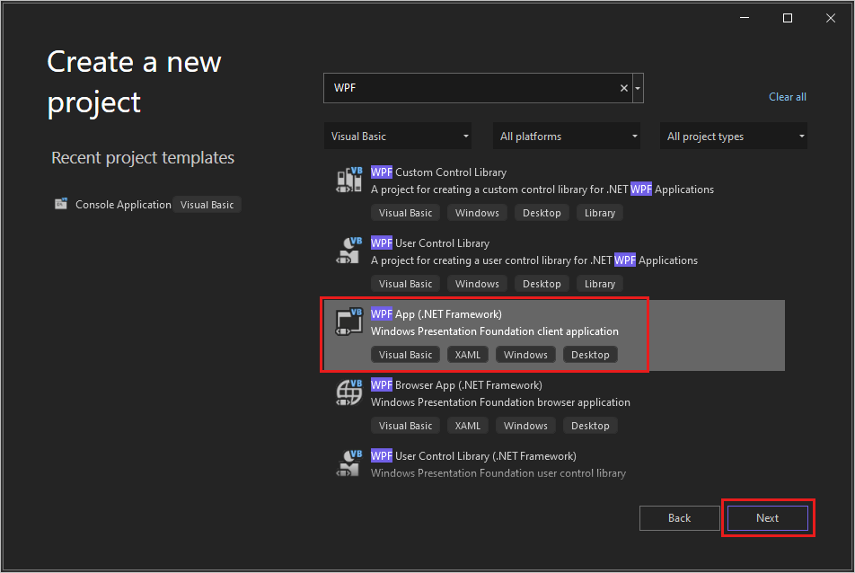
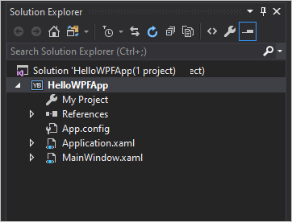
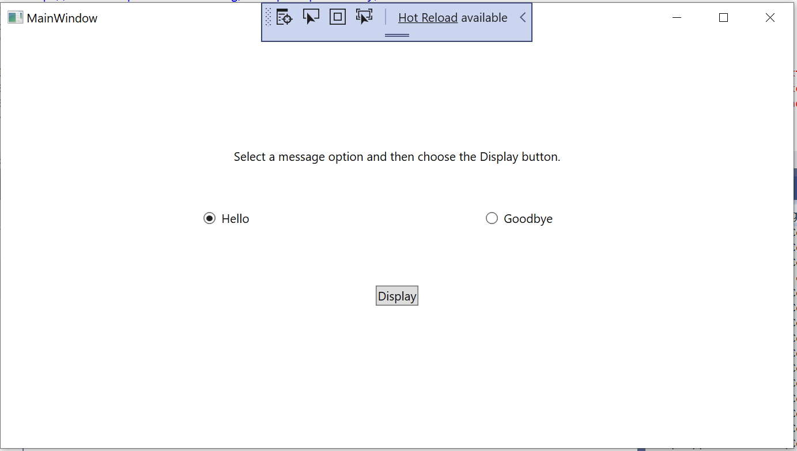

# Tutorial: Create a WPF application with Visual Basic

In this tutorial, you'll create an application using Visual Basic in the Visual Studio integrated development environment (IDE).
Your program will use the Windows Presentation Foundation (WPF) UI framework.
Use this tutorial to become familiar with many of the tools, dialog boxes, and designers that you can use in Visual Studio.

In this tutorial, you learn how to:

> [!div class="checklist"]
> - Create the project
> - Configure window and add text
> - Add buttons and code
> - Debug and test the application
> - Debug with breakpoints
> - Build a release version

## What is WPF?

WPF, or Windows Presentation Foundation, is a UI (user interface) framework that creates desktop client applications.  The WPF development platform supports a broad set of application development features, including an application model, resources, controls, graphics, layout, data binding, documents, and security.

WPF is part of .NET, so if you have previously built applications with .NET using ASP.NET or Windows Forms, the programming experience should be familiar. WPF uses the Extensible Application Markup Language [XAML](../../xaml-tools/xaml-overview.md) to provide a declarative model for application programming. For more information, see [WPF .NET overview](/dotnet/desktop/wpf/overview/?view=netdesktop-6.0&preserve-view=true).

## Prerequisites

::: moniker range="vs-2019"
You need Visual Studio to complete this tutorial.
Visit the [Visual Studio downloads page](https://visualstudio.microsoft.com/vs/) for a free version.
::: moniker-end
::: moniker range=">=vs-2022"
You need Visual Studio to complete this tutorial.
Visit the [Visual Studio downloads page](https://visualstudio.microsoft.com/downloads/?cid=learn-onpage-download-cta) for a free version.
::: moniker-end

## Create the project

When you create an application in Visual Studio, you first create a project.
In this tutorial, create a Windows Presentation Foundation project.

::: moniker range="vs-2019"
1. Open Visual Studio.

1. On the **Create a new project** screen, search for "WPF", and select **WPF App (.NET Framework)**. Select **Next**.

   

1. Give the project a name, *HelloWPFApp*, and select **Create**.

   Visual Studio creates the HelloWPFApp project and solution.
   **Solution Explorer** shows the various files.

   

The **WPF Designer** shows a design view and a XAML view of *MainWindow.xaml* in a split view.
::: moniker-end

::: moniker range=">=vs-2022"
1. Open Visual Studio.

1. On the start window, choose **Create a new project**.

   :::image type="content" source="media/vs-2022/start-window-create-new-project.png" alt-text="Screenshot of the start window in Visual Studio 2022 with the 'Create a new project' option highlighted.":::

1. On the **Create a new project** window, search for "WPF" and select **Visual Basic** in the **All languages** drop-down list.
   Choose **WPF App (.NET Framework)**, and then choose **Next**.

   :::image type="content" source="media/tutorial-wpf/visual-studio-create-wpf-project.png" alt-text="Screenshot of the 'Create a new project' dialog with 'WPF' entered in the search box, 'Visual Basic' selected in the languages list, and the 'WPF App (.NET Framework)' project template highlighted.":::

1. Give the project a name, **HelloWPFApp**, and select **Create**.

   Visual Studio creates the HelloWPFApp project and solution.
   **Solution Explorer** shows the various files.

   :::image type="content" source="media/vs-2022/explore-ide-hello-wpf-app-files.png" alt-text="Screenshot showing the files in the HelloWPFApp project and solution in the Solution Explorer.":::

The **WPF Designer** shows a design view and a XAML view of *MainWindow.xaml* in a split view.
::: moniker-end

> [!NOTE]
> For more information about eXtensible Application Markup Language (XAML), see [XAML overview for WPF](/dotnet/framework/wpf/advanced/xaml-overview-wpf).

## Configure window and add text

Using the **Properties** window, you can display and change options for project items, controls, and other items.

1. In **Solution Explorer**, open the *MainWindow.xaml*.

1. In the XAML view, change the value of the **Window.Title** property from *Title="MainWindow"* to *Title="Greetings"*.

1. On the left side of the Visual Studio IDE, select the **Toolbox** tab.
   If you don't see it, select **View** > **Toolbox** from the menu bar or **Ctrl**+**Alt**+**X**.

1. Either expand **Common WPF Controls** or enter *Text* in the search bar to find **TextBlock**.

   :::image type="content" source="media/tutorial-wpf/toolbox-tab-text-block.png" alt-text="Screenshot showing the Toolbox window with the TextBlock control highlighted in the list of Common WPF Controls.":::

1. Select the **TextBlock** item and drag it to the window on the design surface.
   You can move the TextBlock control by dragging it.
   Use the guidelines to place the control.

   :::image type="content" source="media/tutorial-wpf/form-with-text-block.png" alt-text="Screenshot showing the TextBlock control positioned on the Greetings form with the guidelines visible.":::

   The XAML markup should look like the following example:

   ```xaml
   <TextBlock HorizontalAlignment="Left" Margin="381,100,0,0" TextWrapping="Wrap" Text="TextBlock" VerticalAlignment="Top"/>
   ```

1. In the XAML view, locate the markup for the TextBlock and change the **Text** attribute:

   ```xaml
   Text="Select a message option and then choose the Display button."
   ```

   Center the TextBlock again if necessary

1. Save your app by choosing the **Save All** toolbar button.
   Alternatively, to save your app, choose **File** > **Save All** from the menu bar, or press **Ctrl**+**Shift**+**S**.
   It's a best practice to save early and often.

## Add buttons and code

Your application uses two radio buttons and a button.
Use these steps to add them.
You'll add Visual Basic code to the button.
That code refers to the radio button selection.

1. In the **Toolbox**, find **RadioButton**.

   :::image type="content" source="media/tutorial-wpf/toolbox-radio-button.png" alt-text="Screenshot showing the Toolbox window with the RadioButton control selected in the list of Common WPF Controls.":::

1. Add two RadioButton controls to the design surface by selecting the **RadioButton** item and dragging it to the  design surface.
   Move the buttons by selecting them and using the arrow keys.
   Place the buttons side by side under the TextBlock control.

   :::image type="content" source="media/tutorial-wpf/greetings-form-radio-buttons.png" alt-text="Screenshot showing the Greetings form with a TextBlock control and two radio buttons.":::

1. In the **Properties** window for the left RadioButton control, change the **Name** property at the top of the **Properties** window to *HelloButton*.

   :::image type="content" source="media/tutorial-wpf/properties-radio-button-name.png" alt-text="Screenshot showing the Solution Explorer Properties window for the 'HelloButton'  RadioButton.":::

1. In the **Properties** window for the right RadioButton control, change the **Name** property to *GoodbyeButton*.

1. Update the **Content** attribute for `HelloButton` and `GoodbyeButton` to `"Hello"` and `"Goodbye"` in the XAML.

   ```xaml
   <Grid>
        <TextBlock HorizontalAlignment="Left" Margin="252,47,0,0" TextWrapping="Wrap" Text="Select a message option and then choose the Display button." VerticalAlignment="Top"/>
        <RadioButton x:Name="HelloButton" Content="Hello" HorizontalAlignment="Left" Margin="297,161,0,0" VerticalAlignment="Top"/>
        <RadioButton x:Name="GoodbyeButton" Content="Goodbye" HorizontalAlignment="Left" Margin="488,161,0,0" VerticalAlignment="Top"/>
   </Grid>
   ```

1. In the XAML view, locate the markup for HelloButton and add an **IsChecked** attribute:

   ```xaml
   IsChecked="True"
   ```

   The **IsChecked** attribute with the value **True** means that HelloButton is checked by default.
   This setting means that the radio button is always selected, even when the program starts.

1. In the **Toolbox**, find the **Button** control, and then drag a button to the design surface under the RadioButton controls.

1. In the XAML view, change the value of **Content** for the Button control from `Content="Button"` to `Content="Display"`.

   ```xaml
   <Button Content="Display" HorizontalAlignment="Left" VerticalAlignment="Top" Width="75" Margin="215,204,0,0"/>
   ```

   Your window should resemble the following image.

   :::image type="content" source="media/tutorial-wpf/greetings-buttons.png" alt-text="Screenshot showing the Greetings form with the TextBlock, RadioButtons labeled 'Hello' and 'Goodbye', and the Button control labeled 'Display' all positioned on the form.":::

1. On the design surface, double-click the **Display** button.

   *MainWindow.xaml.vb* opens, with the cursor in the `Button_Click` event.

    ```vb
    Private Sub Button_Click(sender As Object, e As RoutedEventArgs)

    End Sub
    ```

1. Add the following code:

    ```vb
    If HelloButton.IsChecked = True Then
        MessageBox.Show("Hello.")
    ElseIf GoodbyeButton.IsChecked = True Then
        MessageBox.Show("Goodbye.")
    End If
    ```

## Debug and test the application

Next, you'll debug the application to look for errors and test that both message boxes appear correctly.
To see how this process works, the first step deliberately introduces an error into the program.

1. In **Solution Explorer**, right-click on *MainWindow.xaml* and choose **Rename**. Rename the file to *Greetings.xaml*.

1. Start the debugger by pressing **F5** or selecting **Debug**, then **Start Debugging**.

   A **Break Mode** window appears, and the **Output** window indicates that an exception has occurred.
    
   ::: moniker range="vs-2019"

      :::image type="content" source="media/tutorial-wpf/exception-unhandled.png" alt-text="Screenshot showing the 'Exception Unhandled' window with a System.IO.Exception message that reads 'Cannot locate resource mainwindow.xaml'.":::

   ::: moniker-end

   ::: moniker range=">=vs-2022"

   :::image type="content" source="media/tutorial-wpf/exception-unhandled-vs-2022.png" alt-text="Screenshot showing the 'Exception Unhandled' window with a System.IO.Exception message that reads 'Cannot locate resource mainwindow.xaml'.":::

   ::: moniker-end

1. Stop the debugger by choosing **Debug** > **Stop Debugging**.

   You renamed *MainWindow.xaml* to *Greetings.xaml* at the start of this section.
   The code still refers to *MainWindow.xaml* as the startup URI for the application, so the project can't start.

1. In **Solution Explorer**, open the *Application.xaml* file.

1. Change `StartupUri="MainWindow.xaml"` to `StartupUri="Greetings.xaml"`

1. Start the debugger again (press **F5**). You should now see the **Greetings** window of your application.

   ::: moniker range="vs-2019"

   

   ::: moniker-end

   ::: moniker range=">=vs-2022"

   :::image type="content" source="media/vs-2022/explore-ide-wpf-running-app.png" alt-text="Screenshot of the Greetings window with the TextBlock, RadioButtons, and Button controls visible. The 'Hello' radio button is selected.":::

   ::: moniker-end

1. Select **Hello** and the **Display** button, and then **Goodbye** and the **Display** button.
   Use the close icon in the upper right corner to stop debugging.

For more information, see [Build a WPF application (WPF)](/dotnet/framework/wpf/app-development/building-a-wpf-application-wpf) and [Debug WPF](../../debugger/debugging-wpf.md).

## Debug with breakpoints

You can test the code during debugging by adding some breakpoints.

1. Open *Greetings.xaml.vb*, and select the following line: `MessageBox.Show("Hello.")`

1. Add a breakpoint by pressing **F9** or selecting **Debug**, then **Toggle Breakpoint**.

   A red circle appears next to the line of code in the left margin of the editor window.

1. Select the following line: `MessageBox.Show("Goodbye.")`.

1. Press the **F9** key to add a breakpoint, and then press **F5** to start debugging.

1. In the **Greetings** window, select the **Hello** button, and then select **Display**.

   The line `MessageBox.Show("Hello.")` is highlighted in yellow.
   At the bottom of the IDE, the **Autos**, **Locals**, and **Watch** windows are docked together on the left side.
   The **Call Stack**, **Breakpoints**, **Exception Settings**, **Command**, **Immediate**, and **Output** windows are docked together on the right side.

   :::image type="content" source="media/vs-2022/explore-ide-debug-breakpoint.png" alt-text="Screenshot showing a debug session in Visual Studio with the Code, Diagnostics. Autos, and Call Stack windows open. Execution is stopped at a breakpoint in Greetings.xaml.vb.":::

1. On the menu bar, choose **Debug** > **Step Out**.

   The application starts again.
   A dialog box with the word "Hello" appears.

1. Choose the **OK** button to close the dialog box.

1. In the **Greetings** window, choose the **Goodbye** radio button, and then choose the **Display** button.

   The line `MessageBox.Show("Goodbye.")` is highlighted in yellow.

1. Choose the **F5** key to continue debugging.
   When the dialog box appears, choose **OK** to close the dialog box.

1. Close the application window to stop debugging.

1. On the menu bar, choose **Debug** > **Disable All Breakpoints**.

## Build a release version

Now that you've verified that everything works, you can prepare a release build of your application.

1. Select **Build** > **Clean solution** to delete intermediate files and output files that were created during previous builds.

1. Change the build configuration for HelloWPFApp from **Debug** to **Release** by using the dropdown control on the toolbar.

1. Select **Build** > **Build Solution**.

Congratulations on completing this tutorial!
You can find the *.exe* you built under your solution and project directory (*...\HelloWPFApp\bin\Release*).

## Next steps

Advance to the next article to learn how to create a Windows Forms app in Visual Studio with Visual Basic.
> [!div class="nextstepaction"]
> [Create a Windows Forms app](../../ide/create-a-visual-basic-winform-in-visual-studio.md)

## Related links

For more information about Visual Studio, see these resources:

::: moniker range="vs-2019"
- [What's new in Visual Studio 2019](../../ide/whats-new-visual-studio-2019.md)
- [Productivity tips](../../ide/productivity-features.md)
::: moniker-end
::: moniker range=">=vs-2022"
- [Productivity tips](../../ide/productivity-features.md)
::: moniker-end
