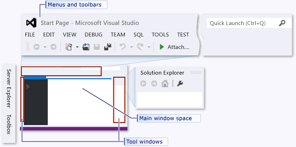
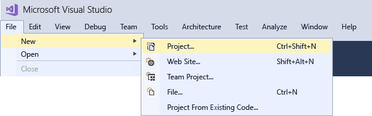
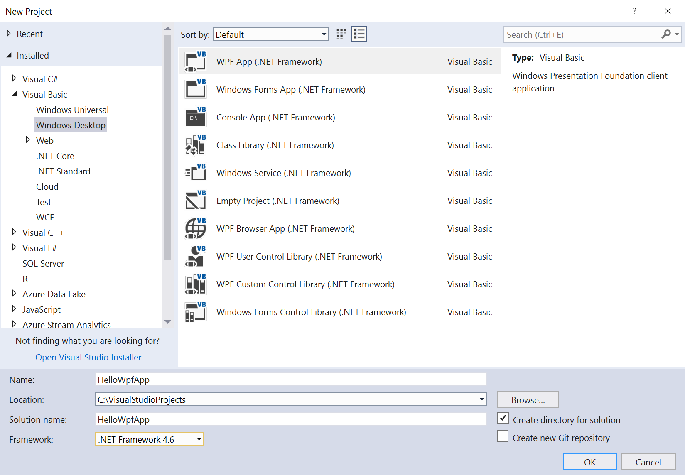
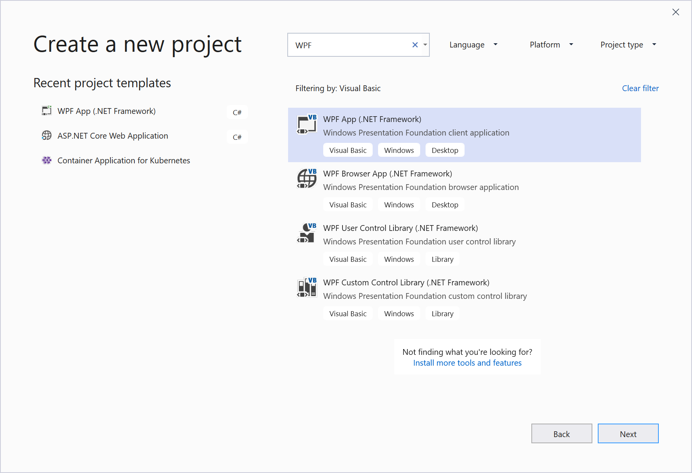
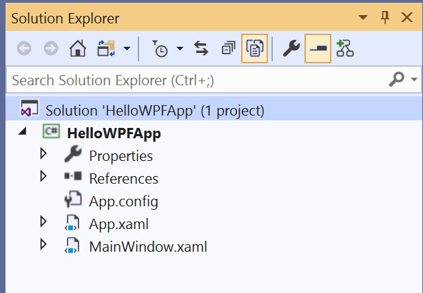
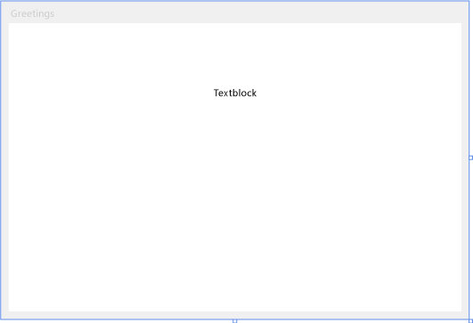
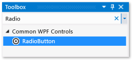
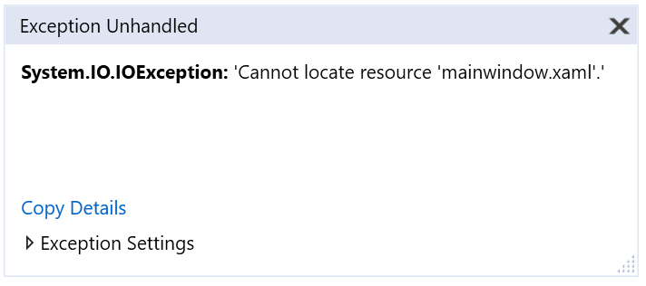
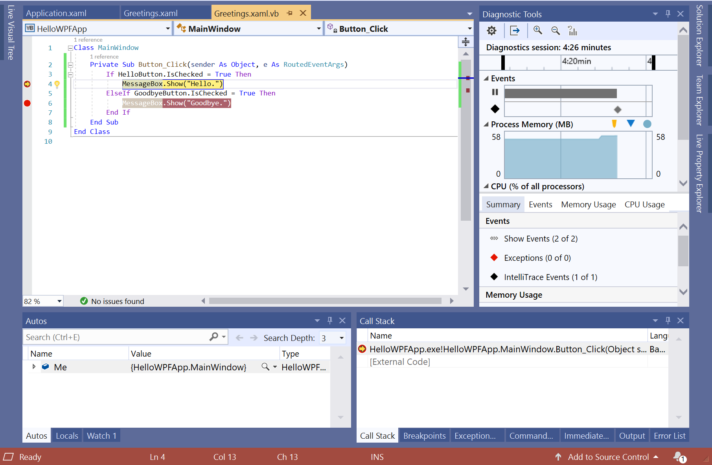
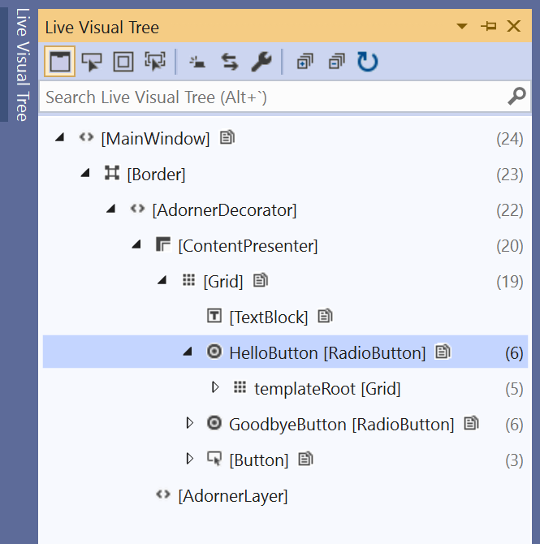

# Tutorial: Create a simple application with Visual Basic

By completing this tutorial, you'll become familiar with many of the tools, dialog boxes, and designers that you can use when you develop applications with Visual Studio. You'll create a "Hello, World" application, design the UI, add code, and debug errors, while you learn about working in the integrated development environment ([IDE](visual-studio-ide.md)).

::: moniker range="vs-2017"

If you haven't already installed Visual Studio, go to the [Visual Studio downloads](https://visualstudio.microsoft.com/vs/older-downloads/?utm_medium=microsoft&utm_source=docs.microsoft.com&utm_campaign=vs+2017+download) page to install it for free.

::: moniker-end

::: moniker range=">=vs-2019"

If you haven't already installed Visual Studio, go to the [Visual Studio downloads](https://visualstudio.microsoft.com/downloads) page to install it for free.

::: moniker-end

## Configure the IDE

::: moniker range="vs-2017"

When you open Visual Studio for the first time, you'll be prompted to sign in. This step is optional for this tutorial. Next you may be shown a dialog box that asks you to choose your development settings and color theme. Keep the defaults and choose **Start Visual Studio**.


After Visual Studio launches, you'll see tool windows, the menus and toolbars, and the main window space. Tool windows are docked on the left and right sides of the application window, with **Quick Launch**, the menu bar, and the standard toolbar at the top. In the center of the application window is the **Start Page**. When you load a solution or project, editors and designers appear in the space where the **Start Page** is. When you develop an application, you'll spend most of your time in this central area.



::: moniker-end

::: moniker range=">=vs-2019"

When you launch Visual Studio, the start window opens first. Select **Continue without code** to open the development environment. You'll see tool windows, the menus and toolbars, and the main window space. Tool windows are docked on the left and right sides of the application window, with a search box, the menu bar, and the standard toolbar at the top. When you load a solution or project, editors and designers appear in the central space of the application window. When you develop an application, you'll spend most of your time in this central area.

::: moniker-end

## Create the project

When you create an application in Visual Studio, you first create a project and a solution. For this example, you'll create a Windows Presentation Foundation (WPF) project.

::: moniker range="vs-2017"

1. Create a new project. On the menu bar, select **File** > **New** > **Project**.

     

2. In the **New Project** dialog, select the **Installed** > **Visual Basic** > **Windows Desktop** category, and then select the **WPF App (.NET Framework)** template. Name the project **HelloWPFApp**, and select **OK**.

     

Visual Studio creates the HelloWPFApp project and solution, and **Solution Explorer** shows the various files. The **WPF Designer** shows a design view and a XAML view of *MainWindow.xaml* in a split view. You can slide the splitter to show more or less of either view. You can choose to see only the visual view or only the XAML view. The following items appear in **Solution Explorer**:


::: moniker-end

::: moniker range="vs-2019"

1. Open Visual Studio 2019.

2. On the **Create a new project** screen, search for "WPF", and choose **WPF App (.NET Framework)**, and then choose **Next**.

   

3. At the next screen, give the project a name, **HelloWPFApp**, and choose **Create**.

Visual Studio creates the HelloWPFApp project and solution, and **Solution Explorer** shows the various files. The **WPF Designer** shows a design view and a XAML view of *MainWindow.xaml* in a split view. You can slide the splitter to show more or less of either view. You can choose to see only the visual view or only the XAML view. The following items appear in **Solution Explorer**:



::: moniker-end

> [!NOTE]
> For more information about XAML (eXtensible Application Markup Language), see the [XAML overview for WPF](/dotnet/framework/wpf/advanced/xaml-overview-wpf) page.

After you create the project, you can customize it. By using the **Properties** window (found on the **View** menu), you can display and change options for project items, controls, and other items in an application.

### Change the name of MainWindow.xaml

Let's give MainWindow a more specific name. In **Solution Explorer**, right-click on *MainWindow.xaml* and choose **Rename**. Rename the file to *Greetings.xaml*.

## Design the user interface (UI)

If the designer is not open, select *Greetings.xaml* in **Solution Explorer**, and press **Shift**+**F7** to open the designer.

We will add three types of controls to this application: a <xref:System.Windows.Controls.TextBlock> control, two <xref:System.Windows.Controls.RadioButton> controls, and a <xref:System.Windows.Controls.Button> control.

### Add a TextBlock control

1. Press **Ctrl**+**Q** to activate the search box and type **Toolbox**. Choose **View > Toolbox** from the results list.

2. In the **Toolbox**, expand the **Common WPF Controls** node to see the TextBlock control.

     

3. Add a TextBlock control to the design surface by choosing the **TextBlock** item and dragging it to the window on the design surface. Center the control near the top of the window. In Visual Studio 2019 and later, you can use the red guidelines to center the control.

Your window should resemble the following illustration:



The XAML markup should look something like the following example:

```xaml
<TextBlock HorizontalAlignment="Left" Margin="381,100,0,0" TextWrapping="Wrap" Text="TextBlock" VerticalAlignment="Top"/>
```

### Customize the text in the text block

1. In the XAML view, locate the markup for TextBlock and change the Text attribute:

   ```xaml
   Text="Select a message option and then choose the Display button."
   ```

2. Center the TextBlock again if necessary, and save your changes by pressing Ctrl+S or using the **File** menu item.

Next, you'll add two [RadioButton](/dotnet/framework/wpf/controls/radiobutton) controls to the form.

### Add radio buttons

1. In the **Toolbox**, find the **RadioButton** control.

     

2. Add two RadioButton controls to the design surface by choosing the **RadioButton** item and dragging it to the window on the design surface. Move the buttons (by selecting them and using the arrow keys) so that the buttons appear side by side under the TextBlock control. Use the red guidelines to align the controls.

     Your window should look like this:

     

3. In the **Properties** window for the left RadioButton control, change the **Name** property (the property at the top of the **Properties** window) to `HelloButton`.

     

4. In the **Properties** window for the right RadioButton control, change the **Name** property to `GoodbyeButton`, and then save your changes.

You can now add display text for each RadioButton control. The following procedure updates the **Content** property for a RadioButton control.

### Add display text for each radio button

Update the **Content** attribute for the `HelloButton` and `GoodbyeButton` to `"Hello"` and `"Goodbye"` in the XAML. The XAML markup should now look similar to the following example:

   ```xaml
   <Grid>
        <TextBlock HorizontalAlignment="Left" Margin="252,47,0,0" TextWrapping="Wrap" Text="Select a message option and then choose the Display button." VerticalAlignment="Top"/>
        <RadioButton x:Name="HelloButton" Content="Hello" HorizontalAlignment="Left" Margin="297,161,0,0" VerticalAlignment="Top"/>
        <RadioButton x:Name="GoodbyeButton" Content="Goodbye" HorizontalAlignment="Left" Margin="488,161,0,0" VerticalAlignment="Top"/>
   </Grid>
   ```

### Set a radio button to be checked by default

In this step, we'll set HelloButton to be checked by default so that one of the two radio buttons is always selected.

In the XAML view, locate the markup for HelloButton and add an **IsChecked** attribute:

```xaml
IsChecked="True"
```

The final UI element that you'll add is a [Button](/dotnet/framework/wpf/controls/button) control.

### Add the button control

1. In the **Toolbox**, find the **Button** control, and then add it to the design surface under the RadioButton controls by dragging it to the form in the design view. If you're using Visual Studio 2019 or later, a red line helps you center the control.

2. In the XAML view, change the value of **Content** for the Button control from `Content="Button"` to `Content="Display"`, and then save the changes.

     The markup should resemble the following example:
     `<Button Content="Display" HorizontalAlignment="Left" VerticalAlignment="Top" Width="75" Margin="215,204,0,0"/>`

     Your window should resemble the following illustration.

     

### Add code to the display button

When this application runs, a message box appears after a user chooses a radio button and then chooses the **Display** button. One message box will appear for Hello, and another will appear for Goodbye. To create this behavior, you'll add code to the `Button_Click` event in *Greetings.xaml.vb* or *Greetings.xaml.cs*.

1. On the design surface, double-click the **Display** button.

     *Greetings.xaml.vb* opens, with the cursor in the `Button_Click` event.

    ```vb
    Private Sub Button_Click(sender As Object, e As RoutedEventArgs)

    End Sub
    ```

2. Enter the following code:

    ```vb
    If HelloButton.IsChecked = True Then
        MessageBox.Show("Hello.")
    ElseIf GoodbyeButton.IsChecked = True Then
        MessageBox.Show("Goodbye.")
    End If
    ```

3. Save the application.

## Debug and test the application

Next, you'll debug the application to look for errors and test that both message boxes appear correctly. The following instructions tell you how to build and launch the debugger, but later you might read [Build a WPF application (WPF)](/dotnet/framework/wpf/app-development/building-a-wpf-application-wpf) and [Debug WPF](../../debugger/debugging-wpf.md) for more information.

### Find and fix errors

In this step, you'll find the error that we caused earlier by changing the name of the *MainWindow.xaml* file.

#### Start debugging and find the error

1. Start the debugger by pressing **F5** or selecting **Debug**, then **Start Debugging**.

   A **Break Mode** window appears, and the **Output** window indicates that an IOException has occurred: Cannot locate resource 'mainwindow.xaml'.

   

2. Stop the debugger by choosing **Debug** > **Stop Debugging**.

We renamed *MainWindow.xaml* to *Greetings.xaml* at the start of this tutorial, but the code still refers to *MainWindow.xaml* as the startup URI for the application, so the project can't start.

#### Specify Greetings.xaml as the startup URI

1. In **Solution Explorer**, open the *Application.xaml* file.

2. Change `StartupUri="MainWindow.xaml"` to `StartupUri="Greetings.xaml"`, and then save the changes.

Start the debugger again (press **F5**). You should see the **Greetings** window of the application.

::: moniker range="vs-2017"

::: moniker-end
::: moniker range=">=vs-2019"

::: moniker-end

 Now close the application window to stop debugging.

### Debug with breakpoints

You can test the code during debugging by adding some breakpoints. You can add breakpoints by choosing **Debug** > **Toggle Breakpoint**, by clicking in the left margin of the editor next to the line of code where you want the break to occur, or by pressing **F9**.

#### Add breakpoints

1. Open *Greetings.xaml.vb*, and select the following line: `MessageBox.Show("Hello.")`

2. Add a breakpoint by pressing **F9** or from the menu by selecting **Debug**, then **Toggle Breakpoint**.

   A red circle appears next to the line of code in the far left margin of the editor window.

3. Select the following line: `MessageBox.Show("Goodbye.")`.

4. Press the **F9** key to add a breakpoint, and then press **F5** to start debugging.

5. In the **Greetings** window, choose the **Hello** radio button, and then choose the **Display** button.

   The line `MessageBox.Show("Hello.")` is highlighted in yellow. At the bottom of the IDE, the Autos, Locals, and Watch windows are docked together on the left side, and the Call Stack, Breakpoints, Exception Settings, Command, Immediate, and Output windows are docked together on the right side.

   

6. On the menu bar, choose **Debug** > **Step Out**.

     The application resumes execution, and a message box with the word "Hello" appears.

7. Choose the **OK** button on the message box to close it.

8. In the **Greetings** window, choose the **Goodbye** radio button, and then choose the **Display** button.

     The line `MessageBox.Show("Goodbye.")` is highlighted in yellow.

9. Choose the **F5** key to continue debugging. When the message box appears, choose the **OK** button on the message box to close it.

10. Close the application window to stop debugging.

11. On the menu bar, choose **Debug** > **Disable All Breakpoints**.

### View a representation of the UI elements

In the running app, you should see a widget that appears at the top of your window. This is a runtime helper that provides quick access to some helpful debugging features. Click on the first button, **Go to Live Visual Tree**. You should see a window with a tree that contains all the visual elements of your page. Expand the nodes to find the buttons you added.



### Build a release version of the application

Now that you've verified that everything works, you can prepare a release build of the application.

1. On the main menu, select **Build** > **Clean solution** to delete intermediate files and output files that were created during previous builds. This is not necessary, but it cleans up the debug build outputs.

2. Change the build configuration for HelloWPFApp from **Debug** to **Release** by using the dropdown control on the toolbar (it says "Debug" currently).

3. Build the solution by choosing **Build** > **Build Solution**.

Congratulations on completing this tutorial! You can find the *.exe* you built under your solution and project directory (*...\HelloWPFApp\HelloWPFApp\bin\Release*).

## See also

::: moniker range="vs-2017"

- [What's new in Visual Studio 2017](../../ide/whats-new-visual-studio-2017.md)
- [Productivity tips](../../ide/productivity-features.md)

::: moniker-end

::: moniker range="vs-2019"

- [What's new in Visual Studio 2019](../../ide/whats-new-visual-studio-2019.md)
- [Productivity tips](../../ide/productivity-features.md)

::: moniker-end