# Welcome to the Visual Studio IDE | Visual Basic

An *integrated development environment* (IDE) is a feature-rich program that supports many aspects of software development. The Visual Studio IDE is a creative launching pad that you can use to edit, debug, and build code, and then publish an app. Over and above the standard editor and debugger that most IDEs provide, Visual Studio includes compilers, code completion tools, graphical designers, and many more features to enhance the software development process.

::: moniker range="vs-2019"

[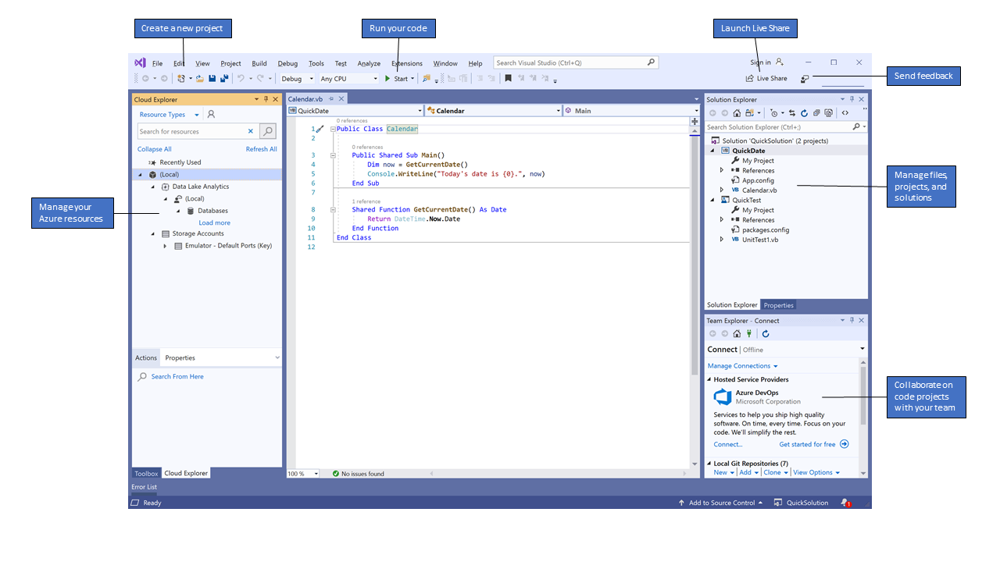](media/vs-2019/ide-overview.png#lightbox)

::: moniker-end

::: moniker range=">=vs-2022"

:::image type="content" source="media/vs-2022/ide-overview.png" alt-text="Screenshot of the Visual Studio IDE with Visual Basic code and key functionality." lightbox="media/vs-2022/ide-overview.png" border="false":::

::: moniker-end

The preceding image shows Visual Studio with an open Visual Basic project that shows key windows and their functionality:

- In [Solution Explorer](../../ide/solutions-and-projects-in-visual-studio.md), at upper right, you can view, navigate, and manage your code files. **Solution Explorer** can help organize your code by grouping the files into [solutions and projects](tutorial-projects-solutions.md).

- The central [editor window](../../ide/writing-code-in-the-code-and-text-editor.md), where you'll probably spend most of your time, displays file contents. In the editor window, you can edit code or design a user interface such as a window with buttons and text boxes.

::: moniker range="<=vs-2019"
- In [Team Explorer](/azure/devops/user-guide/work-team-explorer?view=vsts&preserve-view=true), at lower right, you can track work items and share code using version control technologies such as [Git](https://git-scm.com/) and [Team Foundation Version Control (TFVC)](/azure/devops/repos/tfvc/overview?view=vsts&preserve-view=true).
::: moniker-end

::: moniker range=">=vs-2022"
- In [Git Changes](/visualstudio/version-control/) at lower right, you can track work items and share code with others by using version control technologies like [Git](https://git-scm.com/) and [GitHub](https://github.com/).
::: moniker-end

## Editions

Visual Studio is available for Windows.

There are three editions of Visual Studio: Community, Professional, and Enterprise. See [Compare Visual Studio editions](https://visualstudio.microsoft.com/vs/compare/) to learn about which features each edition supports.

## Popular productivity features

Some popular features in Visual Studio that improve your productivity when developing software include:

- Squiggles and [Quick Actions](../../ide/quick-actions.md)

  Squiggles are wavy underlines that alert you to errors or potential problems in your code as you type. These visual clues help you fix problems immediately, without waiting to discover errors during build or runtime. If you hover over a squiggle, you see more information about the error. A light bulb might also appear in the left margin showing *Quick Actions* you can take to fix the error.

   ::: moniker range="vs-2019"

   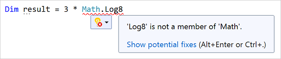

   ::: moniker-end

   ::: moniker range=">=vs-2022"

   :::image type="content" source="media/vs-2022/squiggles-error.png" alt-text="Screenshot of a squiggle underline in Visual Studio." border="false":::

   ::: moniker-end

- [Refactoring](../../ide/refactoring-in-visual-studio.md)

   Refactoring includes operations such as intelligent renaming of variables, extracting one or more lines of code into a new method, and changing the order of method parameters.

   ::: moniker range="vs-2019"

   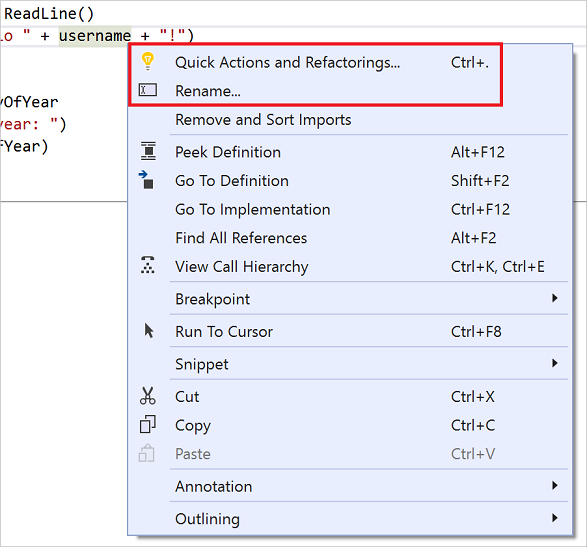

   ::: moniker-end

   ::: moniker range=">=vs-2022"

   :::image type="content" source="media/vs-2022/refactoring-menu.png" alt-text="Screenshot of the Refactoring menu in Visual Studio." border="false":::

   ::: moniker-end

- [IntelliSense](../../ide/using-intellisense.md)

   IntelliSense is a set of features that display information about your code directly in the editor and, in some cases, write small bits of code for you. It's like having basic documentation inline in the editor, so you don't have to look up type information elsewhere.

   The following illustration shows how IntelliSense displays a member list for a type:

   ::: moniker range="vs-2019"

   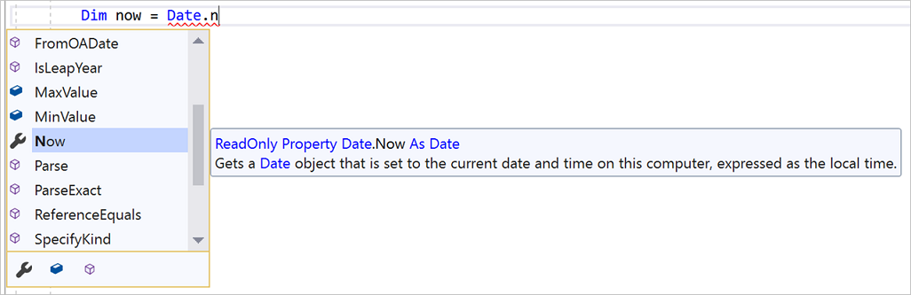

   ::: moniker-end

   ::: moniker range=">=vs-2022"

   :::image type="content" source="media/vs-2022/intellisense.png" alt-text="Screenshot of an IntelliSense member list." border="false":::

   ::: moniker-end

   IntelliSense features vary by language. For more information, see [C# IntelliSense](../../ide/visual-csharp-intellisense.md), [Visual C++ IntelliSense](../../ide/visual-cpp-intellisense.md), [JavaScript IntelliSense](../../ide/javascript-intellisense.md), and [Visual Basic IntelliSense](../../ide/visual-basic-specific-intellisense.md).

- [Visual Studio search](../../ide/visual-studio-search.md)

   Visual Studio menus, options, and properties can seem overwhelming at times. Visual Studio search, or **Ctrl**+**Q**, is a great way to rapidly find IDE features and code in one place.

   When you start typing the name of something you're looking for, Visual Studio lists results that take you where you need to go. If you need to add functionality, for example another programming language, you can open the Visual Studio Installer from the search box results to install the workload or component.

   ::: moniker range="vs-2019"

   

   ::: moniker-end

   ::: moniker range=">=vs-2022"

   :::image type="content" source="media/vs-2022/quick-launch-nuget.png" alt-text="Screenshot that shows the Quick Launch search box in Visual Studio." border="false":::

   ::: moniker-end

- [Live Share](/visualstudio/liveshare/)

   Collaboratively edit and debug with others in real time, regardless of your app type or programming language. You can instantly and securely share your project. You can also share debugging sessions, terminal instances, `localhost` web apps, voice calls, and more.

- [Call Hierarchy](../../ide/reference/call-hierarchy.md)

   The **Call Hierarchy** window shows the methods that call a selected method. This information can be useful when you're thinking about changing or removing the method, or when you're trying to track down a bug.

   ::: moniker range="vs-2019"

   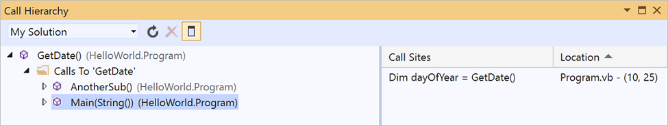

   ::: moniker-end

   ::: moniker range=">=vs-2022"

   :::image type="content" source="media/vs-2022/call-hierarchy.png" alt-text="Screenshot that shows the Call Hierarchy window in Visual Studio." border="false":::

   ::: moniker-end

- [CodeLens](../../ide/find-code-changes-and-other-history-with-codelens.md)

   CodeLens helps you find code references, code changes, linked bugs, work items, code reviews, and unit tests, without leaving the editor.

   ::: moniker range="vs-2019"

   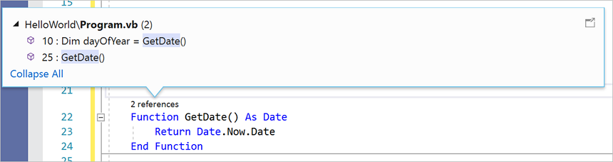

   ::: moniker-end

   ::: moniker range=">=vs-2022"

   :::image type="content" source="media/vs-2022/codelens.png" alt-text="Screenshot that shows CodeLens in Visual Studio." border="false":::

   ::: moniker-end

- [Go To Definition](../../ide/go-to-and-peek-definition.md)

   The **Go To Definition** feature takes you directly to the location of a function or type definition.

   ::: moniker range="vs-2019"

   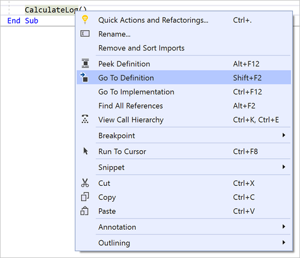

   ::: moniker-end

   ::: moniker range=">=vs-2022"

   :::image type="content" source="media/vs-2022/go-to-definition-menu.png" alt-text="Screenshot that shows Go to Definition in Visual Studio." border="false":::

   ::: moniker-end

- [Peek Definition](../../ide/how-to-view-and-edit-code-by-using-peek-definition-alt-plus-f12.md)

   The **Peek Definition** window shows a method or type definition without opening a separate file.

   ::: moniker range="vs-2019"

   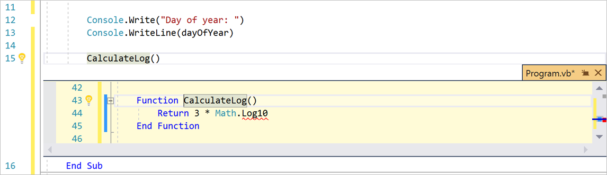

   ::: moniker-end

   ::: moniker range=">=vs-2022"

   :::image type="content" source="media/vs-2022/peek-definition.png" alt-text="Screenshot that shows Peek Definition in Visual Studio." border="false":::

   ::: moniker-end

::: moniker range=">=vs-2022"

- [Hot Reload](../../debugger/hot-reload.md)

   Hot Reload enables you to edit your application's code files and apply the code changes immediately to the running application.

   :::image type="content" source="../media/vs-2022/overview-hot-reload.png" alt-text="Screenshot of Hot Reload in Visual Studio 2022.":::

::: moniker-end

## Install Visual Studio

In this section, you create a simple project to try out some of the things you can do with Visual Studio. You learn how to change the color theme, use [IntelliSense](../../ide/using-intellisense.md) as a coding aid, and debug an app to see a variable value during app execution.

::: moniker range="vs-2019"

To get started, [download Visual Studio](https://visualstudio.microsoft.com/downloads/?cid=learn-onpage-download-cta) and install it on your system. The modular installer enables you to select and install *workloads*, which are groups of features needed for the programming language or platform you prefer. To follow the steps for [creating a program](#create-a-program), be sure to select the **.NET Core cross-platform development** workload during installation.


::: moniker-end

::: moniker range=">=vs-2022"

To get started, [download Visual Studio](https://visualstudio.microsoft.com/downloads/?cid=learn-onpage-download-cta) and install it on your system. In the modular installer, you choose and install *workloads*, which are groups of features you need for the programming languages or platforms you want. To use the following steps to [create a program](#create-a-program), be sure to select the **.NET desktop development** workload during installation.

:::image type="content" source="media/vs-2022/dot-net-development-workload.png" alt-text="Screenshot of the dot NET desktop development workload selected in the Visual Studio Installer." border="false":::

::: moniker-end

When you open Visual Studio for the first time, you can [sign in](../../ide/signing-in-to-visual-studio.md) by using your Microsoft account or your work or school account.

## Customize Visual Studio

You can personalize the Visual Studio user interface, including changing the default color theme.

### Change the color theme

To change the color theme:

::: moniker range="vs-2019"

1. Open Visual Studio. On the start window, select **Continue without code**.

   :::image type="content" source="media/vs-2019/continue-without-code.png" alt-text="Screenshot of the Start window in Visual Studio 2019, with the 'Continue without code' link highlighted.":::

   The IDE opens.

1. On the Visual Studio menu bar, choose **Tools** > **Options** to open the **Options** dialog.

1. On the **Environment** > **General** options page, change the **Color theme** selection to **Dark**, and then choose **OK**.

   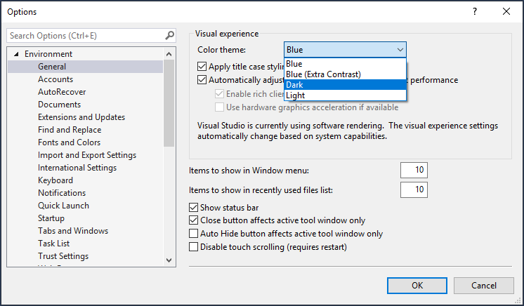

   The color theme for the entire IDE changes to **Dark**.

   

::: moniker-end

::: moniker range=">=vs-2022"
1. Open Visual Studio. On the start window, select **Continue without code**.

   :::image type="content" source="media/vs-2022/continue-without-code.png" alt-text="Screenshot of the Visual Studio Start screen, with the Continue without code link highlighted." border="false":::

1. On the Visual Studio menu bar, choose **Tools** > **Options** to open the **Options** dialog.

1. On the **Environment** > **General** options page, change the **Color Theme** selection to **Blue** or **Light**, and then select **OK**.

   :::image type="content" source="media/vs-2022//change-color-theme.png" alt-text="Screenshot that shows changing the color theme to Blue in Visual Studio.":::

   The color theme for the entire IDE changes accordingly. The following screenshot shows the Blue theme:

   :::image type="content" source="media/vs-2022/blue-theme.png" alt-text="Screenshot that shows Visual Studio in Blue theme.":::
::: moniker-end

### Select environment settings

You can configure Visual Studio to use environment settings tailored to Visual Basic developers.

1. On the menu bar, choose **Tools** > **Import and Export Settings**.

1. In the **Import and Export Settings Wizard**, select **Reset all settings**, and then select **Next**.

1. On the **Save Current Settings** page, select whether to save your current settings before resetting. If you haven't customized any settings, select **No, just reset settings, overwriting my current settings**. Then select **Next**.

1. On the **Choose a Default Collection of Settings** page, choose **Visual Basic**, and then select **Finish**.

1. On the **Reset Complete** page, select **Close**.

To learn about other ways you can personalize the IDE, see [Personalize Visual Studio](../../ide/personalizing-the-visual-studio-ide.md).

## Create a program

Dive in and create a simple program.

::: moniker range="vs-2019"

1. On the Visual Studio menu bar, choose **File** > **New** > **Project**. (Alternatively, press **Ctrl**+**Shift**+**N**.)

    :::image type="content" source="media/vs-2019/file-new-project.png" alt-text="Screenshot of the File > New > Project selection from the Visual Studio 2019 menu bar.":::

   The **Create a new project** window opens and shows several project *templates*. A template contains the basic files and settings required for a given project type.

1. To find the template we want, type or enter **.net core console** in the search box. The list of available templates is automatically filtered based on the keywords you entered. You can further filter the template results by choosing **Visual Basic** from the **All language** drop-down list, **Windows** from the **All platforms** list, and **Console** from the **All project types** list.

   Select the **Console Application** template, and then select **Next**.

    :::image type="content" source="media/vs-2019/create-new-project.png" alt-text="Screenshot of the 'Create a new project' window in Visual Studio 2019, where you select the template that you want.":::

1. In the **Configure your new project** window, enter **HelloWorld** in the **Project name** box, optionally change the directory location for your project files (the default locale is `C:\Users\<name>\source\repos`), and then select **Next**.

    :::image type="content" source="media/vs-2019/configure-new-project.png" alt-text="Screenshot showing the Configure your new project dialog in Visual Studio 2019 and the options to set, including the project name and project location." lightbox="media/vs-2019/configure-new-project.png":::

1. In the **Additional information** window, verify that **.NET Core 3.1** appears in the **Target Framework** drop-down menu, and then select **Create**.

    :::image type="content" source="media/vs-2019/create-project-additional-info.png" alt-text="Screenshot of the 'Additional information' window in Visual Studio 2019, where you select the version of the .NET Core Framework that you want.":::

   Visual Studio creates the project. It's a simple "Hello World" application that calls the <xref:System.Console.WriteLine?displayProperty=nameWithType> method to display the literal string "Hello World!" in the console (program output) window.

   Shortly, you should see something like the following image:

   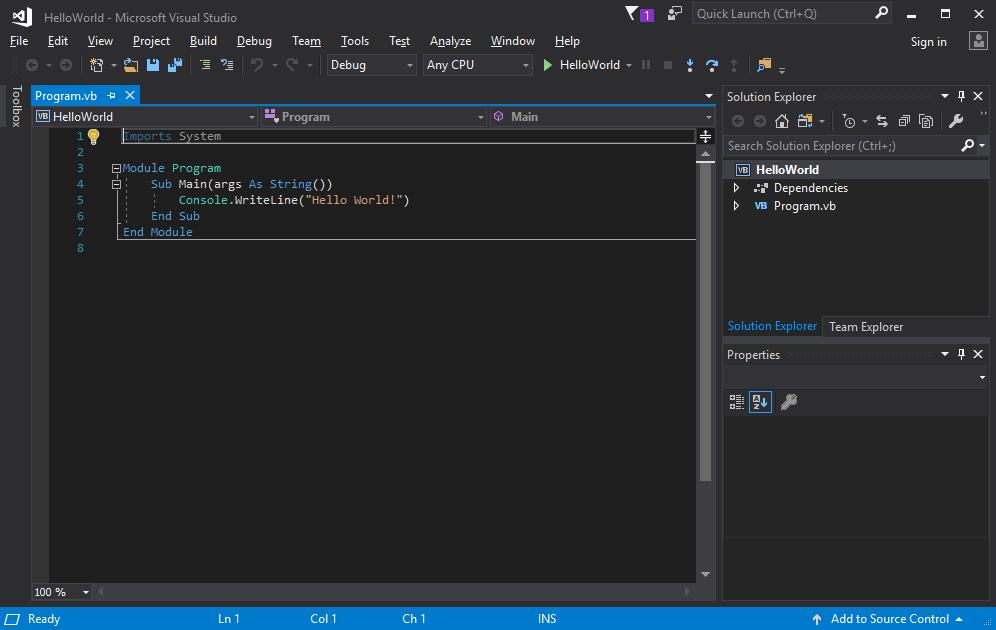

   The Visual Basic code for the app appears in the editor window, which takes up most of the space. Notice that the text is automatically colorized to indicate different parts of the code, such as keywords and types. In addition, small, vertical dashed lines in the code indicate which braces match one another, and line numbers help you locate code later. You can choose the small, boxed minus signs to collapse or expand blocks of code. This code outlining feature lets you hide code you don't need, helping to minimize onscreen clutter. The project files are listed on the right side in a window called **Solution Explorer**.

   

   There are other menus and tool windows available, but let's move on for now.

1. Now, start the app. You can initiate the process by choosing **Start Without Debugging** from the **Debug** menu on the menu bar. You can also press **Ctrl**+**F5**.

   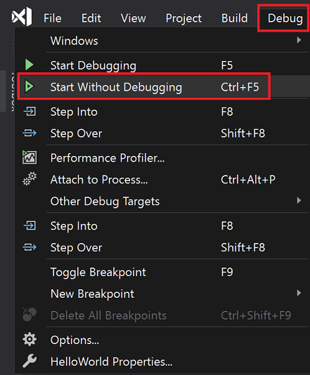

   Visual Studio builds the app, and a console window opens with the message **Hello World!**. You now have a running app!

   

1. To close the console window, press any key on your keyboard.

1. Let's add some more code to the app. Add the following Visual Basic code before the line that says `Console.WriteLine("Hello World!")`:

   ```vb
   Console.WriteLine("What is your name?")
   Dim name = Console.ReadLine()
   ```

   This code displays **What is your name?** in the console window, and then waits until the user enters some text followed by the **Enter** key.

1. Change the line that says `Console.WriteLine("Hello World!")` to the following code:

   ```vb
   Console.WriteLine("Hello " + name + "!")
   ```

1. Run the app again by pressing **Ctrl**+**F5**.

   Visual Studio rebuilds the app, and a console window opens and prompts you for your name.

1. Enter your name in the console window and press **Enter**.

   :::image type="content" source="../media/vs-2019/overview-console-input.png" alt-text="Screenshot of the console window showing the What is your name question and the app's response." lightbox="../media/vs-2019/overview-console-input.png" border="false":::

1. Press any key to close the console window and stop the running program.

::: moniker-end

::: moniker range=">=vs-2022"

1. On the Visual Studio menu bar, choose **File** > **New** > **Project**. You can also press **Ctrl**+**Shift**+**N**.

   :::image type="content" source="media/vs-2022/file-new-project.png" alt-text="Screenshot of the File > New > Project selection from the Visual Studio menu bar." border="false":::

   The **Create a new project** window opens and shows several project *templates*. A template contains the basic files and settings that a given project type requires.

1. To find a template, you can type or enter keywords in the search box. The list of available templates filters based on the keywords you enter. You can further filter the template results by choosing **Visual Basic** from the **All languages** dropdown list, **Windows** from the **All platforms** list, and **Console** from the **All project types** list.

   Select the Visual Basic **Console Application** template, and then select **Next**.

   :::image type="content" source="media/vs-2022/create-project.png" alt-text="Screenshot of the Create a new project window with the Visual Basic Console Application selected." border="false":::

1. In the **Configure your new project** window, enter **HelloWorld** in the **Project name** box. Optionally, change the project directory location from the default location of *C:\\Users\\\<name>\\source\\repos*, and then select **Next**.

   :::image type="content" source="media/vs-2022/configure.png" alt-text="Screenshot of the Configure your new project window with the project name HelloWorld entered." lightbox="media/vs-2022/configure.png" border="false":::

1. In the **Additional information** window, verify that **.NET 8.0** appears in the **Target Framework** drop-down menu, and then select **Create**.

   :::image type="content" source="media/vs-2022/additional-information.png" alt-text="Screenshot of the Additional information window with dot NET 8.0 selected." lightbox="media/vs-2022/additional-information.png" border="false":::

   Visual Studio creates the project. The program is a simple "Hello World" application that calls the <xref:System.Console.WriteLine?displayProperty=nameWithType> method to display the string **Hello, World!** in a console window.

   The project files appear on the right side of the Visual Studio IDE, in a window called the **Solution Explorer**. In the **Solution Explorer** window, select the **Program.vb** file. The Visual Basic code for the app opens in the central editor window, which takes up most of the space.

   :::image type="content" source="media/vs-2022/open-program.png" alt-text="Screenshot that shows the Visual Studio I D E with the Program dot V B code in the editor." border="false":::

   The code is automatically colorized to indicate different parts, such as keywords and types. Line numbers help you locate code.

   Small, vertical dashed lines in the code indicate code structure or code blocks that go together. You can also select the small, boxed minus or plus signs to collapse or expand blocks of code. This code outlining feature lets you hide code you don't need to see, helping to minimize onscreen clutter.

   :::image type="content" source="media/vs-2022/editor-features.png" alt-text="Screenshot that shows the Visual Studio I D E with red boxes." border="false":::

   Many other menus and tool windows are available.

1. Start the app by choosing **Debug** > **Start Without Debugging** from the Visual Studio top menu. You can also press **Ctrl**+**F5**.

   :::image type="content" source="media/vs-2022/start-without-debugging.png" alt-text="Screenshot that shows the Debug > Start without Debugging menu item." border="false":::

   Visual Studio builds the app, and a console window opens with the message **Hello World!**. You now have a running app!

   :::image type="content" source="../media/vs-2019/overview-console-window.png" alt-text="Screenshot of the Debug Console window showing the output Hello World! and Press any key to close this window." border="false":::

1. To close the console window, press any key.

1. Let's add more code to the app. Add the following Visual Basic code before the line that says `Console.WriteLine("Hello World!")`:

   ```vb
   Console.WriteLine("What is your name?")
   Dim name = Console.ReadLine()
   ```

   This code displays **What is your name?** in the console window, and then waits until the user enters some text.

1. Change the line that says `Console.WriteLine("Hello World!")` to the following line:

   ```vb
   Console.WriteLine("Hello " + name + "!")
   ```

1. Run the app again by selecting **Debug** > **Start Without Debugging** or pressing **Ctrl**+**F5**.

   Visual Studio rebuilds the app, and a console window opens and prompts you for your name.

1. Type your name in the console window and press **Enter**.

   :::image type="content" source="../media/vs-2022/overview-console-input.png" alt-text="Screenshot of the Debug Console window showing the prompt for a name, the input, and the output Hello Georgette." border="false":::

1. Press any key to close the console window and stop the running program.

::: moniker-end

## Use refactoring and IntelliSense

Let's look at a couple of the ways that [refactoring](../../ide/refactoring-in-visual-studio.md) and [IntelliSense](../../ide/using-intellisense.md) can help you code more efficiently.

First, rename the `name` variable:

1. Double-click the `name` variable, and type the new name for the variable, *username*.

   A box appears around the variable, and a light bulb appears in the margin.

1. Select the light bulb icon to show the available [Quick Actions](../../ide/quick-actions.md). Select **Rename 'name' to 'username'**.

   ::: moniker range="<=vs-2019"
   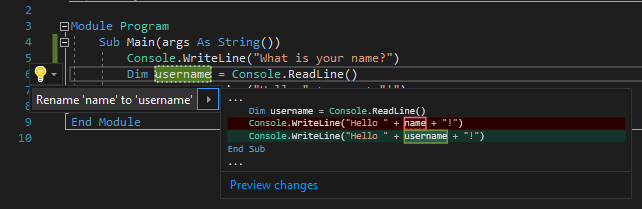
   ::: moniker-end
   ::: moniker range=">=vs-2022"
   :::image type="content" source="media/vs-2022/rename.png" alt-text="Screenshot that shows the Rename action in Visual Studio." border="false":::
   ::: moniker-end

   The variable renames across the project, which in this case is only two places.

Now take a look at IntelliSense.

1. Below the line that says `Console.WriteLine("Hello " + username + "!")`, type the following code:

   ```vb
   Dim now = Date.
   ```
   
   A box displays the members of the <xref:System.DateTime> class. The description of the currently selected member also displays in a separate box.

   ::: moniker range="<=vs-2019"
   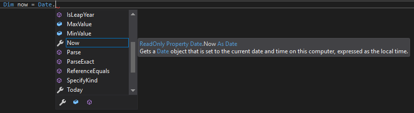
   ::: moniker-end
   ::: moniker range=">=vs-2022"
   :::image type="content" source="media/vs-2022/intellisense-list-members.png" alt-text="Screenshot that shows IntelliSense list members in Visual Studio." border="false":::
   ::: moniker-end

1. Choose the member named **Now**, which is a property of the class. Either double-click on **Now**, or select it and press **Tab**.

1. Below that line, enter the following lines of code:

   ```vb
   Dim dayOfYear = now.DayOfYear
   Console.Write("Day of year: ")
   Console.WriteLine(dayOfYear)
   ```

   > [!TIP]
   > <xref:System.Console.Write%2A?displayProperty=nameWithType> is different from <xref:System.Console.WriteLine%2A?displayProperty=nameWithType> in that it doesn't add a line terminator after it prints. That means that the next piece of text that's sent to the output will print on the same line. You can hover over each of these methods in your code to see their descriptions.

Next, use refactoring again to make the code a little more concise.

::: moniker range="<=vs-2019"
1. Select the variable `now` in the line `Dim now = Date.Now`. A screwdriver icon appears in the margin on that line.

1. Select the screwdriver icon to see available suggestions from Visual Studio. This case shows the [Inline temporary variable](../../ide/reference/inline-temporary-variable.md) refactoring to remove a line of code without changing the overall code behavior.

   

1. Select **Inline temporary variable** to refactor the code.

1. Run the program again by pressing **Ctrl**+**F5**. The output looks something like this:

   :::image type="content" source="../media/vs-2019/overview-console-final.png" alt-text="Screenshot of the Debug Console window showing the prompt for a name, the input, and the output." lightbox="../media/vs-2019/overview-console-final.png" border="false":::

   ::: moniker-end

::: moniker range=">=vs-2022"
1. Select the variable `now` in the line `Dim now = Date.Now`. A light bulb icon appears in the margin on that line.

1. Select the light bulb icon to see available suggestions from Visual Studio. This case shows the [Inline temporary variable](../../ide/reference/inline-temporary-variable.md) refactoring to remove a line of code without changing the overall code behavior.

   :::image type="content" source="media/vs-2022/inline-temporary-variable.png" alt-text="Screenshot showing the Inline temporary variable suggestion in Visual Studio." border="false":::

1. Select **Inline temporary variable** to refactor the code.

1. Run the program again by pressing **Ctrl**+**F5**. The output looks something like this:

   :::image type="content" source="../media/vs-2022/overview-console-final.png" alt-text="Screenshot of the Debug Console window showing the prompt for a name, the input, and the output." lightbox="../media/vs-2022/overview-console-final.png" border="false":::
::: moniker-end

## Debug code

When you write code, you should run it and test it for bugs. Visual Studio's debugging system lets you step through code one statement at a time and inspect variables as you go. You can set *breakpoints* that stop execution of the code at a particular line, and observe how the variable value changes as the code runs.

Set a breakpoint to see the value of the `username` variable while the program is running.

1. Set a breakpoint on the line of code that says `Console.WriteLine("Hello " + username + "!")` by clicking in the far-left margin, or gutter, next to the line. You can also select the line of code and then press **F9**.

   A red circle appears in the gutter, and the line is highlighted.

   ::: moniker range="<=vs-2019"
   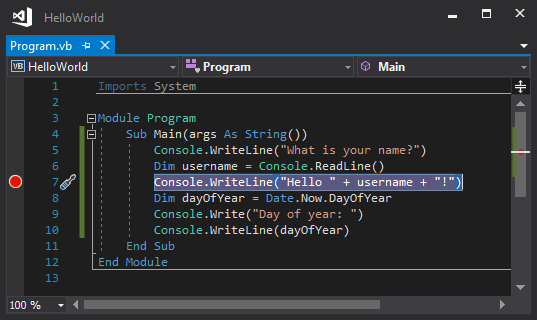
   ::: moniker-end
   ::: moniker range=">=vs-2022"
   :::image type="content" source="media/vs-2022/breakpoint.png" alt-text="Screenshot that shows a breakpoint on a line of code in Visual Studio." border="false":::
   ::: moniker-end

1. Start debugging by selecting **Debug** > **Start Debugging** or pressing **F5**.

1. When the console window appears and asks for your name, enter your name.

   The focus returns to the Visual Studio code editor, and the line of code with the breakpoint is highlighted in yellow. The yellow highlight means that this line of code executes next. The breakpoint makes the app pause execution at this line.

1. Hover your mouse over the `username` variable to see its value. You can also right-click on `username` and select **Add Watch** to add the variable to the **Watch** window, where you can also see its value.

   ::: moniker range="<=vs-2019"
   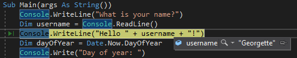
   ::: moniker-end
   ::: moniker range=">=vs-2022"
   :::image type="content" source="media/vs-2022/inspect-variable.png" alt-text="Screenshot that shows a variable value during debugging in Visual Studio." border="false":::
   ::: moniker-end

1. Press **F5** again to finish running the app.

::: moniker range=">=vs-2022"

Once the app is running, you can apply code changes to the running app by clicking the Hot Reload button.

:::image type="content" source="../media/vs-2022/overview-hot-reload.png" alt-text="Screenshot of Hot Reload in Visual Studio 2022.":::

::: moniker-end

For more information about debugging in Visual Studio, see the [Debugger feature tour](../../debugger/debugger-feature-tour.md).

## Related content

- [Learn to use the code editor](tutorial-editor.md)
- [Learn about projects and solutions](tutorial-projects-solutions.md)
- Discover [more Visual Studio features](../../ide/advanced-feature-overview.md).
- Visit [visualstudio.microsoft.com](https://visualstudio.microsoft.com/vs/).
- Read the [Visual Studio blog](https://devblogs.microsoft.com/visualstudio/).
