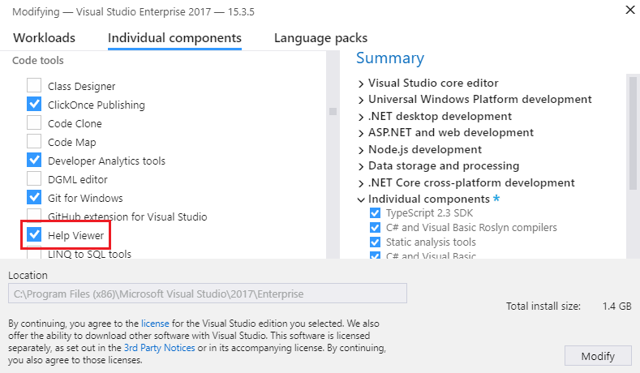
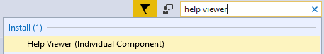
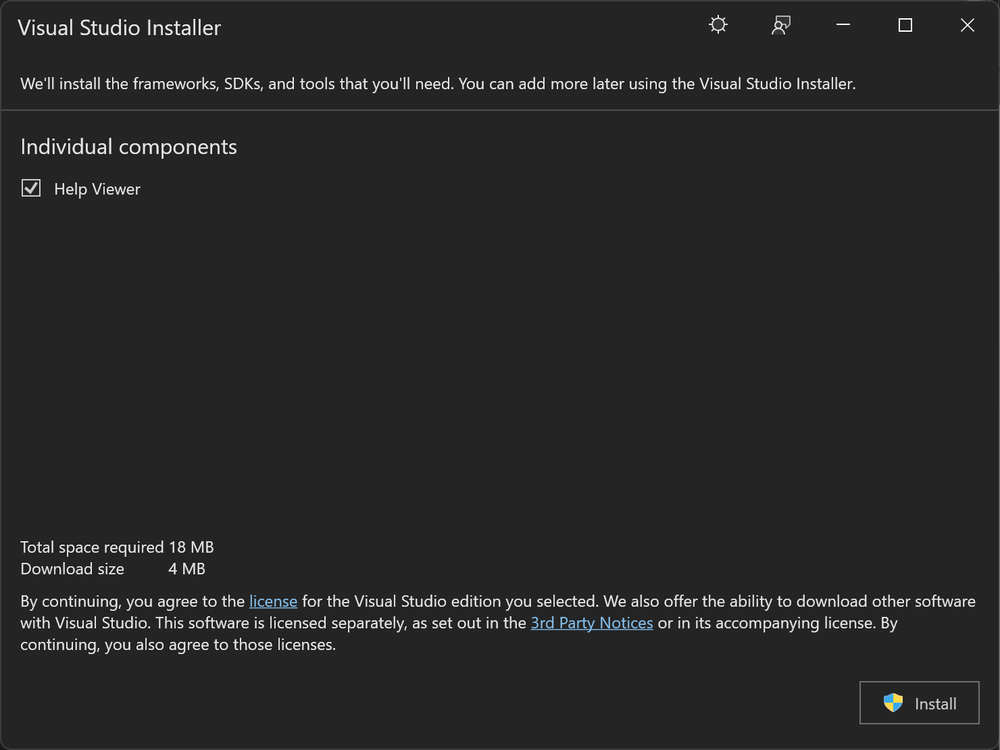

# Microsoft Help Viewer installation

Several products can display Help content in Microsoft Help Viewer, including Visual Studio and SQL Server.

>[!WARNING]
>Compatibility issues may arise if multiple versions of Visual Studio with Help Viewer are installed side by side, especially when Visual Studio 2022 or a newer version is installed first, followed by an older version. These issues may include crashes while using Help Viewer and difficulties uninstalling it through Add/Remove Programs in Windows.
>
> To address these problems, it is recommended to manually delete the folder where Help Viewer is installed, typically found at %ProgramFiles(x86)%\Microsoft Help Viewer. Afterward, reinstall Help Viewer using Visual Studio 2022 or a later version.

Help Viewer is an optional installation component of Visual Studio. To install it through Visual Studio Installer, follow these steps:

1. Open **Visual Studio Installer** from the Start menu or, if you have Visual Studio open, you can choose **Tools** > **Get Tools and Features** to open Visual Studio Installer.

1. Choose the **Individual Components** tab, then search for `help viewer`, or select **Help Viewer** under the **Code tools** section.

   

1. Choose the **Modify** button to start the installation of Microsoft Help Viewer.

Another way to easily install Microsoft Help Viewer is through the search box:

1. Make sure that the **Visual Studio Installer** is not running.

1. Press **Ctrl**+**Q** and then type or enter **help viewer** in the search box.

   

1. Choose the result called **Install Help Viewer**.

1. In the dialog box that opens, choose the **Install** button.

   

## Related content

- [Microsoft Help Viewer](../help-viewer/overview.md)
- [Help viewer and offline content for SQL Server](/sql/sql-server/sql-server-offline-documentation)

