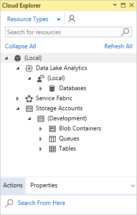
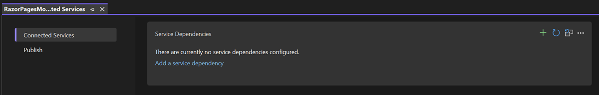

# Features of Visual Studio

This article describes features for experienced developers, or developers who are already familiar with Visual Studio. For a basic introduction to Visual Studio, see the [Visual Studio IDE overview](../get-started/visual-studio-ide.md).

## Modular installation

In Visual Studio's modular installer, you choose and install the *workloads* you want. Workloads are groups of features that programming languages or platforms need to work. This modular strategy helps keep the Visual Studio installation footprint smaller, so it installs and updates faster.

If you haven't already installed Visual Studio, go to the [Visual Studio downloads](https://visualstudio.microsoft.com/downloads/?cid=learn-onpage-download-cta) page to install it for free.

To learn more about setting up Visual Studio on your system, see [Install Visual Studio](../install/install-visual-studio.md).

## Create cloud-enabled Azure apps

Visual Studio has a suite of tools to easily create Microsoft Azure cloud-enabled applications. You can configure, build, debug, package, and deploy Azure apps and services directly from the Visual Studio integrated development environment (IDE). To get the Azure tools and project templates, select the **Azure development** workload when you install Visual Studio.

::: moniker range="<=vs-2019"

::: moniker-end

::: moniker range=">=vs-2022"

:::image type="content" source="media/vs-2022/azure-development-workload.png" alt-text="Screenshot of the Azure development workload selected in the Visual Studio Installer." border="false":::

::: moniker-end

::: moniker range="vs-2019"

In Visual Studio, use [Cloud Explorer](/azure/vs-azure-tools-resources-managing-with-cloud-explorer) to view and manage your Azure-based cloud resources. Cloud resources might include virtual machines (VMs), tables, and SQL databases. **Cloud Explorer** shows the Azure resources in all the accounts under the Azure subscription you're signed into. If an operation requires the Azure portal, **Cloud Explorer** has links to the place in the portal you need to go.

::: moniker-end

::: moniker range=">=vs-2022"
> [!Important]
> The Cloud Explorer window is retired in Visual Studio 2022. For more information, see [Manage the resources associated with your Azure accounts in Visual Studio Cloud Explorer](../azure/vs-azure-tools-resources-managing-with-cloud-explorer.md?view=vs-2022&preserve-view=true).
>
> Use the Azure portal to access Azure resources as necessary. You can continue to use the Azure node of Server Explorer in previous versions of Visual Studio.
>
::: moniker-end

You can use Azure services for your apps by adding **Connected Services**, such as:

- [Active Directory connected service](/azure/active-directory/develop/vs-active-directory-add-connected-service), to use [Microsoft Entra ID](/azure/active-directory/active-directory-whatis) (Microsoft Entra ID) accounts to connect to web apps
- [Azure Storage connected service](/azure/vs-azure-tools-connected-services-storage) for blob storage, queues, and tables
- [Key Vault connected service](/azure/key-vault/vs-key-vault-add-connected-service) to manage secrets for web apps

The available **Connected Services** depend on your project type. Add a service by right-clicking the project in **Solution Explorer** and choosing **Add** > **Connected Service**.

::: moniker range="<=vs-2019"

::: moniker-end

::: moniker range=">=vs-2022"

On the **Connected Services** screen, select the link or the plus sign to **Add a service dependency**. On the **Add dependency** screen, select the service you want to add, and follow the screens to connect to your Azure subscription and service.

:::image type="content" source="media/vs-2022/connected-services.png" alt-text="Screenshot that shows Connected Services dependencies." border="false":::

::: moniker-end

For more information, see [Move to the cloud With Visual Studio and Azure](https://visualstudio.microsoft.com/vs/azure-tools/).

## Create web apps

Visual Studio can help you write apps for the web. You can create web apps by using ASP.NET, Node.js, Python, JavaScript, and TypeScript. Visual Studio supports many web frameworks, such as Angular, jQuery, and Express.

[ASP.NET Core](https://dotnet.microsoft.com/learn/aspnet/what-is-aspnet-core) and .NET Core run on Windows, Mac, and Linux operating systems. ASP.NET Core is a major update to MVC, WebAPI, and SignalR. ASP.NET Core is designed from the ground up to provide a lean and composable .NET stack for building modern cloud-based web apps and services.

For more information, see [Modern web tooling](https://visualstudio.microsoft.com/vs/modern-web-tooling/).

## Build cross-platform apps and games

Visual Studio can build apps and games for macOS, Linux, and Windows, and for Android, iOS, and other [mobile devices](https://visualstudio.microsoft.com/vs/mobile-app-development/). With Visual Studio, you can build:

- [.NET Core](/dotnet/core/) apps that run on Windows, macOS, and Linux.

- Cross-platform apps for Android, iOS, Mac Catalyst, and Windows in C# by using [.NET MAUI](/dotnet/maui).

- 2D and 3D games in C# by using [Visual Studio Tools for Unity](/visualstudio/gamedev/unity/get-started/visual-studio-tools-for-unity).

- Native C++ apps for iOS, Android, and Windows devices. Share common code in iOS, Android, and Windows libraries by using [C++ for cross-platform development](/cpp/cross-platform/visual-cpp-for-cross-platform-mobile-development).

## Connect to databases

**Server Explorer** helps you browse and manage server instances and assets locally, remotely, and on Azure, Microsoft 365, Salesforce.com, and websites. To open **Server Explorer**, choose **View** > **Server Explorer**. For more information on using Server Explorer, see [Add new connections](../data-tools/add-new-connections.md).

**SQL Server Object Explorer** provides a view of your database objects, similar to SQL Server Management Studio. With SQL Server Object Explorer, you can do light-duty database administration and design work. Examples include editing table data, comparing schemas, and executing queries by using contextual menus.

::: moniker range="<=vs-2019"

::: moniker-end

::: moniker range=">=vs-2022"

To open **SQL Server Object Explorer**, select its icon at the top of the **Server Explorer** window, or select **View** > **SQL Server Object Explorer** from the Visual Studio top menu.

:::image type="content" source="media/vs-2022/sql-server-object-explorer.png" alt-text="Screenshot that shows the SQL Server Object Explorer window." border="false":::

::: moniker-end

[SQL Server Data Tools (SSDT)](/sql/ssdt/download-sql-server-data-tools-ssdt) is a powerful development environment for SQL Server, Azure SQL Database, and Azure SQL Data Warehouse. With SSDT, you can build, debug, maintain, and refactor databases. You can work with a database project, or directly with a connected database instance on- or off-premises. To get SSDT, use the Visual Studio Installer to install the **Data storage and processing** workload.

## Debug, test, and improve your code

When you write code, you should run it and test it for bugs and performance. With Visual Studio's debugging system, you can debug code running in your local project, on a remote device, or on a [device emulator](../cross-platform/visual-studio-emulator-for-android.md). Step through code one statement at a time, and inspect variables as you go. Or set breakpoints that are only hit when a specified condition is true. You can manage debug options in the code editor itself, so you don't have to leave your code.

For more information about debugging in Visual Studio, see [First look at the debugger](../debugger/debugger-feature-tour.md).

To improve app performance, check out the Visual Studio [profiling](../profiling/profiling-feature-tour.md) feature.

Visual Studio offers [testing](../test/improve-code-quality.md) options like unit testing, Live Unit Testing, IntelliTest, and load and performance testing. Visual Studio also has advanced [code analysis](/previous-versions/visualstudio/visual-studio-2019/code-quality/code-analysis-for-managed-code-overview) capabilities to find design, security, and other flaws.

## Deploy your finished application

Visual Studio has tools to deploy your app to users or customers through the Microsoft Store, a SharePoint site, or InstallShield or Windows Installer technologies. You can access all these options through the Visual Studio IDE. For more information, see [Deploy applications, services, and components](../deployment/deploying-applications-services-and-components.md).

## Manage your source code and collaborate with others

In Visual Studio, you can manage your source code in Git repos hosted by any provider, including GitHub. You can also browse for an Azure DevOps Server to connect to, too.

::: moniker range=">=vs-2022"

For full details, see the [Git experience in Visual Studio](../version-control/git-with-visual-studio.md) page. And, for a step-by-step tutorial on how to connect to a Git or Azure DevOps repository by using Visual Studio, see the [Open a project from a repo](../get-started/tutorial-open-project-from-repo.md?view=vs-2022&preserve-view=true) page.

> [!TIP]
> We continue to build out the Git feature set and iterate on it based on your feedback. For more info about a recent feature update along with a link to survey where you can share your feedback on it, see the [Multi-repo support in Visual Studio](https://devblogs.microsoft.com/visualstudio/multi-repo-support-in-visual-studio/) blog post.

::: moniker-end

::: moniker range="vs-2019"

How you open a project from a GitHub repo by using Visual Studio 2019 depends on which version you have. Specifically, if you've installed version [**version 16.8**](/visualstudio/releases/2019/release-notes/) or later, there's a new, more fully integrated [Git experience in Visual Studio](../version-control/git-with-visual-studio.md) available to you.

And, for a step-by-step tutorial on how to connect to a Git or Azure DevOps repository by using Visual Studio, see the [Open a project from a repo](../get-started/tutorial-open-project-from-repo.md?view=vs-2019&preserve-view=true) page.

::: moniker-end

::: moniker range=">=vs-2022"

## Optimize the Visual Studio experience on Microsoft Dev Box

> [!NOTE]
> This feature is currently in public preview. This information relates to a feature that may be substantially modified before it's released. Microsoft makes no warranties, expressed or implied, with respect to the information provided here.

With [Visual Studio 17.7 Preview 3](https://visualstudio.microsoft.com/vs/preview/), you can [pregenerate Visual Studio caches and include them in your dev box image](/azure/dev-box/how-to-generate-visual-studio-caches#enable-visual-studio-caches-in-dev-box-images). As a result, Visual Studio will load your solution and enable key IDE features faster on your dev box.
You can also improve the Git performance on large repositories by [enabling Git commit-graph optimizations in dev box images](/azure/dev-box/how-to-generate-visual-studio-caches#enable-git-commit-graph-optimizations-in-dev-box-images).

::: moniker-end

## Extend Visual Studio

If Visual Studio doesn't have the exact functionality you need, you can add it. Personalize the IDE based on your workflow and style, add support for external tools that aren't integrated with Visual Studio, and modify existing functionality to increase your productivity. For the latest version of the Visual Studio Extensibility Tools (VSSDK), see [Visual Studio SDK](../extensibility/visual-studio-sdk.md).

You can use the .NET Compiler Platform *Roslyn* to write your own code analyzers and code generators. Find everything you need at [Roslyn](https://github.com/dotnet/Roslyn).

Find [existing extensions](https://marketplace.visualstudio.com/vs) for Visual Studio created by Microsoft developers and the Visual Studio development community.

To learn more about extending Visual Studio, see [Extend Visual Studio IDE](https://visualstudio.microsoft.com/vs/extend/).

## Related content

- [Visual Studio SDK](../extensibility/visual-studio-sdk.md)
- [Roslyn](https://github.com/dotnet/Roslyn)
- [Visual Studio IDE overview](../get-started/visual-studio-ide.md)
- [What's new in Visual Studio 2017](../ide/whats-new-visual-studio-2017.md)
- [What's new in Visual Studio 2019](../ide/whats-new-visual-studio-2019.md)
- [What's new in Visual Studio 2022](whats-new-visual-studio-2022.md)
