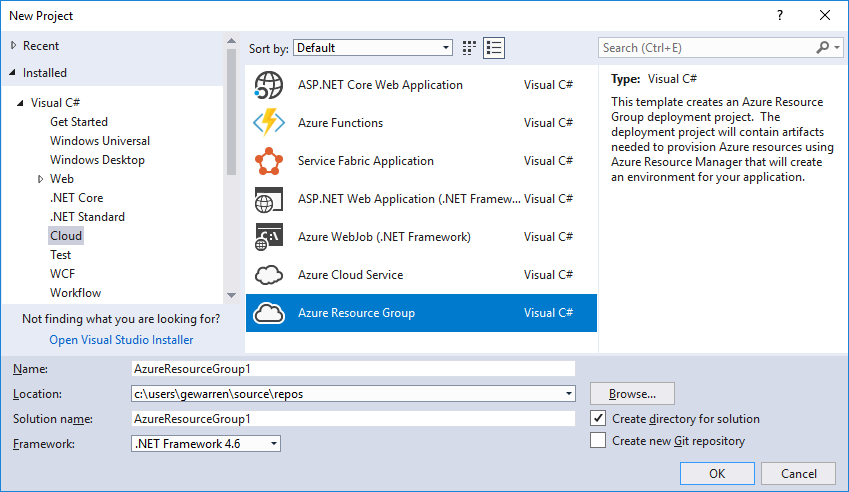
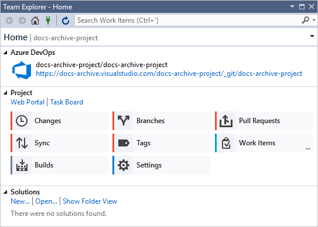

# Features of Visual Studio

The [Visual Studio IDE overview](../get-started/visual-studio-ide.md) article gives a basic introduction to Visual Studio. This article describes features that might be more appropriate for experienced developers, or those developers who are already familiar with Visual Studio.

## Modular installation

Visual Studio's modular installer enables you to choose and install *workloads*. Workloads are groups of features needed for the programming language or platform you prefer. This strategy helps to keep the footprint of the Visual Studio installation smaller, which means it installs and updates faster too.

::: moniker range="vs-2017"

If you haven't already installed Visual Studio, go to the [Visual Studio downloads](https://visualstudio.microsoft.com/vs/older-downloads/?utm_medium=microsoft&utm_source=docs.microsoft.com&utm_campaign=vs+2017+download) page to install it for free.

::: moniker-end

::: moniker range=">=vs-2019"

If you haven't already installed Visual Studio, go to the [Visual Studio downloads](https://visualstudio.microsoft.com/downloads) page to install it for free.

::: moniker-end

To learn more about setting up Visual Studio on your system, see [Install Visual Studio](../install/install-visual-studio.md).

## Create cloud-enabled apps for Azure

Visual Studio offers a suite of tools that enable you to easily create cloud-enabled applications powered by Microsoft Azure. You can configure, build, debug, package, and deploy applications and services on Microsoft Azure directly from the IDE. To get the Azure tools and project templates, select the **Azure development** workload when you install Visual Studio.

::: moniker range="vs-2017"

After you install the **Azure development** workload, the following **Cloud** templates for C# are available in the **New Project** dialog:

::: moniker-end

Visual Studio's [Cloud Explorer](/azure/vs-azure-tools-resources-managing-with-cloud-explorer) lets you view and manage your Azure-based cloud resources within Visual Studio. These resources may include virtual machines, tables, SQL databases, and more. **Cloud Explorer** shows the Azure resources in all the accounts managed under the Azure subscription you're logged into. And if a particular operation requires the Azure portal, **Cloud Explorer** provides links that take you to the place in the portal where you need to go.

You can leverage Azure services for your apps using **Connected Services** such as:

- [Active Directory connected service](/azure/active-directory/develop/vs-active-directory-add-connected-service) so users can use their accounts from [Azure Active Directory](/azure/active-directory/active-directory-whatis) to connect to web apps
- [Azure Storage connected service](/azure/vs-azure-tools-connected-services-storage) for blob storage, queues, and tables
- [Key Vault connected service](/azure/key-vault/vs-key-vault-add-connected-service) to manage secrets for web apps

The available **Connected Services** depend on your project type. Add a service by right-clicking on the project in **Solution Explorer** and choosing **Add** > **Connected Service**.

For more information, see [Move to the cloud With Visual Studio and Azure](https://visualstudio.microsoft.com/vs/azure-tools/).

## Create apps for the web

The web drives our modern world, and Visual Studio can help you write apps for it. You can create web apps using ASP.NET, Node.js, Python, JavaScript, and TypeScript. Visual Studio understands web frameworks like Angular, jQuery, Express, and more. ASP.NET Core and .NET Core run on Windows, Mac, and Linux operating systems. [ASP.NET Core](https://dotnet.microsoft.com/learn/aspnet/what-is-aspnet-core) is a major update to MVC, WebAPI and SignalR, and runs on Windows, Mac, and Linux.  ASP.NET Core has been designed from the ground up to provide you with a lean and composable .NET stack for building modern cloud-based web apps and services.

For more information, see [Modern web tooling](https://visualstudio.microsoft.com/vs/modern-web-tooling/).

## Build cross-platform apps and games

You can use Visual Studio to build apps and games for macOS, Linux, and Windows, as well as for Android, iOS, and other [mobile devices](https://visualstudio.microsoft.com/vs/mobile-app-development/).

- Build [.NET Core](/dotnet/core/) apps that run on Windows, macOS, and Linux.

- Build mobile apps for iOS, Android, and Windows in C# and F# by using [Xamarin](https://developer.xamarin.com/guides/cross-platform/windows/visual-studio/).

- Use standard web technologies&mdash;HTML, CSS, and JavaScript&mdash;to build mobile apps for iOS, Android, and Windows by using [Apache Cordova](/visualstudio/cross-platform/tools-for-cordova/).

- Build 2D and 3D games in C# by using [Visual Studio Tools for Unity](../cross-platform/visual-studio-tools-for-unity.md).

- Build native C++ apps for iOS, Android, and Windows devices. Share common code in libraries built for iOS, Android, and Windows, by using [C++ for cross-platform development](../cross-platform/visual-cpp-for-cross-platform-mobile-development.md).

- Deploy, test, and debug Android apps with the [Android emulator](../cross-platform/visual-studio-emulator-for-android.md).

## Connect to databases

**Server Explorer** helps you browse and manage SQL Server instances and assets locally, remotely, and on Azure, Salesforce.com, Office 365, and websites. To open **Server Explorer**, on the main menu, choose **View** > **Server Explorer**. For more information on using Server Explorer, see [Add new connections](../data-tools/add-new-connections.md).

[SQL Server Data Tools (SSDT)](/sql/ssdt/download-sql-server-data-tools-ssdt) is a powerful development environment for SQL Server, Azure SQL Database, and Azure SQL Data Warehouse. It enables you to build, debug, maintain, and refactor databases. You can work with a database project, or directly with a connected database instance on- or off-premises.

**SQL Server Object Explorer** in Visual Studio provides a view of your database objects similar to SQL Server Management Studio. SQL Server Object Explorer enables you to do light-duty database administration and design work. Work examples include editing table data, comparing schemas, executing queries by using contextual menus right from SQL Server Object Explorer, and more.

## Debug, test, and improve your code

When you write code, you need to run it and test it for bugs and performance. Visual Studio's cutting-edge debugging system enables you to debug code running in your local project, on a remote device, or on a [device emulator](../cross-platform/visual-studio-emulator-for-android.md). You can step through code one statement at a time and inspect variables as you go. You can set breakpoints that are only hit when a specified condition is true. Debug options can be managed in the code editor itself, so that you don't have to leave your code. To get more details about debugging in Visual Studio, see [First look at the debugger](../debugger/debugger-feature-tour.md).

To learn more about improving the performance of your apps, checkout out Visual Studio's [profiling](../profiling/profiling-feature-tour.md) feature.

For [testing](../test/improve-code-quality.md), Visual Studio offers unit testing, Live Unit Testing, IntelliTest, load and performance testing, and more. Visual Studio also has advanced [code analysis](../code-quality/code-analysis-for-managed-code-overview.md) capabilities to catch design, security, and other types of flaws.

## Deploy your finished application

When your application is ready to deploy to users or customers, Visual Studio provides the tools to do that. Deployment options include to Microsoft Store, to a SharePoint site, or with InstallShield or Windows Installer technologies. It's all accessible through the IDE. For more information, see [Deploy applications, services, and components](../deployment/deploying-applications-services-and-components.md).

## Manage your source code and collaborate with others

You can manage your source code in Git repos hosted by any provider, including GitHub. Or use [Azure DevOps Services](/azure/devops/index) to manage code alongside bugs and work items for your whole project. See [Get started with Git and Azure Repos](/azure/devops/repos/git/gitquickstart?tabs=visual-studio) to learn more about managing Git repos in Visual Studio using Team Explorer. Visual Studio also has other built-in source control features. To learn more about them, see [New Git features in Visual Studio (blog)](https://devblogs.microsoft.com/devops/new-git-features-in-visual-studio-2017/).

Azure DevOps Services are cloud-based services to plan, host, automate, and deploy software and enable collaboration in teams. Azure DevOps Services support both Git repos (distributed version control) and Team Foundation Version Control (centralized version control). They support pipelines for continuous build and release (CI/CD) of code stored in version control systems. Azure DevOps Services also support Scrum, CMMI and Agile development methodologies.

Team Foundation Server (TFS) is the application lifecycle management hub for Visual Studio. It enables everyone involved with the development process to participate using a single solution. TFS is useful for managing heterogeneous teams and projects, too.

If you have an Azure DevOps organization or a Team Foundation Server on your network, you connect to it through the **Team Explorer** window in Visual Studio. From this window you can check code into or out of source control, manage work items, start builds, and access team rooms and workspaces. You can open **Team Explorer** from the search box, or on the main menu from **View** > **Team Explorer** or from **Team** > **Manage Connections**.

The following image shows the **Team Explorer** window for a solution that is hosted in Azure DevOps Services.

You can also automate your build process to build the code that the devs on your team have checked into version control. For example, you can build one or more projects nightly or every time that code is checked in. For more information, see [Azure Pipelines](/azure/devops/pipelines/index?view=vsts).

## Extend Visual Studio

If Visual Studio doesn't have the exact functionality you need, you can add it! You can personalize the IDE based on your workflow and style, add support for external tools not yet integrated with Visual Studio, and modify existing functionality to increase your productivity. To find the latest version of the Visual Studio Extensibility Tools (VS SDK), see [Visual Studio SDK](../extensibility/visual-studio-sdk.md).

You can use the .NET Compiler Platform ("Roslyn") to write your own code analyzers and code generators. Find everything you need at [Roslyn](https://github.com/dotnet/Roslyn).

Find [existing extensions](https://marketplace.visualstudio.com/vs) for Visual Studio created by Microsoft developers as well as our development community.

To learn more about extending Visual Studio, see [Extend Visual Studio IDE](https://visualstudio.microsoft.com/vs/extend/).

## See also

- [Visual Studio IDE overview](../get-started/visual-studio-ide.md)
- [What's new in Visual Studio 2017](../ide/whats-new-visual-studio-2017.md)
- [What's new in Visual Studio 2019](../ide/whats-new-visual-studio-2019.md)
