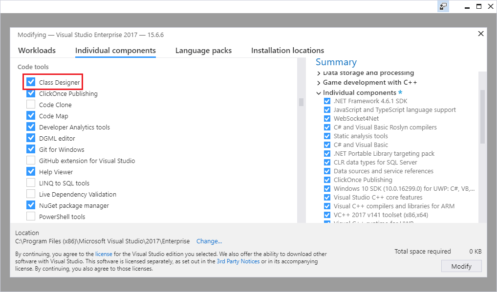

# How to: Add class diagrams to projects

To design, edit, and refactor classes and other types, add a class diagram to your C#, Visual Basic, or C++ project. To visualize different parts of the code in a project, add multiple class diagrams to the project.

You can't create class diagrams from projects that share code across multiple apps. To create UML class diagrams, see [Create UML modeling projects and diagrams](https://devblogs.microsoft.com/devops/uml-designers-have-been-removed-layer-designer-now-supports-live-architectural-analysis/).

## Install the Class Designer component

If you haven't installed the **Class Designer** component, follow these steps to install it.

1. Open **Visual Studio Installer** from the Windows Start menu, or by selecting **Tools** > **Get Tools and Features** from the menu bar in Visual Studio.

   **Visual Studio Installer** opens.

1. Select the **Individual components** tab, and then scroll down to the **Code tools** category.

1. Select **Class Designer** and then select **Modify**.

    ::: moniker range="vs-2017"
   
   ::: moniker-end
   ::: moniker range="vs-2019"
   :::image type="content" source="media/vs-2019/class-designer-component.png" alt-text="Screenshot of the Class Designer component in the Visual Studio Installer." lightbox="media/vs-2019/class-designer-component.png":::
   ::: moniker-end
   ::: moniker range="vs-2022"
   :::image type="content" source="media/vs-2022/class-designer-component.png" alt-text="Screenshot of the Class Designer component in the Visual Studio Installer." lightbox="media/vs-2022/class-designer-component.png":::
   ::: moniker-end

   The **Class Designer** component starts installing.

## Add a blank class diagram to a project

1. In **Solution Explorer**, right-click the project node and then choose **Add** > **New Item**. Or, press **Ctrl**+**Shift**+**A**.

   The **Add New Item** dialog opens.

2. Expand **Common Items** > **General**, and then select **Class Diagram** from the template list. For Visual C++ projects, look in the **Utility** category to find the **Class Diagram** template.

   > [!NOTE]
   > If you don't see the **Class Diagram** template, [follow the steps](#install-the-class-designer-component) to install the **Class Designer** component for Visual Studio.

   The class diagram opens in Class Designer and appears as a file that has a *.cd* extension in **Solution Explorer**. You can drag shapes and lines to the diagram from **Toolbox**.

To add multiple class diagrams, repeat the steps in this procedure.

## Add a class diagram based on existing types

In **Solution Explorer**, open a class file's context menu (right-click) and then choose **View Class Diagram**.

-or-

In **Class View**, open the namespace or type context menu and then choose **View Class Diagram**.

> [!TIP]
> If **Class View** is not open, open **Class View** from the **View** menu.

## To display the contents of a complete project in a class diagram

In **Solution Explorer** or Class View, right-click the project and choose **View**, then choose **View Class Diagram**.

An auto-populated class diagram is created.

> [!IMPORTANT]
> Class Designer is not available in .NET Core projects.

## See also

- [How to: Create types using the Class Designer](how-to-create-types.md)
- [How to: View existing types](how-to-view-existing-types.md)
- [Design and view classes and types](designing-and-viewing-classes-and-types.md)
