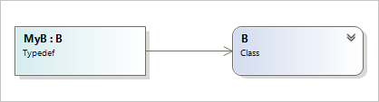
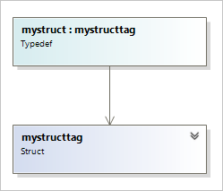

# Work with C++ code in Class Designer

**Class Designer** displays a visual design surface called a *class diagram* that provides a visual representation of the code elements in your project. You can use class diagrams to design and visualize classes and other types in a project.

**Class Designer** supports the following C++ code elements:

- Class (resembles a managed class shape, except that it can have multiple inheritance relationships)

- Anonymous class (displays Class View's generated name for the anonymous type)

- Template class

- Struct

- Enum

- Macro (displays the post-processed view of the macro)

- Typedef

> [!NOTE]
> This is not the same as the UML class diagram, which you can create in a Modeling Project. For more information, see [UML Class Diagrams: Reference](../../modeling/what-s-new-for-design-in-visual-studio.md).

## C++ classes in Class Designer

**Class Designer** supports C++ classes and visualizes native C++ classes in the same way as Visual Basic and C# class shapes, except that C++ classes can have multiple inheritance relationships. You can expand the class shape to show more fields and methods in the class or collapse it to conserve space.

> [!NOTE]
> **Class Designer** does not support unions (a special type of class in which the memory allocated is only the amount necessary for the union's largest data member).

### Simple inheritance

When you drag more than one class onto a class diagram, and the classes have a class inheritance relationship, an arrow connects them. The arrow points in the direction of the base class. For example, when the following classes are displayed in a class diagram, an arrow connects them, pointing from B to A:

```cpp
class A {};
class B : A {};
```

You can also drag only class B to the class diagram, right-click the class shape for B, and then click **Show Base Classes**. This displays its base class: A.

### Multiple inheritance

**Class Designer** supports the visualization of multiple-class inheritance relationships. *Multiple inheritance* is used when a derived class has attributes of more than one base class. Following is an example of multiple inheritance:

```cpp
class Bird {};
class Swimmer {};
class Penguin : public Bird, public Swimmer {};
```

When you drag more than one class onto the class diagram, and the classes have a multiple-class inheritance relationship, an arrow connects them. The arrow points in the direction of the base classes.

Right-clicking a class shape and then clicking **Show Base Classes** displays the base classes for the selected class.

> [!NOTE]
> The **Show Derived Classes** command is not supported for C++ code. You can display derived classes by going to **Class View**, expanding the type node, expanding the **Derived Types** subfolder, and then dragging those types onto the class diagram.

For more information about multiple-class inheritance, see [Multiple Inheritance](/previous-versions/6td5yws2(v=vs.140)) and [Multiple Base Classes](/cpp/cpp/multiple-base-classes).

### Abstract classes

**Class Designer** supports abstract classes (also named "abstract base classes"). These are classes that you never instantiate, but from which you can derive other classes. Using an example from "Multiple Inheritance" earlier in this document, you might instantiate the `Bird` class as individual objects as follows:

```cpp
int main()
{
   Bird sparrow;
   Bird crow;
   Bird eagle;
}
```

However, you might not intend to instantiate the `Swimmer` class as individual objects. You might intend only to derive other types of animal classes from it, for example, `Penguin`, `Whale`, and `Fish`. In that case, you would declare the `Swimmer` class as an abstract base class.

To declare a class as abstract, you can use the `abstract` keyword. Members marked as abstract, or included in an abstract class, are virtual and must be implemented by classes that derive from the abstract class.

```cpp
class Swimmer abstract
{
   virtual void swim();
   void dive();
};
```

You can also declare a class as abstract by including at least one pure virtual function:

```cpp
class Swimmer
{
   virtual void swim() = 0;
   void dive();
};
```

When you display these declarations in a Class Diagram, the class name `Swimmer` and its pure virtual function `swim` are in displayed in italic in an abstract class shape, together with the notation **Abstract Class**. Notice that the abstract class type shape is the same as that of a regular class, except that its border is a dotted line.

A class derived from an abstract base class must override each pure virtual function in the base class, or the derived class cannot be instantiated. So, for example, if you derive a `Fish` class from the `Swimmer` class, `Fish` must override the `swim` method:

```cpp
class Fish : public Swimmer
{
   void swim(int speed);
};

int main()
{
   Fish guppy;
}
```

When you display this code in a Class Diagram, **Class Designer** draws an inheritance line from `Fish` to `Swimmer`.

### Anonymous classes

**Class Designer** supports anonymous classes. *Anonymous class types* are classes declared without an identifier. They cannot have a constructor or destructor, cannot be passed as arguments to functions, and cannot be returned as return values from functions. You can use an anonymous class to replace a class name with a typedef name, as in the following example:

```cpp
typedef struct
{
    unsigned x;
    unsigned y;
} POINT;
```

Structures can also be anonymous. **Class Designer** displays anonymous classes and structures the same as it displays the respective type. Although you can declare and display anonymous classes and structures, **Class Designer** will not use the tag name that you specify. It will use the name that Class View generates. The class or structure appears in Class View and **Class Designer** as an element called **__unnamed**.

For more information about anonymous classes, see [Anonymous Class Types](/cpp/cpp/anonymous-class-types).

### Template classes

**Class Designer** supports the visualization of template classes. Nested declarations are supported. The following table shows some typical declarations.

| Code element | Class Designer view |
| - | - |
| `template <class T>`<br /><br /> `class A {};` | `A<T>`<br /><br /> Template Class |
| `template <class T, class U>`<br /><br /> `class A {};` | `A<T, U>`<br /><br /> Template Class |
| `template <class T, int i>`<br /><br /> `class A {};` | `A<T, i>`<br /><br /> Template Class |
| `template <class T, template <class K> class U>`<br /><br /> `class A {};` | `A<T, U>`<br /><br /> Template Class |

The following table shows some examples of partial specialization.

|Code element|Class Designer view|
|------------------| - |
|`template<class T, class U>`<br /><br /> `class A {};`|`A<T, U>`<br /><br /> Template Class|
|`template<class T>`<br /><br /> `class A<T, T> {};`|`A<T, T>`<br /><br /> Template Class|
|`template <class T>`<br /><br /> `class A<T, int> {};`|`A<T, int>`<br /><br /> Template Class|
|`template <class T1, class T2>`<br /><br /> `class A<T1*, T2*> {};`|`A<T1*, T2*>`<br /><br /> Template Class|

The following table shows some examples of inheritance in partial specialization.

|Code element|Class Designer view|
|------------------| - |
|`template <class T, class U>`<br /><br /> `class A {};`<br /><br /> `template <class TC>`<br /><br /> `class A<T, int> {};`<br /><br /> `class B : A<int, float>`<br /><br /> `{};`<br /><br /> `class C : A<int, int>`<br /><br /> `{};`|`A<T, U>`<br /><br /> Template Class<br /><br /> `B`<br /><br /> Class<br /><br /> (points to Class A)<br /><br /> `C`<br /><br /> Class<br /><br /> (points to Class A)|

The following table shows some examples of partial specialization template functions.

|Code element|Class Designer view|
|------------------| - |
|`class A`<br /><br /> `{`<br /><br /> `template <class T, class U>`<br /><br /> `void func(T a, U b);`<br /><br /> `template <class T>`<br /><br /> `void func(T a, int b);`<br /><br /> `};`|`A`<br /><br /> func\<T, U> (+ 1 overload)|
|`template <class T1>`<br /><br /> `class A {`<br /><br /> `template <class T2>`<br /><br /> `class B {};`<br /><br /> `};`<br /><br /> `template<> template<>`<br /><br /> `class A<type>::B<type> {};`|`A<T1>`<br /><br /> Template Class<br /><br /> `B<T2>`<br /><br /> Template Class<br /><br /> (B is contained within class A under **Nested Types**)|
|`template <class T>`<br /><br /> `class C {};`<br /><br /> `class A : C<int> {};`|`A`<br /><br /> Class<br /><br /> -> C\<int><br /><br /> `C<T>`<br /><br /> Template Class|

The following table shows some examples of template inheritance.

|Code element|Class Designer view|
|------------------| - |
|`template <class T>`<br /><br /> `class C {};`<br /><br /> `template<>`<br /><br /> `class C<int> {`<br /><br /> `class B {};`<br /><br /> `}`<br /><br /> `class A : C<int>::B {};`|`A`<br /><br /> Class<br /><br /> ->B<br /><br /> `C<int>`<br /><br /> Class<br /><br /> (B is contained within class C under **Nested Types**)<br /><br /> `C<T>`<br /><br /> Template Class|

The following table shows some examples of canonical specialized class connection.

|Code element|Class Designer view|
|------------------| - |
|`template <class T>`<br /><br /> `class C {};`<br /><br /> `template<>`<br /><br /> `class C<int> {};`<br /><br /> `class A : C<int> {};`<br /><br /> `class D : C<float> {};`|`A`<br /><br /> Class<br /><br /> ->C\<int><br /><br /> `C<int>`<br /><br /> Class<br /><br /> `C<T>`<br /><br /> Template Class<br /><br /> `D`<br /><br /> Class<br /><br /> ->C\<float>|
|`class B {`<br /><br /> `template <class T>`<br /><br /> `T min (const T &a, const T &b);`<br /><br /> `};`|`B`<br /><br /> min \<T>|

## C++ enumerations in Class Designer

**Class Designer** supports C++ `enum` and scoped `enum class` types. Following is an example:

```cpp
enum CardSuit {
   Diamonds = 1,
   Hearts = 2,
   Clubs = 3,
   Spades = 4
};

// or...
enum class CardSuit {
   Diamonds = 1,
   Hearts = 2,
   Clubs = 3,
   Spades = 4
};
```

A C++ enumeration shape in a class diagram looks and works like a structure shape, except that the label reads **Enum** or **Enum class**, it is pink instead of blue, and it has a colored border on the left and top margins. Both enumeration shapes and structure shapes have square corners.

For more information about using the `enum` type, see [Enumerations](/cpp/cpp/enumerations-cpp).

## C++ typedefs in Class Designer

[Typedef](/cpp/cpp/aliases-and-typedefs-cpp#typedefs) statements create one or more layers of indirection between a name and its underlying type. **Class Designer** supports C++ typedef types, which are declared with the keyword `typedef`, for example:

```cpp
typedef class coord
{
   void P(x,y);
   unsigned x;
   unsigned y;
} COORD;
```

You can then use this type to declare an instance:

`COORD OriginPoint;`

### Class and struct shapes

In **Class Designer**, a C++ typedef has the shape of the type specified in the typedef. If the source declares `typedef class`, the shape has rounded corners and the label **Class**. For `typedef struct`, the shape has square corners and the label **Struct**.

Classes and structures can have nested typedefs declared within them. In **Class Designer**, class and structure shapes can show nested typedef declarations as nested shapes.

Typedef shapes support the **Show as Association** and **Show as Collection Association** commands on the right-click menu (context menu).

#### Class typedef example

```cpp
class B {};
typedef B MyB;
```



#### Struct typedef example

```cpp
typedef struct mystructtag
{
    int   i;
    double f;
} mystruct;
```



### Unnamed typedefs

Although you can declare a typedef without a name, **Class Designer** doesn't use the tag name that you specify. **Class Designer** uses the name that **Class View** generates. For example, the following declaration is valid, but it appears in **Class View** and **Class Designer** as an object named **__unnamed**:

```cpp
typedef class coord
{
   void P(x,y);
   unsigned x;
   unsigned y;
};
```

> [!NOTE]
> **Class Designer** does not display typedefs whose source type is a function pointer.

## Learn about limitations for C++ code elements

- When a C++ project is loaded, **Class Designer** functions in a read-only manner. You can change the class diagram, but you cannot save changes from the class diagram back to the source code.

- **Class Designer** supports only native C++ semantics. For C++ projects that are compiled into managed code, **Class Designer** will only visualize code elements that are native types. Therefore, you can add a class diagram to a project, but **Class Designer** will not allow you to visualize elements in which the `IsManaged` property is set to `true` (that is, value types and reference types).

- For C++ projects, the **Class Designer** reads only the definition of the type. For example, assume that you define a type in a header (.h) file and define its members in an implementation (.cpp) file. If you invoke "View Class Diagram" on the implementation (.cpp) file, **Class Designer** displays nothing. As another example, if you invoke "View Class Diagram" on a .cpp file that uses an `#include` statement to include other files but does not contain any actual class definitions, **Class Designer** again displays nothing.

- IDL (.idl) files, which define COM interfaces and type libraries, do not display in diagrams unless they are compiled to native C++ code.

- **Class Designer** does not support global functions and variables.

- **Class Designer** does not support unions. This is a special type of class in which the memory allocated is only the amount necessary for the union's largest data member.

- **Class Designer** does not display basic data types such as `int` and `char`.

- **Class Designer** does not display types that are defined outside the current project if the project does not have correct references to those types.

- **Class Designer** can display nested types but not the relationships between a nested type and other types.

- **Class Designer** cannot display types that are void or that derive from a void type.

## Troubleshoot type resolution and display issues

### Location of source files

**Class Designer** does not keep track of the location of source files. Therefore, if you modify your project structure or move source files in your project, **Class Designer** can lose track of the type (especially the source type of a typedef, base classes, or association types). You might receive an error such as **Class Designer is unable to display this type**. If you do, drag the modified or relocated source code to the class diagram again to redisplay it.

### Update and performance issues

For C++ projects, it might take 30 to 60 seconds for a change in the source file to appear in the class diagram. This delay might also cause **Class Designer** to throw the error **No types were found in the selection**. If you receive an error such as this, click **Cancel** in the error message and wait for the code element to appear in **Class View**. After you do this, **Class Designer** should be able to display the type.

If a class diagram does not update with changes you have made in the code, you might need to close the diagram and open it again.

### Type resolution issues

**Class Designer** might not be able to resolve types for the following reasons:

- The type is in a project or assembly that is not referenced from the project that contains the class diagram. To correct this error, add a reference to the project or assembly that contains the type. For more information, see [Managing references in a project](../managing-references-in-a-project.md).

- The type is not in the correct scope, so **Class Designer** cannot locate it. Ensure that the code is not missing a `using`, `imports`, or `#include` statement. Also make sure that you have not moved the type (or a related type) out of the namespace in which it was originally located.

- The type does not exist (or has been commented out). To correct this error, make sure that you have not commented out or deleted the type.

- The type is located in a library referenced by an #import directive. A possible workaround is to manually add the generated code (the .tlh file) to an #include directive into the header file.

- Ensure that **Class Designer** supports the type that you entered. See [Limitations for C++ code elements](#learn-about-limitations-for-c-code-elements).

The error you are most likely to see for a type resolution issue is **Code could not be found for one or more shapes in class diagram '\<element>'**. This error message does not necessarily indicate that your code is in error. It indicates only that class designer was unable to display your code. Try the following measures:

- Ensure that the type exists. Ensure that you have not unintentionally commented out or deleted the source code.

- Try to resolve the type. The type might be in a project or assembly that is not referenced from the project that contains the class diagram. To correct this error, add a reference to the project or assembly that contains the type. For more information, see [Managing references in a project](../managing-references-in-a-project.md).

- Ensure that the type is in the correct scope so that Class Designer can locate it. Make sure that the code is not missing a `using`, `imports`, or `#include` statement. Also make sure that you have not moved the type (or a related type) out of the namespace in which it was originally located.

> [!TIP]
> For additional troubleshooting information, see [Class Designer errors](/troubleshoot/developer/visualstudio/ide/troubleshoot-class-designer-errors).

## Related content

- [What is Class Designer?](designing-and-viewing-classes-and-types.md)
