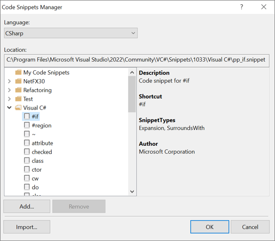
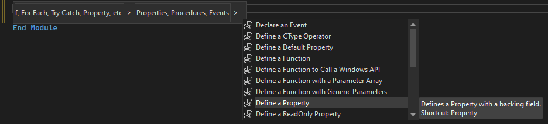

# Code snippets

 [!INCLUDE [Visual Studio](~/includes/applies-to-version/vs-windows-only.md)]

Code snippets are small blocks of reusable code that you can add to a code file by using the right-click context menu command or a combination of hotkeys. Code snippets typically contain often-used code blocks such as `try-finally` or `if-else` blocks, but you can also use them to add entire classes or methods.

> [!NOTE]
> This article applies to Visual Studio on Windows. For Visual Studio for Mac, see [Code snippets (Visual Studio for Mac)](/visualstudio/mac/snippets).

Code snippets are available for many languages, including C#, C++, and Visual Basic, to name a few.

To view all the available snippets for a language, select **Tools** > **Code Snippets Manager** from the menu bar (or, press **Ctrl**+**K**, **Ctrl**+**B**) and then select the language you want from the drop-down menu at the top of the dialog box.



In Visual Studio, there are several different ways you can add a code snippet to a code file:

- On the menu bar, choose **Edit** > **IntelliSense** > **Insert Snippet**

- From the right-click or context menu in the code editor, choose **Snippet** > **Insert Snippet**

- From the keyboard, press **Ctrl**+**K**,**Ctrl**+**X**

## Expansion snippets and surround-with snippets

There are two kinds of code snippets you can add to your code.

|Snippet type  | How it's used  |
|---------|---------|
|*expansion* | Added at a specified insertion point and might replace a snippet shortcut |
|*surround-with* | Added around a selected block of code (available for C# and C++ only) |

In the following example of an expansion snippet in C#, the shortcut `tryf` adds a try-finally block:

```csharp
try
{

}
finally
{

}
```

Here's how to add this expansion snippet:

1. In the code window, position your cursor where you want to add the snippet.

1. Select **Insert Snippet** from the right-click context menu.

1. Select **Visual C#**, then type `tryf`, and then press **Tab**. (Or, you can type `tryf` and press **Tab** twice.)

In the following example of a surround-with snippet in C++, the shortcut `if` can be used either as an insertion snippet or as a surround-with snippet. If you select a line of code (for example `return FALSE;`), and then choose **Surround With** > **if**, the snippet is expanded around the line:

```cpp
if (true)
{
    return FALSE;
}
```

## Snippet replacement parameters

Snippets can contain replacement parameters, which are placeholders that you must replace to fit the code you're writing. In the previous example, `true` is a replacement parameter, which you'd replace with the appropriate condition. The replacement you make is repeated for every instance of the same replacement parameter in the snippet.

For example, in Visual Basic there's a code snippet that inserts a property. To insert the snippet, select **Snippet** > **Insert Snippet** from the right-click context menu in a Visual Basic code file. Then, select **Code Patterns** > **Properties, Procedures, Events** > **Define a Property**.



The following code is inserted:

```vb
Private newPropertyValue As String
Public Property NewProperty() As String
    Get
        Return newPropertyValue
    End Get
    Set(ByVal value As String)
        newPropertyValue = value
    End Set
End Property
```

If you change `newPropertyValue` to `m_property`, then every instance of `newPropertyValue` is changed. If you change `String` to `Int` in the property declaration, then the value in the set method is also changed to `Int`.

## Next steps

To learn how to create your own code snippets, see [Walkthrough: Create a code snippet](walkthrough-creating-a-code-snippet.md).

## See also

- [C# code snippets](visual-csharp-code-snippets.md)
- [C++ code snippets](visual-cpp-code-snippets.md)
- [Best practices for using code snippets](best-practices-for-using-code-snippets.md)
- [Code snippets schema reference](code-snippets-schema-reference.md)
- [How to: Distribute code snippets](how-to-distribute-code-snippets.md)
