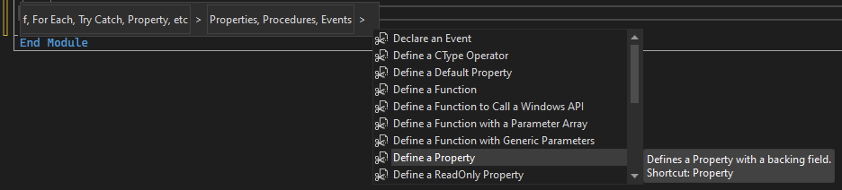

# Use code snippets in Visual Studio

Code snippets are small blocks of reusable code that you can add to a code file. Snippets usually contain frequently used constructs such as `Try...Finally` or `If...Else` blocks. You can also use snippets to add entire classes or methods.

A code snippet has a title that you use to select it and can have a shortcut that you type to insert it. Snippets can also contain replacement parameters, which act as placeholders. Visual Studio provides snippets for many languages, including C#, C++, and Visual Basic.

## Prerequisites

- Visual Studio with support installed for the programming language that you want to use. The available snippets depend on the installed workloads and language components.
- A code file open in the editor and recognized by the appropriate language service. For the C++ example, open a `.cpp` or `.h` file.

## Understand snippet types

Visual Studio supports two types of code snippets:

- An *expansion* snippet adds code at a specified insertion point.
- A *surround-with* snippet adds code around selected code. Surround-with snippets are available only for C# and C++.

## Find available snippets

To view the installed snippets for a language, select **Tools** > **Code Snippets Manager** or press **Ctrl+K, Ctrl+B**. In **Code Snippets Manager**, select a language from the **Language** list.

To create and import your own snippet so it appears in the snippet list, see [Walkthrough: Create a code snippet in Visual Studio](walkthrough-creating-a-code-snippet.md).

> [!NOTE]
> Keyboard shortcuts can vary by settings profile, context, keyboard layout, and custom key bindings. To find the binding for a command, see [Identify and customize keyboard shortcuts](identifying-and-customizing-keyboard-shortcuts-in-visual-studio.md).

## Insert an expansion snippet

An expansion snippet inserts code at the insertion point. For example, the C# `tryf` snippet adds a `try`/`finally` block:

```csharp
try
{

}
finally
{

}
```

You must insert the `tryf` snippet where a statement is valid, such as inside a method, indexer, property accessor, or event accessor.

1. In the code editor, position your cursor where you want to add the snippet.
1. Take one of the following actions:

   - On the menu bar, select **Edit** > **IntelliSense** > **Insert Snippet**.
   - Right-click and select **Snippet** > **Insert Snippet**.
   - Press **Ctrl+K, Ctrl+X**.

1. In the snippet picker, open the **Visual C#** folder, and then double-click **tryf**. You can also select **tryf** and press **Tab** or **Enter**.

The `try`/`finally` block appears at the insertion point, ready for you to customize.

> [!TIP]
> At a valid insertion point, type `tryf`, and then press **Tab** twice to expand the snippet without opening the snippet picker.

## Surround selected code with a snippet

A surround-with snippet wraps selected code. For example, the C++ `if` snippet wraps the selected line `return FALSE;` in an `if` block:

```cpp
if (true)
{
    return FALSE;
}
```

To surround selected C++ code:

1. In a `.cpp` or `.h` file, select the code that you want to wrap.
1. Take one of the following actions:

   - On the menu bar, select **Edit** > **IntelliSense** > **Surround With**.
   - Right-click and select **Surround With**.

1. In the snippet picker, double-click **if**, or select **if** and press **Tab** or **Enter**.

The `if` block appears around the selected code. Replace the `true` placeholder with the condition that you want to evaluate.

For more C++ snippet examples, see [Visual C++ code snippets](visual-cpp-code-snippets.md).

## Edit replacement fields

Snippets can contain replacement fields that you customize after insertion. When the same field appears more than once, changing one occurrence changes all linked occurrences. Press **Tab** to move to the next replacement field.

For example, the Visual Basic **Define a Property** snippet contains linked fields for the backing variable, property name, and property type. To insert it:

1. In a Visual Basic code file, right-click where you want to insert the property, and then select **Snippet** > **Insert Snippet**.
1. Select **Code Patterns** > **Properties, Procedures, Events** > **Define a Property**.



The following code is inserted:

```vb
Private newPropertyValue As String
Public Property NewProperty() As String
    Get
        Return newPropertyValue
    End Get
    Set(ByVal value As String)
        newPropertyValue = value
    End Set
End Property
```

If you change `newPropertyValue` to `m_property`, every linked instance of `newPropertyValue` changes. If you change the property type from `String` to `Integer`, every linked instance of `String` changes to `Integer`.

## Troubleshoot code snippets

If a snippet or command isn't available:

- Confirm that Visual Studio recognizes the file as the expected programming language.
- Confirm that the required workload or language component is installed.
- In **Tools** > **Code Snippets Manager**, confirm that the snippet is installed for the selected language.
- If a keyboard shortcut doesn't work as expected, use [Identify and customize keyboard shortcuts](identifying-and-customizing-keyboard-shortcuts-in-visual-studio.md) to look up the command's current binding.
- Check that the insertion point is valid for the selected snippet. For example, some C# snippets are valid only inside a method or type declaration. For valid C# insertion locations, see [C# code snippets](visual-csharp-code-snippets.md).

## Review code inserted by snippets

Snippet code shows a basic way to perform a task. Review and adapt the generated code before you use it in an application. Consider how the code handles exceptions, accesses resources, validates input, and protects secrets.

Treat snippets downloaded from the internet like other downloaded code. Download snippets only from sources that you trust, and inspect the snippet code and metadata before you import or run it.

In .NET Framework projects, a snippet can use the `References` element to add project references. Review the `Imports` and `References` elements and verify that you trust the referenced assemblies. For more information, see [Import a namespace](walkthrough-creating-a-code-snippet.md#import-a-namespace) and the [code snippets schema reference](code-snippets-schema-reference.md).

## See also

- [C# code snippets](visual-csharp-code-snippets.md)
- [Visual C++ code snippets](visual-cpp-code-snippets.md)
- [Walkthrough: Create a code snippet in Visual Studio](walkthrough-creating-a-code-snippet.md)
- [Distribute code snippets as a Visual Studio extension](how-to-distribute-code-snippets.md)
- [Code snippets schema reference](code-snippets-schema-reference.md)
