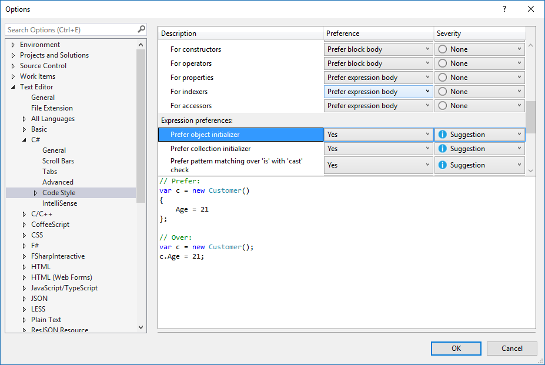
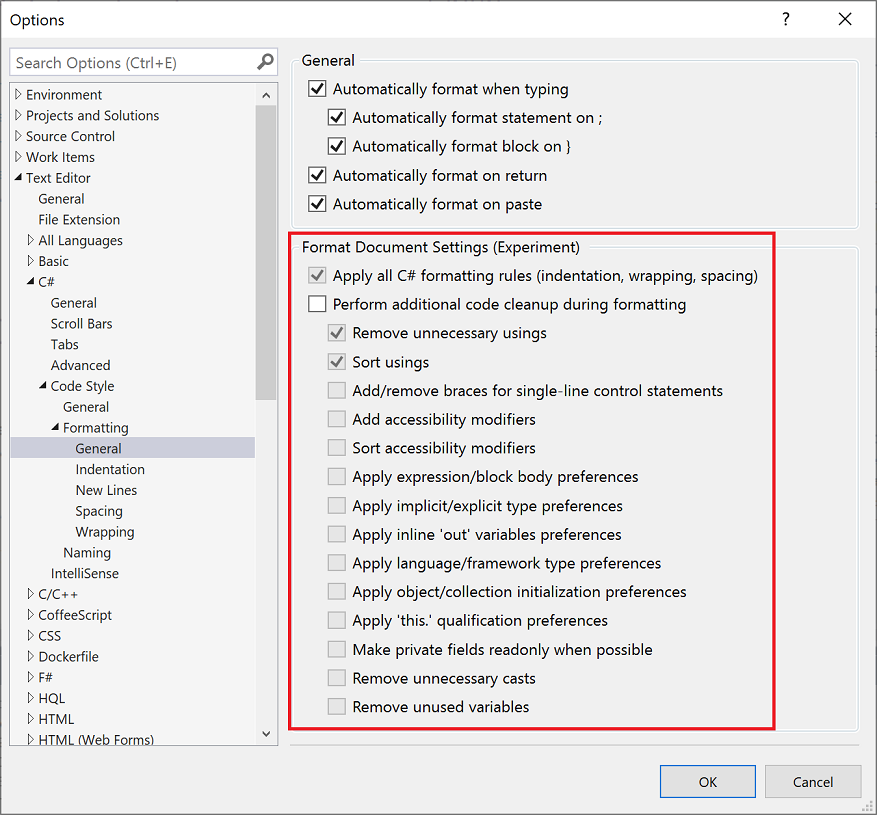
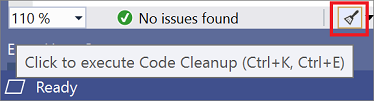
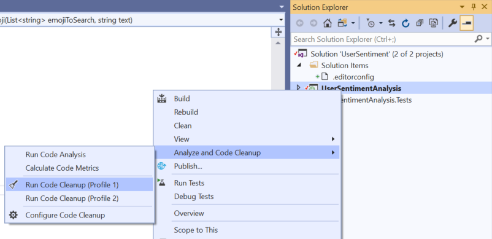

# Code style preferences

You can define code style settings per-project by using an [EditorConfig file](#code-styles-in-editorconfig-files), or for all code you edit in Visual Studio on the text editor [**Options** page](#code-styles-in-the-options-dialog-box). For C# code, you can also configure Visual Studio to apply these code style preferences using the **Code Cleanup** (Visual Studio 2019) and **Format Document** (Visual Studio 2017) commands.

> [!NOTE]
> This topic applies to Visual Studio on Windows. For Visual Studio for Mac, see [Editor behavior in Visual Studio for Mac](/visualstudio/mac/editor-behavior).

## Code styles in EditorConfig files

[Code style settings](../ide/editorconfig-code-style-settings-reference.md) for .NET can be specified by adding an [EditorConfig](create-portable-custom-editor-options.md) file to your project. EditorConfig files are associated with a codebase rather than a Visual Studio personalization account. Settings in an EditorConfig file take precedence over code styles that are specified in the **Options** dialog box. Use an EditorConfig file when you want to enforce coding styles for all contributors to your repo or project.

::: moniker range=">=vs-2019"

You can manually populate your EditorConfig file, or you can automatically generate the file based on the code style settings you've chosen in the Visual Studio **Options** dialog box. This options page is available at **Tools** > **Options** > **Text Editor** > [**C#** or  **Basic**] > **Code Style** > **General**. Click **Generate .editorconfig file from settings** to automatically generate a coding style *.editorconfig* file based on the settings on this **Options** page.

::: moniker-end

## Code styles in the Options dialog box

Code style preferences can be set for all of your C# and Visual Basic projects by opening the **Options** dialog box from the **Tools** menu. In the **Options** dialog box, select **Text Editor** > [**C#** or  **Basic**] > **Code Style** > **General**.

Each item in the list shows a preview of the preference when selected:

::: moniker range="vs-2017"

::: moniker-end

::: moniker range=">=vs-2019"

::: moniker-end

Options set in this window are applicable to your Visual Studio personalization account and aren't associated with a particular project or codebase. In addition, they aren't enforced at build time, including in continuous integration (CI) builds. If you want to associate code style preferences with your project and have the styles enforced during build, specify the preferences in an [.editorconfig file](#code-styles-in-editorconfig-files) that's associated with the project.

### Preference and severity

For each code style setting on this page, you can set the **Preference** and **Severity** values using the drop-downs on each line. Severity can be set to **Refactoring Only**, **Suggestion**, **Warning**, or **Error**. If you want to enable [Quick Actions](../ide/quick-actions.md) for a code style, ensure that the **Severity** setting is set to something other than **Refactoring Only**. The **Quick Actions** light bulb , error light bulb , or screwdriver  icon appears when a non-preferred style is used, and you can choose an option on the **Quick Actions** list to automatically rewrite code to the preferred style.

## Apply code styles

::: moniker range="vs-2017"

You can configure the **Format Document** command (**Edit** > **Advanced** > **Format Document**) to apply your code style settings (from an EditorConfig file or **Code Style** options) along with the regular formatting that it does (such as indentation). If an *.editorconfig* file exists for the project, those settings take precedence.

> [!NOTE]
> Applying code styles by using the **Format Document** command is only available for C# code files. This is an experimental feature.

Configure which settings you want **Format Document** to apply on the [Formatting options page](reference/options-text-editor-csharp-formatting.md#format-document-settings).

> [!TIP]
> Rules configured with a severity of **None** don't participate in code cleanup but can be individually applied via the **Quick Actions and Refactorings** menu.

The first time you trigger the **Format Document** command, a yellow info bar prompts you to configure your code cleanup settings.

::: moniker-end

::: moniker range=">=vs-2019"

For C# code files, Visual Studio 2019 has a **Code Cleanup** button at the bottom of the editor (keyboard: **Ctrl**+**K**, **Ctrl**+**E**) to apply code styles from an EditorConfig file or from the **Code Style** options page. If an *.editorconfig* file exists for the project, those are the settings that take precedence.

> [!TIP]
> Rules configured with a severity of **None** don't participate in code cleanup but can be individually applied via the **Quick Actions and Refactorings** menu.

First, configure which code styles you want to apply (in one of two profiles) in the **Configure Code Cleanup** dialog box. To open this dialog box, click the expander arrow next to the code cleanup broom icon and then choose **Configure Code Cleanup**.

After you've configured code cleanup, you can either click on the broom icon or press **Ctrl**+**K**, **Ctrl**+**E** to run code cleanup. You can also run code cleanup across your entire project or solution. Right-click on the project or solution name in **Solution Explorer**, select **Analyze and Code Cleanup**, and then select **Run Code Cleanup**.

If you want your code style settings to be applied every time you save a file, you may like the [Code Cleanup on Save](https://marketplace.visualstudio.com/items?itemName=MadsKristensen.CodeCleanupOnSave) extension.

::: moniker-end

## See also

- [Quick Actions](../ide/quick-actions.md)
- [.NET coding convention settings for EditorConfig](../ide/editorconfig-code-style-settings-reference.md)
- [Editor behavior (Visual Studio for Mac)](/visualstudio/mac/editor-behavior)
