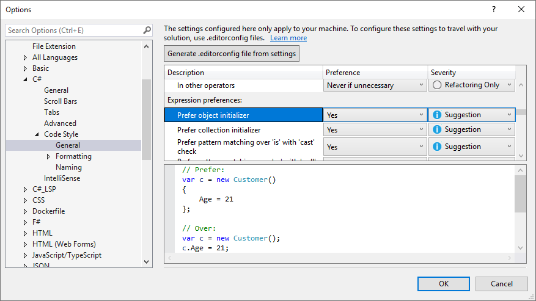
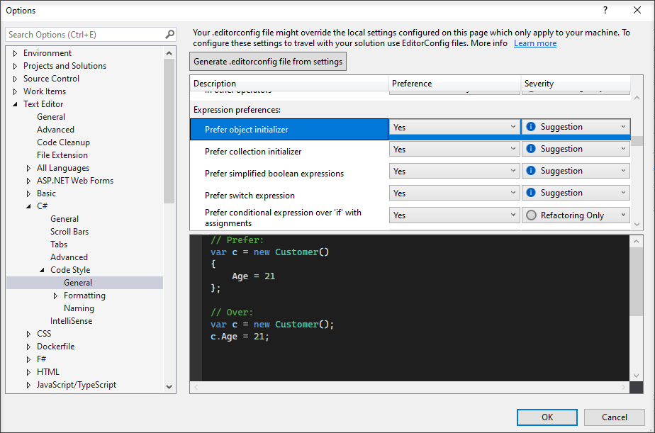
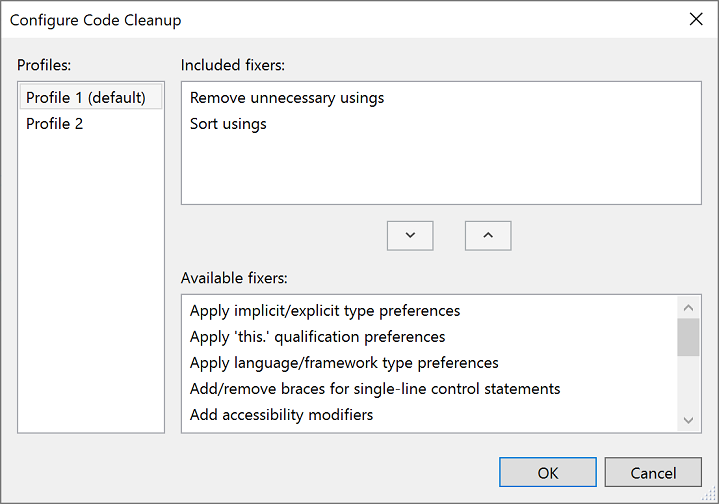
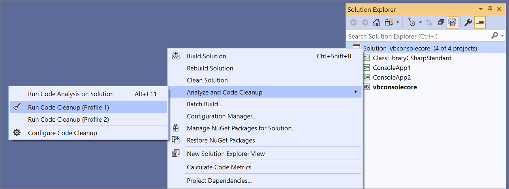
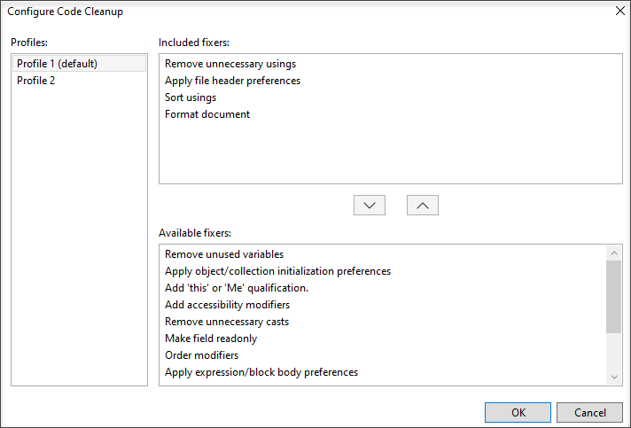
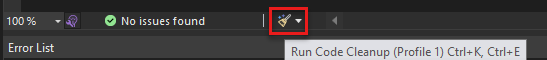
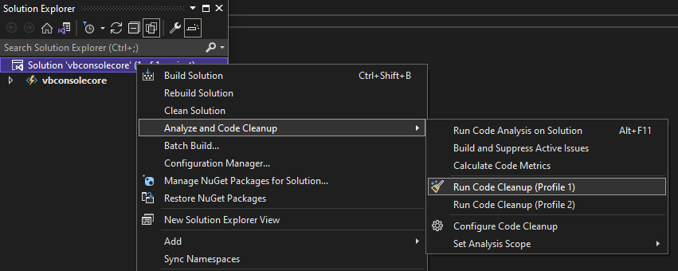

# Code style preferences

::: moniker range=">=vs-2022"
You can define code style settings per-project by using an [EditorConfig file](#code-styles-in-editorconfig-files), or for all code you edit in Visual Studio on the text editor [**Options** page](#code-styles-in-the-options-dialog-box). For C# code, you can also configure Visual Studio to apply these code style preferences using the **Code Cleanup** command.
::: moniker-end

::: moniker range="vs-2019"
You can define code style settings per-project by using an [EditorConfig file](#code-styles-in-editorconfig-files), or for all code you edit in Visual Studio on the text editor [**Options** page](#code-styles-in-the-options-dialog-box). For C# code, you can also configure Visual Studio to apply these code style preferences using the **Code Cleanup** (Visual Studio 2019) and **Format Document** (Visual Studio 2017) commands.
::: moniker-end

## Code styles in EditorConfig files

[Code style settings](/dotnet/fundamentals/code-analysis/code-style-rule-options) for .NET can be specified by adding an [EditorConfig](create-portable-custom-editor-options.md) file to your project. EditorConfig files are associated with a codebase rather than a Visual Studio personalization account. Settings in an EditorConfig file take precedence over code styles that are specified in the **Options** dialog box. Use an EditorConfig file when you want to enforce coding styles for all contributors to your repo or project.

::: moniker range="vs-2019"

You can manually populate your EditorConfig file, or you can automatically generate the file based on the code style settings you've chosen in the Visual Studio **Options** dialog box. This options page is available at **Tools** > **Options** > **Text Editor** > [**C#** or  **Basic**] > **Code Style** > **General**. Click **Generate .editorconfig file from settings** to automatically generate a coding style *.editorconfig* file based on the settings on this **Options** page.

::: moniker-end

::: moniker range=">=vs-2022"

You can manually populate your EditorConfig file, or you can automatically generate the file based on the code style settings you've chosen in the Visual Studio **Options** dialog box. This options page is available at **Tools** > **Options** > **Text Editor** > [**C#** or  **Visual Basic**] > **Code Style** > **General**. Click **Generate .editorconfig file from settings** to automatically generate a coding style *.editorconfig* file based on the settings on this **Options** page.

::: moniker-end

## Code styles in the Options dialog box

::: moniker range="vs-2022"

Code style preferences can be set for all of your C# and Visual Basic projects by opening the **Options** dialog box from the **Tools** menu. In the **Options** dialog box, select **Text Editor** > [**C#** or  **Visual Basic**] > **Code Style** > **General**.

::: moniker-end

::: moniker range="<=vs-2019"

Code style preferences can be set for all of your C# and Visual Basic projects by opening the **Options** dialog box from the **Tools** menu. In the **Options** dialog box, select **Text Editor** > [**C#** or  **Basic**] > **Code Style** > **General**.

::: moniker-end

Each item in the list shows a preview of the preference when selected:

::: moniker range="vs-2019"

::: moniker-end

::: moniker range=">=vs-2022"

::: moniker-end

Options set in this window are applicable to your Visual Studio personalization account and aren't associated with a particular project or codebase. In addition, they aren't enforced at build time, including in continuous integration (CI) builds. If you want to associate code style preferences with your project and have the styles enforced during build, specify the preferences in an [.editorconfig file](#code-styles-in-editorconfig-files) that's associated with the project.

### Preference and severity

For each code style setting on this page, you can set the **Preference** and **Severity** values using the drop-downs on each line. Severity can be set to **Refactoring Only**, **Suggestion**, **Warning**, or **Error**. If you want to enable [Quick Actions](../ide/quick-actions.md) for a code style, ensure that the **Severity** setting is set to something other than **Refactoring Only**. The **Quick Actions** light bulb :::image type="icon" source="media/light-bulb-dropdown.png":::, error light bulb :::image type="icon" source="media/error-bulb.png":::, or screwdriver :::image type="icon" source="media/screwdriver.png"::: icon appears when a non-preferred style is used, and you can choose an option on the **Quick Actions** list to automatically rewrite code to the preferred style.

## Enforce code styles on build

Starting in Visual Studio 2019 version 16.8, which includes the .NET 5.0 RC2 SDK, you can [enforce the .NET coding conventions on build](/dotnet/fundamentals/productivity/code-analysis#code-style-analysis) for all .NET projects. At build time, .NET code style violations will appear as warnings or errors with an "IDE" prefix. This enables you to strictly enforce consistent code styles in your codebase.

## Apply code styles

::: moniker range="vs-2019"

For C# code files, Visual Studio has a **Code Cleanup** button at the bottom of the editor (keyboard: **Ctrl**+**K**, **Ctrl**+**E**) to apply code styles from an EditorConfig file or from the **Code Style** options page. If an *.editorconfig* file exists for the project, those are the settings that take precedence.

> [!TIP]
> Rules configured with a severity of **None** don't participate in code cleanup but can be individually applied via the **Quick Actions and Refactorings** menu.

To apply code styles:

1. First, configure which code styles you want to apply (in one of two profiles) in the **Configure Code Cleanup** dialog box. To open this dialog box, click the expander arrow next to the code cleanup broom icon and then choose **Configure Code Cleanup**.

   

1. After you've configured code cleanup, use one of the following methods to run code cleanup:

   - Click on the broom icon or press **Ctrl**+**K**, **Ctrl**+**E** to run code cleanup.

     

   - To run code cleanup across your entire project or solution, right-click on the project or solution name in **Solution Explorer**, select **Analyze and Code Cleanup**, and then select **Run Code Cleanup**.

     

   If you want your code style settings to be applied every time you save a file, you may like the [Code Cleanup on Save](https://marketplace.visualstudio.com/items?itemName=MadsKristensen.CodeCleanupOnSave) extension.
::: moniker-end

::: moniker range=">=vs-2022"

For C# code files, Visual Studio has a **Code Cleanup** button at the bottom of the editor (keyboard: **Ctrl**+**K**, **Ctrl**+**E**) to apply code styles from an EditorConfig file or from the **Code Style** options page. If an *.editorconfig* file exists for the project, those are the settings that take precedence.

> [!TIP]
> Rules configured with a severity of **None** don't participate in code cleanup but can be individually applied via the **Quick Actions and Refactorings** menu.

To apply code styles:

1. First, configure which code styles you want to apply (in one of two profiles) in the **Configure Code Cleanup** dialog box. To open this dialog box, click the expander arrow next to the code cleanup broom icon and then choose **Configure Code Cleanup**.

   

1. After you've configured code cleanup, use one of the following methods to run code cleanup:

   - Click on the broom icon or press **Ctrl**+**K**, **Ctrl**+**E**.

     

   - To run code cleanup across your entire project or solution, right-click on the project or solution name in **Solution Explorer**, select **Analyze and Code Cleanup**, and then select **Run Code Cleanup**.

     

   If you want your code style settings to be applied every time you save a file, go to **Options** > **Text Editor** > **Code Cleanup** and select **Run Code Cleanup profile on save**.

::: moniker-end

## Code cleanup settings

Most of the code cleanup settings map to one or more .NET code styles supported in *.editorconfig*. For examples that show the effects of the settings, use the links in the following table.

|Setting|Rule ID or style option|
|-|-|
|Remove unnecessary Imports or usings|[IDE0005](/dotnet/fundamentals/code-analysis/style-rules/ide0005)|
|Sort imports or usings|[dotnet_sort_system_directives_first](/dotnet/fundamentals/code-analysis/style-rules/dotnet-formatting-options#dotnet_sort_system_directives_first) [dotnet_separate_import_directive_groups](/dotnet/fundamentals/code-analysis/style-rules/dotnet-formatting-options#dotnet_separate_import_directive_groups)|
|Apply file header preferences|[file_header_template](/dotnet/fundamentals/code-analysis/style-rules/ide0073#file_header_template)|
|Remove unused variables|[CS0219](/dotnet/csharp/misc/cs0219)|
|Apply object creation preferences|[visual_basic_style_prefer_simplified_object_creation](/dotnet/fundamentals/code-analysis/style-rules/ide0140#visual_basic_style_prefer_simplified_object_creation)|
|Apply IsNot preferences|[visual_basic_style_prefer_isnot_expression](/dotnet/fundamentals/code-analysis/style-rules/ide0084#visual_basic_style_prefer_isnot_expression)|
|Add 'this' or 'Me' qualification|[IDE0003-IDE0009](/dotnet/fundamentals/code-analysis/style-rules/ide0003-ide0009)|
|Add accessibility modifiers|[dotnet_style_require_accessibility_modifiers](/dotnet/fundamentals/code-analysis/style-rules/ide0040#dotnet_style_require_accessibility_modifiers)|
|Order modifiers|[IDE0036](/dotnet/fundamentals/code-analysis/style-rules/ide0036)|
|Make field readonly|[dotnet_style_readonly_field](/dotnet/fundamentals/code-analysis/style-rules/ide0044#dotnet_style_readonly_field)|
|Remove unnecessary casts|[IDE0004](/dotnet/fundamentals/code-analysis/style-rules/ide0004)|
|Apply object/collection initialization parameters)|[dotnet_style_object_initializer](/dotnet/fundamentals/code-analysis/style-rules/ide0017#dotnet_style_object_initializer)|
|Apply using directive placement preferences|[csharp_using_directive_placement](/dotnet/fundamentals/code-analysis/style-rules/ide0065#csharp_using_directive_placement)|
|Apply parentheses preferences|[IDE0047-IDE0048](/dotnet/fundamentals/code-analysis/style-rules/ide0047-ide0048)|
|Apply unused value preferences|[IDE0058](/dotnet/fundamentals/code-analysis/style-rules/ide0058)|
|Apply language/framework type preferences|[IDE0049](/dotnet/fundamentals/code-analysis/style-rules/ide0049)|
|Remove unused suppressions|[dotnet_remove_unnecessary_suppression_exclusions](/dotnet/fundamentals/code-analysis/style-rules/ide0079#dotnet_remove_unnecessary_suppression_exclusions)|
|Apply simplify boolean expression preferences|[dotnet_style_prefer_simplified_boolean_expressions](/dotnet/fundamentals/code-analysis/style-rules/ide0075#dotnet_style_prefer_simplified_boolean_expressions)|
|Apply string interpolation preferences|[dotnet_style_prefer_simplified_interpolation](/dotnet/fundamentals/code-analysis/style-rules/ide0071#dotnet_style_prefer_simplified_interpolation)|
|Remove unused parameters|[dotnet_code_quality_unused_parameters](/dotnet/fundamentals/code-analysis/style-rules/ide0060#dotnet_code_quality_unused_parameters)|
|Apply auto property preferences|[dotnet_style_prefer_auto_properties](/dotnet/fundamentals/code-analysis/style-rules/ide0032#dotnet_style_prefer_auto_properties)|
|Apply compound assignment preferences|[dotnet_style_prefer_compound_assignment](/dotnet/fundamentals/code-analysis/style-rules/ide0054-ide0074#dotnet_style_prefer_compound_assignment)|
|Apply coalesce expression preferences|[dotnet_style_coalesce_expression](/dotnet/fundamentals/code-analysis/style-rules/ide0029-ide0030#dotnet_style_coalesce_expression)|
|Apply conditional expression preferences|[dotnet_style_prefer_conditional_expression_over_assignment](/dotnet/fundamentals/code-analysis/style-rules/ide0045#dotnet_style_prefer_conditional_expression_over_assignment) [dotnet_style_prefer_conditional_expression_over_return](/dotnet/fundamentals/code-analysis/style-rules/ide0046#dotnet_style_prefer_conditional_expression_over_return)|
|Apply tuple name preferences|[dotnet_style_explicit_tuple_names](/dotnet/fundamentals/code-analysis/style-rules/ide0033#dotnet_style_explicit_tuple_names) [dotnet_style_prefer_inferred_tuple_names](/dotnet/fundamentals/code-analysis/style-rules/ide0037#dotnet_style_prefer_inferred_tuple_names)|
|Apply inferred anonymous type member names preferences|[dotnet_style_prefer_inferred_anonymous_type_member_names](/dotnet/fundamentals/code-analysis/style-rules/ide0037#dotnet_style_prefer_inferred_anonymous_type_member_names)|
|Apply null checking preferences|[dotnet_style_prefer_is_null_check_over_reference_equality_method](/dotnet/fundamentals/code-analysis/style-rules/ide0041#dotnet_style_prefer_is_null_check_over_reference_equality_method)|
|Apply null propagation preferences|[dotnet_style_null_propagation](/dotnet/fundamentals/code-analysis/style-rules/ide0031#dotnet_style_null_propagation)|
|Apply 'var' preferences|[IDE0007-IDE0008](/dotnet/fundamentals/code-analysis/style-rules/ide0007-ide0008)|
|Add required braces for single-line control statements|[csharp_prefer_braces](/dotnet/fundamentals/code-analysis/style-rules/ide0011#csharp_prefer_braces)|
|Apply expression/block body preferences|[Expression-bodied members](/dotnet/fundamentals/code-analysis/style-rules/expression-bodied-members)|
|Apply inline 'out' variables preferences|[csharp_style_inlined_variable_declaration](/dotnet/fundamentals/code-analysis/style-rules/ide0018#csharp_style_inlined_variable_declaration)|
|Apply pattern matching preferences|[Pattern-matching preferences](/dotnet/fundamentals/code-analysis/style-rules/pattern-matching-preferences)|
|Apply conditional delegate call preferences|[csharp_style_conditional_delegate_call](/dotnet/fundamentals/code-analysis/style-rules/ide1005#csharp_style_conditional_delegate_call)|
|Apply static local function preferences|[csharp_prefer_static_local_function](/dotnet/fundamentals/code-analysis/style-rules/ide0062#csharp_prefer_static_local_function)|
|Apply deconstruct preferences|[csharp_style_deconstructed_variable_declaration](/dotnet/fundamentals/code-analysis/style-rules/ide0042#csharp_style_deconstructed_variable_declaration)|
|Apply default(T) preferences|[csharp_prefer_simple_default_expression](/dotnet/fundamentals/code-analysis/style-rules/ide0034#csharp_prefer_simple_default_expression)|
|Apply new() preferences|[csharp_style_implicit_object_creation_when_type_is_apparent](/dotnet/fundamentals/code-analysis/style-rules/ide0090#csharp_style_implicit_object_creation_when_type_is_apparent)|
|Apply range preferences|[csharp_style_prefer_range_operator](/dotnet/fundamentals/code-analysis/style-rules/ide0057#csharp_style_prefer_range_operator)|
|Apply local over anonymous function preferences|[csharp_style_pattern_local_over_anonymous_function](/dotnet/fundamentals/code-analysis/style-rules/ide0039#csharp_style_pattern_local_over_anonymous_function)|
|Apply parameter null preferences|[Null-checking preferences](/dotnet/fundamentals/code-analysis/style-rules/null-checking-preferences)|
|Apply using statement preferences|[csharp_prefer_simple_using_statement](/dotnet/fundamentals/code-analysis/style-rules/ide0063#csharp_prefer_simple_using_statement)|
|Apply throw expression preferences|[csharp_style_throw_expression](/dotnet/fundamentals/code-analysis/style-rules/ide0016#csharp_style_throw_expression)|

## Related content

- [Quick Actions](../ide/quick-actions.md)
- [.NET coding convention settings for EditorConfig](/dotnet/fundamentals/code-analysis/code-style-rule-options)
