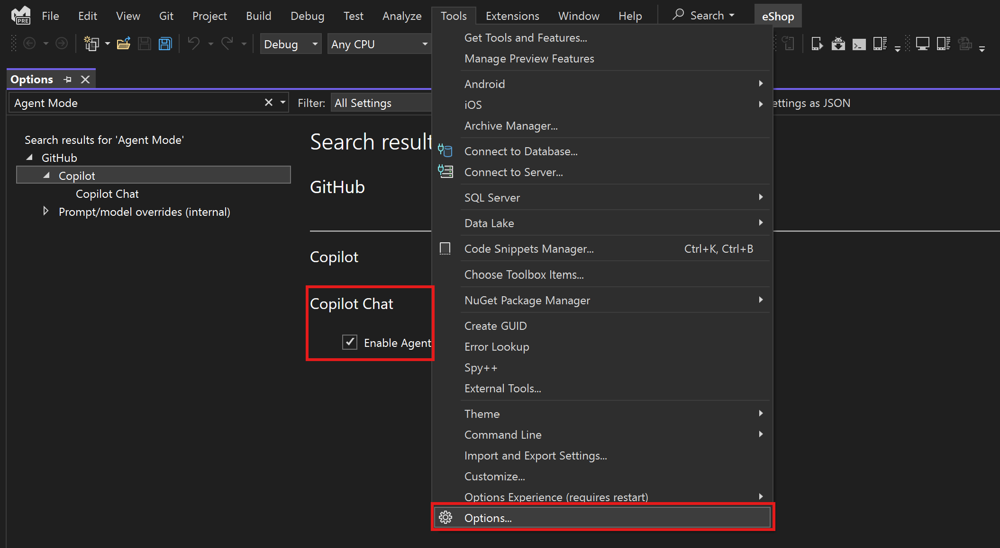
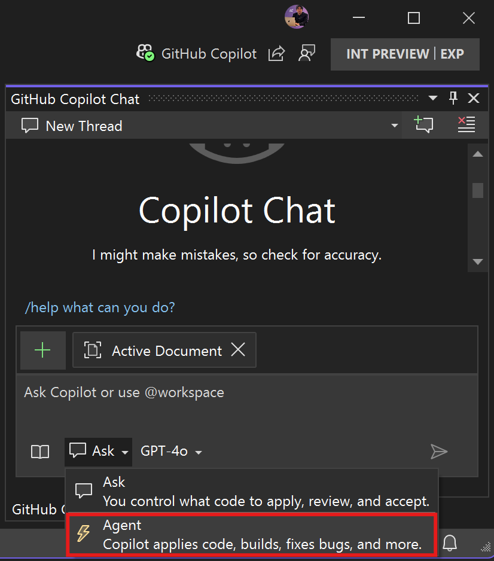
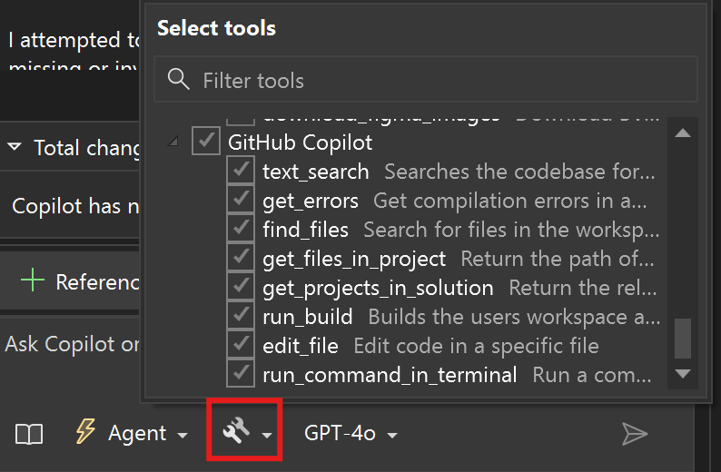
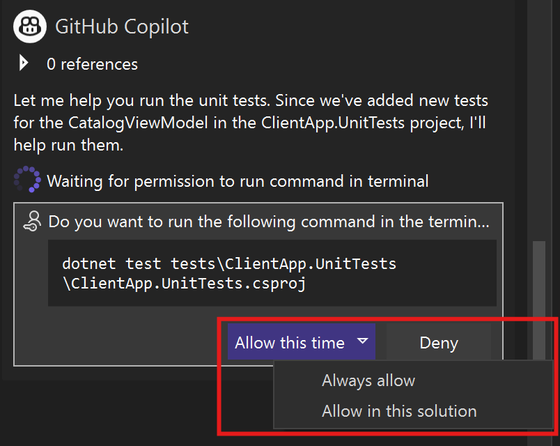
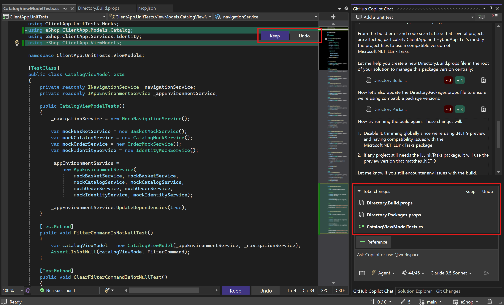
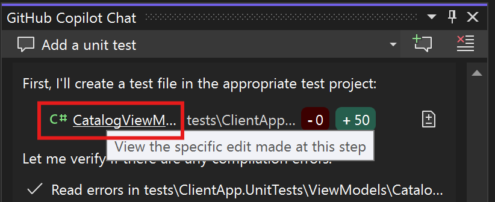
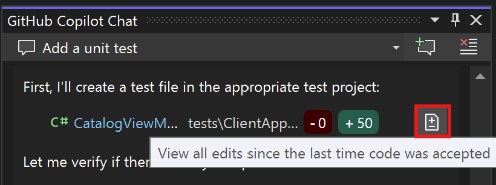
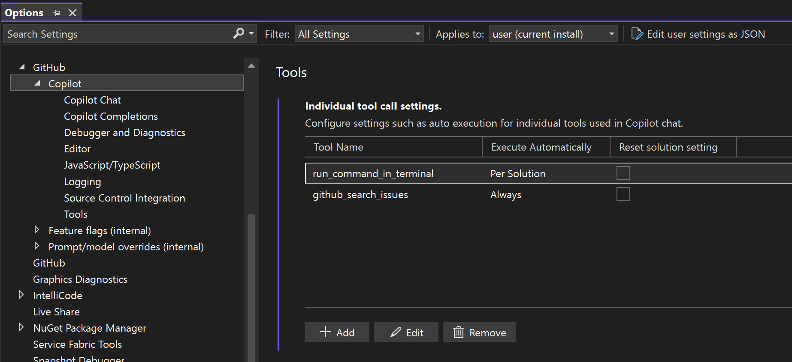
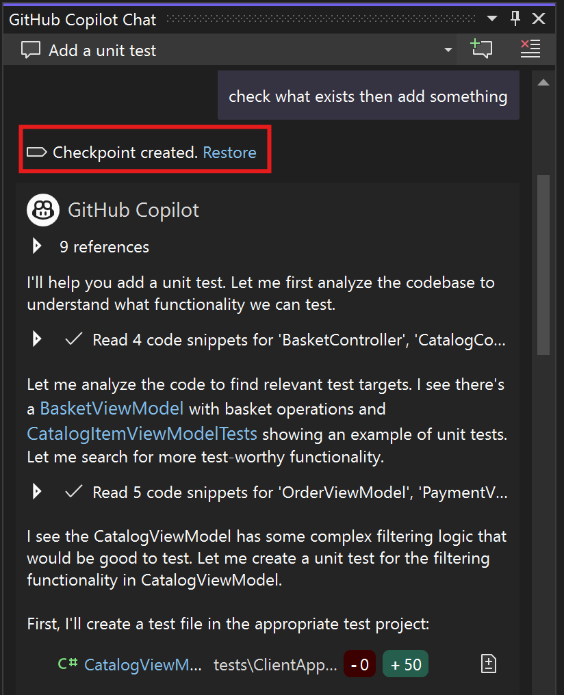

# What is GitHub Copilot Agent?

With GitHub Copilot's agent mode in Visual Studio, you can use natural language to specify a high-level task, and let AI autonomously reason about the request, plan the work needed, and apply the changes to your codebase. Agent mode uses a combination of code editing and tool invocation to accomplish the task you specified. As it processes your request, it monitors the outcome of edits and tools, and iterates to resolve any issues that arise.

The critical difference compared to Copilot Chat is that the Agent mode can:

1) Run commands and builds to interpret the environment or execute a task (i.e. database migration, dotnet restore, etc.)
2) Iterate on errors, failed builds, unit test results until the agent requires more input or deems the task accomplished.

## Prerequisites
+ [Visual Studio 2022 version 17.14](/visualstudio/releases/2022/release-history) and later have the Copilot Agent.
    + In the initial 17.14 release, you will need to set `Enable agent mode in the chat pane` in Tools > Options > GitHub > Copilot.
+ [Sign in to Visual Studio using a GitHub account](work-with-github-accounts.md) with [Copilot access](https://docs.github.com/en/copilot/about-github-copilot/what-is-github-copilot#getting-access-to-copilot).  
    + You can use [GitHub Copilot for Free](copilot-free-plan.md). Sign up and leverage AI to code faster and more efficiently.

## How to use Copilot Agent

In agent mode, Copilot operates autonomously and determines the relevant context for your prompt.

Follow these steps to get started:

1. Make sure that agent mode is enabled by clicking Tools > Options > GitHub > Copilot and the "Enable agent mode in the chat pane".

2. Open the GitHub Copilot window, click the mode dropdown that says "Ask", then select "Agent".

3. Enter your prompt for making edits in the chat input field and select Send (Enter) to submit it. You can specify a high-level requirement, and you don't have to specify which files to work on. In agent mode, Copilot determines the relevant context and files to edit autonomously.

4. Agent mode might invoke multiple tools to accomplish different tasks. Optionally, select the Tools icon to configure which additional tools can be used for responding to your request.

5. Confirm tool invocations and terminal commands. Before running a terminal command or non-builtin tool, Copilot requests confirmation to continue. This is because tools might run locally on your machine and perform actions that modify files or data.

6. Copilot detects issues and problems in code edits and terminal commands and will iterate and perform additional actions to resolve them. For example, agent mode might run unit tests as a result of a code edit. If the tests fail, it uses the test outcome to resolve the issue. Copilot agent mode iterates multiple times to resolve issues and problems.

7. As Copilot processes your request, notice that Copilot streams the suggested code edits directly in the editor. Review the suggested edits and either keep or discard the suggested edits as a whole in the Total Changes section, or individually by clicking on a file and reviewing the code diffs presented in the editor.

8. If you want to review individual code changes made by the agent, you can either review the specific change made at each step, or review the cumulative changes from the last time changes were kept or undone.

9. Continue to iterate on the code changes to refine the edits or implement additional features.

## Agent mode tools

Agent mode can use the following tools:

* Built-in tools
* [MCP tools](mcp.md)

You can view and manage the tools that can be used for responding to a request. Select the Tools icon in the Chat view to view and manage the tools that are available in agent mode.

Based on the outcome of a tool, Copilot might invoke other tools to accomplish the overall request. For example, if a code edit results in syntax errors in the file, Copilot might explore another approach and suggest different code changes.

Additional tools added by running MCP servers are not automatically enabled, they are unchecked by default and must be checked to be activated.

## Manage tool approvals

When a tool is invoked, Copilot requests confirmation to run the tool. This is because tools might run locally on your machine and perform actions that modify files or data.

In the Chat view, after a tool invocation, use the Allow button dropdown options to automatically confirm the specific tool for the current session, solution, or all future invocations.

You can reset tool confirmation selections in Tools > Options > GitHub > Copilot > Tools.

<!-- TODO: Define what "Reset solution setting does -->

## Accept or discard edits

Copilot lists the files that were edited in the list of Total Changes files in the Chat view.

Click on each file to review changes individually, where you can "Keep" or "Undo" edits made to each chunk of code.

Alternatively, in the Total Changes dialogue, click "Keep" or "Undo" for all edits made since the last time you clicked Keep or Undo.

## Revert edits

As you're sending requests to make edits to your code, you might want to roll back some of these changes, for example, because you want to use another implementation strategy or because Copilot starts walking down the wrong path when generating edits.

You can achieve this by clicking "Restore" next to the checkpoint prior to the prompt that included changes you did not want.

At time of writing, the Visual Studio Copilot Agent doesn't support stepwise undo/redo.

## Interrupt an agent mode request
To interrupt an ongoing request, you can cancel it.

This stops all running tools and terminal commands.

To stop a build, click `Build` in the top toolbar then click `Cancel` or use the `Ctrl + Break` keyboard shortcut.

## Frequently Asked Questions

### I don't see Ask and Agent mode in the GitHub Copilot Chat window.

Take the following troubleshooting steps in the order specified:

- Make sure you're using Visual Studio 17.14 or later: check by clicking `Help`, `About Visual Studio`. If you are not using version 17.14 or later, launch the Visual Studio Installer and update your build.

- Make sure you have checked the `Enable agent mode in the chat pane` setting in `Tools > Options > GitHub > Copilot`

- Try restarting Visual Studio.

### When to use Ask and Agent modes?

- Ask mode is excellent when you want 100% confidence that no code edits will be made without your explicit clicking of "Apply" or Copy and Pasting Code.
- Otherwise, Agent mode can handle the same conceptual questions, generate code examples without applying them, along with its agent capabilities of editing code.
- If you are looking to use MCP capabilities, you must have Agent mode selected.

### What happened to Copilot Edits in Visual Studio?

- We perceive Agent mode to be an evolution of Edits, with greater ability to iterate on errors, use tools, and automatically apply code changes.
- For the initial releases of Visual Studio 2022 version 17.14, Edits mode is still available if you uncheck the `Enable agent mode` setting in `Tools > Options`.

### As an administrator, how do I control use of Agent mode for Visual Studio users?

Agent mode in Visual Studio is governed by the "Editor preview features" flag in the GitHub Copilot dashboard for administrator.

More information can be found in the GitHub documentation for [managing policies and features for copilot in your enterprise](https://docs.github.com/en/enterprise-cloud@latest/copilot/managing-copilot/managing-copilot-for-your-enterprise/managing-policies-and-features-for-copilot-in-your-enterprise#editor-preview-features).

## Related content

- [Install and manage GitHub Copilot in Visual Studio](visual-studio-github-copilot-install-and-states.md)
- [GitHub Copilot experience for Visual Studio](visual-studio-github-copilot-extension.md)
- [GitHub Copilot Chat experience for Visual Studio](visual-studio-github-copilot-chat.md)
- [About GitHub Copilot Free](https://aka.ms/ghdocscopilotfreepage)
