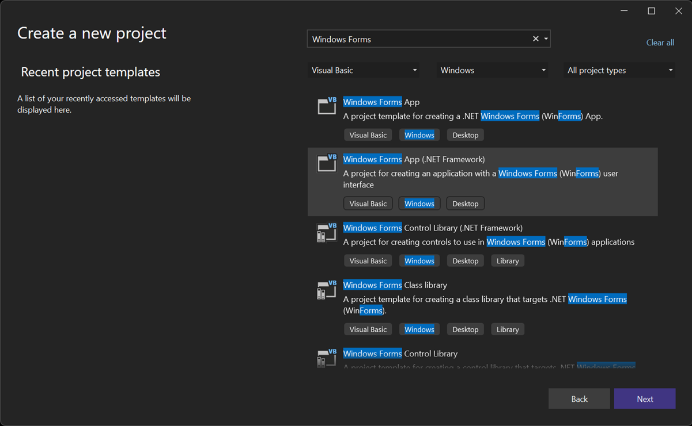
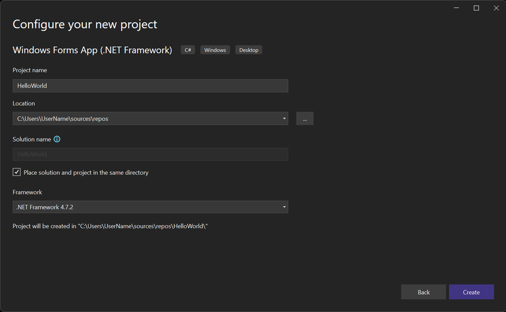
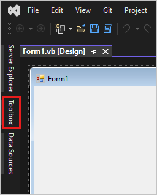
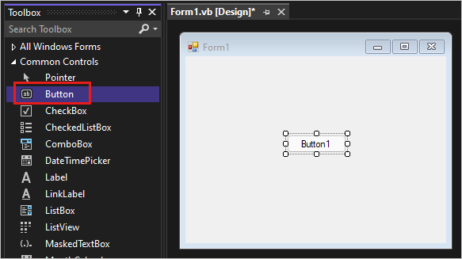
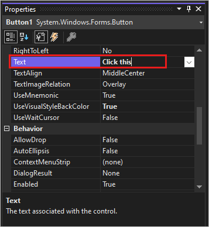
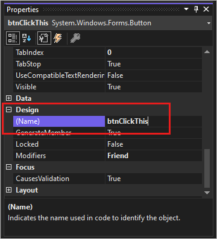
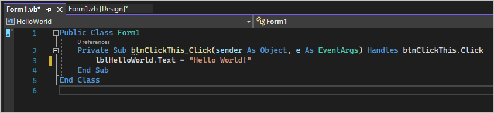
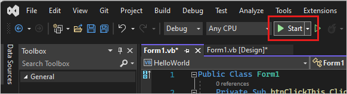
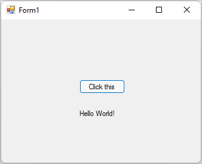

# Tutorial: Create a WinForms app with Visual Basic

 [!INCLUDE [Visual Studio](~/includes/applies-to-version/vs-windows-only.md)]

In this tutorial, you'll create a Visual Basic application that has a Windows Forms user interface.
The Visual Studio integrated development environment (IDE) includes all the tools you need to create a Windows Forms app.

In this tutorial, you learn how to:

> [!div class="checklist"]
> - Create a project
> - Add a button to the form
> - Add a label and code
> - Run the application

## Prerequisites

::: moniker range="vs-2019"
You need Visual Studio to complete this tutorial.
Visit the [Visual Studio downloads page](https://visualstudio.microsoft.com/vs/) for a free version.
::: moniker-end
::: moniker range=">=vs-2022"
You need Visual Studio to complete this tutorial.
Visit the [Visual Studio downloads page](https://visualstudio.microsoft.com/downloads) for a free version.
::: moniker-end

## Create a project

Create a Visual Basic application project.
The project type comes with all the template files you'll need, before you've even added anything.

::: moniker range="vs-2019"
1. Open Visual Studio.

1. On the start window, choose **Create a new project**.

   

1. On the **Create a new project** window, select the **Windows Forms App (.NET Framework)** template for Visual Basic.

   You can refine your search to quickly get to the template you want.
   For example, enter *Windows Forms App* in the search box.
   Next, select **Visual Basic** from the **Language** list, and then **Windows** from the **Platform** list.  

   

   > [!NOTE]
   > If you don't see the **Windows Forms App (.NET Framework)** template, you can install it from the **Create a new project** window.
   > In the **Not finding what you're looking for?** message, choose the **Install more tools and features** link.
   >
   > 
   >
   > Next, in the Visual Studio Installer, choose the **.NET desktop development** workload.
   >
   > 
   >
   > After that, select **Modify** in the Visual Studio Installer. You might be prompted to save your work.

1. In the **Configure your new project** window, enter *HelloWorld* as the **Project name**. Then, select **Create**.

   

   Visual Studio opens your new project.

::: moniker-end

::: moniker range=">=vs-2022"
1. Open Visual Studio.

1. On the start window, choose **Create a new project**.

   

1. On the **Create a new project** window, select the **Windows Forms App (.NET Framework)** template for Visual Basic.

   You can refine your search to quickly get to the template you want.
   For example, enter *Windows Forms App* in the search box.
   Next, select **Visual Basic** from the **Language** list, and then **Windows** from the **Platform** list.  

   

   > [!NOTE]
   > If you don't see the **Windows Forms App (.NET Framework)** template, you can install it from the **Create a new project** window.
   > In the **Not finding what you're looking for?** message, choose the **Install more tools and features** link.
   >
   > 
   >
   > Next, in the Visual Studio Installer, choose the **.NET desktop development** workload.
   >
   > 
   >
   > After that, select **Modify** in the Visual Studio Installer. You might be prompted to save your work.

1. In the **Configure your new project** window, enter *HelloWorld* as the **Project name**. Then, select **Create**.

   

   Visual Studio opens your new project.

::: moniker-end

## Add a button to the form

After you select your Visual Basic project template and name your file, Visual Studio opens a form for you.
A form is a Windows user interface.
You'll create a "Hello World" application by adding controls to the form.

1. On the left side of the Visual Studio IDE, select the **Toolbox** tab.
   If you don't see it, select **View** > **Toolbox** from the menu bar or **Ctrl**+**Alt**+**X**.

   

   If you want, select the **Pin** icon to dock the **Toolbox** window.

1. Select the **Button** control and then drag it onto the form.

   

1. In the **Appearance** section of the **Properties** window, for **Text**, type *Click this*, and then press **Enter**.

   

   If you don't see the **Properties** window, you can open it from the menu bar. Select **View** > **Properties Window** or press **F4**.

1. In the **Design** section of the **Properties** window, change the name from **Button1** to *btnClickThis*, and then press **Enter**.

   

   > [!NOTE]
   > If you've alphabetized the list in the **Properties** window, **Button1** appears in the **(DataBindings)** section, instead.

## Add a label and code

Now that you've added a button control to create an action, add a label control to send text to.

1. Select the **Label** control in the **Toolbox** window, and then drag it onto the form.
   Place it beneath the **Click this** button.

1. In either the **Design** section or the **(DataBindings)** section of the **Properties** window, change the name **Label1** to *lblHelloWorld*, and then press **Enter**.

1. In the **Form1.vb &#91;Design&#93;** window, double-click the **Click this** button to open the **Form1.vb** window.

   Another option is to expand **Form1.vb** in **Solution Explorer**, and then select **Form1**.

1. In the **Form1.vb** window, between the **Private Sub** and **End Sub** lines, enter *lblHelloWorld.Text = "Hello World!"* as shown in the following screenshot:

     

## Run the application

Your application is ready to build and run.

1. Select **Start** to run the application.

   

   Several things happen.
   In the Visual Studio IDE, the **Diagnostics Tools** window opens, and an **Output** window opens.
   Outside of the IDE, a **Form1** dialog box appears.
   It includes your **Click this** button and text that says **Label1**.

1. Select the **Click this** button in the **Form1** dialog box.

   

   The **Label1** text changes to **Hello World!**.

1. Close the **Form1** dialog box to stop running the app.

## Next steps

To learn more about Windows Forms, continue with the following tutorial:

> [!div class="nextstepaction"]
> [Tutorial: Create a picture viewer](tutorial-windows-forms-picture-viewer-layout.md)

## See also

* [More Visual Basic tutorials](../get-started/visual-basic/index.yml)
* [C# tutorials](../get-started/csharp/index.yml)
* [C++ tutorials](/cpp/get-started/tutorial-console-cpp)
