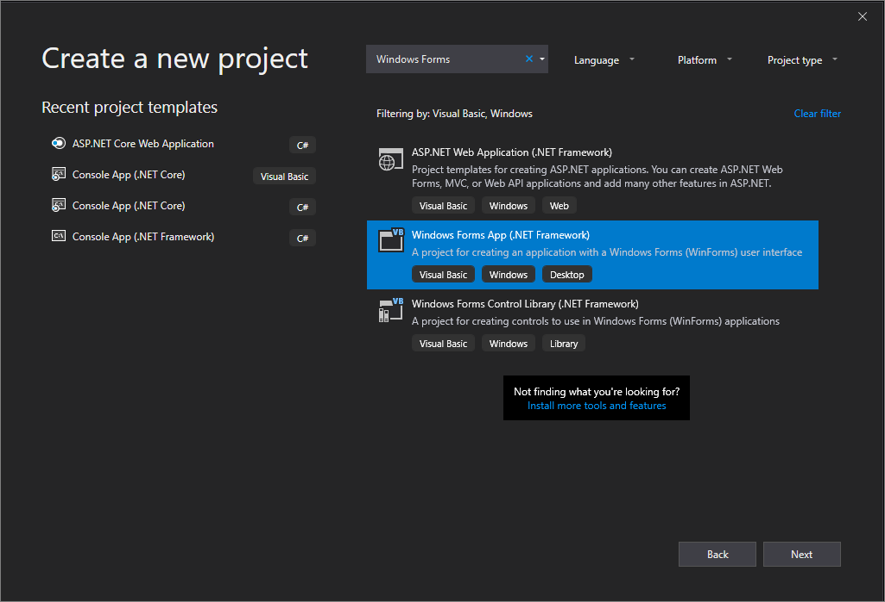
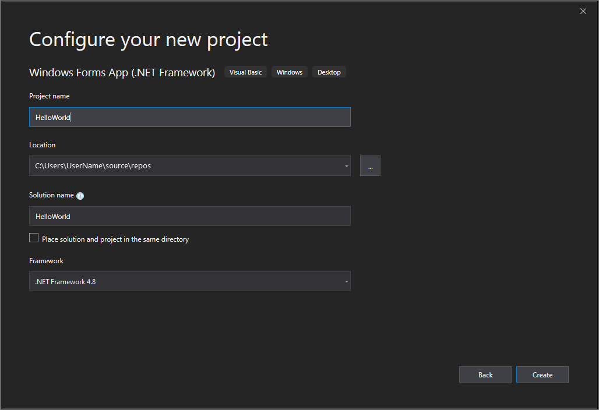
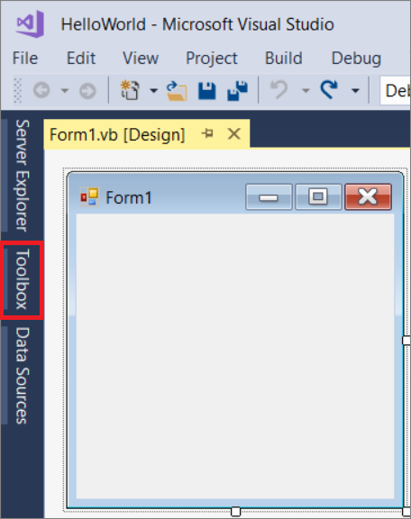
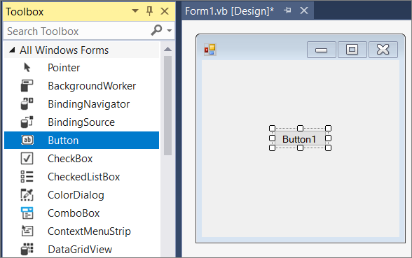
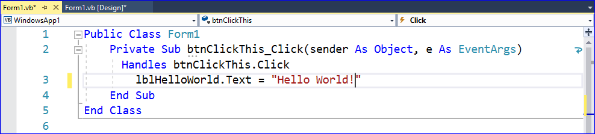

# Create a Windows Forms app in Visual Studio with Visual Basic

In this short introduction to the Visual Studio integrated development environment (IDE), you'll create a simple Visual Basic application that has a Windows-based user interface (UI).

::: moniker range="vs-2017"

If you haven't already installed Visual Studio, go to the [Visual Studio downloads](https://visualstudio.microsoft.com/vs/older-downloads/?utm_medium=microsoft&utm_source=docs.microsoft.com&utm_campaign=vs+2017+download) page to install it for free.

::: moniker-end

::: moniker range="vs-2019"

If you haven't already installed Visual Studio, go to the [Visual Studio downloads](https://visualstudio.microsoft.com/downloads) page to install it for free.

> [!NOTE]
> Some of the screenshots in this tutorial use the dark theme. If you aren't using the dark theme but would like to, see the [Personalize the Visual Studio IDE and Editor](../ide/quickstart-personalize-the-ide.md) page to learn how.

::: moniker-end

## Create a project

First, you'll create a Visual Basic application project. The project type comes with all the template files you'll need, before you've even added anything.

::: moniker range="vs-2017"

1. Open Visual Studio 2017.

1. From the top menu bar, choose **File** > **New** > **Project**.

1. In the **New Project** dialog box in the left pane, expand **Visual Basic**, and then choose **Windows Desktop**. In the middle pane, choose **Windows Forms App (.NET Framework)**. Then name the file `HelloWorld`.

     If you don't see the **Windows Forms App (.NET Framework)** project template, cancel out of the **New Project** dialog box and from the top menu bar, choose **Tools** > **Get Tools and Features**. The Visual Studio Installer launches. Choose the **.NET desktop development** workload, then choose **Modify**.

     

::: moniker-end

::: moniker range="vs-2019"

1. Open Visual Studio 2019.

1. On the start window, choose **Create a new project**.

   

1. On the **Create a new project** window, choose the **Windows Forms App (.NET Framework)** template for Visual Basic.

   (If you prefer, you can refine your search to quickly get to the template you want. For example, enter or type *Windows Forms App* in the search box. Next, choose **Visual Basic** from the Language list, and then choose **Windows** from the Platform list.)  

   

   > [!NOTE]
   > If you do not see the **Windows Forms App (.NET Framework)** template, you can install it from the **Create a new project** window. In the **Not finding what you're looking for?** message, choose the **Install more tools and features** link.
   >
   > 
   >
   > Next, in the Visual Studio Installer, choose the Choose the **.NET desktop development** workload.
   >
   > 
   >
   > After that, choose the **Modify** button in the Visual Studio Installer. You might be prompted to save your work; if so, do so. Next, choose **Continue** to install the workload. Then, return to step 2 in this "[Create a project](#create-a-project)" procedure.

1. In the **Configure your new project** window, type or enter *HelloWorld* in the **Project name** box. Then, choose **Create**.

   

   Visual Studio opens your new project.

::: moniker-end

## Create the application

After you select your Visual Basic project template and name your file, Visual Studio opens a form for you. A form is a Windows user interface. We'll create a "Hello World" application by adding controls to the form, and then we'll run the app.

### Add a button to the form

1. Click **Toolbox** to open the Toolbox fly-out window.

     

     (If you don't see the **Toolbox** fly-out option, you can open it from the menu bar. To do so, **View** > **Toolbox**. Or, press **Ctrl**+**Alt**+**X**.)

1. Click the **Pin** icon to dock the **Toolbox** window.

     

1. Click the **Button** control and then drag it onto the form.

     

1. In the **Appearance** section (or the **Fonts** section) of the **Properties** window, type `Click this`, and then press **Enter**.

     

     (If you don't see the **Properties** window, you can open it from the menu bar. To do so, click **View** > **Properties Window**. Or, press **F4**.)

1. In the **Design** section of the **Properties** window, change the name from **Button1** to `btnClickThis`, and then press **Enter**.

     

   > [!NOTE]
   > If you've alphabetized the list in the **Properties** window, **Button1** appears in the **(DataBindings)** section, instead.

### Add a label to the form

Now that we've added a button control to create an action, let's add a label control to send text to.

1. Select the **Label** control from the **Toolbox** window, and then drag it onto the form and drop it beneath the **Click this** button.

1. In either the **Design** section or the **(DataBindings)** section of the **Properties** window, change the name of **Label1** to `lblHelloWorld`, and then press **Enter**.

### Add code to the form

1. In the **Form1.vb &#91;Design&#93;** window, double-click the **Click this** button to open the **Form1.vb** window.

      (Alternatively, you can expand **Form1.vb** in **Solution Explorer**, and then click **Form1**.)

1. In the **Form1.vb** window, between the **Private Sub** and **End Sub** lines, type or enter `lblHelloWorld.Text = "Hello World!"` as shown in the following screenshot:

     

## Run the application

1. Click the **Start** button to run the application.

     

   Several things will happen. In the Visual Studio IDE, the **Diagnostics Tools** window will open, and an **Output** window will open, too. But outside of the IDE, a **Form1** dialog box appears. It will include your **Click this** button and text that says **Label1**.

1. Click the **Click this** button in the **Form1** dialog box. Notice that the **Label1** text changes to **Hello World!**.

    

1. Close the **Form1** dialog box to stop running the app.

## Next steps

To learn more, continue with the following tutorial:

> [!div class="nextstepaction"]
> [Tutorial: Create a picture viewer](tutorial-1-create-a-picture-viewer.md)

## See also

* [More Visual Basic tutorials](/visualstudio/get-started/visual-basic/)
* [C# tutorials](/visualstudio/get-started/csharp/)
* [C++ tutorials](/cpp/get-started/tutorial-console-cpp)
