# Create a Windows Forms app in Visual Studio with C\#

 [!INCLUDE [Visual Studio](~/includes/applies-to-version/vs-windows-only.md)]

In this tutorial, you'll create a simple C# application that has a Windows-based user interface (UI).

::: moniker range="vs-2019"

If you haven't already installed Visual Studio, go to the [Visual Studio downloads](https://visualstudio.microsoft.com/downloads) page to install it for free.

> [!NOTE]
> Some of the screenshots in this tutorial use the dark theme. If you aren't using the dark theme but would like to, see the [Personalize the Visual Studio IDE and Editor](../ide/quickstart-personalize-the-ide.md) page to learn how.

::: moniker-end

::: moniker range="vs-2022"

If you haven't already installed Visual Studio, go to the [Visual Studio 2022 downloads](https://visualstudio.microsoft.com/downloads) page to install it for free.

::: moniker-end

## Create a project

First, you'll create a C# application project. The project type comes with all the template files you'll need, before you've even added anything.

::: moniker range="vs-2019"

1. Open Visual Studio.

1. On the start window, choose **Create a new project**.

   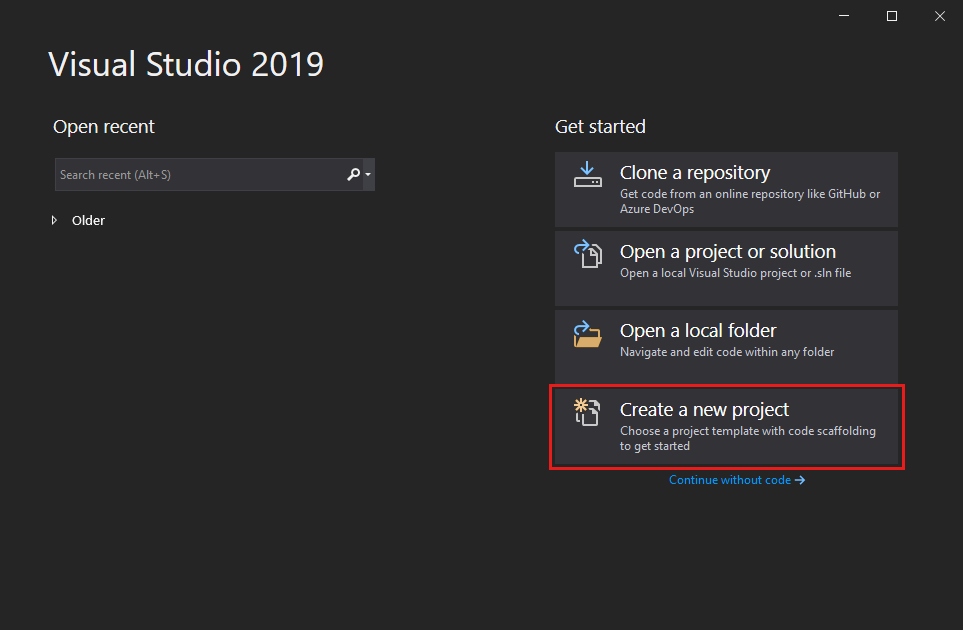

1. On the **Create a new project** window, choose the **Windows Forms App (.NET Framework)** template for C#.

   (If you prefer, you can refine your search to quickly get to the template you want. For example, enter or type *Windows Forms App* in the search box. Next, choose **C#** from the Language list, and then choose **Windows** from the Platform list.)  

   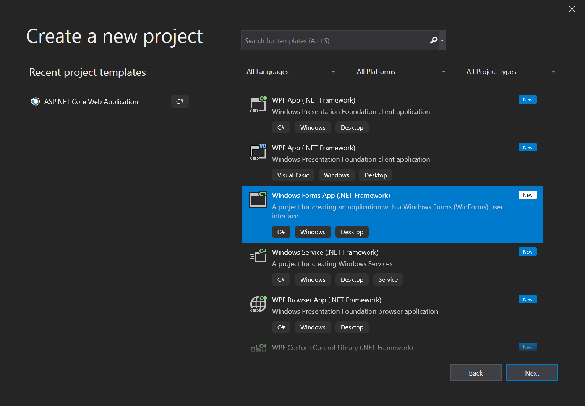

   > [!NOTE]
   > If you do not see the **Windows Forms App (.NET Framework)** template, you can install it from the **Create a new project** window. In the **Not finding what you're looking for?** message, choose the **Install more tools and features** link.
   >
   > 
   >
   > Next, in the Visual Studio Installer, choose the **.NET desktop development** workload.
   >
   > 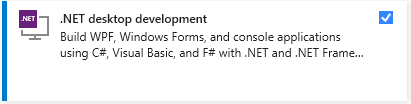
   >
   > After that, choose the **Modify** button in the Visual Studio Installer. You might be prompted to save your work; if so, do so. Next, choose **Continue** to install the workload. Then, return to step 2 in this "[Create a project](#create-a-project)" procedure.

1. In the **Configure your new project** window, type or enter *HelloWorld* in the **Project name** box. Then, choose **Create**.

   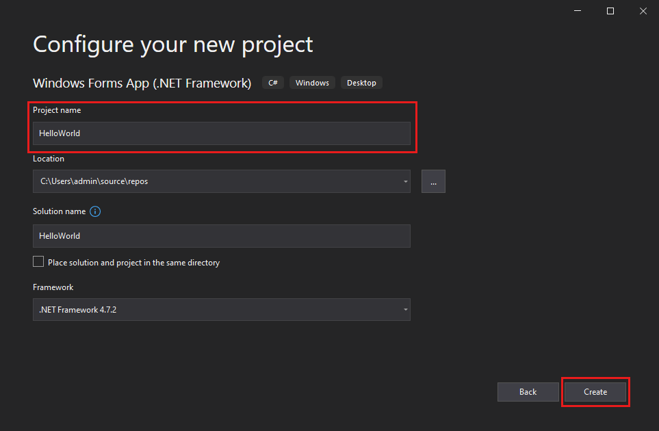

   Visual Studio opens your new project.

::: moniker-end

::: moniker range=">=vs-2022"

1. Open Visual Studio.

1. On the start window, select **Create a new project**.
    
    :::image type="content" source="media/vs-2022/create-new-project-dark-theme.png" alt-text="Screenshot to show the Create a new project window.":::

1. On the **Create a new project** window, select the **Windows Forms App (.NET Framework)** template for C#.

   (If you prefer, you can refine your search to quickly get to the template you want. For example, enter or type *Windows Forms App* in the search box. Next, select **C#** from the **Language** list, and then select **Windows** from the **Platform** list.)  

    :::image type="content" source="media/vs-2022/csharp-winform-create-a-new-project.png" alt-text="Screenshot to select the C# template for the Windows Forms App (.NET Framework).":::

   > [!NOTE]
   > If you do not see the **Windows Forms App (.NET Framework)** template, you can install it from the **Create a new project** window. In the **Not finding what you're looking for?** message, select the **Install more tools and features** link.
   >
   > :::image type="content" source="../get-started/media/vs-2019/not-finding-what-looking-for.png" alt-text="Screenshot to show the The 'Install more tools and features' link from the 'Not finding what you're looking for' message in the 'Create a new project' window.":::
   >
   > Next, in the Visual Studio Installer, select the **.NET desktop development** workload.
   >
   > :::image type="content" source="media/vs-2022/install-dot-net-desktop-env.png" alt-text="Screenshot to show the .NET Core workload in the Visual Studio Installer.":::
   >
   > After that, select the **Modify** button in the Visual Studio Installer. You might be prompted to save your work; if so, do so. Next, select **Continue** to install the workload. Then, return to step 2 in this "[Create a project](#create-a-project)" procedure.

1. In the **Configure your new project** window, type or enter *HelloWorld* in the **Project name** box. Then, select **Create**.

    :::image type="content" source="media/vs-2022/csharp-winform-configure-new-project.png" alt-text="Screenshot to show the 'Configure your new project' window and name your project 'HelloWorld'.":::

   Visual Studio opens your new project.

## Create the application

After you select your C# project template and name your file, Visual Studio opens a form for you. A form is a Windows user interface. We'll create a "Hello World" application by adding controls to the form, and then we'll run the app.

### Add a button to the form

1. Select **Toolbox** to open the Toolbox fly-out window.
    
     :::image type="content" source="media/vs-2022/csharp-winform-hello-world-project-toolbox.png" alt-text="Screenshot to select the Toolbox to open the Toolbox window.":::

     (If you don't see the **Toolbox** fly-out option, you can open it from the menu bar. To do so, **View** > **Toolbox**. Or, press **Ctrl**+**Alt**+**X**.)

1. Expand **Common Controls** and select the **Pin** icon to dock the **Toolbox** window.

     :::image type="content" source="media/vs-2022/csharp-winform-toolbox-flyout-pin.png" alt-text="Screenshot to select the Pin icon to pin the Toolbox window to the IDE.":::

1. Select the **Button** control and then drag it onto the form.

     :::image type="content" source="media/vs-2022/csharp-winform-add-button-on-form.png" alt-text="Screenshot to add a button to the form.":::

1. In the **Properties** window, locate **Text**, change the name from **button1** to `Click this`, and then press **Enter**.

     :::image type="content" source="media/vs-2022/csharp-winform-button-properties-text.png" alt-text="Screenshot to add text to the button on the form by using the Properties window.":::

     (If you don't see the **Properties** window, you can open it from the menu bar. To do so, select **View** > **Properties Window**. Or, press **F4**.)

1. In the **Design** section of the **Properties** window, change the name from **button1** to `btnClickThis`, and then press **Enter**.

     :::image type="content" source="media/vs-2022/csharp-winform-button-properties-design-name.png" alt-text="Screenshot to add a function to the button on the form by using the Properties window.":::

   > [!NOTE]
   > If you've alphabetized the list in the **Properties** window, **button1** appears in the **(DataBindings)** section, instead.

### Add a label to the form

Now that we've added a button control to create an action, let's add a label control to send text to.

1. Select the **Label** control from the **Toolbox** window, and then drag it onto the form and drop it beneath the **Click this** button.

1. In either the **Design** section or the **(DataBindings)** section of the **Properties** window, change the name of **label1** to `lblHelloWorld`, and then press **Enter**.

### Add code to the form

1. In the **Form1.cs &#91;Design&#93;** window, double-click the **Click this** button to open the **Form1.cs** window.

      (Alternatively, you can expand **Form1.cs** in **Solution Explorer**, and then choose **Form1**.)

1. In the **Form1.cs** window, after the **private void** line, type or enter `lblHelloWorld.Text = "Hello World!";` as shown in the following screenshot:

     :::image type="content" source="media/vs-2022/csharp-winform-button-click-code.png" alt-text="Screenshot to add code to the form":::

## Run the application

1. Select the **Start** button to run the application.

     :::image type="content" source="media/vs-2022/csharp-winform-visual-studio-start-run-program.png" alt-text="Screenshot to select Start to debug and run the app.":::

   Several things will happen. In the Visual Studio IDE, the **Diagnostics Tools** window will open, and an **Output** window will open, too. But outside of the IDE, a **Form1** dialog box appears. It will include your **Click this** button and text that says **label1**.

1. Select the **Click this** button in the **Form1** dialog box. Notice that the **label1** text changes to **Hello World!**.

     :::image type="content" source="media/vs-2022/csharp-winform-form.png" alt-text="Screenshot to show a Form1 dialog box that includes label1 text.":::

1. Close the **Form1** dialog box to stop running the app.

::: moniker-end

::: moniker range="<=vs-2019"
## Create the application

After you select your C# project template and name your file, Visual Studio opens a form for you. A form is a Windows user interface. We'll create a "Hello World" application by adding controls to the form, and then we'll run the app.

### Add a button to the form

1. Choose **Toolbox** to open the Toolbox fly-out window.

     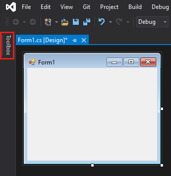

     (If you don't see the **Toolbox** fly-out option, you can open it from the menu bar. To do so, **View** > **Toolbox**. Or, press **Ctrl**+**Alt**+**X**.)

1. Choose the **Pin** icon to dock the **Toolbox** window.

     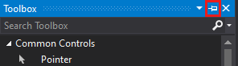

1. Choose the **Button** control and then drag it onto the form.

     

1. In the **Properties** window, locate **Text**, change the name from **Button1** to `Click this`, and then press **Enter**.

     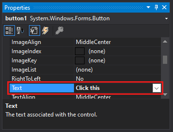

     (If you don't see the **Properties** window, you can open it from the menu bar. To do so, choose **View** > **Properties Window**. Or, press **F4**.)

1. In the **Design** section of the **Properties** window, change the name from **Button1** to `btnClickThis`, and then press **Enter**.

     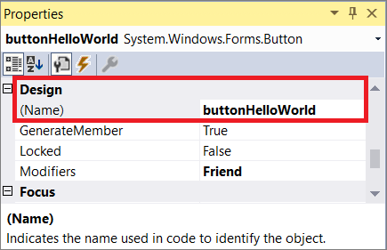

   > [!NOTE]
   > If you've alphabetized the list in the **Properties** window, **Button1** appears in the **(DataBindings)** section, instead.

### Add a label to the form

Now that we've added a button control to create an action, let's add a label control to send text to.

1. Select the **Label** control from the **Toolbox** window, and then drag it onto the form and drop it beneath the **Click this** button.

1. In either the **Design** section or the **(DataBindings)** section of the **Properties** window, change the name of **Label1** to `lblHelloWorld`, and then press **Enter**.

### Add code to the form

1. In the **Form1.cs &#91;Design&#93;** window, double-click the **Click this** button to open the **Form1.cs** window.

      (Alternatively, you can expand **Form1.cs** in **Solution Explorer**, and then choose **View Code**(or press **F7**) from the right-click menu on  **Form1.cs**.)

1. In the **Form1.cs** window, after the **private void** line, type or enter `lblHelloWorld.Text = "Hello World!";` as shown in the following screenshot:

     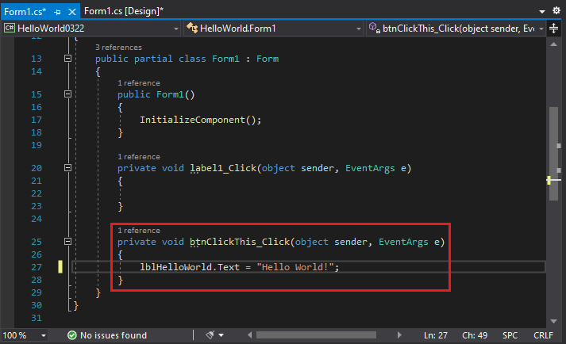

## Run the application

1. Choose the **Start** button to run the application.

     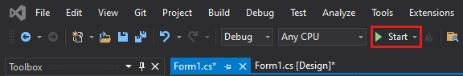

   Several things will happen. In the Visual Studio IDE, the **Diagnostics Tools** window will open, and an **Output** window will open, too. But outside of the IDE, a **Form1** dialog box appears. It will include your **Click this** button and text that says **Label1**.

1. Choose the **Click this** button in the **Form1** dialog box. Notice that the **Label1** text changes to **Hello World!**.

    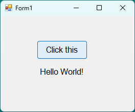

1. Close the **Form1** dialog box to stop running the app.

::: moniker-end

## Next steps

Congratulations on completing this tutorial. To learn more, continue with the following tutorial:

> [!div class="nextstepaction"]
> [Tutorial: Create a picture viewer](tutorial-windows-forms-picture-viewer-layout.md)

## See also

* [More C# tutorials](../get-started/csharp/index.yml)
* [Visual Basic tutorials](../get-started/visual-basic/index.yml)
* [C++ tutorials](/cpp/get-started/tutorial-console-cpp)