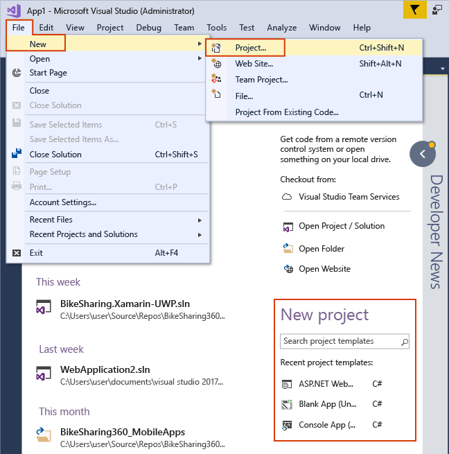
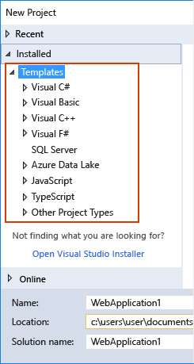

# Create a new project in Visual Studio

In this article, we'll show you how to quickly create a new project in Visual Studio from a template.

::: moniker range="vs-2017"

## Open the New Project page in Visual Studio 2017

There are multiple ways to create a new project in Visual Studio 2017. On the Start page, you can type in the name of a project template in the **Search project templates** box or select the **Create new project** link to open the **New Project** dialog box. Aside from the Start page, you can also select **File** > **New** > **Project** on the menu bar or select the **New Project** button on the toolbar.

## Select a template type in Visual Studio 2017

In the **New Project** dialog box, available project templates appear in a list under the **Templates** category. Templates are organized by programming language and project type, such as Visual C#, JavaScript, and Azure Data Lake.

> [!NOTE]
> The list of available languages and project templates that appears depends on the version of Visual Studio you are running and the workloads that are installed. To learn about how to install additional workloads, see [Modify Visual Studio by adding or removing workloads and components](../install/modify-visual-studio.md).

Show the list of templates for the programming language you want to use by selecting the triangle next to the language name and then choosing a project category (such as Windows Desktop).

The following image shows the project templates available for Visual C# .NET Core projects:

## Configure your project in Visual Studio 2017

Enter a name for the new project in the **Name** box. You can save the project in the default location on your computer or select the **Browse** button to find another location. You can also select a solution name or add the new project to a Git repository (by selecting **Add to Source Control**).

Select **OK** to create the solution and project.

::: moniker-end

::: moniker range="vs-2019"

## Open the "Create a new project" dialog

There are multiple ways to create a new project in Visual Studio. When you first open Visual Studio, the start window appears, and from there, you can select **Create a new project**.

:::image type="content" source="media/vs-2019/start-window-create-new-project.png" alt-text="Screenshot of the 'Create a new project' dialog from the start window in Visual Studio 2019":::

If the Visual Studio development environment is already open, you can create a new project by choosing **File** > **New** > **Project** on the menu bar. You can also select the **New Project** button on the toolbar, or press **Ctrl**+**Shift**+**N**.

:::image type="content" source="media/vs-2019/new-project-button.png" alt-text="Screenshot of the New Project button in Visual Studio 2019.":::

::: moniker-end

::: moniker range="vs-2022"

## Open the "Create a new project" dialog

There are multiple ways to create a new project in Visual Studio. When you first open Visual Studio, the start window appears, and from there, you can select **Create a new project**.

:::image type="content" source="media/vs-2022/start-window-create-new-project.png" alt-text="Screenshot of the 'Create a new project' dialog from the start window in Visual Studio 2022.":::

If the Visual Studio development environment is already open, you can create a new project by choosing **File** > **New** > **Project** on the menu bar. You can also select the **New Project** button on the toolbar, or press **Ctrl**+**Shift**+**N**.

:::image type="content" source="media/vs-2022/new-project-button.png" alt-text="Screenshot of the New Project button in Visual Studio 2022.":::

::: moniker-end

::: moniker range=">=vs-2019"

## Select a template type

On the **Create a new project** dialog, a list of your recently selected templates appears on the left. The templates are sorted by *most recently used*.

If you're not selecting from the recently used templates, you can filter all available project templates by **Language** (for example, C# or C++), **Platform** (for example, Windows or Azure), and **Project type** (for example, Desktop or Web). You can also enter search text into the search box to further filter the templates, for example, **asp.net**.

::: moniker-end

::: moniker range="vs-2019"

:::image type="content" source="media/vs-2019/create-new-project-filters.png" alt-text="Screenshot of the project template filters in Visual Studio 2019.":::

The tags that appear under each template correspond to the three dropdown filters (Language, platform, and project type).

> [!TIP]
> If you don't see the template you're looking for, you might be missing a workload for Visual Studio. To install additional workloads, for example, **Azure Development** or **Mobile Development with .NET**, select the **Install more tools and features** link to open Visual Studio Installer. From there, select the workloads you want to install, and then select **Modify**. After that, additional project templates will be available to choose from.
>
> :::image type="content" source="media/vs-2019/install-more-tools-features.png" alt-text="Screenshot of the 'Install more tools and features' link in Visual Studio 2019.":::

Select a template and then select **Next**.

::: moniker-end

::: moniker range="vs-2022"

:::image type="content" source="media/vs-2022/create-new-project-filters.png" alt-text="Screenshot of the project template filters in Visual Studio 2022.":::

The tags that appear under each template correspond to the three dropdown filters (Language, platform, and project type).

> [!TIP]
> If you don't see the template you're looking for, you might be missing a workload for Visual Studio. To install additional workloads, for example, **Azure Development** or **Mobile Development with .NET**, select the **Install more tools and features** link to open Visual Studio Installer. From there, select the workloads you want to install, and then select **Modify**. After that, additional project templates will be available to choose from.
>
> :::image type="content" source="../get-started/csharp/media/vs-2022/not-finding-what-looking-for.png" alt-text="Screenshot of the 'Install more tools and features' link in Visual Studio 2022.":::

Select a template and then select **Next**.

::: moniker-end

::: moniker range="vs-2019"

## Configure your new project

The **Configure your new project** dialog has options to name your project (and solution), select a disk location, and select a Framework version (if applicable to the template you chose).

:::image type="content" source="media/vs-2019/configure-new-project.png" alt-text="Screenshot of the 'Configure your new project' dialog in Visual Studio 2019.":::

> [!NOTE]
> If you create a new project when you already have a project or solution open in Visual Studio, an extra configuration option is available. You can choose to create a new solution or add the new project to the solution that's already open.
>
> :::image type="content" source="media/vs-2019/configure-new-project-solution.png" alt-text="Screenshot of the 'Create new solution' or 'Add to solution' dialog in Visual Studio 2019.":::

Select **Create** to create the new project.

::: moniker-end

::: moniker range="vs-2022"

## Configure your new project

The **Configure your new project** dialog has options to name your project (and solution), select a disk location, and more.

:::image type="content" source="media/vs-2022/configure-new-project.png" alt-text="Screenshot of the 'Configure your new project' dialog in Visual Studio 2022.":::

The **Additional information** dialog includes options to select a Framework version, an authentication type, and more.

:::image type="content" source="media/vs-2022/aspnet-core-additional-information-dialog.png" alt-text="Screenshot of the 'Additional Information dialog in Visual Studio 2022.":::

Select **Create** to create the new project.

::: moniker-end

## Add additional projects to a solution

If you want to add an additional project to a solution, right-click the solution node in **Solution Explorer** and then select **Add** > **New Project**.

> [!TIP]
> For an example of a project and solution created from scratch, complete with step-by-step instructions and sample code, see [Introduction to projects and solutions](../get-started/tutorial-projects-solutions.md).

## See also

- [Introduction to projects and solutions](../get-started/tutorial-projects-solutions.md)
- [Work with solutions and projects](creating-solutions-and-projects.md)
- [Manage project and solution properties](managing-project-and-solution-properties.md)
- [Create projects (Visual Studio for Mac)](/visualstudio/mac/create-new-projects)
