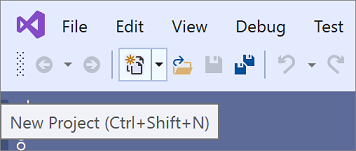
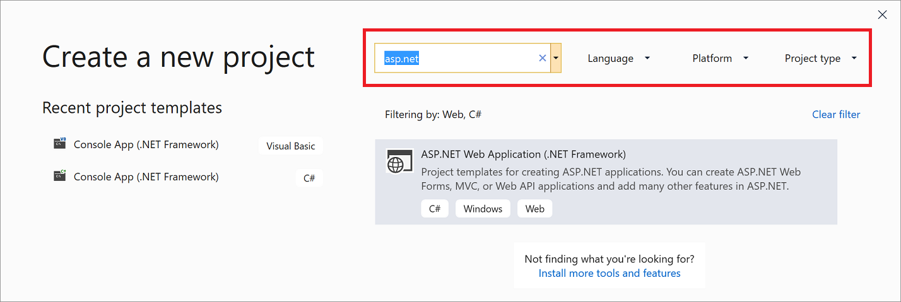
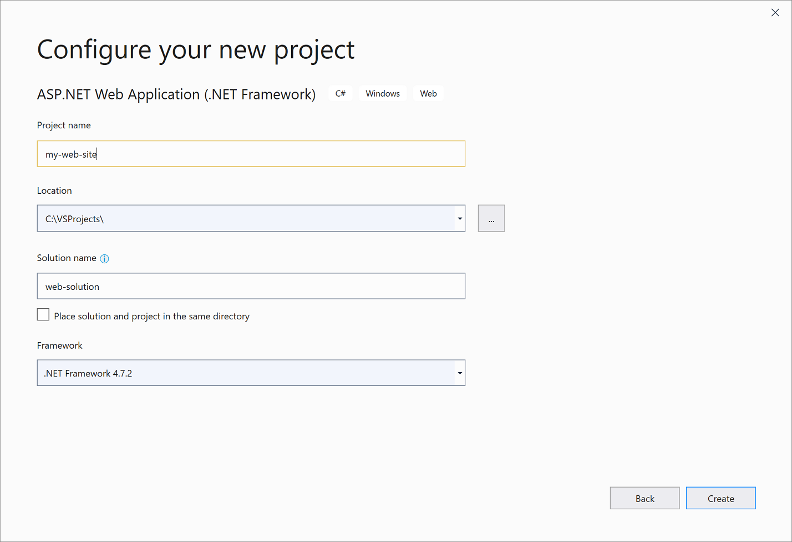
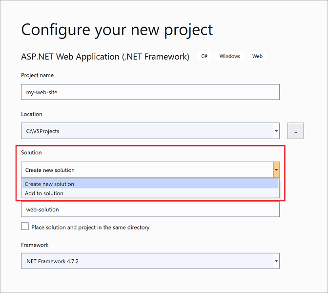

# Create a new project in Visual Studio

::: moniker range="vs-2017"

## Open the New Project dialog

There are multiple ways to create a new project in Visual Studio 2017. On the Start page, you can type in the name of a project template in the **Search project templates** box or choose the **Create new project** link to open the **New Project** dialog box. Aside from the Start page, you can also choose **File** > **New** > **Project** on the menu bar or click the **New Project** button on the toolbar.

## Select a template type

In the **New Project** dialog box, available project templates appear in a list under the **Templates** category. Templates are organized by programming language and project type, such as Visual C#, JavaScript, and Azure Data Lake.

> [!NOTE]
> The list of available languages and project templates that appears depends on the version of Visual Studio you are running and the workloads that are installed. To learn about how to install additional workloads, see [Modify Visual Studio by adding or removing workloads and components](../install/modify-visual-studio.md).

Show the list of templates for the programming language you want to use by clicking the triangle next to the language name and then choosing a project category (such as Windows Desktop).

The following image shows the project templates available for Visual C# .NET Core projects:

## Configure your project

Enter a name for the new project in the **Name** box. You can save the project in the default location on your computer or click the **Browse** button to find another location. You can also choose a solution name or add the new project to a Git repository (by choosing **Add to Source Control**).

Click **OK** to create the solution and project.

::: moniker-end

::: moniker range=">=vs-2019"

## Open the Create a new project page

There are multiple ways to create a new project in Visual Studio 2019. When you first open Visual Studio, the start window appears, and from there, you can choose **Create a new project**.

If the Visual Studio development environment is already open, you can create a new project by choosing **File** > **New** > **Project** on the menu bar or by clicking the **New Project** button on the toolbar.

## Select a template type

On the **Create a new project** page, a list of your recently selected templates appears on the left. The templates are sorted by *most recently used*.

If you're not selecting from the recently used templates, you can filter all available project templates by **Language** (for example, C# or C++), **Platform** (for example, Windows or Azure), and **Project type** (for example, Desktop or Web). You can also enter search text into the search box to further filter the templates, for example, **asp.net**.

The tags that appear under each template correspond to the three dropdown filters (Language, Platform, and Project type).

> [!TIP]
> If you don't see the template you're looking for, you may be missing a workload for Visual Studio. To install additional workloads, for example, **Azure Development** or **Mobile Development with .NET**, click the **Install more tools and features** link to open Visual Studio Installer. From there, select the workloads you want to install, and then choose **Modify**. After that, additional project templates will be available to choose from.
>
> 

Select a template and then click **Next**.

## Configure your project

The **Configure your new project** page has options to name your project (and solution), choose a disk location, and select a Framework version (if applicable to the template you chose).

> [!NOTE]
> If you create a new project when you already have a project or solution open in Visual Studio, an extra configuration option is available. You can choose to create a new solution or add the new project to the solution that's already open.
>
> 

Click **Create** to create the new project.

::: moniker-end

## Add additional projects to a solution

If you want to add an additional project to a solution, right-click the solution node in **Solution Explorer** and choose **Add** > **New Project**.

## See also

- [Create solutions and projects](creating-solutions-and-projects.md)
