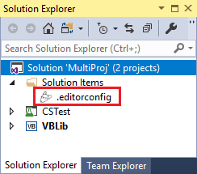
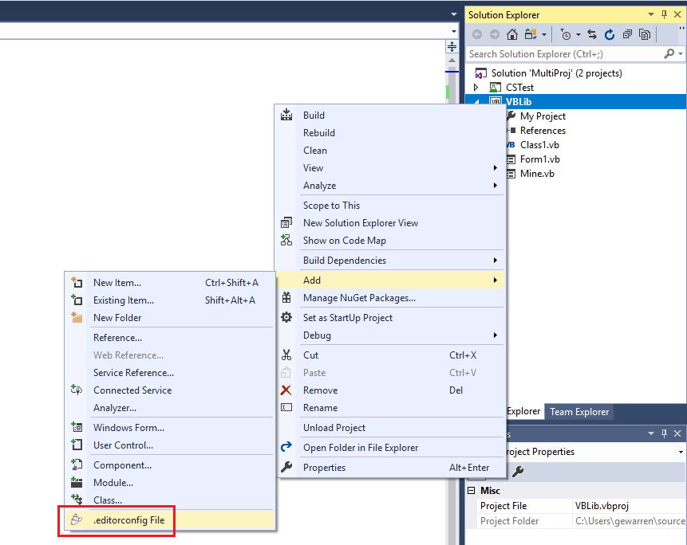
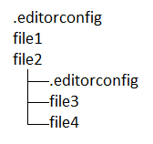
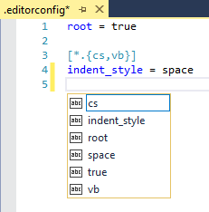
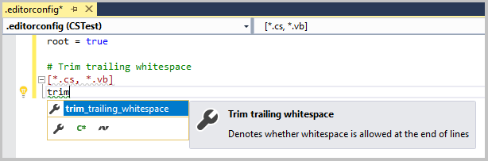
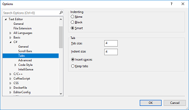
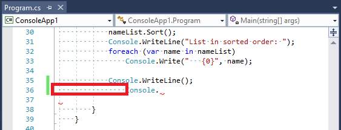
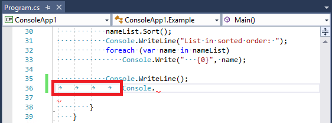
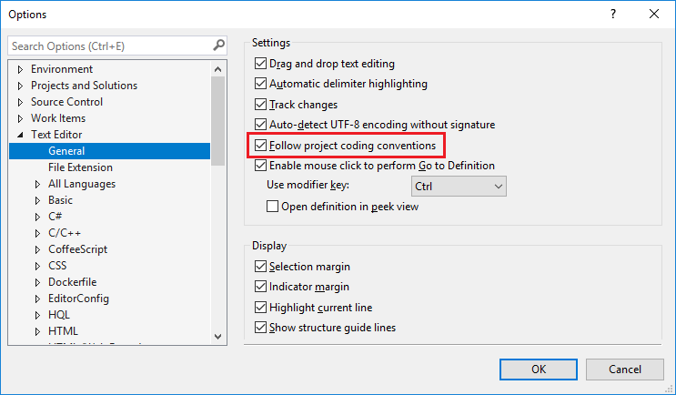

# Create portable, custom editor settings with EditorConfig

You can add an [EditorConfig](http://editorconfig.org/) file to your project or codebase to enforce consistent coding styles for everyone that works in the codebase. EditorConfig settings take precedence over global Visual Studio text editor settings. This means that you can tailor each codebase to use text editor settings that are specific to that project. You can still set your own personal editor preferences in the Visual Studio **Options** dialog box. Those settings apply whenever you're working in a codebase without an *.editorconfig* file, or when the *.editorconfig* file doesn't override a particular setting. An example of such a preference is indent style&mdash;tabs or spaces.

EditorConfig settings are supported by numerous code editors and IDEs, including Visual Studio. It's a portable component that travels with your code, and can enforce coding styles even outside of Visual Studio.

When you add an EditorConfig file to your project in Visual Studio, the formatting of existing code is not changed unless you format the document (**Edit** > **Advanced** > **Format Document** or **Ctrl**+**K**, **Ctrl**+**D** in the default profile). However, any new lines of code are formatted according to the EditorConfig settings.

::: moniker range="vs-2017"

You can define which EditorConfig settings you want **Format Document** to apply on the [**Formatting** options page](reference/options-text-editor-csharp-formatting.md#format-document-settings).

::: moniker-end

> [!NOTE]
> This topic applies to Visual Studio on Windows. For Visual Studio for Mac, see [EditorConfig in Visual Studio for Mac](/visualstudio/mac/editorconfig).

## Code consistency

Settings in EditorConfig files enable you to maintain consistent coding styles and settings in a codebase, such as indent style, tab width, end of line characters, encoding, and more, regardless of the editor or IDE you use. For example, when coding in C#, if your codebase has a convention to prefer that indents always consist of five space characters, documents use UTF-8 encoding, and each line always ends with a CR/LF, you can configure an *.editorconfig* file to do that.

Coding conventions you use on your personal projects may differ from those used on your team's projects. For example, you might prefer that when you're coding, indenting adds a tab character. However, your team might prefer that indenting adds four space characters instead of a tab character. EditorConfig files resolve this problem by enabling you to have a configuration for each scenario.

Because the settings are contained in a file in the codebase, they travel along with that codebase. As long as you open the code file in an EditorConfig-compliant editor, the text editor settings are implemented. For more information about EditorConfig files, see the [EditorConfig.org](http://editorconfig.org/) website.

> [!NOTE]
> Conventions that are set in an EditorConfig file cannot currently be enforced in a CI/CD pipeline as build errors or warnings. Any style deviations appear only in the Visual Studio editor and **Error List**.

## Supported settings

The editor in Visual Studio supports the core set of [EditorConfig properties](http://editorconfig.org/#supported-properties):

- indent_style
- indent_size
- tab_width
- end\_of_line
- charset
- trim\_trailing_whitespace
- insert\_final_newline
- root

EditorConfig editor settings are supported in all Visual Studio-supported languages except for XML. In addition, EditorConfig supports [code style](../ide/editorconfig-code-style-settings-reference.md) conventions including [language](../ide/editorconfig-language-conventions.md), [formatting](../ide/editorconfig-formatting-conventions.md), and [naming](../ide/editorconfig-naming-conventions.md) conventions for C# and Visual Basic.

## Add and remove EditorConfig files

Adding an EditorConfig file to your project or codebase does not convert existing styles to the new ones. For example, if you have indents in your file that are formatted with tabs, and you add an EditorConfig file that indents with spaces, the indent characters are not automatically converted to spaces. However, any new lines of code are formatted according to the EditorConfig file. Additionally, if you format the document (**Edit** > **Advanced** > **Format Document** or **Ctrl**+**K**, **Ctrl**+**D**), the settings in the EditorConfig file are applied to existing lines of code.

If you remove an EditorConfig file from your project or codebase, you must close and reopen any open code files to revert to the global editor settings for new lines of code.

### To add an EditorConfig file to a project or solution

1. Open a project or solution in Visual Studio. Select either the project or solution node, depending on whether your *.editorconfig* settings should apply to all projects in the solution or just one. You can also select a folder in your project or solution to add the *.editorconfig* file to.

1. From the menu bar, choose **Project** > **Add New Item**, or press **Ctrl**+**Shift**+**A**.

   The **Add New Item** dialog box opens.

1. In the categories on the left, choose **General**, and then choose the **Text File** template. In the **Name** text box, enter `.editorconfig` and then choose **Add**.

   An *.editorconfig* file appears in Solution Explorer, and it opens in the editor.

   

1. Edit the file as desired, for example:

   ```ini
   root = true

   [*.{cs,vb}]
   indent_size = 4
   trim_trailing_whitespace = true

   [*.cs]
   csharp_new_line_before_open_brace = methods
   ```

### Other ways to add an EditorConfig file

There are a couple other ways you can add an EditorConfig file to your project:

- Install the [EditorConfig Language Service extension](https://marketplace.visualstudio.com/items?itemName=MadsKristensen.EditorConfig) to more easily add an empty *.editorconfig* file to your project. After you install this extension, simply choose **Add** > **.editorconfig File** from the right-click or context menu of the solution node, project node, or any folder in **Solution Explorer**. This extension also improves the editing experience for the *.editorconfig* file.

   

- Try out the [IntelliCode extension](/visualstudio/intellicode/intellicode-visual-studio). This experimental extension infers your code styles from existing code, and then creates a non-empty *.editorconfig* file with your code style preferences already defined.

## File hierarchy and precedence

When you add an *.editorconfig* file to a folder in your file hierarchy, its settings apply to all applicable files at that level and below. You can also override EditorConfig settings for a particular project, codebase, or part of a codebase, such that it uses different conventions than other parts of the codebase. This can be useful when you incorporate code from somewhere else, and don’t want to change its conventions.

To override some or all of the EditorConfig settings, add an *.editorconfig* file at the level of the file hierarchy you want those overridden settings to apply. The new EditorConfig file settings apply to files at the same level and any subdirectories.



If you want to override some but not all of the settings, specify just those settings in the *.editorconfig* file. Only those properties that you explicitly list in the lower-level file are overridden. Other settings from higher-level *.editorconfig* files continue to apply. If you want to ensure that _no_ settings from _any_ higher-level *.editorconfig* files are applied to this part of the codebase, add the ```root=true``` property to the lower-level *.editorconfig* file:

```ini
# top-most EditorConfig file
root = true
```

EditorConfig files are read top to bottom. If there are multiple properties with the same name, the most recently found property with that name takes precedence.

## Edit EditorConfig files

Visual Studio helps you edit *.editorconfig* files by providing IntelliSense completion lists.



After you've edited your EditorConfig file, you must reload your code files for the new settings to take effect.

If you edit numerous *.editorconfig* files, you may find the [EditorConfig Language Service extension](https://marketplace.visualstudio.com/items?itemName=MadsKristensen.EditorConfig) helpful. Some of the features of this extension include syntax highlighting, improved IntelliSense, validation, and code formatting.



## Example

The following example shows the indent state of a C# code snippet before and after adding an *.editorconfig* file to the project. The **Tabs** setting in the **Options** dialog box for the Visual Studio text editor is set to produce space characters when you press the **Tab** key.



As expected, pressing the **Tab** key on the next line indents the line by adding four additional white-space characters.



Add a new file called *.editorconfig* to the project, with the following contents. The `[*.cs]` setting means that this change applies only to C# code files in the project.

```ini
# Top-most EditorConfig file
root = true

# Tab indentation
[*.cs]
indent_style = tab
```

Now, when you press the **Tab** key, you get tab characters instead of spaces.



## Troubleshoot EditorConfig settings

If there is an EditorConfig file anywhere in the directory structure at or above your project's location, Visual Studio applies the editor settings in that file to your editor. In this case, you may see the following message in the status bar:

   **"User preferences for this file type are overridden by this project's coding conventions."**

This means that if any editor settings in **Tools** > **Options** > **Text Editor** (such as indent size and style, tab size, or coding conventions) are specified in an EditorConfig file at or above the project in the directory structure, the conventions in the EditorConfig file override the settings in **Options**. You can control this behavior by toggling the **Follow project coding conventions** option in **Tools** > **Options** > **Text Editor**. Unchecking the option turns off EditorConfig support for Visual Studio.



You can find any *.editorconfig* files in parent directories by opening a command prompt and running the following command from the root of the disk that contains your project:

```Shell
dir .editorconfig /s
```

You can control the scope of your EditorConfig conventions by setting the ```root=true``` property in the *.editorconfig* file at the root of your repo or in the directory that your project resides. Visual Studio looks for a file named *.editorconfig* in the directory of the opened file and in every parent directory. The search ends when it reaches the root filepath, or if an *.editorconfig* file with ```root=true``` is found.

## See also

- [.NET code style conventions](../ide/editorconfig-code-style-settings-reference.md)
- [Supporting EditorConfig for a language service](../extensibility/supporting-editorconfig.md)
- [EditorConfig.org](http://editorconfig.org/)
- [Features of the code editor](writing-code-in-the-code-and-text-editor.md)
- [EditorConfig (Visual Studio for Mac)](/visualstudio/mac/editorconfig)