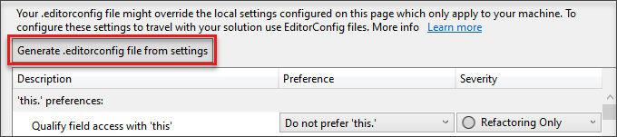
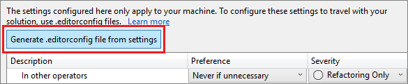

# Define consistent coding styles with EditorConfig

To enforce consistent coding styles for everyone that works in a codebase, you can add an `.editorconfig` file to your solution or project. EditorConfig file settings adhere to a file format specification maintained by [EditorConfig.org](https://editorconfig.org). Many code editors and applications support EditorConfig files, including Visual Studio. Because the settings are in a file, they accompany your code, and can be used even outside of Visual Studio.

In Visual Studio, EditorConfig file settings take precedence over the various global text editor settings available under **Tools** > **Options** > **Text Editor** > **\[C# | C/C++ | Visual Basic\]** > **Code Style**. You can use an EditorConfig file to tailor each codebase to use text editor settings that are specific to that project.

You can manually populate an EditorConfig file, or automatically generate it based on the code style settings you've chosen in Visual Studio. For more information, see [Ways to add an EditorConfig file](#ways-to-add-an-editorconfig-file).

When you use an EditorConfig file, you can still continue to set your own personal editor preferences in the Visual Studio text editor. These text editor settings apply whenever you're working in a codebase without an EditorConfig file, or when the EditorConfig file doesn't override a particular setting. An example of such a preference is whether to use tabs or spaces for the code indent style.

When you add an EditorConfig file to your project in Visual Studio, only new lines of code are formatted based on the EditorConfig settings. The formatting of existing code isn't changed unless you run the **Code Cleanup** or **Format Document** commands. For more information, see [Apply code styles](../ide/code-styles-and-code-cleanup.md).

## Code consistency

EditorConfig file settings let you maintain consistent coding styles and conventions in a codebase, regardless of the editor or IDE you use. Some coding styles you can control are indent style, tab width, end-of-line characters, and encoding. For example, if your C# codebase has a convention that indents use five space characters, documents use UTF-8 encoding, and lines ends with CR/LF, you can configure an EditorConfig file to use this convention.

EditorConfig files are useful when coding conventions you use on your personal projects differ from those conventions used on your team's projects. For example, you might prefer that an indent adds a tab character in your code. However, your team might prefer that an indent adds four space instead. EditorConfig files resolve this problem by letting you have a configuration for each scenario.

Because an `.editorconfig` file in the codebase contains the EditorConfig settings, they travel along with that codebase. As long as you open the code file in an EditorConfig-compliant editor, the text editor settings are activated.

::: moniker range="<=vs-2019"
> [!NOTE]
> Conventions that you set in an EditorConfig file can't be enforced in a CI/CD pipeline as build errors or warnings. Any style deviations appear only in the Visual Studio editor and **Error List**.
::: moniker-end

## Supported settings

The editor in Visual Studio supports the core set of [EditorConfig properties](https://editorconfig.org/#supported-properties):

- indent_style
- indent_size
- tab_width
- end_of_line
- charset
- trim_trailing_whitespace
- insert_final_newline
- root

EditorConfig supports all Visual Studio-supported languages except for XML support EditorConfig editor settings.

EditorConfig supports [code style](/dotnet/fundamentals/code-analysis/code-style-rule-options) conventions including [language](/dotnet/fundamentals/code-analysis/style-rules/language-rules), [formatting](/dotnet/fundamentals/code-analysis/style-rules/formatting-rules), and [naming](/dotnet/fundamentals/code-analysis/style-rules/naming-rules) conventions for C# and Visual Basic.

## Add and remove EditorConfig files

When you add an EditorConfig file to your project or codebase, Visual Studio formats any new lines of code you write according to the EditorConfig file settings. However, Visual Studio doesn't convert existing styles to the new ones until you format the document or run [Code Cleanup](../ide/code-styles-and-code-cleanup.md#apply-code-styles). For example, if the indents in your file are formatted with tabs and you add an EditorConfig file that formats indents with spaces, the indent characters aren't automatically converted to spaces. When you format the document (select **Edit** > **Advanced** > **Format Document** or press **Ctrl**+**K**, **Ctrl**+**D**), the white-space settings in the EditorConfig file are applied to existing lines of code.

If you remove an EditorConfig file from your project or codebase, you must close and reopen any open code files for the global editor settings to effect new lines of code.

### Ways to add an EditorConfig file

There are a couple of ways you can add an EditorConfig file to your project:

- [Automatically generate an EditorConfig file based on your code-style settings](../ide/code-styles-and-code-cleanup.md#code-styles-in-editorconfig-files).

- [Manually add the EditorConfig file](#add-an-editorconfig-file-to-a-project).

- Use [IntelliCode for Visual Studio](/visualstudio/ide/intellicode-visual-studio) to generate an `.editorconfig` file in your solution. Right-click in Solution Explorer and choosing **Add** > **New EditorConfig (IntelliCode)** from the context menu. IntelliCode for Visual Studio infers your code styles from existing code, and then creates an EditorConfig file with your code-style preferences predefined.

### Generate an EditorConfig from code-style settings

::: moniker range=">=vs-2022"

You can manually populate your EditorConfig file, or you can automatically generate the file based on the code style settings you've chosen in the Visual Studio **Options** dialog box. This options page is available at **Tools** > **Options** > **Text Editor** > [**C#** | **C/C++** | **Visual Basic**] > **Code Style** > **General**. Click **Generate .editorconfig file from settings** to automatically generate a coding style *.editorconfig* file based on the settings on this **Options** page.



::: moniker-end

::: moniker range="vs-2019"

You can manually populate your EditorConfig file, or you can automatically generate the file based on the code style settings you've chosen in the Visual Studio **Options** dialog box. This options page is available at **Tools** > **Options** > **Text Editor** > [**C#** or  **Basic**] > **Code Style** > **General**. Click **Generate .editorconfig file from settings** to automatically generate a coding style *.editorconfig* file based on the settings on this **Options** page.



::: moniker-end

### Add an EditorConfig file to a project

To add an EditorConfig file to your project or solution, follow these steps:

1. Open a project or solution in Visual Studio. Select either the solution or project node, depending on whether your EditorConfig settings should apply to all projects in the solution or just one. You can also select a folder in your project or solution to add the `.editorconfig` file to.

1. From the menu, choose **Project** > **Add New Item**, or press **Ctrl**+**Shift**+**A**.

   The **Add New Item** dialog box opens.

1. In the search box, enter **editorconfig**.

   Two **editorconfig File** item templates are shown in the search results.

   :::image type="content" source="media/vs-2022/editorconfig-item-templates-new.png" alt-text="Screenshot that shows EditorConfig file item templates in Visual Studio.":::

1. Select the **editorconfig File (empty)** template to add an EditorConfig file prefilled with default EditorConfig options for whitespace, code style, and naming conventions. Or, select the **editorconfig File (.NET)** template to add an EditorConfig file prefilled with default [.NET whitespace, code style, and naming conventions](/dotnet/fundamentals/code-analysis/code-style-rule-options).

   A new `.editorconfig` file appears in Solution Explorer, and opens in the editor as a new tab.

   ::: moniker range=">= vs-2022"
   :::image type="content" source="media/vs-2022/editorconfig-dotnet-new.png" alt-text="Screenshot that shows the .editorconfig file in Solution Explorer and editor.":::
   ::: moniker-end

1. Optionally edit the file, and then save it.

## File hierarchy and precedence

When you add an `.editorconfig` file to a folder in your file hierarchy, its settings apply to all applicable files at that level and lower. You can also override EditorConfig settings for a particular project, codebase, or part of a codebase, such that it uses different conventions than other parts of the codebase. Doing so can be useful when you incorporate code from somewhere else, and don’t want to change its conventions.

Follow these guidelines:

- To override some or all of the EditorConfig settings, add an `.editorconfig` file at the level of the file hierarchy you want those overridden settings to apply. The new EditorConfig file settings apply to files at the same level and files in any subdirectories.

   :::image type="content" source="../ide/media/vside_editorconfig_hierarchy.png" alt-text="Screenshot that shows the EditorConfig hierarchy.":::

- If you want to override some, but not all of the settings, specify just those settings in the `.editorconfig` file. Only those properties that you explicitly list in the lower-level `.editorconfig` file are overridden. Other settings from any higher-level `.editorconfig` files continue to apply.

- If you want to ensure that no settings from any higher-level `.editorconfig` files are applied to this part of the codebase, add the `root=true` property to the lower-level `.editorconfig` file.

   ```ini
   # top-most EditorConfig file for this level
   root = true
   ```

EditorConfig files are read from top to bottom. If there are multiple properties with the same name, the most recently found property with the same name takes precedence.

## Edit EditorConfig files

::: moniker range=">= vs-2022"
Visual Studio 2022 provides a visual editor for EditorConfig files.

After you edit your EditorConfig file, you must reload your code files for the new settings to take effect.
::: moniker-end

::: moniker range="vs-2019"
Visual Studio helps you edit EditorConfig files by providing IntelliSense completion lists. For example:

:::image type="content" source="media/vs-2022/editorconfig-intellisense-no-extension-new.png" alt-text="Screenshot that shows the IntelliSense in an EditorConfig file.":::

If you edit many EditorConfig files, you might find the [EditorConfig Language Service extension](https://marketplace.visualstudio.com/items?itemName=MadsKristensen.EditorConfig) helpful. Some of the features of this extension include syntax highlighting, improved IntelliSense, validation, and code formatting.

:::image type="content" source="media/editorconfig-intellisense.png" alt-text="Screenshot that shows the IntelliSense with EditorConfig Language Service extension.":::
::: moniker-end

### Example

The following example shows the indent state of a C# code snippet before and after adding an EditorConfig file to the project:

1. In the **Tools** > **Options** dialog box, set the **Text Editor** > **C#** > **Tabs** settings for the Visual Studio text editor to produce four space characters when you press the **Tab** key.

   :::image type="content" source="../ide/media/vs-2022/vside_editorconfig_tabsetting-new.png" alt-text="Screenshot that shows the Text Editor tab setting.":::

1. As expected, when you press the **Tab** key on the next line, it indents the line by adding four white-space characters.

   ::: moniker range=">= vs-2022"
   :::image type="content" source="../ide/media/vs-2022/ide-editorconfig-before-new.png" alt-text="Screenshot that shows the Tab key adding spaces in code.":::
   ::: moniker-end
   ::: moniker range="vs-2019"
   :::image type="content" source="../ide/media/vs-2022/vside_editorconfig_before-new.png" alt-text="Screenshot that shows the Tab key adding spaces in code.":::
   ::: moniker-end

1. Use EditorConfig to switch the tabs setting to use tabs.

   ::: moniker range=">= vs-2022"
   Select **Use Tabs** in the EditorConfig file.

   :::image type="content" source="../ide/media/vs-2022/ide-editorconfig-use-tabs.png" alt-text="Screenshot that shows configuring use of tabs for Tab key.":::
   ::: moniker-end

   ::: moniker range="vs-2019"
   Add a new file named `.editorconfig` to the project, with the following contents. The `[*.cs]` indicator means that this change applies only to C# code files in the project.

   ```ini
   # Top-most EditorConfig file
   root = true

   # Tab indentation
   [*.cs]
   indent_style = tab
   ```
   ::: moniker-end

1. When you press the **Tab** key, tab characters now appear instead of spaces.

   ::: moniker range=">= vs-2022"
   :::image type="content" source="../ide/media/vs-2022/ide-editorconfig-tab.png" alt-text="Screenshot that shows the Tab key adding tab characters in code.":::
   ::: moniker-end

   ::: moniker range="vs-2019"
   :::image type="content" source="../ide/media/vside_editorconfig_tab.png" alt-text="Screenshot that shows the Tab key adding tab characters in code.":::
   ::: moniker-end

## Troubleshoot EditorConfig settings

If an EditorConfig file exists anywhere in the directory structure at or above your project's location, Visual Studio applies the editor settings in that file to your editor. In this case, you might see the following message in the status bar:

`User preferences for this file type are overridden by this project's coding conventions.`

This means that if any editor settings in **Tools** > **Options** > **Text Editor** (such as indent size and style, tab size, or coding conventions) are specified in an EditorConfig file at or above the project in the directory structure, the conventions in the EditorConfig file override the settings in **Text Editor**.

To troubleshoot EditorConfig issues, follow these steps:

1. To turn off EditorConfig support for Visual Studio, clear the **Follow project coding conventions** option in **Tools** > **Options** > **Text Editor**.

   :::image type="content" source="media/vs-2022/coding_conventions_option-new.png" alt-text="Screenshot that shows the setting for Follow project coding conventions.":::

1. To find any EditorConfig files in the parent directories of your project, open a command prompt and run the following command from the root of the disk that contains your project.

   ```shell
   dir .editorconfig /s
   ```

1. To control the scope of your EditorConfig conventions, set the `root=true` property in the `.editorconfig` file at the root of your repo or in the directory that your project resides.

   Visual Studio looks for a file named `.editorconfig` in the directory of the opened file and in every parent directory. The search ends when it reaches the root filepath, or if an `.editorconfig` file with `root=true` is found.

## Related content

- [Code-style rule options for .NET](/dotnet/fundamentals/code-analysis/code-style-rule-options)
- [Supporting EditorConfig for your language service](../extensibility/supporting-editorconfig.md)
- [EditorConfig.org](https://editorconfig.org)
- [Features of the code editor](writing-code-in-the-code-and-text-editor.md)
- [Configuration files for code analysis rules](/dotnet/fundamentals/code-analysis/configuration-files)
