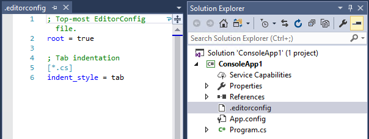

# Create portable, custom editor settings with EditorConfig
Text editor settings in Visual Studio apply to all projects of a given type. So, for example, if you change a C# text editor setting, that setting applies to *all* C# projects in Visual Studio. However, in some cases, you may need to use conventions that differ from your own personal editor preferences. [EditorConfig](http://editorconfig.org/) files enable you to do this by providing common text editor options on a per-project basis. EditorConfig settings, which are contained in an .editorconfig file added to your codebase, supersede global Visual Studio text editor settings. This means that you can tailor each codebase to use the text editor settings you prefer. No plug-in is required to use this functionality in Visual Studio.

## Coding consistency
Settings in EditorConfig files enable you to maintain consistent coding styles and settings for a language, such as indent style, tab width, end of line characters, encoding, and more, in a codebase regardless of the editor or IDE you use. For example, when coding in C#, if your codebase has a convention to prefer that indents always consist of five space characters, documents use UTF-8 encoding, and each line always ends with a CR/LF, you can configure an .editorconfig file to do that.

Coding conventions you use on your personal projects may differ from those used on your team's projects. For example, you might prefer that when you're coding, pressing the Tab key adds a TAB character. However, your team might prefer that indenting adds four space characters instead of a TAB character. EditorConfig files resolve this problem by enabling you to have a configuration for each scenario.

Because the settings are contained in a file in the codebase, they travel along with that codebase. As long as you open the code file in an EditorConfig-compliant editor, the text editor settings are implemented. For more information about EditorConfig files, see the [EditorConfig.org](http://editorconfig.org/) website. If you edit a lot of .editorconfig files, you may find the [EditorConfig Language Service](https://marketplace.visualstudio.com/items?itemName=MadsKristensen.EditorConfig) extension helpful.

## Override EditorConfig settings
When you add a .editorconfig file to a folder in your file hierarchy, its settings apply to all applicable files at that level and below. To override EditorConfig settings for a particular project or codebase and use different or overriding values than the top-level .editorconfig file, just add a .editorconfig file to the level you want to change.

The new .editorconfig file settings will apply to the level in which it is located and all its subfiles.

## Supported settings
The editor in Visual Studio supports the following values of the core set of EditorConfig options.
- indent_style
- indent_size
- tab_width
- end_of_line
- charset
- root
- [code style conventions](../ide/editorconfig-code-style-settings-reference.md)

EditorConfig settings are supported in all Visual Studio-supported languages except for XML.

## Example
Here is an example that shows the indent state of a C# code snippet before and after adding a .editorconfig file to the project. The **Tabs** setting in the **Options** dialog box for the Visual Studio text editor is set to produce space characters when you press the TAB key in your code.

As expected, pressing the TAB key on the next line indents the line by adding four additional white space characters.

We'll add the following to a new file called .editorconfig to the project. (The `[*.cs]` setting means that this change will apply only to .cs files in this project.)

Now, when you press the TAB key, you get Tab characters instead of spaces.

> [!NOTE]
>  Adding a .editorconfig file to your project or codebase will not convert the existing styles to the new ones, it will only apply to newly-added lines. If you remove a .editorconfig file from your project or codebase, you must reload the code file(s) for the editor settings to revert back to global settings. Any errors in .editorconfig files are reported in the Error window in Visual studio.

## Support EditorConfig for your language service

In most cases when you implement a Visual Studio language service, no additional work is needed to support EditorConfig universal properties. The core editor automatically discovers and reads the .editorconfig file when users open files, and it sets the appropriate text buffer and view options. However, some language services opt to use an appropriate contextual text view option rather than using global settings for items such as tabs and spaces when a user edits or formats text. In these cases, the language service must be updated to support EditorConfig files.

Following are the changes needed to update a language service to support EditorConfig files, by replacing a global language-specific option with a contextual option:

Replace:  

Microsoft.VisualStudio.TextManager.Interop.LANGPREFERENCES.fInsertTabs or Microsoft.VisualStudio.Package.LanguagePreferences.InsertTabs  

With:  

!textBufferOptions.GetOptionValue(DefaultOptions.ConvertTabsToSpacesOptionId) or
!textView.Options.GetOptionValue(DefaultOptions.ConvertTabsToSpacesOptionId)  

*****
Replace:  

Microsoft.VisualStudio.TextManager.Interop.LANGPREFERENCES.uIndentSize or Microsoft.VisualStudio.Package.LanguagePreferences.InsertTabs.IndentSize  

With:  

textBufferOptions.GetOptionValue(DefaultOptions. IndentSizeOptionId) or 
textView.Options.GetOptionValue(DefaultOptions. IndentSizeOptionId)  

*****
Replace:  

Microsoft.VisualStudio.TextManager.Interop.LANGPREFERENCES.uTabSize or Microsoft.VisualStudio.Package.LanguagePreferences.InsertTabs.TabSize  

With:  

textBufferOptions.GetOptionValue(DefaultOptions.TabSizeOptionId) or 
textView.Options.GetOptionValue(DefaultOptions.TabSizeOptionId)  

# See Also
[Create Portable Custom Editor Options with EditorConfig](create-portable-custom-editor-options.md)