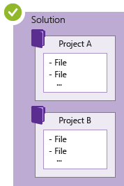
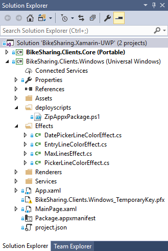
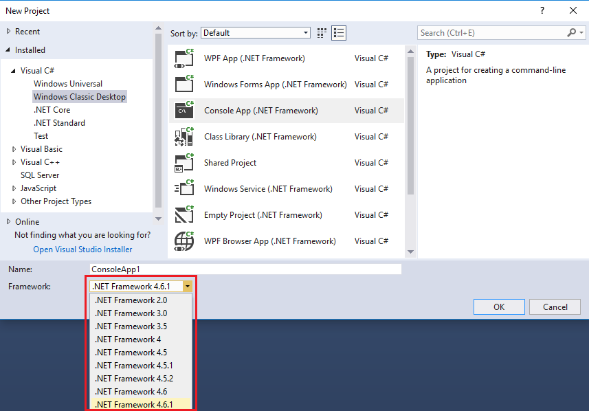

# Create, work with, and delete Visual Studio projects and solutions

In this article, you'll learn how to create and use Visual Studio projects from scratch to store the artifacts you need to build your apps.  If you aren't familiar with projects in Visual Studio, see this overview of [Projects and Solutions](solutions-and-projects-in-visual-studio.md).  To learn how to quickly create a project from a template, see [Create a project from a template](create-new-project.md).

*Projects* hold the items needed to build your app in Visual Studio, such as source code files, bitmaps, icons, and component and service references. When you create a new project, Visual Studio creates a *solution* to contain the project. You can then add other new or existing projects to the solution if you want. You can also create [blank or empty solutions](#create-empty-solutions). Solutions can also contain files that aren't connected to any specific project.

> [!NOTE]
> This topic applies to Visual Studio on Windows. For Visual Studio for Mac, see [Create projects in Visual Studio for Mac](/visualstudio/mac/create-new-projects).

You can view your solutions and projects in a tool window called **Solution Explorer**. The following screenshot shows an example solution in **Solution Explorer** (**BikeSharing.Xamarin-UWP**) that contains two projects: **BikeSharing.Clients.Core** and **BikeSharing.Clients.Windows**. Each project contains multiple files, folders, and references. The project name in bold is the *startup project*; that is, the project that starts when you run the app. You can specify which project is the startup project.

While you can construct a project yourself by adding the necessary files to it, Visual Studio offers a selection of project templates to give you a head start. Creating a new project from a template gives you a project with the essentials for that project type, and you can rename the files or add new or existing code and other resources to it as needed.

That being said, solutions and projects are not required to develop apps in Visual Studio. You can also just open code that you have cloned from Git or downloaded elsewhere. For more information, see [Develop code in Visual Studio without projects or solutions](../ide/develop-code-in-visual-studio-without-projects-or-solutions.md).

## Create a project from a project template

For information about how to select a template to create a new project, see [Create a new project in Visual Studio](create-new-project.md). And, for an example of a project and solution that's created from scratch, complete with step-by-step instructions and sample code, see [Introduction to projects and solutions](../get-started/tutorial-projects-solutions.md).

## Create a project from existing code files

If you have a collection of code source files, you can easily add them to a project.

1. On the menu, select **File** > **New** > **Project From Existing Code**.

1. In the **Create Project from Existing Code Files** wizard, select the project type you want in the **What type of project would you like to create?** drop-down list box, and then select the **Next** button.

1. In the wizard, browse to the location of the files and then enter a name for the new project in the **Name** box. When you are done, select the **Finish** button.

> [!NOTE]
> This option works best for a relatively simple collection of files. Currently, only C++, Apache Cordova, Visual Basic, and C# project types are supported.

## Add files to a solution

If you have a file that applies to multiple projects, such as a readme file for the solution, or other files that logically belong at the solution level rather than under a specific project, then you can add them to the solution itself. To add an item to a solution, on the context (right-click) menu of the solution node in **Solution Explorer**, select **Add** > **New Item**, or **Add** > **Existing Item**.

> [!TIP]
> A solution file is a structure for organizing projects in Visual Studio. It contains the state of that information in two files: an *.sln* (text-based, shared) file, and an *.suo* (binary, hidden, user-specific solution options) file. Thus, a solution isn't something that should be copied and renamed; instead, it's best to create a new solution and then add existing items to it.

## Create a .NET project that targets a specific version of the .NET Framework

When you create a .NET Framework project, you can specify a specific version of the .NET Framework that you want the project to use. (When you create a .NET Core project, you don't specify a framework version.)

::: moniker range="vs-2017"

To specify a .NET Framework version, select the **Framework** drop-down menu in the **New Project** dialog box.

> [!NOTE]
> You must have .NET Framework 3.5 installed on your system to access .NET Framework versions earlier than .NET Framework 4.

::: moniker-end

::: moniker range=">=vs-2019"

To specify a .NET Framework version, select the **Framework** drop-down menu on the **Create a new project** page.

::: moniker-end

## Create empty solutions

You can also create empty solutions that have no projects. This might be preferable in cases where you want to construct your solution and projects from scratch.

### To create an empty solution

1. On the menu bar, select **File** > **New** > **Project**.

::: moniker range="vs-2017"

2. In the left (**Templates**) pane, select **Other Project Types** > **Visual Studio Solutions** in the expanded list.

3. In the middle pane, select **Blank Solution**.

4. Enter **Name** and **Location** values for your solution, and then select **OK**.

::: moniker-end

::: moniker range=">=vs-2019"

2. On the **Create a new project** page, type **solution** into the search box.

3. Select the **Blank Solution** template, and then click **Next**.

4. Enter **Name** and **Location** values for your solution, and then select **Create**.

::: moniker-end

After you create an empty solution, you can add new or existing projects or items to it by choosing **Add New Item** or **Add Existing Item** on the **Project** menu.

As mentioned earlier, you can also open code files without needing a project or solution. To learn about developing code in this way, see [Develop code in Visual Studio without projects or solutions](../ide/develop-code-in-visual-studio-without-projects-or-solutions.md).

::: moniker range="vs-2017"

## Create a temporary project

(C# and Visual Basic only)

If you create a .NET-based project without specifying a disk location, it is a temporary project. Temporary projects enable you to experiment with .NET projects. At any time while you are working with a temporary project, you can choose to save it or discard it.

To create a temporary project, first go to **Tools** > **Options** > **Projects and Solutions** > **General**, and uncheck the **Save new projects when created** checkbox. Then open the **New Project** dialog box as usual.

::: moniker-end

## Delete a solution, project, or item

You can use the right-click context menu to either delete or remove solutions, projects, or items in Visual Studio, but that only removes them from the current solution or project.

To permanently delete a solution or other components from your system, use **File Explorer** in Windows to delete the folder that contains the *.sln* and *.suo* solution files. (Before you delete a solution, you might want to back up your projects and files in case you need them again.)

> [!NOTE]
> The *.suo* file is a hidden file that isn't displayed under the default File Explorer settings. To show hidden files, on the **View** menu in File Explorer, select the **Hidden Items** checkbox.

### Permanently delete a solution

You can access File Explorer in Windows by using Solution Explorer in Visual Studio. Here's how.

1. In **Solution Explorer**, on the right-click menu (context menu) of the solution you want to delete, select **Open folder in File Explorer**.

1. In File Explorer, navigate up one level.

1. Select the folder that contains the solution, and then press the **Delete** key.

## See also

- [Introduction to projects and solutions](../get-started/tutorial-projects-solutions.md)
- [Manage project and solution properties](managing-project-and-solution-properties.md)
- [Filtered solutions in Visual Studio](filtered-solutions.md)
- [Microsoft's open source repositories on GitHub](https://github.com/Microsoft)
- [Developer code samples](https://code.msdn.microsoft.com/)