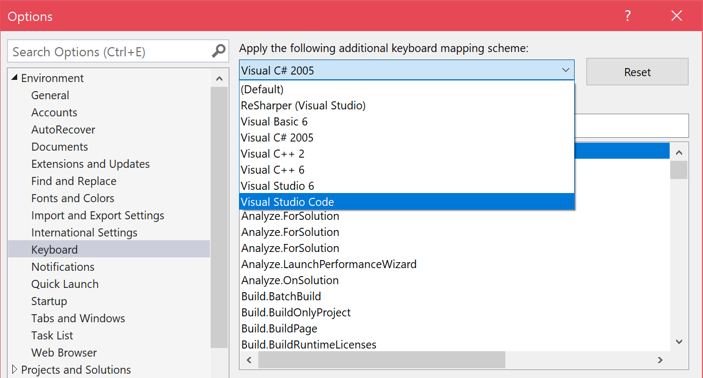
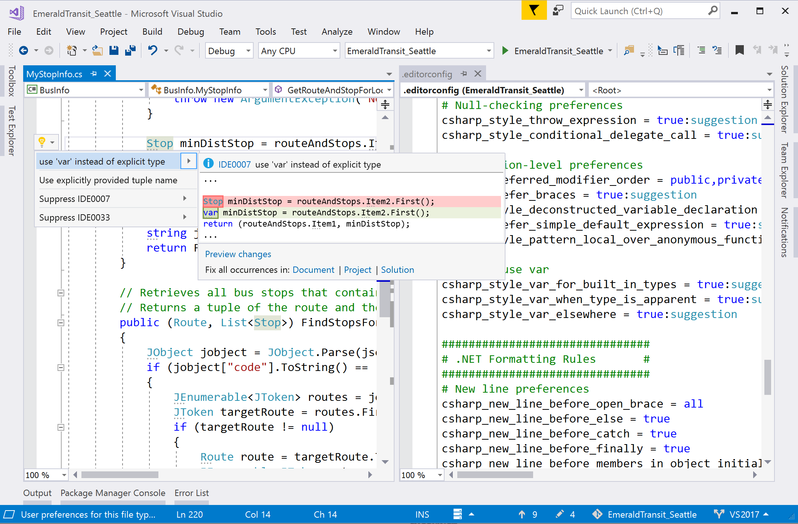
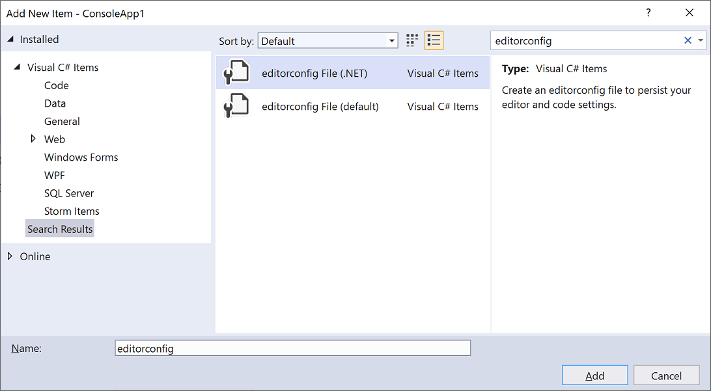
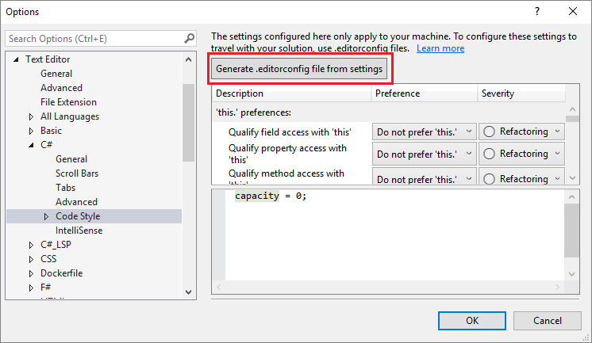
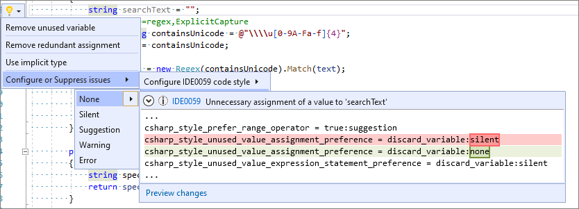
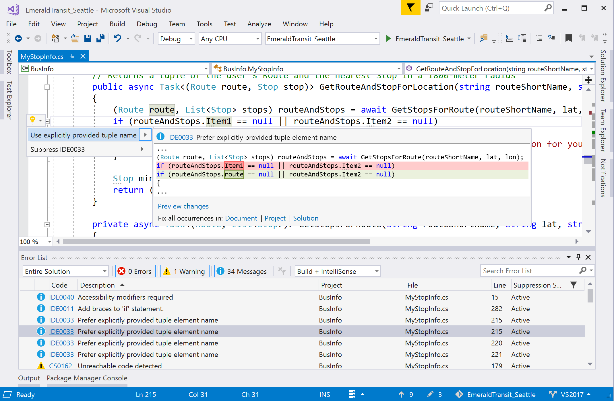
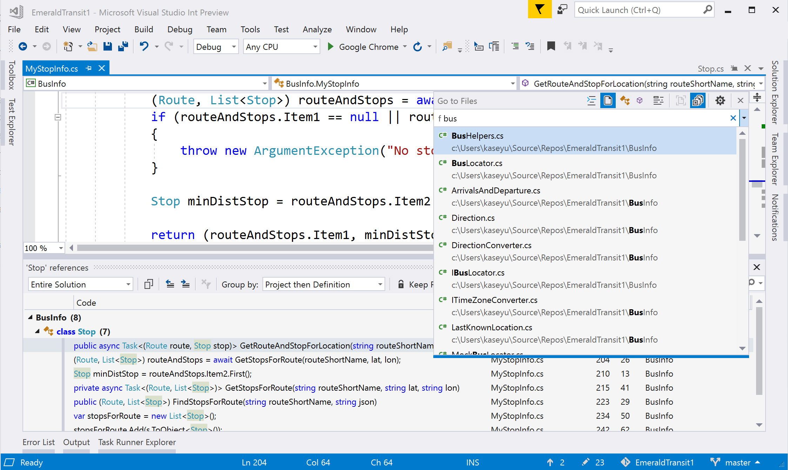
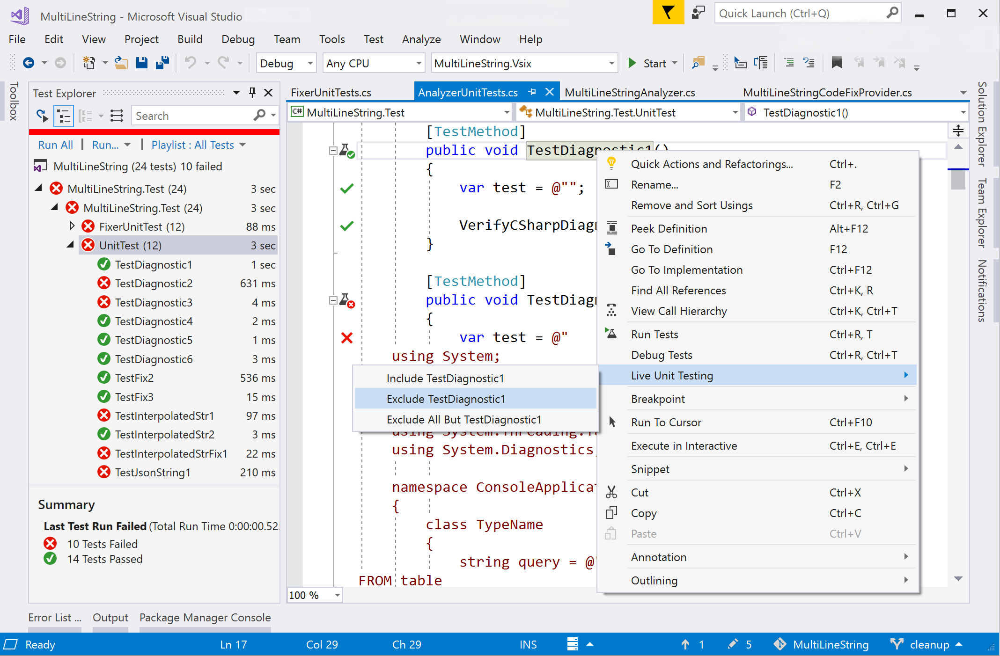
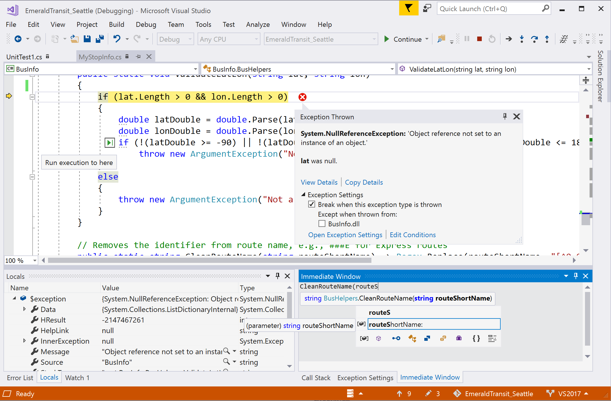

# Visual Studio productivity guide for C# developers

Learn how Visual Studio makes [.NET](/dotnet/fundamentals/) developers who use [C#](/dotnet/csharp/) more productive than ever. Take advantage of our performance and productivity improvements like navigation to decompiled assemblies, variable name suggestions as you type, a hierarchy-view in **Test Explorer**, Go To All (**Ctrl**+**T**) to navigate to file/type/member/symbol declarations, an intelligent **Exception Helper**, code style configuration and enforcement, and many refactorings and code fixes.

For general productivity for .NET, C++, and other languages, see [Productivity guide for Visual Studio](../ide/productivity-features.md). For information about helpful keyboard shortcuts, see [Productivity shortcuts](../ide/productivity-shortcuts.md). For a complete list of command shortcuts, see [Default keyboard shortcuts](../ide/default-keyboard-shortcuts-in-visual-studio.md).

## Use keyboard shortcuts from a different editor

If you're coming from another IDE or coding environment, you can change your keyboard scheme to *Visual Studio Code* or *ReSharper (Visual Studio)*:

::: moniker range="vs-2022"

:::image type="content" source="media/vs-2022/keyboard-schemes.png" alt-text="Screenshot of the keyboard schemes in Visual Studio 2022.":::

::: moniker-end

::: moniker range="vs-2019"

::: moniker-end

Some extensions also offer keyboard schemes:

- [HotKeys for Visual Studio (ReSharper/IntelliJ)](https://marketplace.visualstudio.com/items?itemName=JustinClareburtMSFT.HotKeys)
- [Emacs Emulation](https://marketplace.visualstudio.com/items?itemName=JustinClareburtMSFT.EmacsEmulation)
- [VSVim](https://marketplace.visualstudio.com/items?itemName=JaredParMSFT.VsVim)

The following are popular Visual Studio shortcuts:

| Shortcut (All Profiles) | Command | Description |
|-|-|-|
| **Ctrl**+**T** | Go To All | Navigate to any file, type, member, or symbol declaration |
| **F12** (also **Ctrl**+**Click**) | Go To Definition | Navigate to where a symbol is defined |
| **Ctrl**+**F12** | Go To Implementation | Navigate from a base type or member to its various implementations |
| **Shift**+**F12** | Find All References | See all symbol or literal references |
| **Alt**+**Home** | Go To Base | Navigate up the inheritance chain |
| **Ctrl**+**.** (also **Alt**+**Enter** in C# Profile) | Quick Actions and Refactorings | See what code fixes, code generation actions, refactorings, or other quick actions are available at your cursor position or code selection |
| **Ctrl**+**D** | Duplicate line | Duplicates the line of code that the cursor is in |
| **Shift**+**Alt**+**+**/**-** | Expand/Contract selection | Expands or contracts the current selection in the editor |
| **Shift** + **Alt** + **.** | Insert Next Matching Caret | Adds a selection and caret at the next location that matches the current selection |
| **Ctrl**+**Q** | Search | Search all Visual Studio settings |
| **F5** | Start Debugging | Start debugging your application |
| **Ctrl**+**F5** | Run without Debug | Run your application locally without debugging |
| **Ctrl**+**K**,**D** (Default Profile) or **Ctrl**+**E**,**D** (C# Profile) | Format Document | Cleans up formatting violations in your file based on your newline, spacing, and indentation settings |
| **Ctrl**+**\\**,**Ctrl**+**E** (Default Profile) or **Ctrl**+**W**,**E** (C# Profile) | View Error List | See all errors in your document, project, or solution |
| **Alt** + **PgUp/PgDn** | Go to Next/Previous Issue | Jump to the previous/next error, warning, suggestion in your document |
| **Ctrl**+**K**,**/** | Toggle single line comment/uncomment | This command adds or removes a single line comment depending on whether your selection is already commented |
| **Ctrl**+**Shift**+**/** | Toggle block comment/uncomment | This command adds or removes block comments depending on what you've selected |

> [!NOTE]
> Some extensions unbind the default Visual Studio keybindings. You can restore your keybindings to their defaults by going to **Tools** > **Import and Export Settings** > **Reset all settings** or **Tools** > **Options** > **Keyboard** > **Reset**.

For more information about keyboard shortcuts and commands, see [Productivity shortcuts](../ide/productivity-shortcuts.md). Or, see [Keyboard shortcuts in Visual Studio](default-keyboard-shortcuts-in-visual-studio.md) for a comprehensive list along with a downloadable cheat sheet.

## Navigate quickly to files or types

Visual Studio has a feature called **Go To All** that you can use to quickly jump to any file, type, member, or symbol declaration. To open it from the menu bar, select **Edit** > **Go To** > **Go To All**. Or, you can open it by using the **Ctrl**+**T** keyboard shortcut.

A small window is displayed at the top right of your code editor.

::: moniker range="vs-2022"

:::image type="content" source="media/vs-2022/go-to-all.png" alt-text="Screenshot of the Go To All window in Visual Studio.":::

::: moniker-end

::: moniker range="vs-2019"

::: moniker-end

You can use this feature to perform the following actions:

- Change the location of its search bar or turn off the live navigation preview by using the **gear** icon.
- Filter results by using syntax such as `t mytype`.
- Scope your search to just the current document.
- Camel case matching is supported.

For more information about **Go To All**, see [Find code by using Go To commands](go-to.md).

## Enforce code style rules

You can use an EditorConfig file to codify coding conventions and have them travel with your source.

::: moniker range="vs-2019"

::: moniker-end

- Add a default or .NET-style EditorConfig file to your project by choosing **Add** > **New Item** from the [Add context menu fly-out](use-solution-explorer.md#the-add-menu) in Solution Explorer. Then, in the **Add New Item** dialog box, search for "editorconfig". Select either of the **editorconfig File** item templates and then choose **Add**.

::: moniker range="vs-2022"

   :::image type="content" source="media/vs-2022/editorconfig-item-templates-csharp.png" alt-text="Screenshot of the EditorConfig file templates for C# in Visual Studio.":::

::: moniker-end

::: moniker range="vs-2019"

   

::: moniker-end

- Automatically create an *.editorconfig* file based on your code style settings in **Tools** > **Options** > **Text Editor** > **C#** > **Code Style**.

::: moniker range="vs-2022"

   :::image type="content" source="media/vs-2022/generate-editorconfig-file-csharp.png" alt-text="Screenshot that shows how to generate an .editorconfig file from settings in Visual Studio.":::

::: moniker-end

::: moniker range="vs-2019"

   

::: moniker-end

- The **code inference feature** of [IntelliCode](/visualstudio/intellicode/intellicode-visual-studio) for Visual Studio infers your code styles from existing code. It then creates a nonempty EditorConfig file with your code-style preferences already defined.

- Configure the severity level of a code style rule directly through the editor. If you don't have an .editorconfig file, Visual Studio generates one for you. Place your cursor on the error, warning, or suggestion and type **Ctrl**+**.** to open the **Quick Actions and Refactorings** menu. Select **Configure or Suppress issues**. Then select the rule and choose the severity level you would like to configure for that rule. This action updates your existing EditorConfig with the rule’s new severity.

::: moniker range="vs-2022"

   :::image type="content" source="media/vs-2022/configure-severity-level.png" alt-text="Screenshot of how to configure the severity of a code style rule from within the editor." lightbox="media/vs-2022/configure-severity-level.png":::

::: moniker-end

::: moniker range="vs-2019"

   

::: moniker-end

Check out the [.NET code-style rule options](/dotnet/fundamentals/code-analysis/code-style-rule-options) documentation, which also includes an example of a complete EditorConfig file.

## Code Cleanup

Visual Studio provides on-demand formatting of your code file, including code style preferences, through the **Code Cleanup** feature. To run Code Cleanup, select the broom icon at the bottom of the editor or press **Ctrl**+**K**, **Ctrl**+**E**.

::: moniker range="vs-2022"

:::image type="content" source="media/vs-2022/run-code-cleanup.png" alt-text="Screenshot of the Code Cleanup button and options.":::

::: moniker-end

::: moniker range="vs-2019"

::: moniker-end

You can also run code cleanup across your entire project or solution. Right-click the project or solution name in **Solution Explorer**, select **Analyze and Code Cleanup**, and then select **Run Code Cleanup**.

::: moniker range="vs-2022"

:::image type="content" source="media/vs-2022/run-analyze-code-cleanup-project-solution.png" alt-text="Screenshot of  how to run Analyze and Code Cleanup across an entire project or solution.":::

::: moniker-end

::: moniker range="vs-2019"

::: moniker-end

In addition to formatting your file for spaces, indents, et cetera, **Code Cleanup** also applies selected code styles. Your preferences for each code style are read from the [EditorConfig file](code-styles-and-code-cleanup.md#code-styles-in-editorconfig-files), if you have one for the project, or from the [code style settings](code-styles-and-code-cleanup.md#code-styles-in-the-options-dialog-box) in the **Options** dialog box.

## Refactorings and code fixes

Visual Studio comes with numerous refactorings, code generation actions, and code fixes. Red squiggles represent errors, green squiggles represent warnings, and three gray dots represent code suggestions. You can access code fixes by selecting the light bulb or screwdriver icon, or by pressing **Ctrl**+**.** or **Alt**+**Enter**. Each fix comes with a preview window that shows a live code diff of how the fix works.

Popular quick fixes and refactorings include:

- Rename
- Extract Method
- Change Method Signature
- Generate Constructor
- Generate Method
- Move Type to File
- Add Null-Check
- Add Parameter
- Remove Unnecessary Usings
- Foreach Loop to LINQ Query or to LINQ method
- Pull Members Up

For more information, see [code generation features](code-generation-in-visual-studio.md).

You can [install .NET analyzers](../code-quality/install-net-analyzers.md) to flag code issues. Or, write your own refactoring or code fix with [Roslyn analyzers](../code-quality/install-roslyn-analyzers.md).

Several community members have written free extensions that add more code inspections:

::: moniker range="vs-2022"

- [Roslynator](https://marketplace.visualstudio.com/items?itemName=josefpihrt.Roslynator2022)
- [SonarLint for Visual Studio](https://marketplace.visualstudio.com/items?itemName=SonarSource.SonarLintforVisualStudio2022)

::: moniker-end

::: moniker range="vs-2019"

- [Roslynator](https://marketplace.visualstudio.com/items?itemName=josefpihrt.Roslynator2019)
- [SonarLint for Visual Studio](https://marketplace.visualstudio.com/items?itemName=SonarSource.SonarLintforVisualStudio2019)
- [StyleCopAnalyzers](https://www.nuget.org/packages/stylecop.analyzers/)
- [CodeCracker](https://www.nuget.org/packages/codecracker.CSharp/)

::: moniker-end

## Find Usages, Go To Implementation, and Navigate To Decompiled Assemblies

Visual Studio has many features to help you search and [navigate your code](../ide/navigating-code.md).

| Feature | Shortcut | Details/Improvements |
|- | - | -|
| Find All References | **Shift**+**F12**| Results are colorized and can be grouped by project, definition, and reference type, such as read or write. You can also "lock" results. |
| Go To Implementation | **Ctrl**+**F12** | You can use Go To Definition on the `override` keyword to navigate to the overridden member |
| Go To Definition | **F12** or **Ctrl**+**Click**| Press **Ctrl** while clicking to navigate to definition |
| Peek Definition | **Alt**+**F12** | Inline view of a definition |
| Structure Visualizer | Gray, dotted-lines between braces | Hover to see your code structure |
| Navigation to decompiled assemblies | **F12** or **Ctrl**+**Click** | Navigate to external source (decompiled with ILSpy) by enabling the feature: **Tools** > **Options** > **Text Editor** > **C#** > **Advanced** > **Enable navigation to decompiled sources**. |

::: moniker range="vs-2019"

::: moniker-end

## Improved IntelliSense

Use [IntelliCode](/visualstudio/intellicode/intellicode-visual-studio) for Visual Studio to get context-aware code completions instead of just an alphabetical list. 

::: moniker range=">=vs-2022"
## AI assistance

If you're using [Copilot](../ide/visual-studio-github-copilot-install-and-states.md), get AI assistance to [help you write and debug code](../ide/ai-assisted-development-visual-studio.md#ai-capabilities-side-by-side).
::: moniker-end

## Unit testing

We've made numerous improvements to the testing experience. You can test with the [MSTest](../test/using-microsoft-visualstudio-testtools-unittesting-members-in-unit-tests.md) (MSTest v1 or MSTest v2), [NUnit](../test/getting-started-with-unit-testing.md), and [XUnit](../test/getting-started-with-unit-testing.md) test frameworks.

- **Test Explorer** test discovery is fast.

- Organize your tests in **Test Explorer** with *hierarchical sorting*.

::: moniker range="vs-2019"

   

::: moniker-end

- [Live unit testing](../test/live-unit-testing.md) continuously runs tests impacted by your code changes and updates inline editor icons to let you know the status of your tests. Include or exclude specific tests or test projects from your live test set. (Visual Studio Enterprise edition only.)

For more information, see [Unit test basics](../test/unit-test-basics.md).

## Debugging

Visual Studio includes the following debugging capabilities:

- The ability to search for a string within the **Watch**, **Autos**, and **Locals** windows.
- *Run to click*, which lets you hover next to a line of code, hit the green 'play' icon that appears, and run your program until it reaches that line.
- The [**Exception Helper**](../debugger/exception-helper.md), which puts the most important information at the top level in the dialog, for example, which variable is `null` in a `NullReferenceException`.
- [Step back debugging](../debugger/view-historical-application-state.md), which lets you go back to previous breakpoints or steps and view the state of the application as it was in the past.
- [Snapshot debugging](/azure/application-insights/app-insights-snapshot-debugger), which lets you investigate the state of a live web application at the moment an exception was thrown (must be on Azure).

::: moniker range="vs-2022"

:::image type="content" source="../debugger/media/debugger-exception-helper-locerror.png" alt-text="Screenshot of the Exception Helper next to a line of code.":::

::: moniker-end

::: moniker range="vs-2019"

::: moniker-end

## Version control

::: moniker range="vs-2022"

In Visual Studio 2022, you can use Git directly from the IDE to create, review, check out, and run pull requests. To learn more, see [How Visual Studio makes version control easy with Git](../version-control/git-with-visual-studio.md?view=vs-2022&preserve-view=true).

::: moniker-end

::: moniker range="vs-2019"

You can use [Git](../version-control/git-with-visual-studio.md) or TFVC to store and update your code in Visual Studio.

- In Visual Studio 2019 version 16.8 and later, you can use [Git](../version-control/git-team-explorer-feature-comparison.md) from directly within the IDE to create, review, check out, and run pull requests.

- In Visual Studio 2019 version 16.7 and earlier, install the [Pull requests for Visual Studio](https://marketplace.visualstudio.com/items?itemName=vsideversioncontrolmsft.pr4vs) extension to create, review, check out, and run pull requests without leaving Visual Studio.

   - Organize your local changes in [Team Explorer](reference/team-explorer-reference.md) and use the status bar to track pending commits and changes.

   - Set up continuous integration and delivery for your ASP.NET projects inside of Visual Studio with the [Continuous delivery tools for Visual Studio](https://marketplace.visualstudio.com/items?itemName=VSIDEDevOpsMSFT.ContinuousDeliveryToolsforVisualStudio) extension.

    

::: moniker-end

## What other features should I know about?

Here's a list of editor and productivity features to make writing code more efficient. Some features might need to be enabled because they're off by default.

| Feature | Details | How to enable |
|-|-|-|
| Locate File in Solution Explorer | Highlights the active file in **Solution Explorer** | **Tools** > **Options** > **Projects and Solutions** > **Track Active Item in Solution Explorer** |
| Add usings for types in reference assemblies and NuGet packages | Shows an error light bulb with a code fix to install a NuGet package for an unreferenced type | **Tools** > **Options** > **Text Editor** > **C#** > **Advanced** > **Suggest usings for types in reference assemblies** and **Suggest usings for types in NuGet packages** |
| Enable full solution analysis | See all errors in your solution in the **Error List** | **Tools** > **Options** > **Text Editor** > **C#** > **Advanced** > **Enable full solution analysis** |
| Enable navigation to decompiled sources | Allow Go To Definition on types/members from external sources and use the ILSpy decompiler to show method bodies | **Tools** > **Options** > **Text Editor** > **C#** > **Advanced** > **Enable navigation to decompiled sources** |
| Completion/Suggestion Mode | Changes the completion behavior in [IntelliSense](using-intellisense.md). Developers with IntelliJ backgrounds tend to use a nondefault setting here. | **Edit** > **IntelliSense** > **Toggle Completion Mode** (or press **Ctrl**+**Alt**+**Space** in the editor) |
| [CodeLens](../ide/find-code-changes-and-other-history-with-codelens.md) | Displays code reference information and change history in the editor. (Source control CodeLens indicators aren't available in Visual Studio Community edition.) | **Tools** > **Options** > **Text Editor** > **All Languages** > **CodeLens** |
| [Code snippets](../ide/visual-csharp-code-snippets.md) | Help stub out common boilerplate code | Type a snippet name and press **Tab** twice. |
| [Paste JSON or XML as classes](reference/paste-json-xml.md) | Copy any JSON or XML text fragment to the clipboard and paste it as strongly typed .NET classes into any C# code file. | **Edit** > **Paste Special** > **Paste JSON As Classes** (or **Paste XML As Classes**) |
| [Copy and trim indentation](writing-code-in-the-code-and-text-editor.md#copy-and-paste-code) | Copy code from Visual Studio to another program (Outlook, Teams, etc.), without having to manually fix indentation after you paste your code. Available in Visual Studio 2022 [version 17.7](/visualstudio/releases/2022/release-notes) and later. |

## Related content

- [.NET C# documentation](/dotnet/csharp/)
- [Working with C# in VS Code](https://code.visualstudio.com/docs/languages/csharp)
