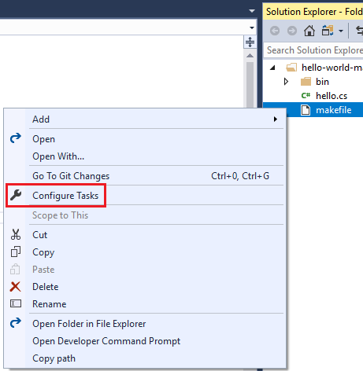
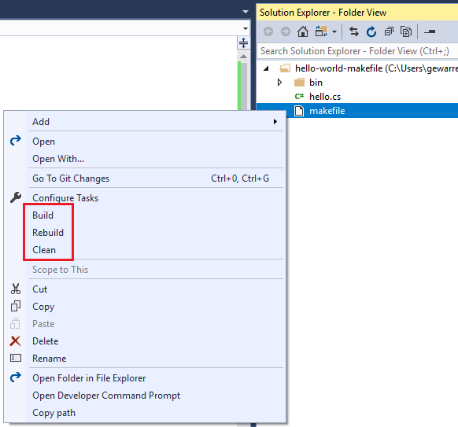
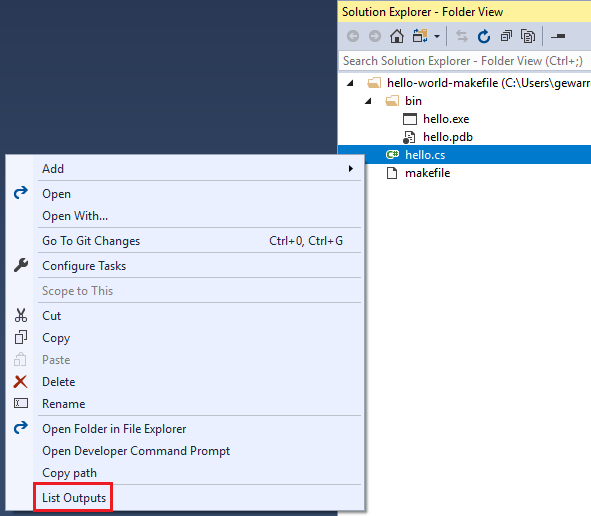
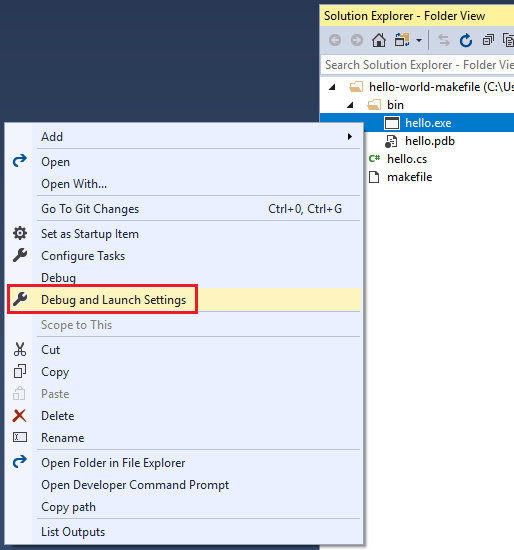
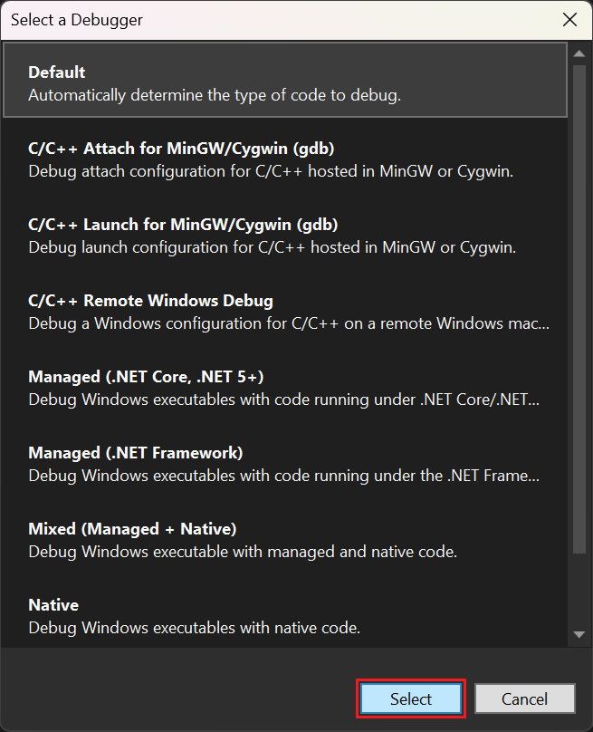
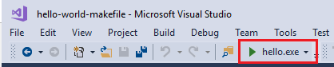
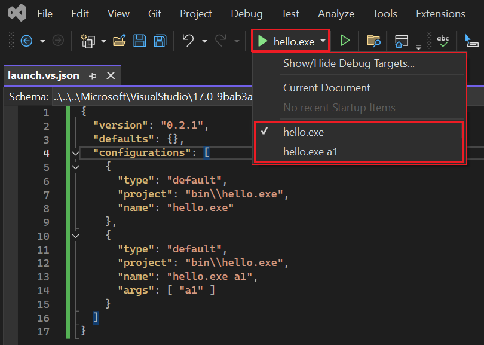

# Customize build and debug tasks for "Open Folder" development

Visual Studio knows how to run many different languages and codebases, but it doesn't know how to run everything. If you [opened a code folder](../ide/develop-code-in-visual-studio-without-projects-or-solutions.md) in Visual Studio, and Visual Studio knows how to run your code, you can run it right away without any additional configuration.

If the codebase uses custom build tools that Visual Studio doesn't recognize, you need to provide some configuration details to run and debug the code in Visual Studio. You instruct Visual Studio how to build your code by defining *build tasks*. You can create one or more build tasks to specify all the items a language needs to build and run its code. You can also create arbitrary tasks that can do nearly anything you want. For example, you can create a task to list the contents of a folder or to rename a file.

Customize your project-less codebase by using the following *.json* files:

|File name|Purpose|
|-|-|
|*tasks.vs.json*|Specify custom build commands and compiler switches, and arbitrary (non-build related) tasks.<br>Accessed via the **Solution Explorer** right-click menu item **Configure Tasks**.|
|*launch.vs.json*|Specify command-line arguments for debugging.<br>Accessed via the **Solution Explorer** right-click menu item **Debug and Launch Settings**.|

These *.json* files are located in a hidden folder called *.vs* in the root folder of your codebase. The *tasks.vs.json* and *launch.vs.json* files are created by Visual Studio on an as-needed basis when you choose either **Configure Tasks** or **Debug and Launch Settings** on a file or folder in **Solution Explorer**. These *.json* files are hidden because users generally don't want to check them into source control. However, if you want to be able to check them into source control, drag the files into the root of your codebase, where they are visible.

> [!TIP]
> To view hidden files in Visual Studio, choose the **Show All Files** button on the **Solution Explorer** toolbar.

## Define tasks with tasks.vs.json

You can automate build scripts or any other external operations on the files you have in your current workspace by running them as tasks directly in the IDE. You can configure a new task by right-clicking on a file or folder and selecting **Configure Tasks**.



This creates (or opens) the *tasks.vs.json* file in the *.vs* folder. You can define a build task or arbitrary task in this file, and then invoke it using the name you gave it from the **Solution Explorer** right-click menu.

Custom tasks can be added to individual files, or to all files of a specific type. For instance, NuGet package files can be configured to have a "Restore Packages" task, or all source files can be configured to have a static analysis task, such as a linter for all *.js* files.

### Define custom build tasks

If your codebase uses custom build tools that Visual Studio doesn't recognize, then you cannot run and debug the code in Visual Studio until you complete some configuration steps. Visual Studio provides *build tasks* where you can tell Visual Studio how to build, rebuild, and clean your code. The *tasks.vs.json* build task file couples the Visual Studio inner development loop to the custom build tools used by your codebase.

Consider a codebase that consists of a single C# file called *hello.cs*. The *makefile* for such a codebase might look like this:

<!-- markdownlint-disable MD010 -->
```makefile
build: directory hello.exe

hello.exe: hello.cs
	csc -debug hello.cs /out:bin\hello.exe

clean:
	del bin\hello.exe bin\hello.pdb

rebuild: clean build

directory: bin

bin:
	md bin
```
<!-- markdownlint-enable MD010 -->

For such a *makefile* that contains build, clean, and rebuild targets, you can define the following *tasks.vs.json* file. It contains three build tasks for building, rebuilding, and cleaning the codebase, using NMAKE as the build tool.

```json
{
  "version": "0.2.1",
  "outDir": "\"${workspaceRoot}\\bin\"",
  "tasks": [
    {
      "taskName": "makefile-build",
      "appliesTo": "makefile",
      "type": "launch",
      "contextType": "build",
      "command": "nmake",
      "args": [ "build" ],
      "envVars": {
        "VSCMD_START_DIR": "\"${workspaceRoot}\""
      }
    },
    {
      "taskName": "makefile-clean",
      "appliesTo": "makefile",
      "type": "launch",
      "contextType": "clean",
      "command": "nmake",
      "args": [ "clean" ],
      "envVars": {
        "VSCMD_START_DIR": "\"${workspaceRoot}\""
      }
    },
    {
      "taskName": "makefile-rebuild",
      "appliesTo": "makefile",
      "type": "launch",
      "contextType": "rebuild",
      "command": "nmake",
      "args": [ "rebuild" ],
      "envVars": {
        "VSCMD_START_DIR": "\"${workspaceRoot}\""
      }
    }
  ]
}
```

After you define build tasks in *tasks.vs.json*, additional right-click menu (context menu) items are added to the corresponding files in **Solution Explorer**. For this example, "build", "rebuild", and "clean" options are added to the context menu of any *makefile* files.



> [!NOTE]
> The commands appear in the context menu under the **Configure Tasks** command due to their `contextType` settings. "build", "rebuild", and "clean" are build commands, so they appear in the build section in the middle of the context menu.

When you select one of these options, the task executes. Output appears in the **Output** window, and build errors appear in the **Error List**.

### Define arbitrary tasks

You can define arbitrary tasks in the *tasks.vs.json* file, to do just about anything you want. For example, you can define a task to display the name of the currently selected file in the **Output** window, or to list the files in a specified directory.

The following example shows a *tasks.vs.json* file that defines a single task. When invoked, the task displays the filename of the currently selected *.js* file.

```json
{
  "version": "0.2.1",
  "tasks": [
    {
      "taskName": "Echo filename",
      "appliesTo": "*.js",
      "type": "default",
      "command": "${env.COMSPEC}",
      "args": [ "echo ${file}" ]
    }
  ]
}
```

- `taskName` specifies the name that appears in the right-click menu.
- `appliesTo` specifies which files the command can be performed on.
- The `command` property specifies the command to invoke. In this example, the `COMSPEC` environment variable is used to identify the command line interpreter, typically *cmd.exe*.
- The `args` property specifies the arguments to be passed to the invoked command.
- The `${file}` macro retrieves the selected file in **Solution Explorer**.

After saving *tasks.vs.json*, you can right-click on any *.js* file in the folder and choose **Echo filename**. The file name is displayed in the **Output** window.

> [!NOTE]
> If your codebase doesn't contain a *tasks.vs.json* file, you can create one by choosing **Configure Tasks** from the right-click or context menu of a file in **Solution Explorer**.

The next example defines a task that lists the files and subfolders of the *bin* directory.

```json
{
  "version": "0.2.1",
  "outDir": "\"${workspaceRoot}\\bin\"",
  "tasks": [
    {
      "taskName": "List Outputs",
      "appliesTo": "*",
      "type": "default",
      "command": "${env.COMSPEC}",
      "args": [ "dir ${outDir}" ]
    }
  ]
}
```

- `${outDir}` is a custom macro that is first defined before the `tasks` block. It is then called in the `args` property.

This task applies to all files. When you open the context menu on any file in **Solution Explorer**, the task's name **List Outputs** appears at the bottom of the menu. When you choose **List Outputs**, the contents of the *bin* directory are listed in the **Output** window in Visual Studio.



### Settings scope

Multiple *tasks.vs.json* files can exist at the root and subdirectories of a codebase. This design enables the flexibility to have different behavior in different subdirectories of the codebase. Visual Studio aggregates or overrides settings throughout the codebase, prioritizing files in the following order:

- Settings files in the root folder’s *.vs* directory.
- The directory where a setting is being computed.
- The current directory’s parent directory, all the way up to the root directory.
- Settings files in the root directory.

These aggregation rules apply to *tasks.vs.json*. For information on how settings in other file are aggregated, see the corresponding section for that file in this article.

### Properties for tasks.vs.json

This section describes some of the properties you can specify in *tasks.vs.json*.

#### appliesTo

You can create tasks for any file or folder by specifying its name in the `appliesTo` field, for example `"appliesTo": "hello.js"`. The following file masks can be used as values:

|||
|-|-|
|`"*"`| task is available to all files and folders in the workspace|
|`"*/"`| task is available to all folders in the workspace|
|`"*.js"`| task is available to all files with the extension *.js* in the workspace|
|`"/*.js"`| task is available to all files with the extension *.js* in the root of the workspace|
|`"src/*/"`| task is available to all subfolders of the *src* folder|
|`"makefile"`| task is available to all *makefile* files in the workspace|
|`"/makefile"`| task is available only to the *makefile* in the root of the workspace|

#### Macros for tasks.vs.json

|||
|-|-|
|`${env.<VARIABLE>}`| Specifies any environment variable (for example,  ${env.PATH}, ${env.COMSPEC} and so on) that is set for the developer command prompt. For more information, see [Developer command prompt for Visual Studio](/dotnet/framework/tools/developer-command-prompt-for-vs).|
|`${workspaceRoot}`| The full path to the workspace folder (for example, *C:\sources\hello*)|
|`${file}`| The full path of the file or folder selected to run this task against (for example, *C:\sources\hello\src\hello.js*)|
|`${relativeFile}`| The relative path to the file or folder (for example, *src\hello.js*)|
|`${fileBasename}`| The name of the file without path or extension (for example, *hello*)|
|`${fileDirname}`| The full path to the file, excluding the filename (for example, *C:\sources\hello\src*)|
|`${fileExtname}`| The extension of the selected file (for example,  *.js*)|

## Configure debugging with launch.vs.json

1. To configure your codebase for debugging, in **Solution Explorer** choose the **Debug and Launch Settings** menu item from the right-click or context menu of your executable file.

   

1. In the **Select a Debugger** dialog box, choose an option, and then choose the **Select** button.

   

   If the *launch.vs.json* file doesn't already exist, it is created.

   ```json
   {
     "version": "0.2.1",
     "defaults": {},
     "configurations": [
       {
         "type": "default",
         "project": "bin\\hello.exe",
         "name": "hello.exe"
       }
     ]
   }
   ```

1. Next, right-click on the executable file in **Solution Explorer**, and choose **Set as Startup Item**.

   The executable is designated as the startup item for your codebase, and the debugging **Start** button's title changes to reflect the name of your executable.

   

   When you choose **F5**, the debugger launches and stops at any breakpoint you may have already set. All the familiar debugger windows are available and functional.

   > [!IMPORTANT]
   > For additional details about custom build and debug tasks in C++ open folder projects, see [Open Folder support for C++ build systems in Visual Studio](/cpp/build/open-folder-projects-cpp).

### Specify arguments for debugging

You can specify command-line arguments to pass in for debugging in the *launch.vs.json* file. Add the arguments in the `args` array, as shown in the following example:

```json
{
  "version": "0.2.1",
  "defaults": {},
  "configurations": [
    {
      "type": "default",
      "project": "bin\\hello.exe",
      "name": "hello.exe"
    },
    {
      "type": "default",
      "project": "bin\\hello.exe",
      "name": "hello.exe a1",
      "args": [ "a1" ]
    }
  ]
}
```

When you save this file, the name of the new configuration appears in the debug target drop-down list, and you can select it to start the debugger. You can create as many debug configurations as you like.



> [!NOTE]
> The `configurations` array property in *launch.vs.json* is read from two file locations&mdash;the root directory for the codebase, and the *.vs* directory. If there is a conflict, priority is given to the value in *.vs\launch.vs.json*.

## Additional settings files

In addition to the three *.json* files described in this topic, Visual Studio also reads settings from some additional files, if they exist in your codebase.

### .vscode\settings.json

Visual Studio reads limited settings from a file named *settings.json*, if it is in a directory named *.vscode*. This functionality is provided for codebases that have previously been developed in Visual Studio Code. Currently, the only setting that is read from *.vscode\settings.json* is `files.exclude`, which filters files visually in Solution Explorer and from some search tools.

You can have any number of *.vscode\settings.json* files in your codebase. Settings read from this file are applied to the parent directory of *.vscode* and all of its subdirectories.

### .gitignore

*.gitignore* files are used to tell Git which files to ignore; that is, which files and directories you don't want to check in. *.gitignore* files are usually included as part of a codebase so that the settings can be shared with all developers of the codebase. Visual Studio reads patterns in *.gitignore* files to filter items visually and from some search tools.

Settings read from the *.gitignore* file are applied to its parent directory and all subdirectories.

## See also

- [Develop code without projects or solutions](../ide/develop-code-in-visual-studio-without-projects-or-solutions.md)
- [Open Folder projects for C++](/cpp/build/open-folder-projects-cpp)
- [CMake projects for C++](/cpp/build/cmake-projects-in-visual-studio)
- [NMAKE reference](/cpp/build/reference/nmake-reference)
- [Features of the code editor](../ide/writing-code-in-the-code-and-text-editor.md)
