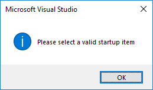

# Develop code in Visual Studio without projects or solutions

In Visual Studio 2017, you can open code from nearly any type of directory-based project into Visual Studio without the need for a solution or project file. This means you can, for example, find a code project on Git, clone it, and then open it directly into Visual Studio and begin developing, without having to create a solution or project. If needed, you can specify custom build tasks and launch parameters through simple JSON files.

After you open your code files in Visual Studio, Solution Explorer displays all the files in the folder. You can click on any file to begin editing it. In the background, Visual Studio starts indexing the files to enable IntelliSense, navigation, and refactoring features. As you edit, create, move, or delete files, Visual Studio tracks the changes automatically and continuously updates its IntelliSense index. Code will appear with syntax colorization and, in many cases, include basic IntelliSense statement completion.

If Visual Studio knows how to run your code, you don't need to configure anything to run and debug it.

If you try to run your code but Visual Studio doesn't know how to run it, a dialog box prompts you to designate a file as the startup item.

- If your code folder contains a Visual Studio project, you can designate the project as the startup item.

   

   The **Start** button's text changes to reflect that the project is the startup item.

   

- If your codebase uses custom build tools, then you must tell Visual Studio how to build your code using *build tasks* that are defined in a *.json* file. For more information, see [Customize build and debug tasks](../ide/customize-build-and-debug-tasks-in-visual-studio.md).

- If your codebase contains Python or JavaScript code, you don't have to configure any *.json* files, but you do have to install the corresponding workload. You must also [configure the startup script](#to-debug-nodejs-and-python-code).

- For information about opening C++ code without solutions or projects in Visual Studio, see [Open Folder projects for C++](/cpp/ide/non-msbuild-projects).

## Open any code

You can open code into Visual Studio in any of the following ways:

- On the Visual Studio menu bar, choose **File** > **Open** > **Folder**, and then browse to the code location.
- On the context (right-click) menu of a folder containing code, choose the **Open in Visual Studio** command.
- Choose the **Open Folder** link on the Visual Studio Start Page.
- If you are a keyboard user, press **Ctrl**+**Shift**+**Alt**+**O** in Visual Studio.
- Open code from a cloned GitHub repo.

### To open code from a cloned GitHub repo

The following example shows how to clone a GitHub repo and then open its code in Visual Studio. To follow this procedure, you must have a GitHub account and Git for Windows installed on your system. See [Signing up for a new GitHub account](https://help.github.com/articles/signing-up-for-a-new-github-account/) and [Git for Windows](https://git-for-windows.github.io/) for more information.

1. Go to the repo you want to clone on GitHub.

1. Choose the **Clone or Download** button and then choose the **Copy to Clipboard** button in the dropdown menu to copy the secure URL for the GitHub repo.

   

1. In Visual Studio, choose the **Team Explorer** tab to open Team Explorer. If you don't see the tab, open it from **View** > **Team Explorer**.

1. In Team Explorer, under the **Local Git Repositories** section, choose the **Clone** command and then paste the URL of the GitHub page into the text box.

   

1. Choose the **Clone** button to clone the project's files to a local Git repository. Depending on the size of the repo, this process could take several minutes.

1. After the repo has been cloned to your system, in Team Explorer, choose the **Open** command on the context (right-click) menu of the newly cloned repo.

   

1. Choose the **Show Folder View** command to view the files in Solution Explorer

   

   You can now browse folders and files in the cloned repo, and view and search the code in the Visual Studio code editor, complete with syntax colorization and other features.

|         |         |
|---------|---------|
|  |    [Watch a video](https://mva.microsoft.com/en-us/training-courses/getting-started-with-visual-studio-2017-17798?l=lp3TOKD6D_6711787171) on how to clone and open code from a GitHub repo in Visual Studio. |

## Debug your code

You can debug your code in Visual Studio without a project or solution. To debug some languages, you may need to specify a valid *startup file* in the code project, such as a script, executable, or project. The drop-down list box next to the **Start** button on the toolbar lists all of the startup items that Visual Studio detects, as well as items you specifically designate. Visual Studio runs this code first when you debug your code.

Visual Studio automatically recognizes projects, but scripts (such as Python and JavaScript) need to be explicitly selected by you as a startup item before they will appear in the list. In addition, some startup items, such as MSBuild and CMake, can have multiple build configurations that appear in the **Start** button's drop-down list.

Visual Studio currently supports debugging (without using projects and solutions) for the following types of code:

- MSBuild-based codebases (C#, VB, C++)
- Any executable that has associated program database (.pdb) files

For information about configuring debugging in codebases that Visual Studio doesn't know how to run, see [Customize build and debug tasks](../ide/customize-build-and-debug-tasks-in-visual-studio.md).

### To debug Node.js and Python code

1. Install the [Node.js development](https://www.visualstudio.com/vs/node-js/) or [Python development](https://www.visualstudio.com/vs/python/) workload by choosing **Tools** > **Get Tools and Features...**, or by closing Visual Studio and running the Visual Studio Installer.

   

1. In **Solution Explorer**, on the right-click or context menu of a JavaScript or Python file, choose the **Set as Startup Item** command.

1. Choose the **F5** key to begin debugging.

### To debug MSBuild-based codebases or executable files

1. On the Visual Studio menu, choose **Debug**. On the drop-down menu, choose the file that you want to use as the startup item.

1. Choose the **F5** key to begin debugging.

> [!NOTE]
> For C++ and CMake codebases, you must have the **Desktop development with C++** workload installed. For C# and Visual Basic codebases, you must have the **.NET desktop development** workload installed.

## See also

- [Customize build and debug tasks](../ide/customize-build-and-debug-tasks-in-visual-studio.md)
- [Open Folder projects for C++](/cpp/ide/non-msbuild-projects)
- [CMake projects in C++](/cpp/ide/cmake-tools-for-visual-cpp)
- [Writing code in the code and text editor](../ide/writing-code-in-the-code-and-text-editor.md)
