# Develop code in Visual Studio without projects or solutions

In Visual Studio 2017, you can open code from nearly any type of directory-based project into Visual Studio without the need for a solution or project file. This means you can, for example, find a code project on Git, clone it, and then open it directly into Visual Studio and begin developing without having to create a solution or project.  

Not only can you edit the code and build it in Visual Studio, you can also navigate through your code (such as by using the Navigate To command). Code will appear with syntax colorization and, in many cases, include basic statement completion and debugging, complete with breakpoints. Some languages will include even more functionality. See [Create portable, custom editor settings](create-portable-custom-editor-options.md) for more information.  

## Open code anywhere

You can open code into Visual Studio in the following ways:  

- On the Visual Studio menu bar, choose **File**, **Open**, **Folder**, then browse to the code location.  

- On the context (right-click) menu of a folder containing code, choose the **Open in Visual Studio** command.  

- Choose the **Open Folder** link on the Visual Studio Start Page.  

- Open code cloned from a GitHub repo.  

### To open code from a cloned GitHub repo

The following example shows how to clone a GitHub repo and then open its code in Visual Studio. To follow this procedure, you must have a GitHub account and Git for Windows installed on your system. See [Signing up for a new GitHub account](https://help.github.com/articles/signing-up-for-a-new-github-account/) and [Git for Windows](https://git-for-windows.github.io/) for more information.  

1. Go to the repo you want to clone on GitHub.  

1. Choose the **Clone or Download** button and then choose the **Copy to Clipboard** button in the dropdown menu to copy the secure URL for the GitHub repo.  

  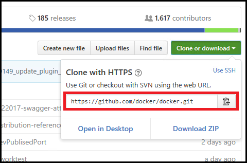

    > [!NOTE]
    >  While you also have the option to open the project on your desktop or download a .zip file of the project, this example demonstrates how to clone the repo using the secure URL method.

1. In Visual Studio, choose the **Team Explorer** tab to open Team Explorer.  

1. In Team Explorer, under the **Local Git Repositories** section, choose the **Clone** command and then paste the URL of the GitHub page into the text box.  

  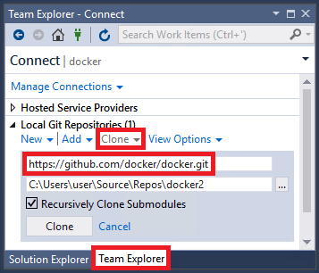

1. Choose the **Clone** button to clone the project's files to a local Git repository. Depending on the size of the repo, this process could take several minutes.  

1. After the repo has been cloned to your system, in Team Explorer, choose the **Open** command on the context (right-click) menu of the newly cloned repo.  

  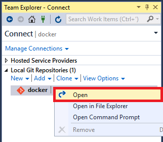

1. Choose the **Show Folder View** command to view the files in Solution Explorer  

  

  You can now browse folders and files in the cloned repo, and view and search the code in the Visual Studio code editor, complete with syntax colorization and other features.

    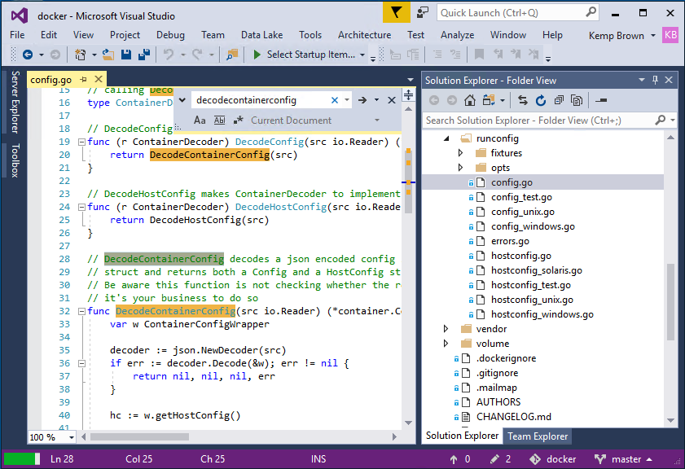  

|         |         |
|---------|---------|
|    |    [Watch a video](https://mva.microsoft.com/en-us/training-courses/getting-started-with-visual-studio-2017-17798?l=lp3TOKD6D_6711787171) on how to clone and open code from a GitHub repo in Visual Studio. |

## Debug your code

You can debug your code in Visual Studio without a project or solution. To debug some languages, you may need to specify a valid *startup file* in the code project, such as a script, executable, or project. Visual Studio runs this specified code first when you debug your code.  

The drop-down list box next to the Start button on the toolbar lists all of the startup items that Visual Studio detects, as well as items you specifically choose in a folder.  

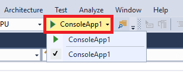  

Visual Studio automatically recognizes projects, but scripts (such as Python and JavaScript) need to be explicitly selected by you as a startup item before they will appear in the list. In addition, some startup items, such as MSBuild and CMake, can have multiple build configurations which appear in the Run Button's drop down list.  

Visual Studio currently supports debugging for the following languages:  

- Node.js  

- Python  

- MSBuild-based projects (C#, VB, C++)  

- Any executable with PDB (Python Debugger) files.  

### To debug Node.js and Python:

1. Install Node.js or Python Tools or Visual Studio 2017 and the Node.js runtime.  

1. On the context menu of a JavaScript file in Solution Explorer, choose the **Set as Startup Item** command.  

1. Choose the **F5** key to begin debugging.  

### To debug MSBuild projects

1. On the Visual Studio menu, choose **Debug**. On the drop-down menu, choose the project or select the project or file that you want to display as the startup item in Solution Explorer.  

1. Choose the **F5** key to begin debugging.  

### To debug executable files

1. On the Visual Studio menu, choose **Debug**. On the drop-down menu, choose the project or select the project or file that you want to display as the startup item in Solution Explorer.  

1. Choose the **F5** key to begin debugging.  

## Enable custom build tools

Visual Studio knows how to run many different languages, but it doesn't know how to run everything. If Visual Studio knows how to run your language, you can run the code right away. If you try to run your code but Visual Studio doesn't know how to run it, an information bar prompts you to designate a file in your codebase to act as the startup item.  

If the codebase uses custom build tools that Visual Studio doesn't recognize, though, then you will likely not be able to run and debug the code in Visual Studio until you complete some additional steps. You must specify a valid executable file type, such as a compiler, along with any custom parameters and arguments required by the language. To enable this, Visual Studio provides *build tasks*. You can create a build task to specify all the items a language needs to build and run its code.  

You can also create arbitrary build tasks that can do nearly anything you want. For example, you can create a task to list the contents of a folder or rename a file. Or, you can create more targeted custom build tasks that do things such as compile and build your project using specific arguments. The following steps show how to create both types of build tasks.  

#### To create an arbitrary build task

1. Choose the file or folder of the project in Solution explorer where you want the task, and on the file or folder's context (right-click) menu, choose **Configure Tasks**.  

  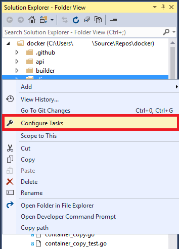

  Choosing **Configure Tasks** opens a file called tasks.vs.json. If this file doesn't exist, it is created. This file contains the build tasks for the selected file or folder.  

  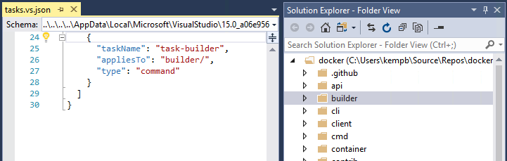

1. Add the following build task to tasks.vs.json. For this example, we'll add a simple task called "List outputs" that lists files and subfolders of the selected folder in the Output window. (The new task should be added within the existing "tasks" array.)  

  ```xml
      {
        "taskName": "List outputs",
        "appliesTo": "*",
        "type": "command",
        "command": "${env.COMSPEC}",
        "args": [
          "dir ${outDir}"
        ]
      },
  ```
  The complete build task should look like this.  

  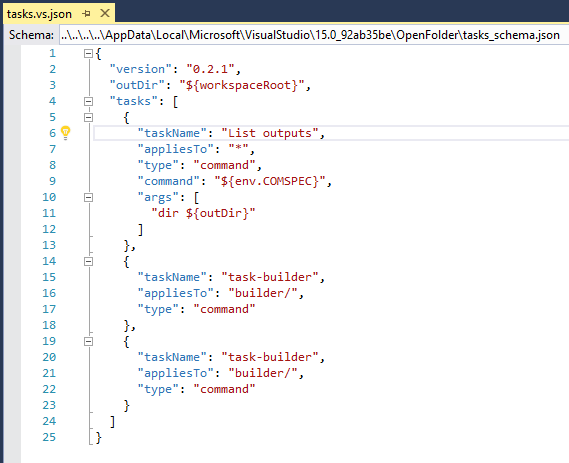

1. Save the project.  

1. Open the context menu for the selected folder. You should see the new arbitrary build task appear at the bottom of the context menu.  

  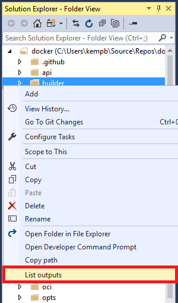

1. Choose the new **List outputs** command to execute the task.  

### To create a custom build task

In this procedure, we will add two custom build tasks that use nMake to build and clean your code.  

1. Choose a file of the project in Solution Explorer that you want to designate later as the startup item. On the file's context (right-click) menu, choose **Configure Tasks**.  

  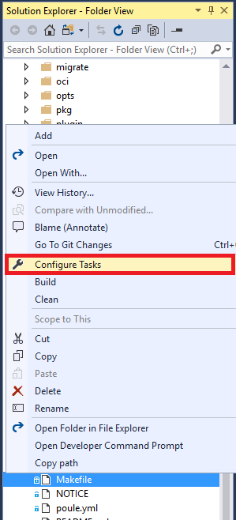

1. Add the following build tasks to tasks.vs.json. For this example, we'll add two tasks: one called "makefile-build" which uses the nMake command to build the project, the other called makefile-clean which calls the nMake command with the "clean" argument. These tasks should be added within the existing "tasks" array. (Note that these are only example build tasks. For them to actually work, you need to have the workload that contains [nNake](/cpp/build/nmake-reference) installed on your system.)

  ```xml
  {
  "taskName": "makefile-build",
  "appliesTo": "makefile",
  "type": "command",
  "contextType": "build",
  "command": "nmake"
  },
  {
  "taskName": "makefile-clean",
  "appliesTo": "makefile",
  "type": "command",
  "contextType": "clean",
  "command": "nmake",
  "args": [
    "clean"
    ]
  },
  ```
  The complete custom build task should look like this.  

  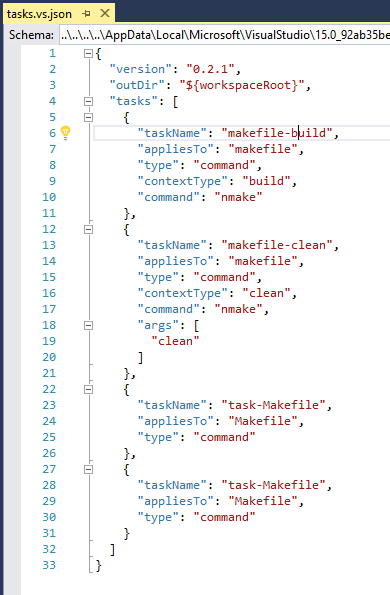

1. Save the project.  

1. Open the context menu for the selected file. The new custom build tasks should appear in the middle of the context menu.  

  

  > [!NOTE]
  > The commands appear under the **Configure Tasks** command due to their `contextType` settings; "build" and "clean" are build commands, so they appear in the build section in the middle of the context menu.  

  Now that you have associated custom build commands with the file, you can designate the file as the startup item.  

1. On the file's context menu, choose **Set as Startup Item**.  

  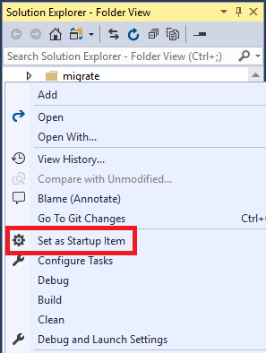

1. On the toolbar, choose the dropdown arrow next to the Start button. The startup item now appears as an option.  

  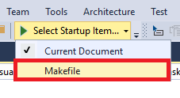

You can now choose the **Start** button or the **F5** key to run your codebase. You can edit and debug your codebase in Visual Studio even though Visual Studio doesn't recognize the build tools of the codebase. Output from the build task appears in the **Output** window, and build errors appear in the **Error List**. The tasks.vs.json build task file couples the Visual Studio inner development loop to the custom build tools used by your codebase.  

Custom build tasks can be added to individual files or to all files of a specific type. For instance, NuGet package files can be configured to have a "Restore Packages" task, or all source files can be configured to have a static analysis task, such as a linter for all .js files.  

Visual Studio supports the VSCode `$variable` substitution in the root of tasks.vs.json, in addition to environment variables (such as `$env.var`) or keys.  

## Specify build Output

If your project needs to be compiled, you can add an additional tag called `output` to the tasks.vs.json file. Here is an example.  

`"output": "${workspaceRoot}\\bin\\hellomake.exe"`

Specifying the output location notifies Visual Studio where to find the project's build output.  

## Tasks.vs.json file location

By default, the tasks.vs.json file is located in a hidden folder called `.vs`. To view hidden files in Visual Studio, choose the **Show All Files** button on the Solution Explorer toolbar.

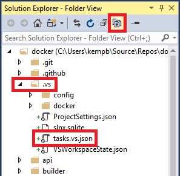

The tasks.vs.json file is hidden because most users generally don't want to check it into source control. However, if you want to be able to check it into source control, drag the file into the root of your project where it will be visible.  

Other .json files may be present in the .vs folder, but the only ones you should move are the tasks.vs.json file and the launch.vs.json file (if one is there). The launch.vs.json file configures the Visual Studio debugger, while the tasks.vs.json file configures build in Visual Studio.  

## See also

[Writing code in the code and text editor](../ide/writing-code-in-the-code-and-text-editor.md)
