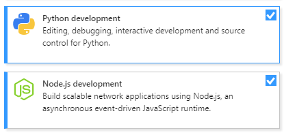
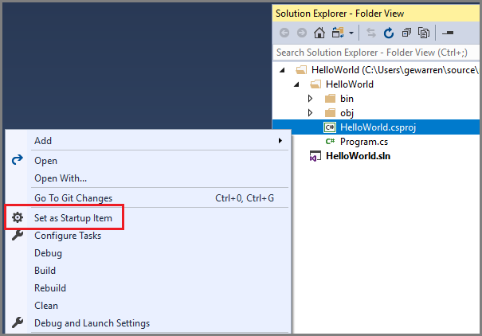
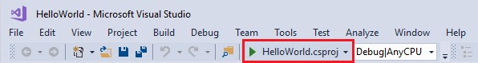

# Develop code in Visual Studio without projects or solutions

You can open code from nearly any type of directory-based project into Visual Studio without the need for a solution or project file. This means you can, for example, clone a repo on GitHub, open it directly into Visual Studio, and begin developing, without having to create a solution or project. If needed, you can specify custom build tasks and launch parameters through simple JSON files.

After you open your code files in Visual Studio, **Solution Explorer** displays all the files in the folder. You can click on any file to begin editing it. In the background, Visual Studio starts indexing the files to enable IntelliSense, navigation, and refactoring features. As you edit, create, move, or delete files, Visual Studio tracks the changes automatically and continuously updates its IntelliSense index. Code will appear with syntax colorization and, in many cases, include basic IntelliSense statement completion.

> [!NOTE]
> If you're looking for information that's specific to VS Code, visit the [Getting started with Visual Studio Code](https://code.visualstudio.com/docs) page.

## Open any code

You can open code into Visual Studio in the following ways:

- On the Visual Studio menu bar, choose **File** > **Open** > **Folder**, and then browse to the code location.

- On the context (right-click) menu of a folder containing code, choose the **Open in Visual Studio** command.

- Choose the **Open Folder** link on the start window.

    > [!IMPORTANT]
    > Not all code can be opened by using the **Open Folder** link from the Visual Studio start window. For example, if your code file was saved as part of a solution&mdash;in other words, in an .sln file&mdash;you must use one of the other options listed here to open your code.

- If you are a keyboard user, press **Ctrl**+**Shift**+**Alt**+**O** in Visual Studio.

- Open code from a cloned GitHub repo.

### To open multiple folders
Starting in Visual Studio 2022 version 17.9 Preview 1, you can specify multiple folders to open in Visual Studio. Opening multiple folders is especially useful in code repos with lots of unrelated code, and a developer only needs a subset to do some work.
- On the Visual Studio menu bar, choose **File** > **Open** > **Workspace**, and then browse to the `.code-workspace` file location.
- The `.code-workspace` file itself is expected to be a .JSON schema, which looks like the following:

```json
{
    "folders" : [
        {
            "path" : "some\\child\\foo",
            "name" : "The Foo"
        },
        {
            "path" : "..\\..\\some\\unrelated\\bar"
        },
        {
            "path" : "C:\\a\\full\\path\\baz"
        },
        {
            "path" : "${env.ANY_ENV_VARIABLE}\\foobar"
        }
    ]
}
```

Each `"path"` value can be any relative path or rooted path. Rooted paths must be on the same drive letter. Environment variables can be used with the syntax `${env.ANY_ENV_VARIABLE}`. The `"name"` property can be used to create a visual alias for the folder in the Solution Explorer.

### To open code from a cloned GitHub repo

The following example shows how to clone a GitHub repo and then open its code in Visual Studio. To follow this procedure, you must have a GitHub account and Git for Windows installed on your system. See [Create a GitHub account to use with Visual Studio](../version-control/git-create-github-account.md) and [Git for Windows](https://git-for-windows.github.io/) for more information.

1. Go to the repo you want to clone on GitHub.

1. Choose the **Clone or Download** button and then choose the **Copy to Clipboard** button in the dropdown menu to copy the secure URL for the GitHub repo.

   

#### Use Git in Visual Studio

As of Visual Studio 2019 [version 16.8](/visualstudio/releases/2019/release-notes/), we introduced a new, streamlined Git interface that you can use to interact with your files on GitHub. To learn more, visit the [Visual Studio version control docs](../version-control/git-with-visual-studio.md).

#### Use Team Explorer in Visual Studio

You can still use Team Explorer in Visual Studio 2022 and in Visual Studio 2019 [version 16.8](/visualstudio/releases/2019/release-notes/) and later. However, you might find it easier to use the new Git experience. For more information, see [How Visual Studio makes version control easy with Git](../version-control/git-with-visual-studio.md).

1. In Visual Studio, choose the **Team Explorer** tab to open **Team Explorer**. If you don't see the tab, open it from **View** > **Team Explorer**.

1. In Team Explorer, under the **Local Git Repositories** section, choose the **Clone** command and then paste the URL of the GitHub page into the text box.

   

1. Choose the **Clone** button to clone the project's files to a local Git repository. Depending on the size of the repo, this process could take several minutes.

1. After the repo has been cloned to your system, in **Team Explorer**, choose the **Open** command on the context (right-click) menu of the newly cloned repo.

   

1. Choose the **Show Folder View** command to view the files in **Solution Explorer**.

   

   You can now browse folders and files in the cloned repo, and view and search the code in the Visual Studio code editor, complete with syntax colorization and other features.

## Run and debug your code

You can debug your code in Visual Studio without a project or solution! To debug some languages, you may need to specify a valid *startup file* in the codebase, such as a script, executable, or project. The drop-down list box next to the **Start** button on the toolbar lists all of the startup items that Visual Studio detects, as well as items you specifically designate. Visual Studio runs this code first when you debug your code.

Configuring your code to run in Visual Studio differs depending on what kind of code it is, and what the build tools are.

### Codebases that use MSBuild

MSBuild-based codebases can have multiple build configurations that appear in the **Start** button's drop-down list. Select the file that you want to use as the startup item, and then choose the **Start** button to begin debugging.

> [!NOTE]
> For C# and Visual Basic codebases, you must have the **.NET desktop development** workload installed. For C++ codebases, you must have the **Desktop development with C++** workload installed.

### Codebases that use custom build tools

If your codebase uses custom build tools, then you must tell Visual Studio how to build your code using *build tasks* that are defined in a *.json* file. For more information, see [Customize build and debug tasks](../ide/customize-build-and-debug-tasks-in-visual-studio.md).

### Codebases that contain Python or JavaScript code

If your codebase contains Python or JavaScript code, you don't have to configure any *.json* files, but you do have to install the corresponding workload. You must also configure the startup script:

1. Install the [Node.js development](https://visualstudio.microsoft.com/vs/node-js/) or [Python development](https://visualstudio.microsoft.com/vs/python/) workload by choosing **Tools** > **Get Tools and Features**, or by closing Visual Studio and running the Visual Studio Installer.

   

1. In **Solution Explorer**, on the right-click or context menu of a JavaScript or Python file, choose the **Set as Startup Item** command.

1. Choose the **Start** button to begin debugging.

### Codebases that contain C++ code

For information about opening C++ code without solutions or projects in Visual Studio, see [Open Folder projects for C++](/cpp/build/open-folder-projects-cpp).

### Codebases that contain a Visual Studio project

If your code folder contains a Visual Studio project, you can designate the project as the startup item.



The **Start** button's text changes to reflect that the project is the startup item.



## Related content

- [Customize build and debug tasks](../ide/customize-build-and-debug-tasks-in-visual-studio.md)
- [Open Folder projects for C++](/cpp/build/open-folder-projects-cpp)
- [CMake projects in C++](/cpp/build/cmake-projects-in-visual-studio)
- [Writing code in the code and text editor](../ide/writing-code-in-the-code-and-text-editor.md)
