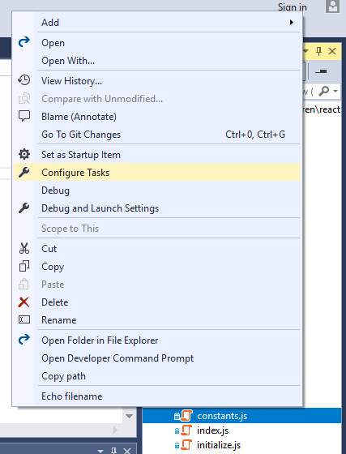

# Develop code in Visual Studio without projects or solutions

In Visual Studio 2017, you can open code from nearly any type of directory-based project into Visual Studio without the need for a solution or project file. This means you can, for example, find a code project on Git, clone it, and then open it directly into Visual Studio and begin developing, without having to create a solution or project. If needed, you can specify custom build tasks and launch parameters through simple JSON files.

After you open your code files in Visual Studio, Solution Explorer displays all the files in the folder. You can click on any file to begin editing it. In the background, Visual Studio starts indexing the files to enable IntelliSense, navigation, and refactoring features. As you edit, create, move, or delete files, Visual Studio tracks the changes automatically and continuously updates its IntelliSense index. Code will appear with syntax colorization and, in many cases, include basic IntelliSense statement completion.

## Open code anywhere

You can open code into Visual Studio in the following ways:

- On the Visual Studio menu bar, choose **File** > **Open** > **Folder**, and then browse to the code location.

- On the context (right-click) menu of a folder containing code, choose the **Open in Visual Studio** command.

- Choose the **Open Folder** link on the Visual Studio Start Page.

- If you are a keyboard user, press **Ctrl**+**Shift**+**Alt**+**O** in Visual Studio.

- Open code cloned from a GitHub repo.

### To open code from a cloned GitHub repo

The following example shows how to clone a GitHub repo and then open its code in Visual Studio. To follow this procedure, you must have a GitHub account and Git for Windows installed on your system. See [Signing up for a new GitHub account](https://help.github.com/articles/signing-up-for-a-new-github-account/) and [Git for Windows](https://git-for-windows.github.io/) for more information.

1. Go to the repo you want to clone on GitHub.

1. Choose the **Clone or Download** button and then choose the **Copy to Clipboard** button in the dropdown menu to copy the secure URL for the GitHub repo.

  

    > [!NOTE]
    >  While you also have the option to open the project on your desktop or download a .zip file of the project, this example demonstrates how to clone the repo using the secure URL method.

1. In Visual Studio, choose the **Team Explorer** tab to open Team Explorer. If you don't see the tab, open it from **View** > **Team Explorer**.

1. In Team Explorer, under the **Local Git Repositories** section, choose the **Clone** command and then paste the URL of the GitHub page into the text box.

  

1. Choose the **Clone** button to clone the project's files to a local Git repository. Depending on the size of the repo, this process could take several minutes.

1. After the repo has been cloned to your system, in Team Explorer, choose the **Open** command on the context (right-click) menu of the newly cloned repo.

  

1. Choose the **Show Folder View** command to view the files in Solution Explorer

  

  You can now browse folders and files in the cloned repo, and view and search the code in the Visual Studio code editor, complete with syntax colorization and other features.

    

|         |         |
|---------|---------|
|  |    [Watch a video](https://mva.microsoft.com/en-us/training-courses/getting-started-with-visual-studio-2017-17798?l=lp3TOKD6D_6711787171) on how to clone and open code from a GitHub repo in Visual Studio. |

## Debug your code

You can debug your code in Visual Studio without a project or solution. To debug some languages, you may need to specify a valid *startup file* in the code project, such as a script, executable, or project. Visual Studio runs this specified code first when you debug your code.

The drop-down list box next to the Start button on the toolbar lists all of the startup items that Visual Studio detects, as well as items you specifically choose in a folder.


Visual Studio automatically recognizes projects, but scripts (such as Python and JavaScript) need to be explicitly selected by you as a startup item before they will appear in the list. In addition, some startup items, such as MSBuild and CMake, can have multiple build configurations that appear in the Start button's drop-down list.

Visual Studio currently supports debugging (without using projects and solutions) for the following types of code:

- MSBuild-based codebases (C#, VB, C++)

- Any executable that has associated program database (.pdb) files

### To debug Node.js and Python

1. Install the [Node.js development](https://www.visualstudio.com/vs/node-js/) or [Python development](https://www.visualstudio.com/vs/python/) workload by choosing **Tools** > **Get Tools and Features...**, or by closing Visual Studio and running the Visual Studio Installer.

   

1. In **Solution Explorer**, on the right-click or context menu of a JavaScript or Python file, choose the **Set as Startup Item** command.

1. Choose the **F5** key to begin debugging.

### To debug MSBuild-based codebases or executable files

1. On the Visual Studio menu, choose **Debug**. On the drop-down menu, choose the file that you want to display as the startup item in Solution Explorer.

1. Choose the **F5** key to begin debugging.

## Customizing codebases

Visual Studio knows how to run many different languages, but it doesn't know how to run everything. If Visual Studio knows how to run your language, you can run the code right away. If you try to run your code but Visual Studio doesn't know how to run it, an information bar prompts you to designate a file in your codebase to act as the startup item.

If the codebase uses custom build tools that Visual Studio doesn't recognize, though, then you will likely not be able to run and debug the code in Visual Studio until you complete some additional steps. You must specify a valid executable file type, such as a compiler, along with any custom parameters and arguments required by the language. To enable this, Visual Studio provides *build tasks*. You can create a build task to specify all the items a language needs to build and run its code.

You can also create arbitrary tasks that can do nearly anything you want. For example, you can create a task to list the contents of a folder or rename a file. Or, you can create more targeted custom build tasks that do things such as compile and build your project using specific arguments.

You can customize an Open Folder project through three JSON files:

|File name|Purpose|
|-|-|
|[tasks.vs.json](#tasks)|Specify custom build commands and compiler switches, and arbitrary (non-build related) tasks.<br>Accessed via the **Solution Explorer** context menu item **Configure Tasks**.|
|[launch.vs.json](#launch)|Specify command line arguments for debugging.<br>Accessed via the **Solution Explorer** context menu item **Debug and Launch Settings**.|
|VSWorkspaceSettings.json|Generic settings that may impact tasks and launch. For example, defining `envVars` in VSWorkspaceSettings.json adds the specified environment variables to externally run commands.|

The JSON files are located in a hidden folder called `.vs` in your root project folder. The `tasks` and `launch` files are created by Visual Studio on an as-needed basis when you choose either **Configure Tasks** or **Debug and Launch Settings** from the Solution Explorer context menu. These .json files are hidden because most users generally don't want to check them into source control. However, if you want to be able to check them into source control, drag the files into the root of your project where they will be visible.

> [!TIP]
> To view hidden files in Visual Studio, choose the **Show All Files** button on the Solution Explorer toolbar.

### <a name="tasks"/>Define tasks with tasks.vs.json

You can automate build scripts or any other external operations on the files you have in your current workspace by running them as tasks directly in the IDE. You can configure a new task by right-clicking on a file or folder and selecting **Configure Tasks**.



This creates (or opens) the `tasks.vs.json` file in the .vs folder. You can define a build task or arbitrary task in this file, and then invoke it using the name you gave it from the **Solution Explorer** context menu.

#### Properties for tasks.vs.json

This section describes some of the properties you can specify in tasks.vs.json.

##### appliesTo

You can create tasks for any file or folder by specifying its name in the `appliesTo` field, for example `"appliesTo" : "hello.js"`. The following file masks can be used as values:
|||
|-|-|
|`"*"`| task is available to all files and folders in the workspace|
|`"*/"`| task is available to all folders in the workspace|
|`"*.js"`| task is available to all files with the extension .js in the workspace|
|`"/*.js"`| task is available to all files with the extension .js in the root of the workspace|
|`"src/*/"`| task is available to all subfolders of the "src" folder|
|`"makefile"`| task is available to all makefile files in the workspace|
|`"/makefile"`| task is available only to the makefile in the root of the workspace|

##### output

If your project needs to be compiled, you can add an additional property called `output` to the tasks.vs.json file. Here is an example:

```json
  "output": "${workspaceRoot}\\bin\\hellomake.exe"
```

Specifying the output location tells Visual Studio where to find the project's build output when you press **F5**.

#### Macros for tasks.vs.json

|||
|-|-|
|`${env.<VARIABLE>}`| Specifies any environment variable (for example,  ${env.PATH}, ${env.COMSPEC} and so on) that is set for the developer command prompt. For more information, see [Developer Command Prompt for Visual Studio](/dotnet/framework/tools/developer-command-prompt-for-vs).|
|`${workspaceRoot}`| The full path to the workspace folder (for example, "C:\sources\hello")|
|`${file}`| The full path of the file or folder selected to run this task against (for example, "C:\sources\hello\src\hello.js")|
|`${relativeFile}`| The relative path to the file or folder (for example, "src\hello.js")|
|`${fileBasename}`| The name of the file without path or extension (for example, "hello")|
|`${fileDirname}`| The full path to the file, excluding the filename (for example, "C:\sources\hello\src")|
|`${fileExtname}`| The extension of the selected file (for example,  ".js")|

##### Custom macros

To define a custom macro in tasks.vs.json, add a name:value pair prior to the task blocks. The following example defines a macro named `outDir` which is consumed in the `args` property:

```json
{
"version": "0.2.1",
  "outDir": "${workspaceRoot}\\bin",
  "tasks": [
    {
      "taskName": "List outputs",
      "*",
      "type": "command",
      "command": "${env.COMSPEC}",
      "args": [
        "dir ${outDir}"
      ]
    }
  ]
```

#### Define custom build tasks in tasks.vs.json

If your codebase uses custom build tools that Visual Studio doesn't recognize, then you will likely not be able to run and debug the code in Visual Studio until you complete some additional steps. You must specify a valid executable file type, such as a compiler, along with any custom parameters and arguments required by the language. To enable this, Visual Studio provides *build tasks*. In this procedure, we will add two custom build tasks that use nMake to build and clean your code.

1. Choose a file in Solution Explorer that you want to designate later as the startup item. On the file's context (right-click) menu, choose **Configure Tasks**.

  

   The tasks.vs.json file opens in the editor.

1. Add the following build tasks to tasks.vs.json. For this example, we'll add two tasks: one called "makefile-build" which uses the nMake command to build the project, the other called "makefile-clean" which calls the nMake command with the "clean" argument. These tasks should be added within the existing "tasks" array. (Note that these are only example build tasks. For them to actually work, you need to have the Visual Studio workload that contains [nMake](/cpp/build/nmake-reference) installed on your system.)

  ```json
  {
    "taskName": "makefile-build",
    "appliesTo": "makefile",
    "type": "command",
    "contextType": "build",
    "command": "nmake"
  },
  {
    "taskName": "makefile-clean",
    "appliesTo": "makefile",
    "type": "command",
    "contextType": "clean",
    "command": "nmake",
    "args": [
      "clean"
    ]
  },
  ```
  The complete custom build task should look like this.

  

1. Save the project.

1. Open the context menu for the selected file. The new custom build tasks should appear in the middle of the context menu.

  

  > [!NOTE]
  > The commands appear under the **Configure Tasks** command due to their `contextType` settings; "build" and "clean" are build commands, so they appear in the build section in the middle of the context menu.

1. Now that you have associated custom build commands with the file, you can designate the file as the startup item. On the file's context menu, choose **Set as Startup Item**.

  

1. On the toolbar, choose the dropdown arrow next to the Start button. The startup item now appears as an option.

  

You can now choose the **Start** button or the **F5** key to run your code. You can edit and debug your code in Visual Studio even though Visual Studio doesn't recognize the build tools of the codebase. Output from the build task appears in the **Output** window, and build errors appear in the **Error List**. The tasks.vs.json build task file couples the Visual Studio inner development loop to the custom build tools used by your codebase.

Custom build tasks can be added to individual files or to all files of a specific type. For instance, NuGet package files can be configured to have a "Restore Packages" task, or all source files can be configured to have a static analysis task, such as a linter for all .js files.

#### Define arbitrary tasks in tasks.vs.json

The following example shows a tasks.vs.json file that defines a single task. When invoked, the task displays the filename of the currently selected .js file. `taskName` defines the name that appears in the context menu. `appliesTo` defines which files the command can be performed on. The `command` property refers to the COMSPEC environment variable, which identifies the path for the console (cmd.exe on Windows). The `args` property specifies the command line to be invoked. The `${file}` macro retrieves the selected file in **Solution Explorer**.

```json
{
  "version": "0.2.1",
  "tasks": [
    {
      "taskName": "Echo filename",
      "appliesTo": "*.js",
      "type": "default",
      "command": "${env.COMSPEC}",
      "args": ["echo ${file}"]
    }
  ]
}
```

After saving tasks.vs.json, you can right-click any .js file in the folder, choose **Echo filename** from the context menu, and see the file name displayed in the **Output** window.

##### To create an arbitrary task

1. Choose the file or folder of the project in Solution explorer where you want the task, and on the file or folder's context (right-click) menu, choose **Configure Tasks**.

  

  Choosing **Configure Tasks** opens a file called tasks.vs.json. If this file doesn't exist, it is created. This file contains tasks for the selected file or folder.

  

1. Add the following task to the tasks.vs.json file. For this example, we'll add a simple task called "List outputs" that lists files and subfolders of the selected folder in the **Output** window. (The new task should be added within the existing `tasks` array.)

   ```json
   {
      "taskName": "List outputs",
      "appliesTo": "*",
      "type": "command",
      "command": "${env.COMSPEC}",
      "args": [ "dir ${outDir}" ]
   },
   ```

  The complete task should look like this.

  

1. Save the project.

1. Open the context menu for the selected folder. You should see the new arbitrary task appear at the bottom of the context menu.

1. Choose the **F5** key to begin debugging.

### <a name="launch"/>Configure debugging arguments with launch.vs.json

To customize your program’s command line arguments for debugging, right-click on the executable in **Solution Explorer** and select **Debug and Launch Settings**. If a file named `launch.vs.json` already exists, it is opened. Otherwise, Visual Studio creates a new `launch.vs.json` file that is pre-populated with information about the program you have selected.

To specify additional command line arguments, add them in the `args` array as shown in the following example:

```json
{
  "version": "0.2.1",
  "defaults": {},
  "configurations": [
    {
      "type": "default",
      "project": "7zip\\Bundles\\Alone\\O\\7za.exe",
      "name": "7za.exe list content of helloworld.zip",
      "args": [ "l", "d:\\sources\\helloworld.zip" ]
    }
  ]
}
```

When you save this file, the new configuration appears in the debug target drop-down list, and you can select it to start the debugger. You can create as many debug configurations as you like, for any number of executables. If you press **F5**, the debugger launches and hits any breakpoint you may have already set. All the familiar debugger windows are available and functional.

## See also

[Writing code in the code and text editor](../ide/writing-code-in-the-code-and-text-editor.md)
