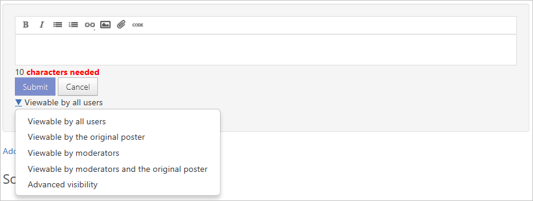
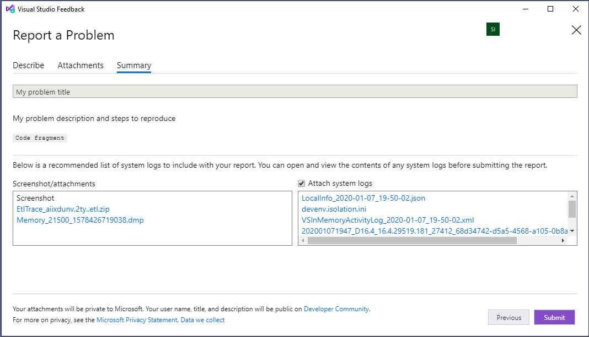

# Developer Community data privacy

By default, all information in problem reports on [Developer Community](https://aka.ms/feedback/suggest?space=8), including any comments and replies, is publicly visible. This is beneficial because it allows the entire community to see the issues, solutions, and workarounds that other users have found. However, if you're concerned about the privacy of your data or identity, you have options. You can also View, Export, or Delete your feedback data.

## Identity privacy

If you're concerned about revealing your identity, [create a new Microsoft account](https://signup.live.com/) that does not disclose any details about you. Use this account to create your report.

## Data privacy

If you're concerned about data privacy, don't put anything you want to keep private in the title or content of the initial report, which is always public. Instead, create the report, and then note that you'll send details privately in a separate comment. Once the problem report is created, you can specify who can see replies and attachments:

1. In the report you created, choose **Add comment** to create a private description of the problem.

2. In the reply editor, use the control below the **Submit** and **Cancel** buttons to specify the audience for your reply. Choose **Viewable by moderators and the original poster** to limit visibility to Microsoft employees and yourself.

   

   Only the people you specify can see the comment and any images, links, or code you include in it. Any replies under the comment have the same visibility as the original comment. This is true even if the privacy control on replies doesn't show the restricted visibility status correctly.

3. Add the description and any other information, images, and file attachments needed for your repro. Choose the **Submit** button to send this information privately.

   > [!NOTE]
   > On the Developer Community website, there is a 2-GB limit on attached files, and a maximum of 10 files. If you need to upload a larger file, you can either submit a new problem report or request an upload URL from a Microsoft employee in a private comment.
   > When we close an issue, associated attachments will be deleted after 90 days.

To maintain your privacy and keep sensitive information out of public view, take care to keep all interactions with Microsoft to replies under a visibility-restricted comment. Replies to other comments may cause you to accidentally disclose sensitive information.

## Data we collect

Microsoft collects data to help us reproduce and troubleshoot issues you report with Visual Studio Family products. This data includes **personal data** and **public feedback**.

**Public feedback** includes: reported problems, comments, and solutions.

**Personal data** includes:

- Your [Developer Community](https://developercommunity.visualstudio.com/) profile information;
- Preferences and notifications;
- Attachments and system-generated logs you provided by [reporting a problem in Visual Studio](how-to-report-a-problem-with-visual-studio.md) or through [Developer Community](https://developercommunity.visualstudio.com/);
- Your votes.

If **Report a problem** is initiated from Visual Studio Installer, we collect the most recent setup log.

If **Report a problem** is initiated from Visual Studio, we collect one or more of the following types of data:

- Watson and .NET entries from the event log
- Visual Studio in-memory activity log file
- PerfWatson files, if Watson collection is enabled
- LiveShare log files, if they exist
- Xamarin/.NET MAUI log files, if they exist
- NuGet log files, if they exist
- Web debugger log files, if they exist
- Service Hub logs and MEF error logs, if they exist
- Python logs, if they exist
- Razor LSP editor logs, if they exist
- Windows Forms logs, if they exist
- A screenshot, if you choose to include it
- Recording data, if you choose to include a recording, which includes:

  - Steps to reproduce the problem
  - ETL trace file
  - Dump file

> [!NOTE]
> Log files, screenshots and recording data you send can significantly increase Microsoft's ability understand and respond to your issue.  So we recommend including them. To protect your privacy, any attached log files, screenshots and recording data are sent only to Microsoft when you provide permission by submitting the problem report with which they are included. You can see which files are included on the 'Summary' step of the 'Report a Problem' window before submitting the report. You can exclude system log files from the report by unchecking 'Attach system logs' in the 'Summary' step. For reference, see the following screenshot.
  > 

## Leveraging AI
Publicly submitted information on Developer Community, including ticket titles, descriptions, and public comments, may be processed by AI language models. This data is utilized to facilitate tasks such as ticket summarization, routing, and other operational improvements aimed at enhancing the user experience. Your data is not used for training AI nor retained outside the feedback system.

## GDPR Data Subject Request processing

We support [General Data Protection Regulation (GDPR)](https://commission.europa.eu/law/law-topic/data-protection/data-protection-eu_en) and other data protection regulation requests through the [Developer Community](https://developercommunity.visualstudio.com/) website. You can View, Export, or Delete your feedback data.

### View

To View your feedback-related data, follow these steps:

1. Sign into [Developer Community](https://developercommunity.visualstudio.com/). From the top-right corner, click on your **profile** and select **Profile and Preferences**.

2. Click on any of the **Profile, Notifications, Activity,** and **Attachments** tabs to view the data submitted to the feedback systems.

   - **Profile** refers to your Developer Community profile, including user name, email address, about, etc.
   - **Notifications** are how you control the email notifications you receive.
   - **Activity** will give you the feedback items you have been active on (posted, commented, etc.), and the activities performed.
   - **Attachments** is a list of your attachment history in a format like `FileName was attached to the problem "ProblemName" Tue, Apr 10, 18 2:27 PM`.

### Export

You can export your feedback data as part of DSR. We will create one or more .zip archives that will include:

- Your Developer Community **profile** information;
- **Preferences** and **notification** settings;
- **Attachments** you provided by reporting a problem in Visual Studio or through Developer Community.

> [!NOTE]
> We will exclude the following public feedback you have provided from your archive: comments, solutions, reported problems.

To start an Export, follow these steps:

1. Sign into [Developer Community](https://developercommunity.visualstudio.com/). From the top-right corner, click on your profile and select **Profile and Preferences**.
2. Click the **Privacy** tab, and then click **Create an archive** to request exporting your data.
3. The **Archive Status** will update to show that we are preparing the data. The length of time before the data is available depends on the amount of data we need to export.
4. Once the data is ready, we will send you an email.
5. Click **Download Archive** in the email, or go back to the **Privacy** tab to download your data.

> [!NOTE]
> - We will not send email if you chose not to receive notifications in the Notifications tab.
> - If you request Export again, we will remove your old archive and create a new one.

### Delete

Deleting will remove the following information about you from Developer Community:

- **Profile** information;
- **Preferences** and **notification** settings;
- **Attachments** you provided by reporting a problem in Visual Studio or through Developer Community.
- Your **votes**

> [!NOTE]
> We will not delete, but will anonymize, the following public information: your comments, your solutions, problems that you reported.

> [!IMPORTANT]
> Delete of a Microsoft Entra ID or MSA account triggers the Delete process for Developer Community.

To initiate a Delete, follow these steps:

1. Sign into [Developer Community](https://developercommunity.visualstudio.com/). From the top-right corner, click on your profile and select **Profile and Preferences**.
2. Click the **Privacy** tab, and then click **Delete your data and account** to start deleting your data.
3. A confirmation screen will appear.
4. Type "delete" in the box, and then click **Delete my account**.

Once you click **Delete my account**:

- We will sign you out.
- We will delete your Developer Community account, your personal data, and attachments.
- We will anonymize your public feedback. Your public feedback will remain available on Developer Community, and will be indicated as reported by an Anonymous user.
- We won't email you after we delete your account, because you will no longer be present in the system.
- If you report a new problem or log into Developer Community, you will be identified as a new user.
- If you delete your account from Developer Community, we will not delete it from other Microsoft services.

## Related content

- [How to report a problem with Visual Studio](how-to-report-a-problem-with-visual-studio.md)
- [C++ problem report data privacy](/cpp/how-to-report-a-problem-with-the-visual-cpp-toolset#reports-and-privacy)
