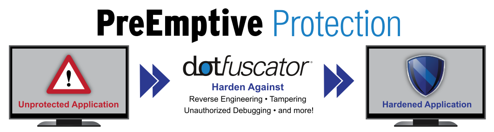

# About Dotfuscator Community & Visual Studio

***PreEmptive Protection - Dotfuscator*** provides comprehensive .NET application protection that easily fits into your secure software development lifecycle.
Use it to harden, protect, and prune desktop, mobile, server, and embedded applications to help secure trade secrets and other intellectual property (IP), reduce piracy and counterfeiting, and protect against tampering and unauthorized debugging.
Dotfuscator works on compiled assemblies without the need for more programming or even access to source code.



## Why protection matters

It's important to **protect your intellectual property** (IP).
Your application's code contains design and implementation details, which can be considered IP.
However, applications built on the .NET Framework [contain significant metadata and high-level intermediate code][assemblies], making them easy to reverse engineer, just by using one of many free, automated tools.
By disrupting and stopping reverse-engineering, you can prevent unauthorized IP disclosure, and demonstrate that your code contains trade secrets.
Dotfuscator can [obfuscate][obfuscation] your .NET assemblies to hinder reverse-engineering, while maintaining original application behavior.

It's also important to **protect the integrity of your application**.
In addition to reverse-engineering, bad actors may attempt to pirate your application, alter the application's behavior at run time, or manipulate data.
Dotfuscator can inject your application with the capability to [detect and respond to unauthorized uses][checks], including tampering, third-party debugging, and rooted devices.

For more information on how Dotfuscator fits into a secure software development lifecycle, see PreEmptive Solutions' [SDL App Protection page][sdl-protection].

## About Dotfuscator Community

Your copy of Microsoft Visual Studio includes a copy of ***PreEmptive Protection - Dotfuscator Community***, free for personal use.
(This free version was previously known as Dotfuscator Community Edition or Dotfuscator CE.)

For instructions on how to install the version of Dotfuscator Community included with Visual Studio, see the [Installation page][install].

Dotfuscator Community offers a range of [software protection and hardening][software-protection] services for developers, architects, and testers.
Examples of [.NET Obfuscation][obfuscation] and other [Application Protection][app-protection] features included in Dotfuscator Community are:

* *[Renaming][renaming]* of identifiers to make reverse-engineering of the compiled assemblies more difficult.
* *[Anti-tamper][tamper]* to detect the execution of tampered applications and terminate or respond to tampered sessions.
* *[Anti-debug][debug]* to detect the attachment of a debugger to a running application and terminate or respond to debugged sessions.
* *[Anti-rooted device][root]* to detect if the application is running on a rooted Android device and terminate or respond to sessions on these devices.
* *[Application expiration behaviors][shelflife]* that encode an "end-of-life" date and terminate expired application sessions.

Dotfuscator Community offers basic protection out-of-the-box.
Even more application protection measures are available to registered users of Dotfuscator Community, and to users of ***PreEmptive Protection - Dotfuscator Professional***, the world's leading [.NET Obfuscator][net-obfuscator].

## Getting started

To begin using Dotfuscator Community from Visual Studio, type `dotfuscator` into the **Search Box** (Ctrl+Q).

* If Dotfuscator Community is already installed, **Search Box** shows the option to start Dotfuscator Community under the *Menus* heading. For details, see [the Getting Started page of the full Dotfuscator Community User Guide][get-started].
* If Dotfuscator Community is not yet installed, **Search Box** instead shows **Install PreEmptive Protection - Dotfuscator** under the *Individual Components* heading. See the [Installation page][install] for details.

You can also get the **latest version** of Dotfuscator Community from [the Dotfuscator Downloads page on preemptive.com][download].

:::moniker range=">=vs-2019"

## Upgrade from Dotfuscator Community 5

Learn how to upgrade to PreEmptive Protection - Dotfuscator Community 6.

Depending on your installation history and version of Visual Studio, you might be currently running Dotfuscator Community 5, the prior major version. If so, you should upgrade, because it is important to ensure your code is being given the [latest protection measures][always-improving]. Upgrades are available at no charge.

This article explains how to determine what version you currently have, how to upgrade to version 6 if necessary, and what features have been replaced or removed between the two versions.

### Determine the Dotfuscator version

If you are unsure what version of Dotfuscator you're running, you can determine the version by doing one of the following options:

* Launch the Dotfuscator Community [graphical user interface][gui] (GUI) by going to Visual Studio's **Tools** menu and selecting **PreEmptive Protection - Dotfuscator Community**.

  From the Dotfuscator GUI, open the **Help** menu, and select **About...** to display the About screen.

  This screen lists Dotfuscator's version.

* If you have Dotfuscator integrated into your build with the [command-line interface][cli], you can also check your build logs for a line like the following example:

  ```no-highlight
  Dotfuscator Community Version 5.42.0.9514-e0e25f754
  ```

  You may need to increase your build's verbosity in order to see this text.
  For Visual Studio, see [Verbosity Settings][verbosity].

The first integer of the version, before the first dot `.`, indicates Dotfuscator's major version. If the first integer is `5`, then you should perform the upgrade steps on this page, so that you can take advantage of the latest Dotfuscator 6 features and protection updates.

### Upgrade instructions

This section includes sets of instructions for upgrading typical usages of Dotfuscator Community from version 5 to version 6.

### Install Dotfuscator 6

Dotfuscator Community is distributed as an extension for Visual Studio. The instructions to install Dotfuscator 6 vary by which version of Visual Studio you have:

* **Visual Studio 2022**
  Dotfuscator Community 6 is included in Visual Studio 2022.

* **Visual Studio 2019**
  Dotfuscator Community 6 is included in later versions of Visual Studio 2019 (version 16.10.0 and later).
  [Update Visual Studio 2019][vs-update] to the latest version. Updating Visual Studio automatically upgrades any Dotfuscator Community 5 installation to Dotfuscator Community 6.

    * If you do not have Dotfuscator installed already, update Visual Studio first and then see [Installation][install].

    * In addition to the releases with Visual Studio, you can always get the latest versions of Dotfuscator Community from the [Dotfuscator Downloads][download] page.

* **Visual Studio 2017**
  This version of Visual Studio only shipped with Dotfuscator Community 5.
  However, you can install or upgrade to Dotfuscator Community 6 by going to the [Dotfuscator Downloads][download] page and selecting the appropriate download link.

  Run the downloaded `.vsix` file and follow the prompts to install Dotfuscator Community 6 into Visual Studio. Existing Dotfuscator Community 5 installations is also be upgraded.

* **Earlier versions of Visual Studio**
  Dotfuscator Community 6 is not supported in these versions of Visual Studio.
  We recommend upgrading to a newer version of Visual Studio, or [upgrading from Dotfuscator Community to Dotfuscator Professional][pro].

If you had previously [registered][register] Dotfuscator Community 5, that registration is automatically converted the first time you run Dotfuscator Community 6.

<a name="steps-cli"></a>

#### Update paths to the CLI

If you previously used Dotfuscator 5's [command-line interface][cli] (CLI) to protect your app, you need to update the path to the CLI in any projects and build scripts that reference it.

The reason a path to Dotfuscator's CLI may now be invalid is because the names of some of the executables installed with Dotfuscator Community have changed in Dotfuscator 6. This change makes these executable names the same across Dotfuscator Community and Dotfuscator Professional.

| Executable for...                     | Dotfuscator 5         | Dotfuscator 6         |
|---------------------------------------|-----------------------|-----------------------|
| [GUI][gui] | `dotfuscator.exe`     | `dotfuscatorUI.exe`   |
| [CLI][cli]   | `dotfuscatorCLI.exe`  | `dotfuscator.exe`     |

> [!NOTE]
> The CLI path might also be invalid if you upgrade between major versions of Visual Studio or switch Visual Studio editions, as the Dotfuscator CLI is installed under Visual Studio's installation directory.
The symptoms and solution listed below also apply to this scenario.

If your build is using an invalid Dotfuscator CLI path, you might get errors such as one of the following examples:

`'"[...]\PreEmptiveSolutions\DotfuscatorCE\dotfuscatorCLI.exe"' is not recognized as an internal or external command, operable program or batch file.`

`The command ""[...]\PreEmptiveSolutions\DotfuscatorCE\dotfuscatorCLI.exe" Dotfuscator.xml" exited with code 9009.`

To update your build to use the correct CLI path:

1. Start the Dotfuscator Community [GUI][gui] by going to Visual Studio's **Tools** menu and selecting **PreEmptive Protection - Dotfuscator Community**.

2. In the Dotfuscator Community GUI, go to the **Tools** menu and select **Dotfuscator Command Prompt**.

3. In the command prompt that opens, type `where dotfuscator.exe`.
   Copy the first path displayed to a plain text document for later reference. This path is the new path to Dotfuscator Community 6's CLI.

4. Open the project or build configuration as appropriate for your build system.

    * For Visual Studio projects, open the project file (`.csproj`, `.vbproj`, or `.fsproj`) as plain text. [Open a project file](../solutions-and-projects-in-visual-studio.md#project-file) in Visual Studio.

5. Locate any places within your project or build configuration where an old path to Dotfuscator Community 5's CLI is used.
   It typically is a path ending in `dotfuscatorCLI.exe`.

6. Replace the old paths located in step 5 with the new path you noted in step 3.

   If one of the old paths is not an absolute path, then you should adjust the new path appropriately based on the context.
   In the example below, the `VSInstallDir` environment variable was used in the old path, so the corresponding new path should do the same.

    * New path from step 3: `C:\Program Files (x86)\Microsoft Visual Studio\2019\Preview\Common7\IDE\Extensions\PreEmptiveSolutions\DotfuscatorCE\dotfuscator.exe`
    * Old path in project file: `%VSInstallDir%\Common7\IDE\Extensions\PreEmptiveSolutions\DotfuscatorCE\dotfuscatorCLI.exe`
    * New path in project file: `%VSInstallDir%\Common7\IDE\Extensions\PreEmptiveSolutions\DotfuscatorCE\dotfuscator.exe`

7. If you are using a source control system, such as Git, then ensure the changes from step 6 are reflected in that system.
   Distribute these changes to the rest of your team as may be appropriate for your system and organization.

> [!WARNING]
> Because `dotfuscator.exe` refers to the graphical user interface (GUI) in Dotfuscator 5 but refers to the command line interface (CLI) in Dotfuscator 6, be careful when updating build scripts shared across multiple machines.
>
> A machine with Dotfuscator 5 installed that runs a script updated for Dotfuscator 6 causes the script to launch the graphical user interface, instead of the intended command line interface. **This may cause the build to succeed despite not applying Dotfuscator's protection, meaning your output packages will NOT be protected.**
>
> In other cases, it could instead cause a build failure.
>
> To avoid these scenarios, upgrade Dotfuscator Community from version 5 to version 6 across all of your machines and build scripts at the same time.

<a name="steps-config-files"></a>

### Upgrade Dotfuscator config files

*All* Dotfuscator config files (such as `Dotfuscator.xml`) that were created prior to Dotfuscator 6 needs to be upgraded.

If you try to run the Dotfuscator CLI with an old configuration file, you get errors like the following examples:

`Dotfuscator Engine Initialization error: PreEmptive Analytics, Authenticode signing, and the Introduce Explicit Method Overrides setting are no longer supported. Please open your Dotfuscator config in the Config Editor which automatically upgrades it.`

> [!IMPORTANT]
> You receive this error and need to upgrade your config file even if you were not using the features mentioned.

To upgrade a config file:

1. Launch the Dotfuscator Community [graphical user interface][gui] (GUI) by going to Visual Studio's **Tools** menu and selecting **PreEmptive Protection - Dotfuscator Community**.

2. Open the Dotfuscator config file in question (Ctrl+O).

3. The following message is displayed in the *Build Output* tab:

    `PreEmptive Analytics, Authenticode signing, and the Introduce Explicit Method Overrides setting are no longer supported.
   The associated settings have been removed. Please save your upgraded Dotfuscator config.`

4. Save the updated Dotfuscator config file (Ctrl+S).

5. If you are using a source control system, such as Git, then ensure the changes to the Dotfuscator config file are reflected in that system.
   Distribute these changes to the rest of your team as may be appropriate for your system and organization.

### Update references to attribute libraries

Dotfuscator allows you to configure certain features via [.NET attributes][dotnet-attributes] in your source code.
If your projects were using such attributes, you may need to update them to address changes in Dotfuscator 6.

#### Obfuscation attributes

There have been no changes to the [Obfuscation Attributes][attributes-obfuscation]. These attributes are defined in the .NET base class libraries, and Dotfuscator Community 6 continues to honor them.

<a name="steps-attrs-check"></a>

#### Check Attributes

The library containing the [Check Attributes][attributes-checks] has changed. In Dotfuscator Community 5, it was distributed as a file alongside Dotfuscator itself. Starting in Dotfuscator Community 6, it's available as a public NuGet package.

If you try to build a Visual Studio project that still references the old location, you may get errors like the following examples:

`The type or namespace name 'PreEmptive' could not be found (are you missing a using directive or an assembly reference?)`

`The type or namespace name 'TamperCheckAttribute' could not be found (are you missing a using directive or an assembly reference?)`

You may also get this warning:

`Could not resolve this reference. Could not locate the assembly "PreEmptive.Attributes". Check to make sure the assembly exists on disk. If this reference is required by your code, you may get compilation errors.`

To update your project to use the new location:

1. Remove the project's assembly reference to `PreEmptive.Attributes.dll`.

2. Add the NuGet package reference `PreEmptive.Protection.Checks.Attributes` to the project.
    The package is available on the default NuGet feed, [nuget.org][nuget-org].

Each Check Attribute's `ExtendedKey` parameters have also been removed.
These parameters were ignored in Dotfuscator Community 5, but if your source code used them regardless, remove these usages in order for your project to compile.

<a name="steps-attrs-analytics"></a>

##### Instrumentation attributes

Instrumentation attributes were used to configure the PreEmptive Analytics feature in Dotfuscator 5. However, PreEmptive Analytics was removed in Dotfuscator 6; see the Removed Feature subsection [PreEmptive Analytics](#removed-analytics). As a result, the instrumentation attributes were also removed.

If you try to build a Visual Studio project that used instrumentation attributes, you may get the same kinds of errors and warnings as noted in [Check Attributes](#steps-attrs-check), though the attribute names differ (for example, `FeatureAttribute` instead of `TamperCheckAttribute`).

If you try to run Dotfuscator on already-built assemblies that contain usages of instrumentation attributes, you get errors like the following examples:

`The PreEmptive.Attributes.FeatureAttribute attribute (annotating SomeNamespace.SomeType::SomeMethod) is not recognized by this version of Dotfuscator.`

To fix these problems, remove all usages of instrumentation attributes from your source code.
You also need to remove the assembly references to the library that defined the attributes, `PreEmptive.Attributes.dll`.
(If you were also using the Check Attributes that were defined in this library, they have moved; see [Check Attributes](#steps-attrs-check) above.)

## Removed features

Dotfuscator Community 6 introduces breaking changes from Dotfuscator Community 5. If you upgraded from Dotfuscator Community 5, this section describes how to deal with the changes that might require build modifications or affect Dotfuscator's output.

A full list of the changes is available in the [changelog][changelog].

<a name="removed-analytics"></a>

#### PreEmptive Analytics

Dotfuscator 6 does not support PreEmptive Analytics, including Check Telemetry. However, [Checks][checks-overview] themselves (including [Application Notification][checks-notification] and [Check Actions][checks-actions]) are still supported.

To use Dotfuscator 6, [upgrade your configuration file](#steps-config-files) to remove the PreEmptive Analytics settings.

If you were using in-code attributes to configure PreEmptive Analytics, [remove them from your source code](#steps-attrs-analytics) and rebuild your input assemblies before Dotfuscator 6 can protect those assemblies.

If you were using Check Telemetry to report when a Check detects an invalid state (such as when [tampering is detected][tamper]), you can replace it with a custom [Application Notification][checks-notification] that reports the incident to [Azure Application Insights][application-insights] or another service of your choice.

#### Unsupported application types

The following application types are no longer supported in Dotfuscator 6:

* Windows Phone
* WinRT (Windows 8 apps)
* Silverlight
* Unity (game engine)
* Universal Windows Platform (UWP)

To protect other kinds of UWP apps, [upgrade to Dotfuscator Professional][pro] and follow the [Protect Your App][pro-pya] instructions.

#### Unsupported inputs

Dotfuscator Community no longer supports Universal Windows Platform (UWP) `.appx` packages as [inputs][inputs]. To protect UWP apps, [upgrade to Dotfuscator Professional][pro] and follow the [Protect Your App][pro-pya] instructions.

Additionally, `.xap` packages can no longer be used as inputs because Silverlight is no longer supported.

#### Introduce explicit method overrides

The Renaming option to introduce explicit method overrides was removed from Dotfuscator. To use Dotfuscator 6, [upgrade your configuration file](#steps-config-files) to remove this setting.

:::moniker-end

## Full documentation

See [the full Dotfuscator Community User Guide at preemptive.com][full] for detailed usage instructions, including [how to start using the Dotfuscator Community user interface][get-started].

<!-- Copyright © 2019 PreEmptive Solutions, LLC -->

[changelog]: https://www.preemptive.com/support/dotfuscator-support/dotfuscator-ce-change-log
[download]: https://www.preemptive.com/products/dotfuscator/downloads
[always-improving]: https://www.preemptive.com/always-improving
[vs-update]: ../../install/update-visual-studio.md

[install]: https://www.preemptive.com/dotfuscator/ce/docs/help/intro_install.html
[register]: https://www.preemptive.com/dotfuscator/ce/docs/help/intro_register.html
[pro]: https://www.preemptive.com/dotfuscator/ce/docs/help/intro_upgrades.html
[pro-pya]: https://www.preemptive.com/dotfuscator/pro/userguide/en/getting_started_protect.html

[gui]:  https://www.preemptive.com/dotfuscator/ce/docs/help/getting_started_gui.html
[cli]: https://www.preemptive.com/dotfuscator/ce/docs/help/intro_cli.html

[inputs]: https://www.preemptive.com/dotfuscator/ce/docs/help/gui_inputs.html

[checks-overview]: https://www.preemptive.com/dotfuscator/ce/docs/help/checks_overview.html
[checks-notification]: https://www.preemptive.com/dotfuscator/ce/docs/help/checks_overview.html#pctoc-application-notification
[checks-actions]: https://www.preemptive.com/dotfuscator/ce/docs/help/checks_overview.html#pctoc-check-actions
[tamper]: https://www.preemptive.com/dotfuscator/ce/docs/help/checks_tamper.html

[attributes-checks]: https://www.preemptive.com/dotfuscator/ce/docs/help/attributes_checks.html
[attributes-obfuscation]: https://www.preemptive.com/dotfuscator/ce/docs/help/attributes_obfuscation.html

[verbosity]: ../how-to-view-save-and-configure-build-log-files.md#specify-data-verbosity-for-build-logs
[dotnet-attributes]: /dotnet/standard/attributes
[application-insights]: /azure/azure-monitor/app/app-insights-overview
[nuget-org]: https://www.nuget.org/

[assemblies]:  /dotnet/standard/assembly-format
[software-protection]:  https://www.preemptive.com/software-protection
[obfuscation]:  https://www.preemptive.com/obfuscation
[app-protection]:  https://www.preemptive.com/application-protection
[sdl-protection]:  https://www.preemptive.com/solutions/SDL-App-Protection
[net-obfuscator]:  https://www.preemptive.com/products/dotfuscator/overview
[download]:  https://www.preemptive.com/products/dotfuscator/downloads

[install]:  install.md
[capabilities]:  capabilities.md
[upgrades]:  upgrades.md

[get-started]:  https://www.preemptive.com/dotfuscator/ce/docs/help/gui_getstarted.html

[renaming]:  https://www.preemptive.com/dotfuscator/ce/docs/help/obfuscation_renaming.html

[checks]:  https://www.preemptive.com/dotfuscator/ce/docs/help/checks_overview.html
[tamper]:  https://www.preemptive.com/dotfuscator/ce/docs/help/checks_tamper.html
[debug]:  https://www.preemptive.com/dotfuscator/ce/docs/help/checks_debug.html
[root]: https://www.preemptive.com/dotfuscator/ce/docs/help/checks_root.html
[shelflife]:  https://www.preemptive.com/dotfuscator/ce/docs/help/checks_shelflife.html

[full]:  https://www.preemptive.com/dotfuscator/ce/docs/help/index.html
