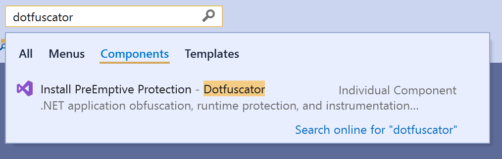
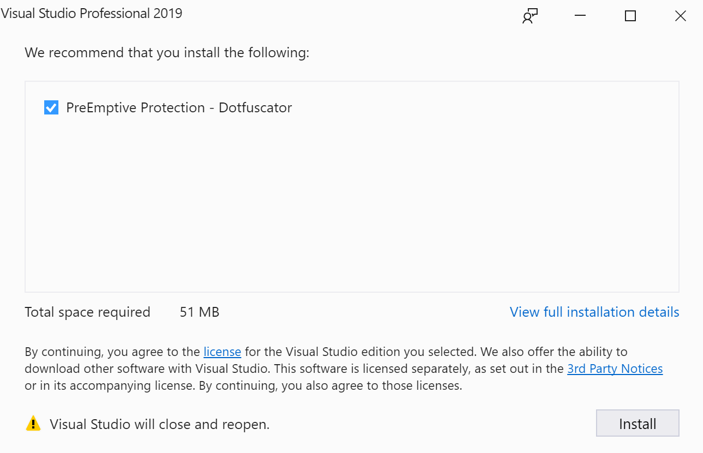
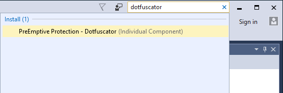
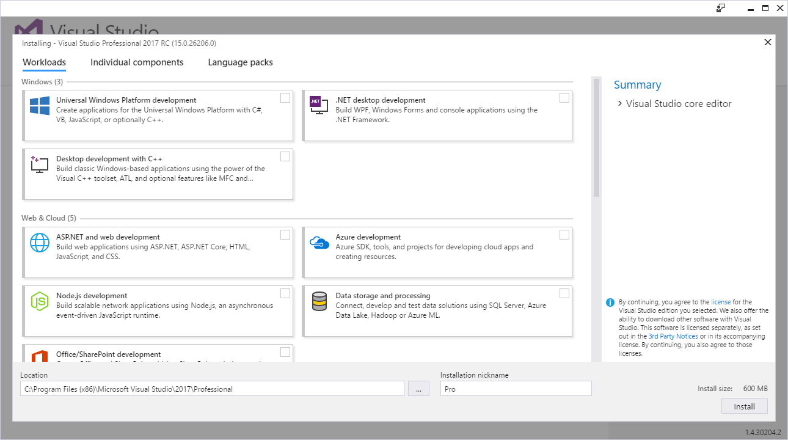
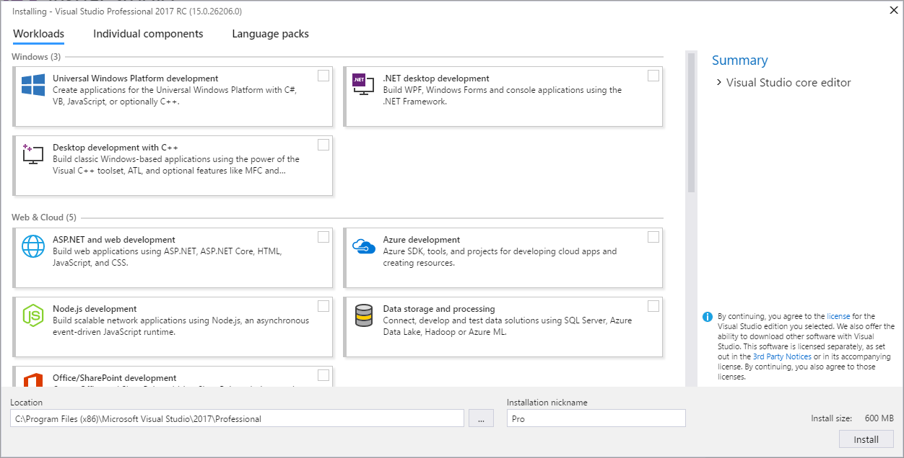
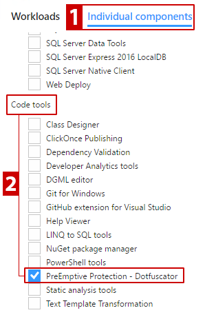
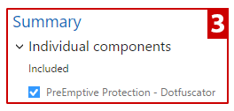

# Install Dotfuscator Community

Dotfuscator Community is an optional component of Visual Studio.
These instructions explain how to install it.

> [!NOTE]
> In addition to the versions of Dotfuscator Community shipped with releases of Visual Studio,
> PreEmptive Solutions also periodically provides updated versions on its website.
> If you want to download the **latest version** directly instead of installing from Visual Studio,
> **[click here to go to the Dotfuscator Downloads page][download]**.

## Within Visual Studio

::: moniker range="vs-2019"

You can install Dotfuscator Community from the Visual Studio IDE:

1. In the **Search Box** (Ctrl+Q), type `dotfuscator`.         

2. In the search results shown, under the *Components* heading, select **Install PreEmptive Protection - Dotfuscator**.
   * If you instead see, under the *Menus* heading, **PreEmptive Protection - Dotfuscator Community**, then Dotfuscator Community is already installed. Select that option to [get started][get-started].

3. A Visual Studio Installer window will launch, pre-configured to install Dotfuscator Community.
   > [!NOTE]
   > You may be required to provide administrator credentials to continue.

4. In the Visual Studio Installer window, click *Install*.         

::: moniker-end

::: moniker range="vs-2017"

You can install Dotfuscator Community from the Visual Studio IDE:

1. In the **Quick Launch** (Ctrl+Q) search bar, type `dotfuscator`.         

2. In the Quick Launch results shown, under the *Install* heading, select **PreEmptive Protection - Dotfuscator (Individual Component)**.
   * If you instead see, under the *Menus* heading, **Tools - PreEmptive Protection - Dotfuscator**, then Dotfuscator CE is already installed. Select that option to [get started][get-started].

3. A Visual Studio Installer window will launch, pre-configured to install Dotfuscator CE.
   > [!NOTE]
   > You may be required to provide administrator credentials to continue.

4. In the Visual Studio Installer window, click *Install*.         

::: moniker-end

Once the installation is complete, you can [start using Dotfuscator Community][get-started].

## During Visual Studio Installation

If you have not yet installed Visual Studio, you can obtain the installer from [the Visual Studio website][vs-install].
When run, it will display installation options for the selected Visual Studio edition.

::: moniker range="vs-2019"

::: moniker-end

::: moniker range="vs-2017"

::: moniker-end

You can then install Dotfuscator Community as an individual component of Visual Studio:

1. Select the **Individual components** tab.
2. Under *Code tools*, check the *PreEmptive Protection - Dotfuscator* item.        
3. The *Summary* panel displays *PreEmptive Protection - Dotfuscator* under the *Individual Components* section.         
4. Configure any further installation settings as appropriate for your environment.
5. When ready to install Visual Studio, click the *Install* button.

Once the installation is complete, you can start using Dotfuscator Community. For details, see [the Getting Started page of the full Dotfuscator Community User Guide][get-started].

## See also

[This topic in the full Dotfuscator Community User Guide](https://www.preemptive.com/dotfuscator/ce/docs/help/)

<!-- Copyright © 2019 PreEmptive Solutions, LLC -->

[vs-install]:  https://visualstudio.microsoft.com/downloads/
[get-started]:  https://www.preemptive.com/dotfuscator/ce/docs/help/gui_getstarted.html

[download]:  https://www.preemptive.com/products/dotfuscator/downloads

[full]:  https://www.preemptive.com/dotfuscator/ce/docs/help/intro_install.html