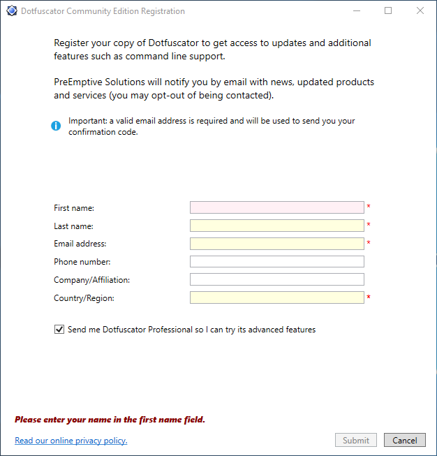
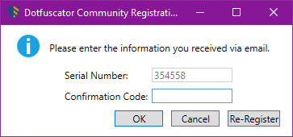

# Register Dotfuscator Community

This article describes how to register the free copy of Dotfuscator Community that's included in Visual Studio and the advantages of registering Dotfuscator Community.

## Why register?

Registered users of Dotfuscator Community get access to additional features, such as [command-line support][cli], which makes it easy to integrate Dotfuscator into your automated build process. Registering also gives you access to a built-in tool you can use to efficiently [decode obfuscated stack traces][decode-obfuscated].

Registration is quick, simple, and free of charge.

## Registration instructions

After [installation][install], you can register Dotfuscator Community via the [graphical user interface][gui](GUI)). To open the GUI, go to the Visual Studio **Tools** menu and select **PreEmptive Protection - Dotfuscator Community**.

If you're running Dotfuscator Community for the first time, you're prompted to sign an End-User License Agreement. After you sign the agreement, the registration form appears.

If you have already run Dotfuscator Community, but have not yet registered it, to view the registration form, open the **Help** menu, and then select **Register Product**.

Some of the fields in the registration form may already be filled based on your Visual Studio account. Ensure that the field values are correct, then fill in the remaining fields and click *Submit*.

After submitting your registration, a dialog will appear and prompt you for your *confirmation code*. You will receive an email from PreEmptive containing this code. Enter the code and click *OK* to complete your registration.

> [!NOTE]
> If you initially cancel the confirmation dialog, you can view it again in Dotfuscator's GUI by opening the **Help** menu, and then selecting **Register Product**.

When registration is finished, you'll immediately be able to use more features, such as the [command-line interface][cli].

If you checked *Send me Dotfuscator Professional so I can try its advanced features* when you registered, you'll also receive information about how to get an evaluation copy of [Dotfuscator Professional][get-pro]. You can use your email to create an account for the [members section of preemptive.com][members] where you can manage evaluations.

[install]: https://www.preemptive.com/dotfuscator/ce/docs/help/intro_install.html
[get-pro]: https://www.preemptive.com/dotfuscator/ce/docs/help/intro_upgrades.html

[gui]: https://www.preemptive.com/dotfuscator/ce/docs/help/getting_started_gui.html
[gui-start]: https://www.preemptive.com/dotfuscator/ce/docs/help/getting_started_gui.html#overview
[cli]: https://www.preemptive.com/dotfuscator/ce/docs/help/intro_cli.html
[decode-obfuscated]: https://www.preemptive.com/dotfuscator/ce/docs/help/gui_decode_stack_trace.html

[members]: https://www.preemptive.com/my-account