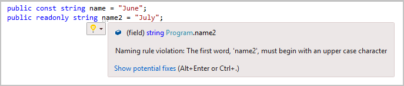
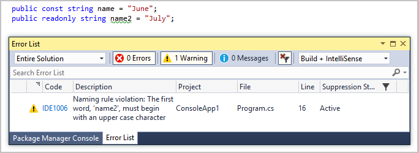

# .NET naming conventions for EditorConfig

Naming conventions concern the naming of code elements such as classes, properties, and methods. For example, you can specify that public members must be capitalized, or that asynchronous methods must end in "Async". You can enforce these rules by specifying them in an [.editorconfig file](../ide/create-portable-custom-editor-options.md). Naming rule violations appear either in the **Error List** or as a suggestion under the name, depending on the severity you choose for your rule. There is no need to build the project in order to see violations.

Naming conventions should be ordered from most-specific to least-specific in the *.editorconfig* file. The first rule encountered that can be applied is the only rule that is applied.

For each naming convention, you must specify the symbols it applies to, a naming style, and a severity for enforcing the convention, using the properties described below. The order of the properties is not important.

To begin, choose a title for your naming rule that you will use in each of the properties that are needed to fully describe the rule. For example, `public_members_must_be_capitalized` is a good, descriptive name for a naming rule. We'll refer to the title you choose as **<namingRuleTitle\>** in the sections that follow.

## Symbols

First, identify a group of symbols to apply the naming rule to. This property has the following format:

`dotnet_naming_rule.<namingRuleTitle>.symbols = <symbolTitle>`

Give a name to the group of symbols by replacing the **<symbolTitle\>** value with a descriptive title, for example `public_symbols`. You'll use the **<symbolTitle\>** value in the three property names that describe which symbols the rule is applied to (kinds of symbol, accessibility levels, and modifiers).

### Kinds of symbols

To describe the kind of symbols to apply the naming rule to, specify a property in the following format:

`dotnet_naming_symbols.<symbolTitle>.applicable_kinds = <values>`

The following list shows the allowable values, and you can specify multiple values by separating them with a comma.

- \* (use this value to specify all symbols)
- namespace
- class
- struct
- interface
- enum
- property
- method
- field
- event
- delegate
- parameter
- type_parameter
- local
- local_function

### Accessibility levels of symbols

To describe the accessibility levels of the symbols you want the naming rule to apply to, specify a property name in the following format:

`dotnet_naming_symbols.<symbolTitle>.applicable_accessibilities = <values>`

The following list shows the allowable values, and you can specify multiple values by separating them with a comma.

- \* (use this value to specify all accessibility levels)
- public
- internal or friend
- private
- protected
- protected\_internal or protected_friend
- private\_protected
- local

> [!NOTE]
> Do not specify an accessibility level as part of your naming convention if accessibility is not applicable to the kind of symbol you are targeting. For example, parameters do not have accessibility levels. If you specify an accessibility level for a parameter naming convention, your naming rule will not function correctly.

### Symbol modifiers (optional)

To describe the modifiers of the symbols you want the naming rule to apply to, specify a property name in the following format:

`dotnet_naming_symbols.<symbolTitle>.required_modifiers = <values>`

The following list shows the allowable values (separate multiple values with a comma):

- `abstract` or `must_inherit`
- `async`
- `const`
- `readonly`
- `static` or `shared`

   > [!NOTE]
   > If you have a naming rule for `static` or `shared` symbols, it is also applied to `const` symbols because they are implicitly static. If you don't want the `static` naming rule to apply to `const` symbols, create a separate naming rule for `const` symbols.

A naming rule matches signatures that have *all* the modifiers specified in `required_modifiers`. If you omit this property, the default value of an empty list is used, that is, no specific modifiers are required for a match. This means a symbol's modifiers have no effect on whether or not this rule is applied.

> [!TIP]
> Do not specify a value of `*` for `required_modifiers`. Instead, just omit the `required_modifiers` property altogether and your naming rule will apply to any kind of modifier.

## Style

Now that we've identified the group of symbols to apply the naming rule to, we must describe the naming style. A style can be that the name has a certain prefix or a certain suffix, or that individual words in the name are separated with a certain character. You can also specify a capitalization style. The style property has the following format:

`dotnet_naming_rule.<namingRuleTitle>.style = <styleTitle>`

Give the style a name by replacing the **<styleTitle\>** value with a descriptive title, for example `first_word_upper_case_style`. You'll use the **<styleTitle\>** value in the property names that describe the naming style (prefix, suffix, word separator character, and capitalization). Use one or more of these properties to describe your style.

### Require a prefix

To specify that symbol names must begin with certain characters, use this property:

`dotnet_naming_style.<styleTitle>.required_prefix = <prefix>`

### Require a suffix

To specify that symbol names must end with certain characters, use this property:

`dotnet_naming_style.<styleTitle>.required_suffix = <suffix>`

### Require a certain word separator

To specify that individual words in symbol names must be separated with a certain character, use this property:

`dotnet_naming_style.<styleTitle>.word_separator = <separator character>`

### Require a capitalization style

To specify a particular capitalization style for symbol names, use this property:

`dotnet_naming_style.<styleTitle>.capitalization = <value>`

The allowable values for this property are:

- pascal_case
- camel_case
- first\_word_upper
- all\_upper
- all_lower

> [!NOTE]
> You must specify a capitalization style as part of your naming style, otherwise your naming style might be ignored.

## Severity

To describe the severity of a violation of your naming rule, specify a property in the following format:

`dotnet_naming_rule.<namingRuleTitle>.severity = <value>`

The following table shows the allowable severity values, and what they mean:

Severity | Effect
------------ | -------------
none or silent | When this style is not being followed, do not show anything to the user; however, auto-generated code follows this style.
suggestion | When this style is not being followed, show it to the user as a suggestion, as underlying dots on the first two characters. It has no effect at compile time.
warning | When this style is not being followed, show a compiler warning in the **Error List**.
error | When this style is not being followed, show a compiler error in the **Error List**.

> [!NOTE]
> You do not have to build your project in order to see naming rule violations. They appear as code is edited, either in the **Error List** or as a suggestion.

## Example

The following *.editorconfig* file contains a naming convention that specifies that public properties, methods, fields, events, and delegates must be capitalized. Notice that this naming convention specifies multiple kinds of symbol to apply the rule to, using a comma to separate the values.

```EditorConfig
# Public members must be capitalized (public_members_must_be_capitalized)
[*.{cs,vb}]
dotnet_naming_rule.public_members_must_be_capitalized.symbols   = public_symbols
dotnet_naming_symbols.public_symbols.applicable_kinds           = property,method,field,event,delegate
dotnet_naming_symbols.public_symbols.applicable_accessibilities = public
dotnet_naming_symbols.public_symbols.required_modifiers         = readonly

dotnet_naming_rule.public_members_must_be_capitalized.style    = first_word_upper_case_style
dotnet_naming_style.first_word_upper_case_style.capitalization = first_word_upper

dotnet_naming_rule.public_members_must_be_capitalized.severity = suggestion
```

The following screenshot shows the effect of this naming convention in the editor. Two public variables have been named without capitalization of the first letter. One is a `const`, and one is `readonly`. Since the naming rule only applies to `readonly` symbols, only the `readonly` variable shows a naming rule suggestion.



Now let's change the violation severity to `warning`:

```EditorConfig
dotnet_naming_rule.public_members_must_be_capitalized.severity = warning
```

If you close and reopen your code file, instead of seeing the suggestion under the name violation, you see a green squiggly, and a warning in the **Error List**:



## See also

- [.NET language and formatting conventions](../ide/editorconfig-code-style-settings-reference.md)
- [Create portable custom editor options](../ide/create-portable-custom-editor-options.md)
- [.NET Compiler Platform's .editorconfig file](https://github.com/dotnet/roslyn/blob/master/.editorconfig)
