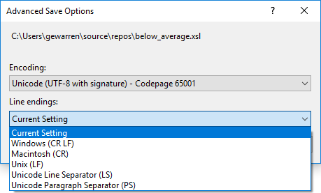

# Encodings and line endings

The following characters are interpreted as line breaks in Visual Studio:

- CR LF: Carriage return + line feed, Unicode characters 000D + 000A

- LF: Line feed, Unicode character 000A

- NEL: Next line, Unicode character 0085

- LS: Line separator, Unicode character 2028

- PS: Paragraph separator, Unicode character 2029

Text that is copied from other applications keeps the original encoding and line break characters. For example, when you copy text from Notepad and paste it into a text file in Visual Studio, the text has the same settings that it had in Notepad.

When you open a file that has different line break characters, you may see a dialog box that asks whether the inconsistent line break characters should be normalized, and which type of line breaks to choose.

## Advanced save options

You can use the **File** > **Advanced Save Options** dialog box to determine the type of line break characters you want. You can also change the encoding of a file with the same settings.

> [!NOTE]
> If you don't see **Advanced Save Options** on the **File** menu, you can add it. Choose **Tools**, **Customize**, and then choose the **Commands** tab. In the **Menu bar** drop-down list, choose **File**, then choose the **Add Command** button. In the **Add Command** dialog box, under **Categories**, choose **File**, and then in the **Commands** list, choose **Advanced Save Options**. Choose **OK** and then choose the **Move Down** button to move the command to any place in the menu. Choose **Close** to close the **Customize** dialog box. For more information, see [Customize menus and toolbars](../ide/how-to-customize-menus-and-toolbars-in-visual-studio.md#customizing_menu).
>
> Alternatively, you can access the **Advanced Save Options** dialog box by choosing **File** > **Save \<file\> As**. In the **Save File As** dialog box, choose the drop-down triangle next to the **Save** button and choose **Save with encoding**.

## See also

- [Features of the code editor](../ide/writing-code-in-the-code-and-text-editor.md)