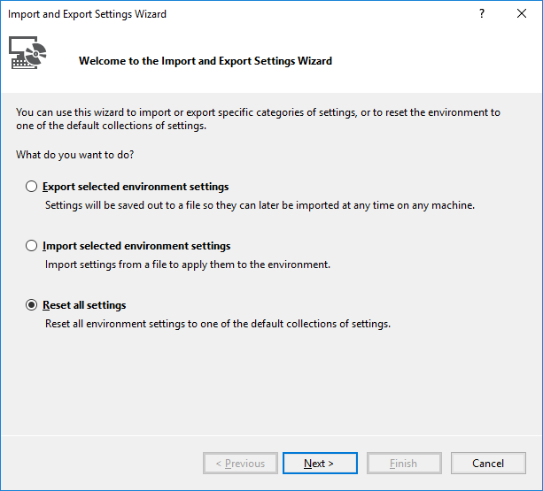

# Environment settings for Visual Studio

When you open Visual Studio for the first time, you can optimize the development environment for the type of development that you do the most by choosing a collection of settings. Each collection optimizes elements such as keyboard shortcuts, window layouts, project and item templates, and command visibility.

The following settings collections are available:

- General
- JavaScript
- Visual Basic
- Visual C#
- Visual C++
- Web Development
- Web Development (Code Only)

## Reset settings

To change your development settings after you open Visual Studio for the first time, follow these steps:

1. Select **Tools** > **Import and Export Settings** from the menu bar to open the **Import and Export Settings Wizard**.

1. In the **Import and Export Settings Wizard**, select **Reset all settings**, and then select **Next**.

   

1. On the **Save Current Settings** page, select either **Yes** or **No**, and then select **Next**.

1. On the **Choose a Default Collection of Settings** page, choose a collection, and then select **Finish**.

   

1. On the **Reset Complete** page, select **Close**.

## See also

- [Synchronize settings across multiple computers](synchronized-settings-in-visual-studio.md)
- [Personalize the Visual Studio IDE](personalizing-the-visual-studio-ide.md)
