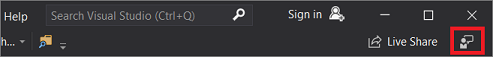
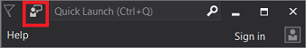

# Visual Studio feedback options

Why send feedback to us? Because we take customer feedback seriously; it drives much of what we do. Here's how to contact us so that we can route your feedback to the right person or team.

## Report a problem

::: moniker range="vs-2019"

If you experience problems with Visual Studio&mdash;such as crashes, sluggish performance, or unexpected behavior&mdash;let us know by using the **Report a Problem** tool. In Visual Studio, choose the feedback icon in the upper-right corner, or choose **Help** > **Send Feedback** > **Report a Problem** from the menu bar.

Next, Visual Studio opens the [Developer Community](https://developercommunity.visualstudio.com) interface, where you can sign in to report the problem. For more information, see [How to report a problem with Visual Studio](how-to-report-a-problem-with-visual-studio.md).

::: moniker-end

::: moniker range="vs-2017"

If you experience problems with Visual Studio&mdash;such as crashes, sluggish performance, or unexpected behavior&mdash;let us know by using the **Report a Problem** tool. In Visual Studio, choose the feedback icon next to the search box, or choose **Help** > **Send Feedback** > **Report a Problem** from the menu bar.

Next, Visual Studio opens the [Developer Community](https://developercommunity.visualstudio.com) interface, where you can sign in to report the problem. For more information, see [How to report a problem with Visual Studio](how-to-report-a-problem-with-visual-studio.md).

::: moniker-end

## Suggest a feature

::: moniker range="vs-2019"

If you have an idea or a suggestion to make Visual Studio better, let us know by using the **Suggest a Feature** tool. In Visual Studio, choose the feedback icon in the upper-right corner, or choose **Help** > **Send Feedback** > **Suggest a Feature** from the menu bar.

Next, Visual Studio opens the [Developer Community](https://developercommunity.visualstudio.com) interface, where you can sign in to share your idea. For more information, see [Suggest a feature for Visual Studio](suggest-a-feature.md).

::: moniker-end

::: moniker range="vs-2017"

If you have an idea or a suggestion to make Visual Studio better, let us know by using the **Provide a Suggestion** tool. In Visual Studio, choose the feedback icon next to the search box, or choose **Help** > **Send Feedback** > **Provide a Suggestion** from the menu bar.

Next, Visual Studio opens the [Developer Community](https://developercommunity.visualstudio.com) page, where you can sign in to share your idea. For more information, see [Suggest a feature for Visual Studio](suggest-a-feature.md).

::: moniker-end

## Improve the documentation

There are two ways that you can help us improve the documentation:

* Use the **Is this page helpful?** response tool at the top-right of any documentation page.
* Use your GitHub account to provide feedback for any Visual Studio page on [docs.microsoft.com](/visualstudio/). To do so, choose the **Send feedback about** > **This page** button at the bottom of any documentation page.

## Contact Microsoft support

For Visual Studio support information, see the [Product life cycle & servicing](/visualstudio/releases/2019/servicing/) page. For other Microsoft products and services, see [Microsoft support](https://go.microsoft.com/fwlink/?LinkID=99019) for online help.

> [!NOTE]
> Support outside the United States and Canada may vary. For a list of regional contacts, see [Microsoft worldwide sites](https://www.microsoft.com/worldwide/).

For larger organizations that require managed support directly from Microsoft, contracts are available through various Enterprise Support offerings. For more information, see [Microsoft Enterprise Support solutions](https://go.microsoft.com/fwlink/?LinkId=258223).

If the product came installed with a new computer or device, the hardware manufacturer provides technical support and assistance for this software. Contact the manufacturer directly for support.

Microsoft support services are subject to then-current prices, terms, and conditions. Prices, terms, and conditions can change without notice.

## Ask the community

If you want to share questions and answers with other developers, consider connecting with them on the following community sites:

* [MSDN forums](https://social.msdn.microsoft.com/Forums/home)
* Visual Studio on [Reddit](https://www.reddit.com/r/VisualStudio/)
* [Stack Overflow](https://stackoverflow.com/search?q=visual+studio+-code)

You can also view code from other developers and share your own examples on the [Browse code samples](/samples/browse/) page.

## See also

* [Troubleshoot installation and upgrade issues](../install/troubleshooting-installation-issues.md)
* [Developer Community data privacy](developer-community-privacy.md)
