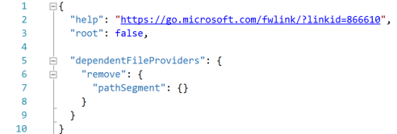

---
# required/recommended metadata

title: [File nesting in Solution Explorer]
description: 
author: [angelosp]
ms.author: [angelpe]
ms.date: [05/22/2018]
ms.topic: [TOPIC TYPE]
ms.prod: [PRODUCT VALUE]
helpviewer_keywords: [OFFLINE BOOK INDEX ENTRIES]

# optional metadata

#ROBOTS:
#ms.technology:
#keywords:
#ms.devlang: [LANGUAGES]
#manager: [andrehal]

---
# File nesting in Solution Explorer

> Note: The feature is currently only supported by ASP.NET Core projects. 

Visual Studio has been nesting related files in Solution Explorer for a long time, but until now you didn't have control over the nesting rules. Out of the box you get to pick between the presets **Off**, **Default** and **Web**, but you can always customize it exactly to your liking. You can even create solution-specific and project-specific settings, but more on all of that later. First let’s go over what you get out of the box.

## What you get out of the box

* **Off**: This option gives you a flat list of files without any file nesting whatsoever.

* **Default**: This options gives you the default file nesting behavior in Solution Explorer that Visual Studio has had since before you were able to control it. If no settings exist for given project type then no nesting happens for the project. If there are settings, like for Web for example, nesting will be applied.

* **Web**: This option applies the “Web” file nesting behavior to all the projects in the current solution. It has a lot of rules and we encourage you to check it out and tell us what you think. The very first picture in this post is highlighting just a few good examples of the file nesting that you get with this option.

## Customizing file nesting to your exact liking

If you don’t like what you get out of the box, you can always create your own, **custom** file nesting settings that make Solution Explorer nest files to your exact liking. You can add as many custom file nesting settings as you like and you can switch between them as you see fit. Every time you want to create a new one you start by choosing to either start with an empty file or to use the Web settings as your starting point:

We recommend you use Web settings as your starting point because it’s easier to tweak something that already works. If you do that you’ll be starting off with something that looks like the following (instead of being empty):

Let’s focus on the node **dependentFileProvider** and more specifically the children being added to it. Each child node is a type of rule that Visual Studio can use to nest files. For example, “having the same filename, but a different extension” is one such type of rule. Let’s go over each type of rule available to you:

* **extentionToExtention**: Use this type of rule to make **file**.js nest under **file**.ts
* **fileSuffixToExtension**: Use this type of rule to make **file**-vsdoc.js nest under **file**.js
* **addedExtension**: Use this type of rule to make **file.html**.css nest under **file.html**
* **pathSegment**: Use this type of rule to make **jquery**.min.**js** nest under **jquery.js**
* **allExtensions**: Use this type of rule to make **file**.* nest under **file**.js
* **fileToFile**: Use this type of rule to make **bower.json** nest under **.bowerrc**

> Note: Ordering is very important in every part of your custom settings file. You can change the order in which rules are executed by moving them up or down inside of the dependentFileProvider node.  For example, if you have one rule that makes file.js the parent of file.ts and another rule that makes file.coffee the parent of file.ts the order in which they appear in the file decides what happens when all three files are present at the same time: file.js, file.ts and file.coffee. Since file.ts can only have one parent, whichever rule executes first wins. Ordering is also important for rule sections themselves, not just for files within a section. As soon as a pair of files is matched with a file nesting rule, other rules down the line are ignored and next pair of files is processed.

You can manage all settings, including your own custom settings through the same button in Solution Explorer:

### Configuring the provider **extensionToExtension**

This provider lets you define file nesting rules using filename extensions. Let's take a look at an example:

 

* **cart.js** is nested under **cart.ts** because of the first extensionToExtension rule
* **cart.js** is not nested under **cart.tsx** because *.ts came before *.tsx in the rules (there can only be one parent)
* **light.css** is nested under **light.sass** because of the second extensionToExtension rule
* **home.html** is nested under **home.md** because of the second extensionToExtension rule

### Configuring the provider **fileSuffixToExtension**

This provider works just like the extensionToExtension, with the only difference being that the rule will look at the suffix of the file instead of just the extension. Let's take a look at an example:

 

* **portal-vsdoc.js** is nested under **portal.js** because of the fileSuffixToExtension rule
* every other aspect of the rule works the same way as extensionToExtension

### Configuring the provider **addedExtension**

This provider nests files with an additional extension under the file without an additional extension. The additional extension can only appear at the end of the full filename. Let's take a look at an example:

 

* **file.html.css** is nested under **file.html** because of the addedExtension rule

### Configuring the provider **pathSegment**

This provider nests files with an additional extension under the file without an additional extension. The additional extension can only appear at the middle of the full filename. Let's take a look at an example:

 

* **jquery.min.js** is nested under **jquery.js** because of the pathSegment rule

### Configuring the provider **allExtensions**

This provider lets you define file nesting rules based on extensions. Let's take a look at an example:

 

* **template**.cs and **template**.doc are nested under **template.tt** because of the allExtensions rule.

### Configuring the provider **fileToFile**

This provider lets you define file nesting rules based on the entire filenames. Let's take a look at an example:

 

* **bower.json** is nested under **.browerrc** because of the fileToFile rule

## Creating solution-specific and project-specific settings

You can create solution-specific and project-specific settings through the context menu of each solution and project:

Solution-specific and project-specific settings will be **combined** with whatever Visual Studio settings are already active. Don’t be surprised for example if you have a blank project-specific settings file, yet Solution Explorer is still nesting files. The nesting is either coming from the solution-specific settings or the Visual Studio settings. The process of merging file nesting settings goes: Visual Studio | Solution | Project.

You can tell Visual Studio to ignore solution-specific and project-specific settings, even if the files exist on disk, by enabling the option **Ignore solution and project settings** under **Tools | Options | ASP.NET Core | File Nesting**.

You can do the opposite and tell Visual Studio to **only use** the solution-specific or the project-specific settings. Remember that “root” node we saw earlier in our custom settings? If not, go back and take a look at the picture. If you set that node to **true** it tells Visual Studio to stop merging files at that level and not combine it with files higher up the hierarchy.

The great thing about solution-specific and project-specific settings is that they can be checked into source control and the entire team that works on the repo can share them.

## Disabling global file nesting rules for a particular solution or project

You can disable existing global file nesting rules for specific solutions or projects by using the **remove** action for the providers, instead of the **add**. For example if you add the following to a project it will disable all pathSegment rules that may exist globally for this specific project:

