# File nesting in Solution Explorer

**Solution Explorer** nests related files to help organize them and make them easier to locate. For example, if you add a Windows Forms form to a project, the code file for the form is nested below the form in **Solution Explorer**. In .NET Core (and .NET 5 and later) projects, file nesting can be taken a step further. You can choose between the file nesting presets **Off**, **Default**, and **Web**. You can also [customize how files are nested](#customize-file-nesting) or [create solution-specific and project-specific settings](#create-project-specific-settings).

> [!NOTE]
> In Visual Studio 2022 version 17.2 and earlier, this feature was only supported for ASP.NET Core projects.
> In version 17.3 and later the projects targeting .NET support file nesting. 

## File nesting options

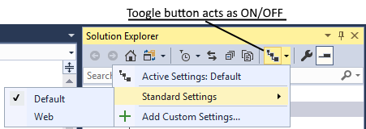

The available options for non-customized file nesting are:

* **Off**: This option gives you a flat list of files without any nesting.

* **Default**: This option gives you the default file nesting behavior in **Solution Explorer**. If no settings exist for a given project type, then no files in the project are nested. If settings exist, for example, for a web project, nesting is applied.

* **Web**: This option applies the **Web** file nesting behavior to all the projects in the current solution. It has numerous rules, and we encourage you to check it out and tell us what you think. The following screenshot highlights just a few examples of the file nesting behavior that you get with this option:

   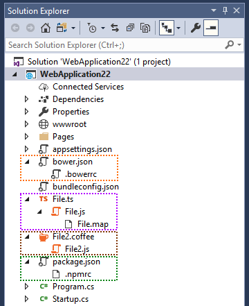

## Customize file nesting

If you don’t like what you get out-of-the-box, you can create your own, custom file nesting settings that instruct **Solution Explorer** how to nest files. You can add as many custom file nesting settings as you like, and you can switch between them as desired. To create a new custom setting, you can start with an empty file, or you can use the **Web** settings as your starting point:

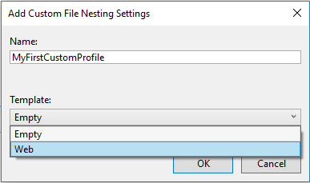

We recommend you use **Web** settings as your starting point because it’s easier to work with something that already functions. If you use the **Web** settings as your starting point, the *.filenesting.json* file looks similar to the following file:

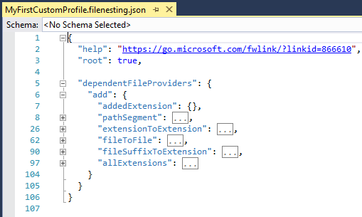

Let’s focus on the node **dependentFileProviders** and its child nodes. Each child node is a type of rule that Visual Studio can use to nest files. For example, **having the same filename, but a different extension** is one type of rule. The available rules are:

* **extensionToExtension**: Use this type of rule to nest *file.js* under *file.ts*

* **fileSuffixToExtension**: Use this type of rule to nest *file-vsdoc.js* under *file.js*

* **addedExtension**: Use this type of rule to nest *file.html.css* under *file.html*

* **pathSegment**: Use this type of rule to nest *jquery.min.js* under *jquery.js*

* **allExtensions**: Use this type of rule to nest *file.** under *file.js*

* **fileToFile**: Use this type of rule to nest *bower.json* under *.bowerrc*

### The extensionToExtension provider

This provider lets you define file nesting rules using specific file extensions. Consider the following example:

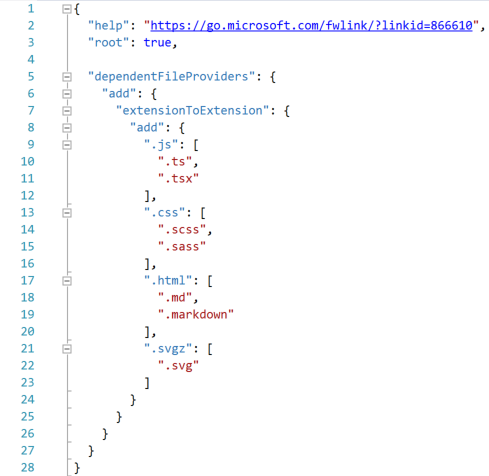

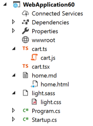

* *cart.js* is nested under *cart.ts* because of the first **extensionToExtension** rule

* *cart.js* is not nested under *cart.tsx* because **.ts** comes before **.tsx** in the rules, and there can only be one parent

* *light.css* is nested under *light.sass* because of the second **extensionToExtension** rule

* *home.html* is nested under *home.md* because of the third **extensionToExtension** rule

### The fileSuffixToExtension provider

This provider works just like the **extensionToExtension** provider, with the only difference being that the rule looks at the suffix of the file instead of just the extension. Consider the following example:


* *portal-vsdoc.js* is nested under *portal.js* because of the **fileSuffixToExtension** rule

* every other aspect of the rule works the same way as **extensionToExtension**

### The addedExtension provider

This provider nests files with an additional extension under the file without an additional extension. The additional extension can only appear at the end of the full filename.

Consider the following example:

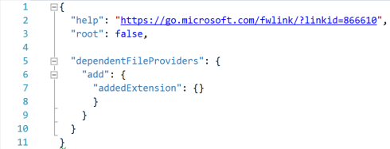

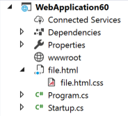

* *file.html.css* is nested under *file.html* because of the **addedExtension** rule

> [!NOTE]
> You don't specify any file extensions for the `addedExtension` rule; it automatically applies to all file extensions. That is, any file with the same name and extension as another file plus an additional extension on the end is nested under the other file. You cannot limit the effect of this provider to just specific file extensions.

### The pathSegment provider

This provider nests files with an additional extension under a file without an additional extension. The additional extension can only appear at the middle of the full filename.

Consider the following example:

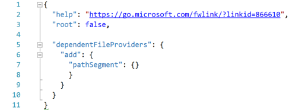

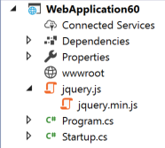

* *jquery.min.js* is nested under *jquery.js* because of the **pathSegment** rule

> [!NOTE]
> - If you don't specify any specific file extensions for the `pathSegment` rule, it applies to all file extensions. That is, any file with the same name and extension as another file plus an additional extension in the middle is nested under the other file.
> - You can limit the effect of the `pathSegment` rule to specific file extensions by specifying them in the following way:
>
>    ```json
>    "pathSegment": {
>       "add": {
>         ".*": [
>           ".js",
>           ".css",
>           ".html",
>           ".htm"
>         ]
>       }
>    }
>    ```

### The allExtensions provider

This provider lets you define file nesting rules for files with any extension but the same base file name. Consider the following example:

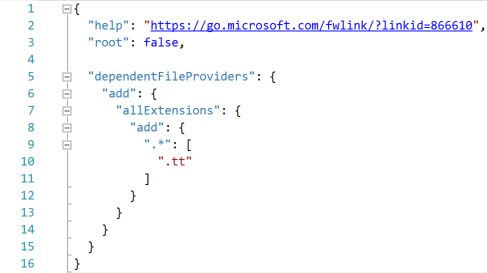

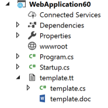

* *template.cs* and *template.doc* are nested under *template.tt* because of the **allExtensions** rule.

### The fileToFile provider

This provider lets you define file nesting rules based on entire filenames. Consider the following example:

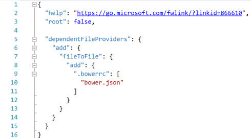

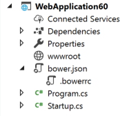

* *.bowerrc* is nested under *bower.json* because of the **fileToFile** rule

### Rule order

Ordering is important in every part of your custom settings file. You can change the order in which rules are executed by moving them up or down inside of the **dependentFileProvider** node. For example, if you have one rule that makes **file.js** the parent of **file.ts** and another rule that makes **file.coffee** the parent of **file.ts**, the order in which they appear in the file dictates the nesting behavior when all three files are present. Since **file.ts** can only have one parent, whichever rule executes first wins.

Ordering is also important for rule sections themselves, not just for files within a section. As soon as a pair of files is matched with a file nesting rule, other rules further down in the file are ignored, and the next pair of files is processed.

### File nesting button

You can manage all settings, including your own custom settings, through the same button in **Solution Explorer**:

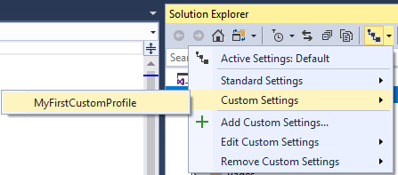

## Create project-specific settings

You can create solution-specific and project-specific settings through the right-click menu (context menu) of each solution and project:

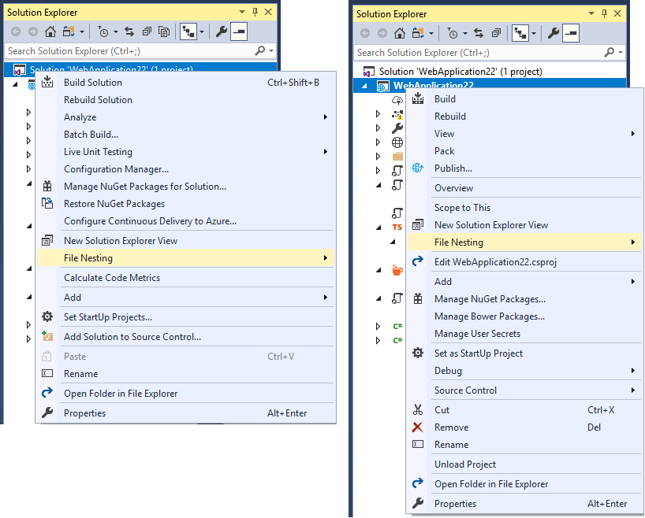

Solution-specific and project-specific settings are combined with the active Visual Studio settings. For example, you may have a blank project-specific settings file, but **Solution Explorer** is still nesting files. The nesting behavior is coming from either the solution-specific settings or the Visual Studio settings. The precedence for merging file nesting settings is: Visual Studio > Solution > Project.

You can tell Visual Studio to ignore solution-specific and project-specific settings, even if the files exist on disk, by enabling the option **Ignore solution and project settings** under **Tools** > **Options** > **ASP.NET Core** > **File Nesting**.

You can do the opposite and tell Visual Studio to *only* use the solution-specific or the project-specific settings, by setting the **root** node to **true**. Visual Studio stops merging files at that level and doesn't combine it with files higher up the hierarchy.

Solution-specific and project-specific settings can be checked into source control, and the entire team that works on the codebase can share them.

## Disable file nesting rules for a project

You can disable existing global file nesting rules for specific solutions or projects by using the **remove** action for a provider instead of **add**. For example, if you add the following settings code to a project, all **pathSegment** rules that may exist globally for this specific project are disabled:

```json
"dependentFileProviders": {
  "remove": {
    "pathSegment": {}
  }
}
```

## Related content

- [Personalize the IDE](../ide/personalizing-the-visual-studio-ide.md)
- [Solutions and projects in Visual Studio](solutions-and-projects-in-visual-studio.md)
