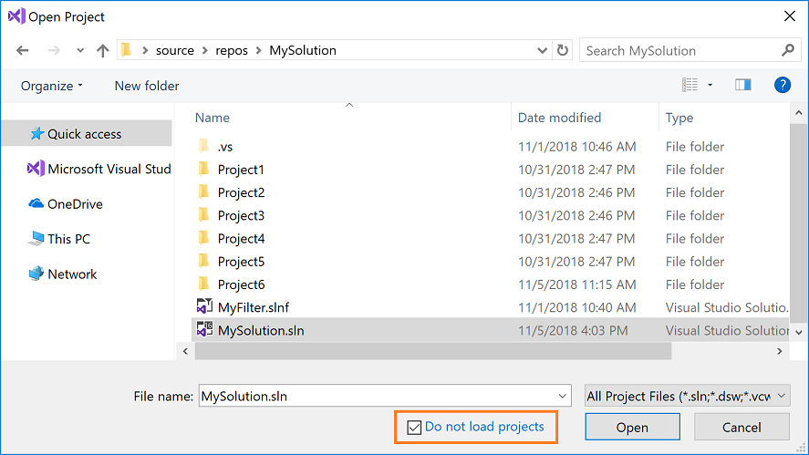
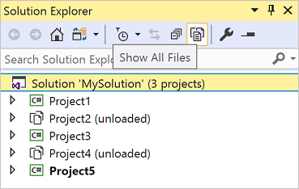
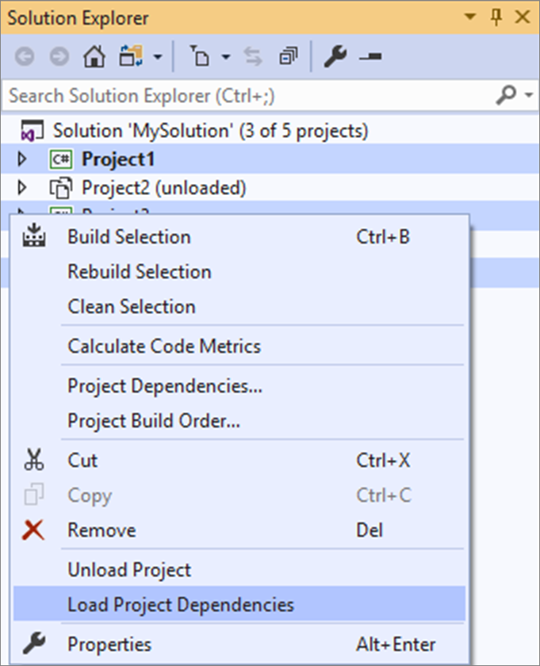
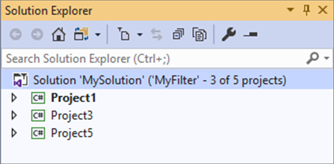
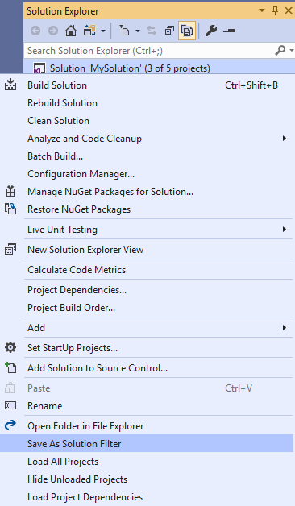
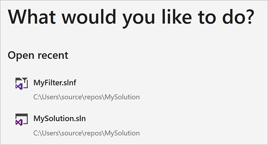

# Filtered solutions in Visual Studio

Large development teams often collaborate by using a single large solution with many projects. However, individual developers typically work on a small subset of these projects. To improve performance when opening large solutions, Visual Studio 2019 introduced *[solution filtering](/shows/visual-studio-toolbox/solution-filters-in-visual-studio/)*. Solution filtering lets you open a solution with only selective projects loaded. Loading a subset of projects in a solution decreases solution load, build, and test run time, and enables more focused review.

The following features are available:

- You can get to code faster by opening a solution without loading any of its projects. After the solution opens, you can selectively choose which projects to load.

- When you reopen a solution, Visual Studio remembers which projects were loaded in your previous session and only loads those projects.

- You can create a solution filter file to save one or more project-load configurations or share the configuration with teammates.

> [!NOTE]
> This topic applies to Visual Studio on Windows.

## Open a filtered solution

You can open a solution without loading any of its projects directly from the **Open Project** dialog or through the [command line](#command-line).

### Open Project dialog

To open a solution without loading any of its projects by using the **Open Project** dialog:

1. Choose **File** > **Open** > **Project/Solution** from the menu bar.

2. In the **Open Project** dialog, select the solution, and then select **Do not load projects**.

   

3. Choose **Open**.

   The solution opens with all of its projects unloaded.

4. In **Solution Explorer**, select the projects you want to load (press **Ctrl** while clicking to select more than one project), and then right-click on the project and choose **Reload Project**.

   

   Visual Studio will remember which projects are loaded the next time you open the solution locally.

### Command line

(New in Visual Studio 2019 version 16.1.)

To open a solution without loading any of its projects from the command line, use the [`/donotloadprojects`](../ide/reference/donotloadprojects-devenv-exe.md) switch as shown in the following example:

```cmd
devenv /donotloadprojects MySln.sln
```

## Toggle unloaded project visibility

You can choose to see either all the projects in the solution or just the loaded ones using one of the following choices in **Solution Explorer**:

- Right-click on your solution and select **Show Unloaded Projects** or **Hide Unloaded Projects**.

- Select the solution node to enable the **Show All Files** button; then, click the button to toggle the visibility of unloaded projects.

   

## Load project dependencies

In a solution where only selected projects are loaded, you may not have all of a project's project dependencies loaded. Use the **Load project dependencies** menu option to ensure that any projects that a project depends on are also loaded. Right-click on one or more loaded projects in **Solution Explorer** and choose **Load project dependencies**.



## Solution filter files

If you want to share your project-load configuration or commit it to source control, you can create a solution filter file (it has the extension *.slnf*). When you open a solution filter file, the solution opens in Visual Studio with the specified projects loaded and all the unloaded projects hidden. You can [toggle](#toggle-unloaded-project-visibility) to view the unloaded projects.

Solution filter files are visually differentiated from regular solution files by the additional funnel glyph in the icon next to the solution in **Solution Explorer**. The name of the filter and the number of loaded projects are also shown next to the solution name.



> [!NOTE]
> If new projects are added to the original solution after you create the solution filter file, they appear as unloaded projects in **Solution Explorer**.

### Create a solution filter file

1. In **Solution Explorer**, right-click on the solution and select **Save As Solution Filter**.

   

2. Choose a name and location for the solution filter file.

After you create a solution filter file, it's added to your **Recent Projects and Solutions** list for easy access:



## Related content

- [Customize file nesting in Solution Explorer](file-nesting-solution-explorer.md)
- [Optimize Visual Studio performance](optimize-visual-studio-performance.md)
