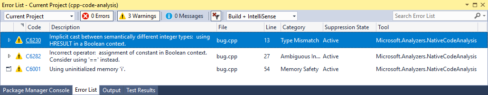
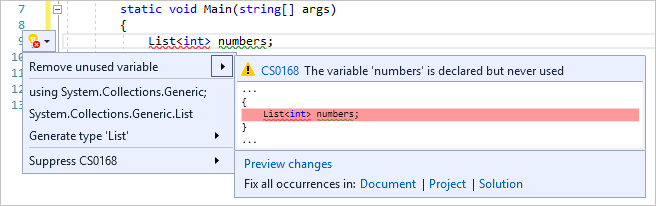
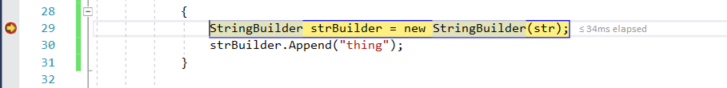

# Make code work in Visual Studio

Visual Studio includes a powerful integrated set of project build and debugging tools. This article describes how Visual Studio can help you find problems in your code by using build output, code analysis, debugging tools, and unit tests.

You've figured out the editor and created some code. Now, you want to make sure the code works properly. In Visual Studio, as with most IDEs, there are two phases to making code work: building the code to catch and resolve project and compiler errors, and running the code to find run-time and dynamic errors.

## Build your code

There are two basic types of build configuration: **Debug** and **Release**. The **Debug** configuration produces a slower, larger executable that allows for a richer interactive run-time debugging experience. The **Debug** executable should never be shipped. The **Release** configuration builds a faster, optimized executable that's appropriate to ship (at least from the perspective of the compiler). The default build configuration is **Debug**.

The easiest way to build your project is to press **F7**, but you can also start the build by selecting **Build** > **Build Solution** from the main menu.

:::image type="content" source="media/debug-build-solution-menu-item.png" alt-text="Screenshot of the Build menu in the Visual Studio IDE.":::

You can observe the build process in the **Output** window at the bottom of the Visual Studio UI (user interface). Errors, warnings, and build operations are displayed here. If you have errors (or if you have warnings above a configured level), your build fails. You can select the errors and warnings to go to the line where they occurred. Rebuild your project by either pressing **F7** again (to recompile only the files with errors) or **Ctrl**+**Alt**+**F7** (for a clean and complete rebuild).

There are two tabbed windows in the results window below the editor: the **Output** window, which contains the raw compiler output (including error messages); and the **Error List** window, which provides a sortable and filterable list of all errors and warnings.

When build succeeds, you see results like this in the **Output** window:

## Review the Error List

Unless you've made no modifications to code you have previously and successfully compiled, you probably have an error. If you're new to coding, you probably have lots of them. Errors are sometimes obvious, such as a simple syntax error or incorrect variable name, and sometimes they're difficult to understand, with only a cryptic code to guide you. For a cleaner view of the issues, navigate to the bottom of the build **Output** window and select the **Error List** tab. This action takes you to a more organized view of the errors and warnings for your project, and gives you some extra options as well.

Select on the error line in the **Error List** window to jump to the line the error occurs in. (Or turn on line numbers by pressing **Ctrl**+**Q**, typing **line numbers**, and then choosing **Turn line numbers on or off** from the results. This action is the fastest way to get to the **Options** dialog where you can turn on line numbers.)

Press **Ctrl**+**G** to quickly jump to the line number where the error occurred.

Visual Studio identifies this error with a red "squiggle" underscore. Hover over it for more details. Make the fix and it goes away, although you might introduce a new error with the correction. (This action is called a "regression".)

Walk through the error list and address all the errors in your code.

### Review errors in detail

Many errors might not make sense to you, phrased as they are in the terms of the compiler. In those cases, you might need additional information. From the **Error List** window, you can perform an automatic Bing search for more information on the error or warning. Right-click on the corresponding entry line and select **Show Error Help** from the context menu, or select the hyperlinked error code value in the **Code** column of the **Error List**.

Depending on your settings, either your web browser displays the search results for the error code and text, or a tab opens inside Visual Studio and shows the results of the Bing search. The results are from many different sources on the Internet, and you might not find all to be helpful.

## Use code analysis

Code analyzers look for common code problems that can lead to run-time errors or problems in code management.

### C# and Visual Basic code analysis

Visual Studio includes a built-in set of [.NET Compiler Platform analyzers](../code-quality/roslyn-analyzers-overview.md) that examine C# and Visual Basic code as you type. You can install more analyzers as a Visual Studio extension, or as a NuGet package. If rule violations are found, they're reported both in the Error List and in the code editor as a squiggle under the offending code.

### C++ code analysis

To analyze C++ code, run [static code analysis](/cpp/code-quality/quick-start-code-analysis-for-c-cpp). Get in the habit of running it once you've cleaned up the obvious errors that prevent a successful build, and take some time to address the warnings it might produce. You can save yourself some headaches down the road, and you might learn a few code style techniques.

Press **Alt**+**F11** (or select **Analyze** > **Run Code Analysis on Solution** from the top menu) to start static code analysis.

Any new or updated warnings appear in the **Error List** tab at the bottom of the IDE. Select a warning to jump to it in code.

## Use Quick Actions to fix or refactor code

[Quick Actions](../ide/quick-actions.md), available from the light bulb or screwdriver icon, let you refactor code inline. They're an easy way to fix common warnings quickly and effectively in C#, C++, and Visual Basic code. To access them, right-click on a warning squiggle and select **Quick Actions and refactorings**. Or, when your cursor is on the line with the colored squiggle, press **Ctrl**+**.** or select the light bulb, error light bulb, or screwdriver icon in the margin. Visual Studio then shows you a list of possible fixes or refactorings you can apply to that line of code.

Quick Actions can be used wherever code analyzers determine there's an opportunity to fix, refactor, or improve your code. Select on any line of code, right-click to open the context menu, and select **Quick Actions and refactorings**. If refactoring or improvement options are available, they're displayed. Otherwise, the message **No quick actions available here** displays in the lower-left corner of the IDE.

With experience, you can quickly use the arrow keys and **Ctrl**+**.** to check for easy refactoring opportunities and clean up your code!

## Run Code Cleanup

Visual Studio provides [on-demand formatting of your C# code file](code-styles-and-code-cleanup.md#apply-code-styles), including code style preferences, through the **Code Cleanup** button at the bottom of the editor.

In addition to formatting your file for spaces, indents, and so on, **Code Cleanup** also applies a set of code style conventions that you define. Your preferences for each code style are read from the [EditorConfig file](code-styles-and-code-cleanup.md#code-styles-in-editorconfig-files), if you have one for the project, or from the [code style settings](code-styles-and-code-cleanup.md#net-code-styles-in-the-options-dialog-box) in the **Options** dialog box.

## Debug your running code

Now that you have successfully built your code and performed a little clean up, run it by pressing **F5** or selecting **Debug** > **Start Debugging**. This action starts your app in a debug environment so you can observe its behavior in detail. The Visual Studio IDE changes while your app is running: the **Output** window is replaced by two new ones (in the default window configuration), the **Autos/Locals/Watch** tabbed window and the **Call Stack/Breakpoints/Exception Settings/Output** tabbed window. These windows have multiple tabs that allow you to inspect and evaluate your app's variables, threads, call stacks, and other behaviors as it runs.

Stop your app by pressing **Shift**+**F5** or by clicking the **Stop** button. Or, you can just close the app's main window (or command-line dialog).

If your code ran perfectly and exactly as expected, congratulations! However, sometimes your code might stop responding, or crashes, or gives you some strange results. If so, you should try to find the source of those problems and fix the bugs.

### Set simple breakpoints

[Breakpoints](../debugger/using-breakpoints.md) are the most basic and essential feature of reliable debugging. A breakpoint indicates where Visual Studio should suspend your running code so you can take a look at the values of variables, or the behavior of memory, or whether a branch of code is getting run. You don't need to rebuild a project after setting and removing breakpoints.

Set a breakpoint by clicking in the far margin of the line where you want the break to occur, or press **F9** to set a breakpoint on the current line of code. When you run your code, it pauses (or *break*) before the instructions for this line of code are executed.

Common uses for breakpoints include:

- To narrow down the source of a crash or unresponsive program, scatter breakpoints throughout and around the code of the method call you think is causing the failure. As you run code in the debugger, remove and then reset the breakpoints closer together until you find the offending line of code. See the next section to learn how to run code in the debugger.

- When you introduce new code, set a breakpoint at the beginning of it, and run the code to make sure it's behaving as expected.

- If you've implemented a complicated behavior, set breakpoints for the algorithmic code so you can inspect the values of the variables and data when the program breaks.

- If you're writing C or C++ code, use breakpoints to stop the code so you can inspect address values (look for NULL) and reference counts when debugging for memory-related failures.

For more information about using breakpoints, see [Use breakpoints in the Visual Studio debugger](../debugger/using-breakpoints.md).

### Inspect your code at run-time

When your running code hits a breakpoint and pauses, the line of code marked in yellow (the current statement) hasn't executed yet. At this point, you might want to execute the current statement and then inspect the changed values. You can use several *step* commands to execute code in the debugger. If the marked code is a method call, you can step into it by pressing **F11**. You can also *step over* the line of code by pressing **F10**. For more commands and details on how to step through code, read [Navigate through code by using the debugger](../debugger/navigating-through-code-with-the-debugger.md).

In the preceding illustration, you can advance the debugger one statement by pressing either **F10** or **F11** (since there's no method call here, both commands have the same result).

While the debugger is paused, you can inspect your variables and call stacks to determine what is going on. Are the values in the ranges you expect to see? Are calls being made in the right order?

Hover over a variable to see its current value and references. If you see a value you didn't expect, you probably have a bug in the preceding or calling code. To learn more, see [First look at the Visual Studio Debugger](../debugger/debugger-feature-tour.md).

Additionally, Visual Studio displays the **Diagnostic Tools** window, where you can observe your app's CPU and memory usage over time. Later in your app development, you can use these tools to look for unanticipated heavy CPU usage or memory allocation. Use it with the **Watch** window and breakpoints to determine what's causing unexpected heavy usage or unreleased resources. For more information, see [First look at profiling tools (C#, Visual Basic, C++, F#)](../profiling/profiling-feature-tour.md).

## Run unit tests

Unit tests are your first line of defense against code bugs because, when done correctly, they test a single "unit" of code, typically a single function, and are easier to debug than your full program. Visual Studio installs the Microsoft unit testing frameworks for both managed and native code. Use a unit testing framework to create unit tests, run them, and report the results of these tests. Rerun unit tests when you make changes, to test that your code is still working correctly. With Visual Studio Enterprise edition, you can run tests automatically after every build.

To get started, read [Generate unit tests for fuzz testing by using IntelliTest](../test/generate-unit-tests-for-your-code-with-intellitest.md).

To learn more about unit tests in Visual Studio and how they can help you create better quality code, read [Unit test basics](../test/unit-test-basics.md).

## Related content

- [First look at the debugger](../debugger/debugger-feature-tour.md)
- [Generate, fix, and refactor code](/visualstudio/ide/writing-code-in-the-code-and-text-editor#generate-fix-or-refactor-code)
- [Explore the debugger documentation](../debugger/index.yml)
