# Find code changes and other history with CodeLens

CodeLens lets you stay focused on your work while you find out what happened to your code&ndash;without leaving the editor. You can find references to a piece of code, changes to your code, linked bugs, work items, code reviews, and unit tests.

::: moniker range=">=vs-2019"

> [!NOTE]
> CodeLens is available in Visual Studio Community edition, however, the *source control* indicators are not available in this edition.

::: moniker-end

::: moniker range="vs-2017"

> [!NOTE]
> CodeLens is available only in Visual Studio Enterprise and Professional editions. It is not available in Visual Studio Community edition.

::: moniker-end

See where and how the individual parts of your code are used in your solution:

Contact your team about changes to your code without leaving the editor:

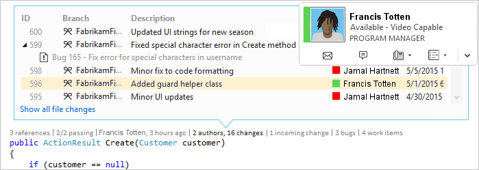

To choose the indicators that you want to see, or to turn CodeLens off and on, go to **Tools** > **Options** > **Text Editor** > **All Languages** > **CodeLens**.

## Find references to your code

You can find references in C# or Visual Basic code.

1. Choose the **references** indicator or press **Alt**+**2**.

   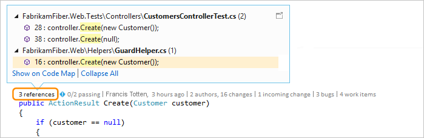

   > [!NOTE]
   > If the indicator shows **0 references**, you have no references from C# or Visual Basic code. However, there may be references in other items such as *.xaml* and *.aspx* files.

2. To view the referencing code, mouse over the reference in the list.

   

3. To open the file that contains the reference, double-click the reference.

### Code maps

To see relationships between the code and its references, [create a code map](../modeling/map-dependencies-across-your-solutions.md). In the code map shortcut menu, select **Show All References**.

## Find changes in your code

Inspect your code's history to find out what happened to your code. Or, review changes before they're merged into your code so you can better understand how changes in other branches might affect your code.

You need:

- Visual Studio Enterprise or Professional edition

- Azure DevOps Services, Team Foundation Server 2013 or later, or Git

- [Skype for Business](/skypeforbusiness/) to contact your team from the code editor

For C# or Visual Basic code that's stored with Team Foundation Version Control (TFVC) or Git, you get CodeLens details at the class and method levels (*code element-level* indicators). If your Git repository is hosted in TfGit, you also get links to TFS work items.

For file types other than *.cs* or *.vb*, you get CodeLens details for the entire file in one place at the bottom of the window (*file-level* indicators).

### Code element-level indicators

Code element-level indicators let you see who changed your code and what changes they made. Code element-level indicators are available for C# and Visual Basic code.

This is what you see when you use Team Foundation Version Control (TFVC) in Team Foundation Server or Azure DevOps Services:

The default time period is the last 12 months. If your code is stored in Team Foundation Server, you can change the time period by running the [TFSConfig command](/azure/devops/server/command-line/tfsconfig-cmd) with the [CodeIndex command](../ide/codeindex-command.md) and the **/indexHistoryPeriod** flag.

To see a detailed history of all the changes, including those from more than a year ago, choose **Show all file changes**:

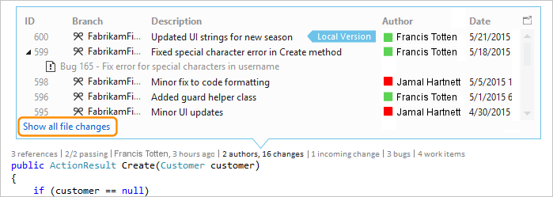

The **History** window opens:

When your files are in a Git repository and you choose the code element-level changes indicator, this is what you see:

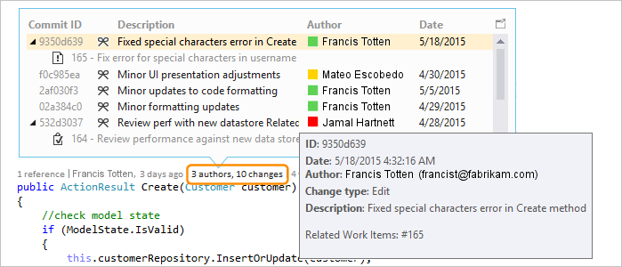

### File-level indicators

Find changes for an entire file in the file-level indicators at the bottom of the window:

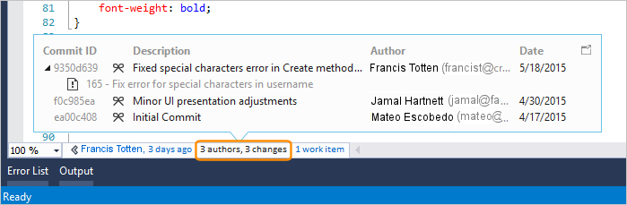

> [!NOTE]
> File-level indicators are not available for C# and Visual Basic files.

To get more details about a change, right-click that item. Depending on whether you are using TFVC or Git, there are options to compare the versions of the file, view details and track the changeset, get the selected version of the file, and email the author of that change. Some of these details appear in **Team Explorer**.

You can also see who changed your code over time. This can help you find patterns in your team's changes and assess their impact.

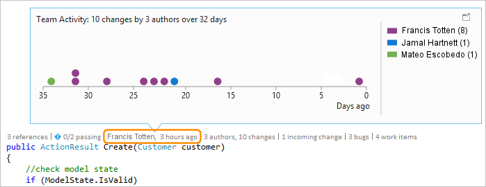

### Find changes in your current branch

Your team may have multiple branches, for example a main branch and a child development branch, to reduce the risk of breaking stable code.

You can find out how many people changed your code and how many changes were made in the main branch by pressing **Alt**+**6**:

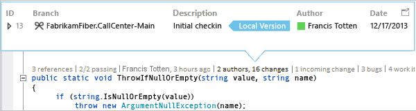

### Find when your code was branched

To find when your code was branched, navigate to your code in the child branch. Then, select the **changes** indicator or press **Alt**+**6**:

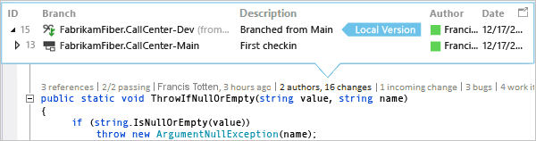

### Find incoming changes from other branches

You can view incoming changes. In the following screenshot, a bug fix was made in the "Dev" branch:

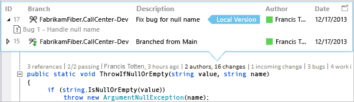

You can review the change without leaving your current branch ("Main"):

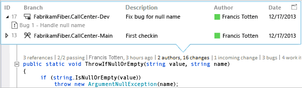

### Find when changes got merged

You can see when changes got merged, so you can determine which changes are included in your branch:

For example, your code in the Main branch now has the bug fix from the "Dev" branch:

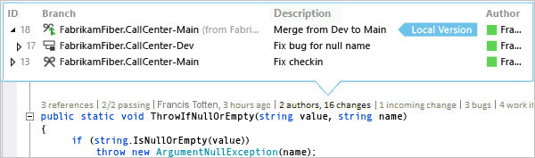

### Compare an incoming change with your local version

Compare an incoming change with your local version by pressing **Shift**+**F10**, or by double-clicking the changeset.

### Branch icons

The icon in the **Branch** column tells you how the branch is related to the branch you're working in.

|**Icon**|**The change came from:**|
|--------------| - |
||The current branch|
||The parent branch|
||A child branch|
||A peer branch|
||A branch further away than a parent, child, or peer|
||A merge from the parent branch to a child branch|
||A merge from a child branch to the parent branch|
||A merge from an unrelated branch (baseless merge)|

## Linked work items

Find linked work items by selecting the **work items** indicator or by pressing **Alt**+**8**.

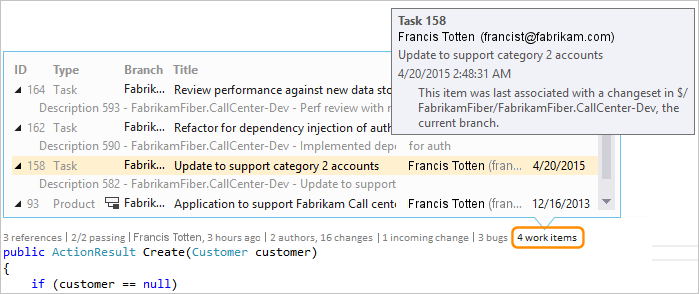

## Linked code reviews

Find linked code reviews by selecting the **reviews** indicator. To use the keyboard, hold down the **Alt** key and then press **Left arrow** or **Right arrow** to navigate the indicator options.

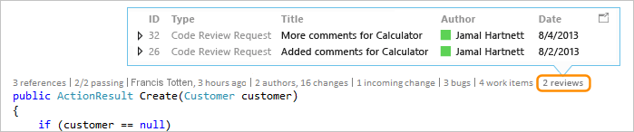

## Linked bugs

Find linked bugs by selecting the **bugs** indicator or by pressing **Alt**+**7**.

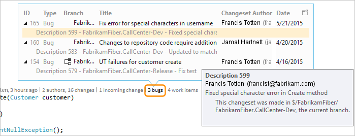

## Contact the owner of an item

Find the author of an item by selecting the **authors** indicator or by pressing **Alt**+**5**.

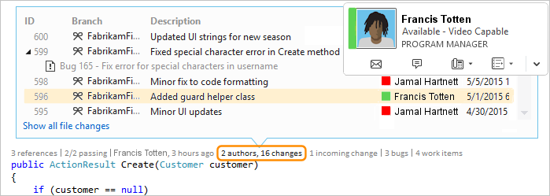

Open the shortcut menu for an item to see the contact options. If you have Lync or Skype for Business installed, you see these options:

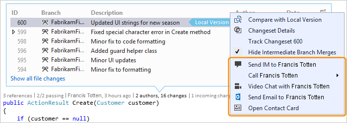

## Associated unit tests

You can discover unit tests that exist for your C# or Visual Basic code without opening **Test Explorer**.

1. Go to application code that has associated [unit test code](../test/unit-test-your-code.md).

2. If you have not already, build your application to load the CodeLens test indicators.

3. Review the tests for the code by pressing **Alt**+**3**.

     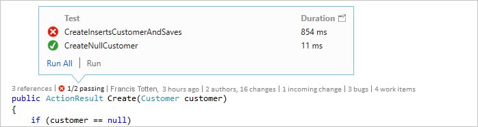

4. If you see a warning icon , the tests haven't run yet, so run them.

     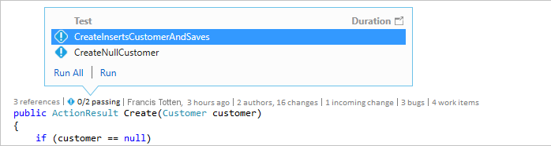

5. To review a test's definition, double-click the test item in the CodeLens indicator window to open the code file in the editor.

     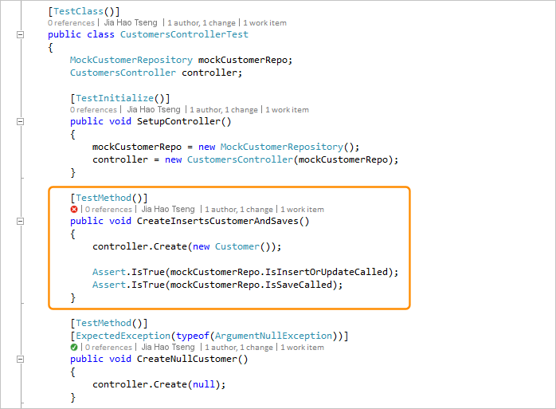

6. To review the test's results, choose the test status indicator ( or ) or press **Alt**+**1**.

     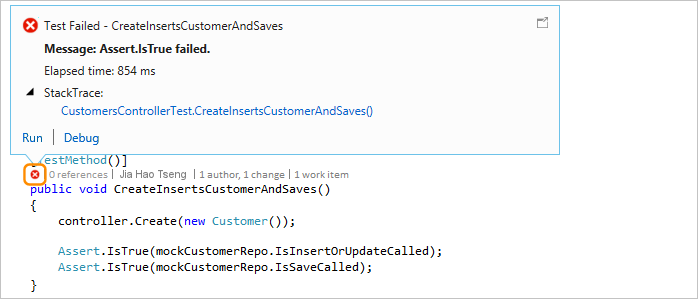

7. To see how many people changed this test, who changed this test, or how many changes were made to this test, [find your code's history](#find-changes-in-your-code) and linked items.

## Keyboard shortcuts

To use the keyboard to select indicators, press and hold the **Alt** key to display the related number keys, then press the number that corresponds to the indicator you want to select.

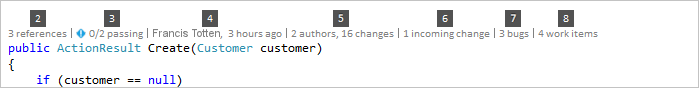

> [!NOTE]
> To select the **reviews** indicator, hold down **Alt** while using the left and right arrow keys to navigate.

## Q & A

### Q: How do I turn CodeLens off or on or choose which indicators to see?

**A:**  You can turn indicators off or on, except for the references indicator. Go to **Tools** > **Options** > **Text Editor** > **All Languages** > **CodeLens**.

When the indicators are turned on, you can also open the CodeLens options from the indicators.

Turn CodeLens file-level indicators on and off using the chevron icons at the bottom of the editor window.

### Q: Where is CodeLens?

**A:** CodeLens appears in C# and Visual Basic code at the method, class, indexer, and property level. CodeLens appears at the file level for all other types of files.

- Make sure CodeLens is turned on. Go to **Tools** > **Options** > **Text Editor** > **All Languages** > **CodeLens**.

- If your code is stored in TFS, make sure that code indexing is turned on by using the [CodeIndex command](../ide/codeindex-command.md) with the [TFS Config command](/azure/devops/server/command-line/tfsconfig-cmd).

- DevOps-related indicators appear only when work items are linked to the code and when you have permissions to open linked work items. Confirm that you have [team member permissions](/azure/devops/organizations/security/view-permissions?view=vsts&preserve-view=true).

- Unit test indicators don't appear when application code doesn't have unit tests. Test status indicators appear automatically in test projects. If you know that your application code has unit tests, but the test indicators don't appear, try building the solution (**Ctrl**+**Shift**+**B**).

::: moniker range=">=vs-2019"

> [!TIP]
> CodeLens is available in Visual Studio Community edition, however, the *source control* indicators are not available in this edition.

::: moniker-end

::: moniker range="vs-2017"

> [!TIP]
> CodeLens is not available in Visual Studio Community edition.

::: moniker-end

### Q: Why don't I see the work item details for a commit?

**A:** This might happen because CodeLens can't find the work items in Azure Boards or TFS. Check that you're connected to the project that has those work items, and that you have permissions to see those work items. Work item details might also not show if the commit description has incorrect information about the work item IDs in Azure Boards or TFS.

### Q: Why don't I see the Skype indicators?

**A:** Skype indicators don't appear if you're not signed into Skype for Business, don't have it installed, or don't have a supported configuration. However, you can still send email:

**Which Skype and Lync configurations are supported?**

- Skype for Business (32-bit or 64-bit)

- Lync 2010 or later alone (32-bit or 64-bit), but not Lync Basic 2013 with Windows 8.1

CodeLens doesn't support having different versions of Lync or Skype installed. They might not be localized for all localized versions of Visual Studio.

### Q: How do I change the font and color for CodeLens?

**A:** Go to **Tools** > **Options** > **Environment** > **Fonts and Colors**.

To use the keyboard:

1. Press **Alt**+**T**+**O** to open the **Options** dialog box.

2. Press **Up Arrow** or **Down Arrow** to go to the **Environment** node, then press **Left Arrow** to expand the node.

3. Press **Down Arrow** to go to **Fonts and Colors**.

4. Press **Tab** to go to the **Show settings for** list, and then press **Down Arrow** to select **CodeLens**.

### Q: Can I move the CodeLens heads-up display?

**A:** Yes, choose  to dock CodeLens as a window.

### Q: How do I refresh the indicators?

**A:** This depends on the indicator:

- **References**: This indicator updates automatically when the code changes. If the **References** indicator is docked as a separate window, refresh the indicator by selecting **Refresh**:

   

- **Team**: Refresh these indicators by selecting **Refresh CodeLens Team Indicators** from the right-click menu:

   

- **Test**: [Find unit tests for your code](#associated-unit-tests) to refresh the **Test** indicator.

### Q: What's "Local Version"?

**A:** The **Local Version** arrow points at the most recent changeset in your local version of a file. When the server has more recent changesets, they appear above or below the **Local Version** arrow, depending on the order used to sort the changesets.

### Q: Can I manage how CodeLens processes code to show history and linked items?

**A:** Yes. If your code is in TFS, use the [CodeIndex command](../ide/codeindex-command.md) with the [TFS Config command](/azure/devops/server/command-line/tfsconfig-cmd).

### Q: My CodeLens test indicators no longer appear in my file when I first open my solution. How can I load them?

**A:** Rebuild your project to get CodeLens test indicators to load in your file. To improve performance, Visual Studio no longer fetches source information for test indicators when code files are loaded. Test indicators are loaded after a build, or when you navigate to a test by double-clicking on it in **Test Explorer**.

## See also

- [Features of the code editor](../ide/writing-code-in-the-code-and-text-editor.md)
