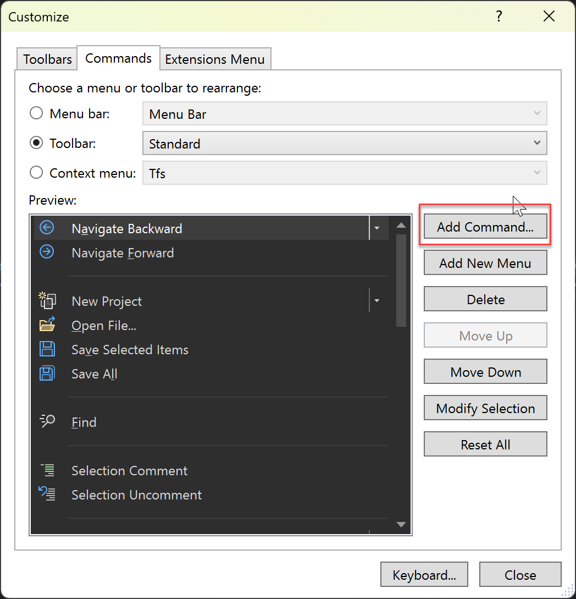
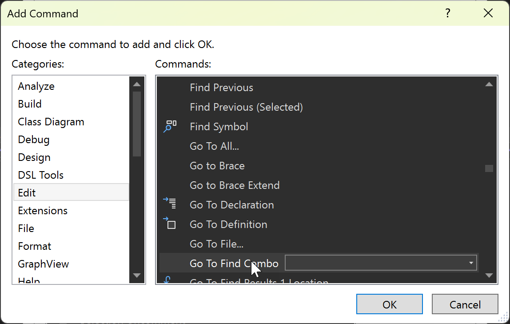

# Go to Find Combo box

You can search for text and run Visual Studio commands from the **Go to Find Combo** box, previously known as the **Find/Command** box. The equivalent of the **Find/Command** box is still available as a toolbar control, but it is named **Go to Find Combo** and is no longer visible by default. To display the **Go to Find Combo** box, follow these steps:

1. Choose **Add or Remove Buttons** on the **Standard** toolbar (the small arrow-like control at the right end of the toolbar).
1. On the menu that appears, choose **Customize**.
1. On the **Customize** dialog box, choose **Add Command**.

   

1. On the **Add Command** dialog box, choose the **Edit** category, and in the list, scroll down or press **G** to find and select **Go to Find Combo**, and choose **OK**.

   

The combobox appears on the toolbar.

   

To run a Visual Studio command, preface it with a greater than (**>**) sign.

The **Go to Find Combo** box retains the last 20 items entered and displays them in a drop-down list. You can navigate through the list by choosing the **arrow keys**.

## Searching for text

By default, when you specify text in the **Go to Find Combo** box and then choose the **Enter** key, Visual Studio searches the current document or tool window using the options that are specified in the **Find in Files** dialog box. For more information, see [Finding and replacing text](../ide/finding-and-replacing-text.md).

## Entering commands

To use the **Go to Find Combo** box to issue a single Visual Studio command or alias rather than search for text, preface the command with a greater than (**>**) symbol. For example:

```
>File.NewFile c:\temp\MyFile /t:"General\Text File"
```

Alternatively, you can also use the **Command** window to enter and execute single or multiple commands. Some commands or aliases can be entered and executed by themselves; others have required arguments in their syntax. For a list of commands that have arguments, see [Visual Studio commands](../ide/reference/visual-studio-commands.md).

## Escape characters

A caret (**^**) character in a command means that the character immediately following it is interpreted literally, rather than as a control character. This can be used to embed straight quotation marks (**"**), spaces, leading slashes, carets, or any other literal characters in a parameter or switch value, with the exception of switch names. For example:

```
>Edit.Find ^^t /regex
```

A caret functions the same whether it is inside or outside quotation marks. If a caret is the last character on the line, it is ignored.

## Related content

- [Command window](../ide/reference/command-window.md)
- [Finding and replacing text](../ide/finding-and-replacing-text.md)
