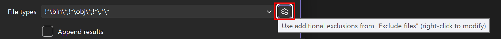
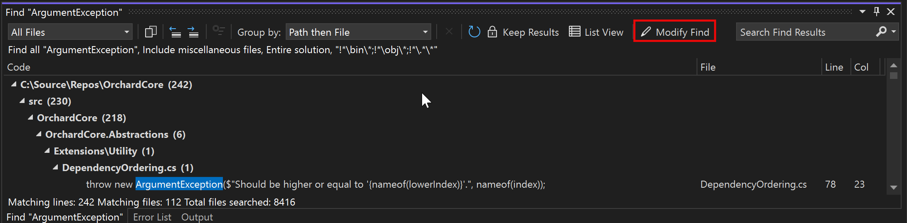

# Find in Files

**Find in Files** allows you to search a specified set of files. Visual Studio lists the matching results in the **Find Results** window in the IDE. How the results appear depends on the options you choose on the **Find in Files** tab of the **Find and Replace** dialog box.

::: moniker range="visualstudio"

:::image type="content" source="media/visualstudio/find-files.png" alt-text="Screenshot of the Find and Replace dialog box in Visual Studio, with the Find in Files tab open.":::

::: moniker-end

::: moniker range="vs-2022"

:::image type="content" source="media/vs-2022/find-files.png" alt-text="Screenshot of the Find and Replace dialog box in Visual Studio 2022, with the Find in Files tab open.":::

::: moniker-end

::: moniker range="vs-2019"

:::image type="content" source="media/find-files-vs2019.png" alt-text="Screenshot of the Find and Replace dialog box in Visual Studio 2019, with the Find in Files tab open.":::

> [!IMPORTANT]
> If you're using **Visual Studio 2019** [**version 16.6**](/visualstudio/releases/2019/release-notes-v16.6/) or earlier, the **Find and Replace** dialog box might not look like it appears here. Switch to the [Visual Studio 2017](find-in-files.md?view=vs-2017&preserve-view=true) version of this page for descriptions that'll match what you see on your screen.

::: moniker-end

## How to display Find in Files

Use the following steps to open the **Find and Replace** dialog box, or press **Ctrl**+**Shift**+**F**.

:::moniker range="<=vs-2019"

1. Press **Ctrl**+**Q** and enter "find" in the search box at the top of the screen.

1. Choose **Find in files** from the list of results.

or
:::moniker-end

1. On the menu bar, select **Edit** > **Find and Replace**.

1. Choose **Find in Files** from the fly-out menu.

To cancel a Find operation, press **Ctrl**+**Break**.

> [!NOTE]
> The **Find and Replace** tool doesn't search directories with the `Hidden` or `System` attribute.

::: moniker range=">=vs-2022"

## Search box

To search for a new text string or expression, specify it in the Search box. To search for any of the 20 strings that you searched for most recently, open the drop-down list and select the string.

You can select or clear the following option(s):

- **Match case** - Use this option to make sure that your search is case-sensitive.
- **Match whole word** - Use this option to make sure that your search returns only whole word matches.
- **Use regular expressions** - Use this option to use special notations that define patterns of text to match in the Search box (or in the **Replace** text box). For a list of these notations, see [Using regular expressions in Visual Studio](../ide/using-regular-expressions-in-visual-studio.md).

    > [!Important]
    > The **Expression Builder** button appears next to the Search box only if you've selected the **Use regular expressions** checkbox.
    >
    > :::image type="content" source="media/vs-2022/find-files-expression-builder.png" alt-text="Screenshot of the Find in Files dialog box that includes and outline around the Expression Builder button and the Use Regular Expressions checkbox.":::

## Look in

The option you choose from the **Look in** drop-down list determines whether **Find in Files** searches the entire workspace, the entire solution, the current project, the current directory, all open documents, or the current document.

You can also use the adjacent **Browse (...)** button to locate where you want to search. Even better, if you've already specified a directory, this button will append the new directory instead of replacing it. For instance, if your "Look in" value was ".\Code", you could select the **Browse (...)** button and navigate to a folder named "Shared Code". The **Browse (...)** box would now show ".\Code;.\Shared Code" and when the Find command is executed, it searches both of those folders.

To refine your search, you can select or clear the following option(s):

- **Include external items** - Use this option to include referenced files from outside a C++ project, that is, files like "windows.h" that are included by your code files, but aren't part of a solution. This option only applies to C++ projects.
- **Include miscellaneous files** - Use this option to include miscellaneous files, which are files that you've opened but aren't part of a solution. See [Miscellaneous files](./reference/miscellaneous-files.md).

## File types

The **File types** option indicates the types of files to search through in the **Look in** directories. Select any item in the list to enter a preconfigured search string that will find files of those particular types.

:::image type="content" source="media/vs-2022/find-file-types.png" alt-text="Screenshot of the File Types section of the Find In Files dialog box.":::

You can search for multiple file types by separating them with a semicolon (`;`). You can also exclude folders and files by prefixing any path or file type with an exclamation mark (`!`).

:::moniker-end

:::moniker range="visualstudio"
You can permanently exclude some files from search; see [Exclude files from search](finding-and-replacing-text.md#exclude-files-from-search). To toggle these exclusions, use the button.

:::moniker-end
  
:::moniker range=">=vs-2022"

### Append results

Use this option to append the results from the current search to previous search results.

::: moniker-end

::: moniker range="vs-2019"

## Search box

To search for a new text string or expression, specify it in the Search box. To search for any of the 20 strings that you searched for most recently, open the drop-down list and select the string.

You can select or clear the following option(s):

- **Match case** - Use this option to make sure that your search is case-sensitive.
- **Match whole word** - Use this option to make sure that your search returns only whole word matches.
- **Use regular expressions** - Use this option to use special notations that define patterns of text to match in the Search box (or in the **Replace** text box). For a list of these notations, see [Using regular expressions in Visual Studio](../ide/using-regular-expressions-in-visual-studio.md).

    > [!Important]
    > The **Expression Builder** button appears next to the Search box only if you've selected the **Use regular expressions** checkbox.
    >
    > :::image type="content" source="media/find-files-expression-builder-vs-2019.png" alt-text="Screenshot of the Find in Files dialog box that includes and outline around the Expression Builder button and the Use Regular Expressions checkbox.":::

## Look in

The option you choose from the **Look in** drop-down list determines whether **Find in Files** searches the entire workspace, the entire solution, the current project, the current directory, all open documents, or the current document.

You can also use the adjacent **Browse (...)** button to locate where you want to search. Even better, if you've already specified a directory, this button appends the new directory instead of replacing it. For instance, if your "Look in" value was ".\Code", you could select the **Browse (...)** button and navigate to a folder named "Shared Code". The **Browse (...)** box would now show ".\Code;.\Shared Code" and when the Find command is executed, it searches both of those folders.

To refine your search, you can select or clear the following option(s):

- **Include external items** - Use this option to include external items, such as files like "windows.h" that you might reference but aren't part of a solution.
- **Include miscellaneous files** - Use this option to include miscellaneous files, such as files that you've opened but aren't part of a solution.

## File types

The **File types** option indicates the types of files to search through in the **Look in** directories. Select any item in the list to enter a preconfigured search string that will find files of those particular types.

:::image type="content" source="media/find-file-types.png" alt-text="Screenshot of the File Types section of the Find In Files dialog box.":::

You can search for multiple file types by separating them with a semicolon (`;`). You can also exclude folders and files by prefixing any path or file type with an exclamation mark (`!`).

### Append results

Use this option to append the results from the current search to previous search results.

::: moniker-end

:::moniker range=">=vs-2022"

## Search results

When you perform a search for all results, results appear as they become available.

> [!NOTE]
> Visual Studio begins building an index after your code context is loaded, such as when opening a new project, changing branches, or otherwise changing the file list. If you search while Visual Studio is still indexing your source files, you might see a warning that results are incomplete.

With Visual Studio 17.12 and later, if you want to repeat the same search after doing further work, you can select the clockwise arrow icon to refresh the results. This ensures all changes you've made since the last Find are reflected without having to reopen the Find window.

## Modify find

Use the **Modify Find** button (**Repeat Find** in some versions) in the results window to refine the search criteria without having to recreate the same search criteria in the Find window. Clicking **Modify Find** reopens Find in Files with your prior search criteria for that set of results.

:::moniker-end

### Keep results

You can keep the results from one search while you're performing other searches. This makes it easy to compare results and see them side-by-side.

:::moniker range=">=vs-2022"

:::image type="content" source="media/vs-2022/find-files-search-results.png" alt-text="Screenshot of the Search Results window with three search results as tabs showing.":::

:::moniker-end

:::moniker range="<=vs-2019"

:::image type="content" source="media/find-files-search-results.png" alt-text="Screenshot of the Search Results window with three search results as tabs showing.":::

:::moniker-end

To keep several search results, select the **Keep Results** button after each search. Then, when you search for something else, the results are shown in a new tab. You can keep the results of up to five searches. If you've already got five search results showing, the next search will reuse the oldest search result tab.

:::moniker range="visualstudio"

You can set Visual Studio to always keep results. In the **Tools** > **Options** pane, expand the **All Settings** > **Environment** > **Search** > **Find and Replace** section. In the **Find in Files** group, select the **Keep search results by default** checkbox.

:::moniker-end
:::moniker range="vs-2022"

In Visual Studio 2022 and later, you can set Visual Studio to always keep results. In the **Tools** > **Options** dialog, expand the **Environment** > **Find and Replace** section, and select the **Keep search results by default** checkbox.

:::moniker-end

## Related content

- [Replace in files](../ide/replace-in-files.md)
- [Find and replace text](../ide/finding-and-replacing-text.md)
- [Visual Studio commands](../ide/reference/visual-studio-commands.md)
