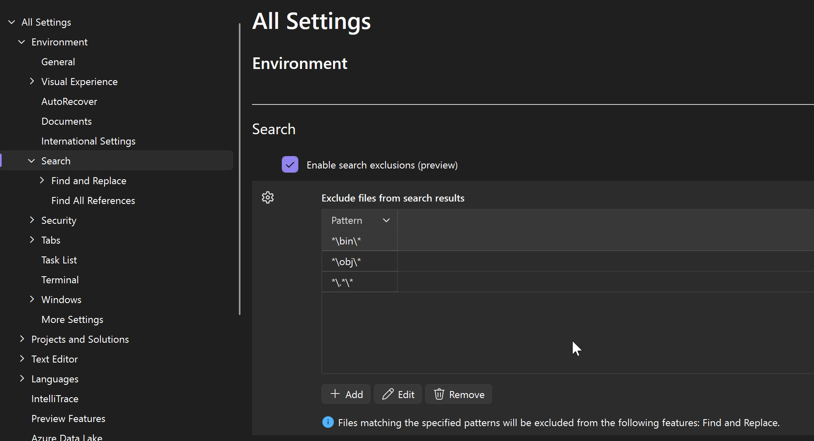
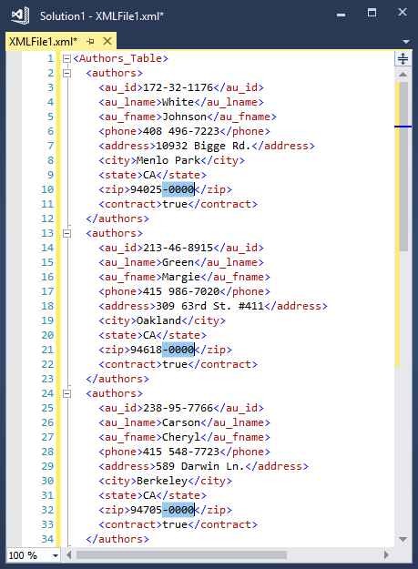

# Find and replace text in Visual Studio

In this article, you learn how to find and replace text in the Visual Studio editor by using [the single file find-and-replace](#control) (**Ctrl**+**F** or **Ctrl**+**H**) or [multi-file find-and-replace](#multifile) (**Ctrl**+**Shift**+**F** or **Ctrl**+**Shift**+**H**). You can also find and replace *some* instances of a pattern by using *[multi-caret selection](#multi-caret-selection)*.  In addition to the editor, you can also find and replace text in certain other text-based windows such as the **Find Results** windows, in designer windows such as the XAML designer and Windows Forms designer, and in tool windows.

> [!NOTE]
> If you're looking for information on Visual Studio Code, visit the [**VS Code find and replace docs**](https://code.visualstudio.com/docs/editor/codebasics#_find-and-replace).

> [!TIP]
> If you want to rename code symbols such as variables and methods, it's better to *[refactor](../ide/reference/rename.md)* them than to use find-and-replace. Refactoring is intelligent and understands scope, whereas find-and-replace blindly replaces all instances. With Visual Studio 2022 version 17.6 or later, you can also use [All in One Search](visual-studio-search.md) to search code intelligently, in a way that accounts for the semantic meaning of your code, not just the text itself.

You can scope searches to the current document, the current solution, or a custom set of folders. You can also specify a set of file name extensions for multi-file searches. Customize search syntax by using .NET [regular expressions](../ide/using-regular-expressions-in-visual-studio.md).

> [!TIP]
> The [Find/Command](../ide/find-command-box.md) box is available as a toolbar control, but isn't visible by default. To display the **Find/Command** box, select **Add or Remove Buttons** on the **Standard** toolbar, and then select **Find**.

## Find and Replace within a single file

- Press **Ctrl**+**F** as a shortcut to *find* a string in the current file.
- Press **Ctrl**+**H** as a shortcut to *find and replace* a string in the current file.

The **Find and Replace** control appears in the upper right corner of the code editor window. It immediately highlights every occurrence of the given search string in the current document. You can navigate from one occurrence to another by choosing the **Find Next** button or the **Find Previous** button on the search control.

::: moniker range=">=vs-2022"

:::image type="content" source="media/vs-2022/find-and-replace-box.png" alt-text="Screenshot of the Find and Replace dialog in the Editor in Visual Studio.":::

::: moniker-end

::: moniker range="<=vs-2019"

:::image type="content" source="media/find-and-replace-box.png" alt-text="Screenshot of the Find and Replace dialog in the Editor in Visual Studio 2019 and earlier versions.":::

::: moniker-end

You can access replacement options by choosing the button next to the **Find** text box. To make one replacement at a time, choose the **Replace Next** button next to the **Replace** text box. To replace all matches, choose the **Replace All** button.

To change the highlight color for matches, choose the **Tools** menu, select **Options**, and then choose **Environment**, and select **Fonts and Colors**. In the **Show settings for** list, select **Text Editor**, and then in the **Display items** list, select **Find Match Highlight**.

### Search tool windows

You can use the **Find** control in code or text windows, such as **Output** windows and **Find Results** windows, by selecting **Edit** > **Find and Replace** or pressing **Ctrl+F**.

A version of the **Find** control is also available in some tool windows. For example, you can filter the list of controls in the **Toolbox** window by entering text in the search box. Other tool windows that allow you to search their contents include **Solution Explorer**, the **Properties** window, and **Team Explorer**.

## Find-and-Replace in multiple files

**Find in Files** allows you to search a specified set of files. The matches Visual Studio finds are listed in the **Find Results** window in the IDE. How the results appear depends on the options you choose in the **Find and Replace** dialog box.

Open the **Find and Replace** dialog box by pressing **Ctrl**+**Shift**+**F**, or:

:::moniker range="<=vs-2019"

1. Press **Ctrl**+**Q** and enter "find" in the search box at the top of the screen.
1. Choose **Find in files** from the list of results.

:::image type="content" source="media/find-files-vs2019.png" alt-text="Screenshot of the Find and Replace dialog box in Visual Studio 2019, with the Find in Files tab open.":::

> [!IMPORTANT]
> If you are using **Visual Studio 2019** [**version 16.6**](/visualstudio/releases/2019/release-notes-v16.6/) or earlier, the **Find and Replace** dialog box might not look like it appears here. Switch to the [Visual Studio 2017](find-in-files.md?view=vs-2017&preserve-view=true) version of this page for descriptions that'll match what you see on your screen.

:::moniker-end

::: moniker range="vs-2022"

1. On the menu bar, select **Edit** > **Find and Replace**.
1. Choose **Find in Files** from the fly-out menu.

:::image type="content" source="media/vs-2022/find-files.png" alt-text="Screenshot of the Find and Replace dialog box in Visual Studio 2022, with the Find in Files tab open.":::

:::moniker-end

::: moniker range="visualstudio"

1. On the menu bar, select **Edit** > **Find and Replace**.
1. Choose **Find in Files** from the fly-out menu.

:::image type="content" source="media/visualstudio/find-files.png" alt-text="Screenshot of the Find and Replace dialog box in Visual Studio, with the Find in Files tab open.":::

:::moniker-end

To expose the **Replace** text box, use the down arrow to the left of the **Find** text, or choose the tab **Replace in Files**. When you switch to replace mode, an additional text field appears for the replacement text, and a checkbox appears that provides the option to preserve case when replacing text.

Set the scope of your search and replace operation to:

- The currently open file
- All open documents
- The entire solution
- The current project
- Specified folder sets
- Specified file extensions

The **Find and Replace** tool does not search directories with the `Hidden` or `System` attribute.

:::moniker range="visualstudio"
You can permanently exclude some files from search; see [Exclude files from search](#exclude-files-from-search).
:::moniker-end
  
### Cancel a search

To cancel a Find or Replace operation, press **Ctrl**+**Break**.

For more information, see [Find in files](../ide/find-in-files.md) and [Replace in files](../ide/replace-in-files.md), and for more about using regular expressions, see [Use Regular Expressions](../ide/using-regular-expressions-in-visual-studio.md).

### Find Results

When you choose **Find All**, a **Find Results** window opens and lists the matches for your search. Selecting a result in the list displays the associated file and highlights the match. If the file is not already open for editing, it is opened in a preview tab in the right side of the tab well. You can use the **Find** control to search through the **Find Results** list.

### Create custom search folder sets

You can define a search scope by choosing the **Choose Search Folders** button (it looks like **...**) next to the **Look in** box. In the **Choose Search Folders** dialog box, you can specify a set of folders to search, and you can save the specification so that you can reuse it later.

> [!TIP]
> If you've mapped a remote machine's drive to your local machine, you can specify folders to search on the remote machine.

### Create custom component sets

You can define component sets as your search scope by choosing the **Edit Custom Component Set** button next to the **Look in** box. You can specify installed .NET or COM components, Visual Studio projects that are included in your solution, or any assembly or type library (*.dll*, *.tlb*, *.olb*, *.exe*, or *.ocx*). To search references, select the **Look in references** box.

:::moniker range="visualstudio"

## Exclude files from search

You can exclude specific files such as build artifacts, minified scripts, or generated files, that you don't want to be included in the typical search.

To set up files to exclude, go to **Tools > Options > Environment > Search**, and look for the **Exclude files from search results** section. There, you can add, edit, or remove glob patterns to control exactly which files are left out of your search results.

These exclusions are automatically applied in [Quick Find](#control). For [Find in Files](#multifile), these exclusions are applied in addition to any exclusions in the **File types** field. You can toggle the settings level exclusions on or off via the toggle button on the right of the **File types**.

:::moniker-end

## Multi-caret selection

Use *multi-caret selection* to make the same edit in two or more places at the same time. For example, you can insert the same text or modify existing text in multiple locations at the same time.

::: moniker range=">=vs-2022"

In Visual Studio 2022 and later, pasting multiple lines into the same number of carets will insert each line to a respective caret. In earlier versions, pasting multiple lines into multiple carets results in the entire clipboard being duplicated at each caret.

To use multi-caret, press **Ctrl**+**Alt**+**mouse click** or **Alt**+**Shift**+**.** and then use **Ctrl**+**Shift**+**arrow key** to expand selections. Next, press **Ctrl**+**C** to copy the text in multiple selections. Use **Alt**+**Shift**+**mouse click** to create multiple carets for each line to paste in where you want them. Finally, press **Ctrl**+**V** to paste each line at its own caret.

:::image type="content" source="media/vs-2022/multi-caret-copy-paste.gif" alt-text="An animation of the multi-caret selection action in Visual Studio.":::

To select multiple carets: 
- Use **Alt**+**Shift**+**up arrow key** (or **down arrow key**) or **Alt**+**Shift**+**mouse drag** to select with multiple carets. If you prefer to keep using a box selection with **Alt**+**Shift**+**arrow keys** and **Alt**+**Shift**+**mouse drag** when you expand a multi-caret selection, go to **Tools** > **Options** > **Text Editor** > **Advanced** and select **Use box selection**.
- Alternatively, access multi-caret selection from the menu bar by selecting **Edit** > **Multiple Carets**, and then selecting the action you want.

|Multi-caret Keyboard Shortcut|Action|Command|
|-|-|-|
| **Alt**+**Shift**+**.** | Use multi-caret | Edit.InsertNextMatchingCaret |
| **Ctrl**+**Shift**+**arrow key** | Expand selections | Edit.SizeControlUp, Edit.SizeControlDown, Edit.SizeControlRight, Edit.SizeControlLeft |
| **Alt**+**Shift**+**up arrow key** (or **down arrow key**)| Select multiple carets | Edit.LineUpExtendColumn, Edit.LineDownExtendColumn |

::: moniker-end

::: moniker range="<=vs-2019"

In the following screenshot, `-0000` is selected in three locations; if the user presses **Delete**, all three selections are deleted:

To select multiple carets, click or make first text selection as usual, and then press **Ctrl**+**Alt** while you click or select text in each additional location. You can also automatically add matching text as additional selections, or select a box of text to edit identically on each line.

> [!TIP]
> If you've selected **Alt** as the modifier key for mouse-click in "Go to Definition" from **Tools** > **Options** > **Text Editor** > **General**, multi-caret select is disabled. For more information, see [Options dialog box: Text Editor /> General](reference/options-text-editor-general.md).

### Commands

Use the following keys and actions for multi-caret selection behaviors:

|Shortcut|Action|
|-|-|
|**Ctrl**+**Alt** + click|Add a secondary caret|
|**Ctrl**+**Alt** + double-click|Add a secondary word selection|
|**Ctrl**+**Alt** + click + drag|Add a secondary selection|
|**Shift**+**Alt**+**.**|Add the next matching text as a selection|
|**Shift**+**Alt**+**;**|Add all matching text as selections|
|**Shift**+**Alt**+**,**|Remove last selected occurrence|
|**Shift**+**Alt**+**/**|Skip next matching occurrence|
|**Alt** + click|Add a box selection|
|**Esc** or click|Clear all selections|

Some of the commands are also available on the **Edit** menu, under **Multiple Carets**:

:::image type="content" source="media/edit-menu-multiple-carets-find-replace.png" alt-text="Screenshot of the Multiple Carets fly-out menu in Visual Studio":::

::: moniker-end

## Related content

- [Use regular expressions in Visual Studio](../ide/using-regular-expressions-in-visual-studio.md)
- [Refactor code in Visual Studio](../ide/refactoring-in-visual-studio.md)
