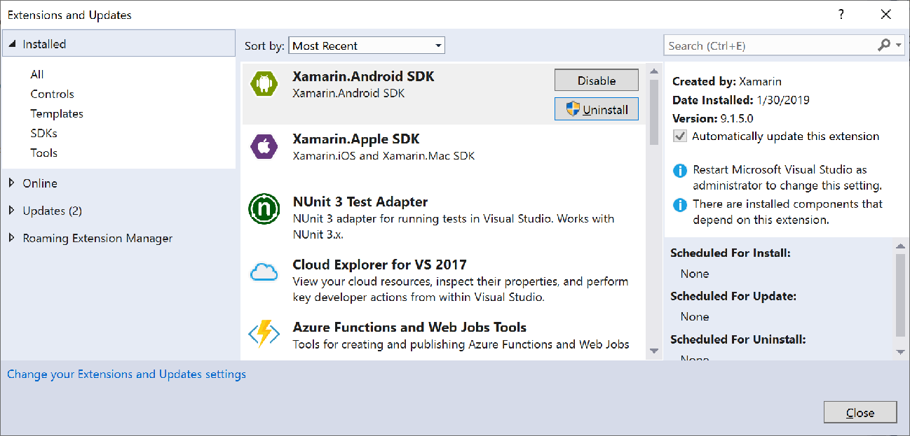

# Manage extensions for Visual Studio

Extensions are code packages that run inside Visual Studio and provide new or improved features. Extensions may be controls, samples, templates, tools, or other components that add functionality to Visual Studio, for example, [Live Share](https://marketplace.visualstudio.com/items?itemName=MS-vsliveshare.vsls-vs) or [Visual Studio IntelliCode](https://marketplace.visualstudio.com/items?itemName=VisualStudioExptTeam.VSIntelliCode).

For information about creating Visual Studio extensions, see [Visual Studio SDK](../extensibility/visual-studio-sdk.md). For information about using extensions, see the individual extension page on [Visual Studio Marketplace](https://marketplace.visualstudio.com).

::: moniker range="vs-2017"

## Extensions and Updates dialog box

Use the **Extensions and Updates** dialog box to install and manage Visual Studio extensions. To open the **Extensions and Updates** dialog, choose **Tools** > **Extensions and Updates**, or type **Extensions** in the **Quick Launch** search box.

::: moniker-end

::: moniker range=">=vs-2019"

## Manage Extensions dialog box

Use the **Manage Extensions** dialog box to install and manage Visual Studio extensions. To open the **Manage Extensions** dialog, choose **Extensions** > **Manage Extensions**. Or, type **Extensions** in the search box and choose **Manage Extensions**.

::: moniker-end

The pane on the left categorizes extensions by those that are installed, those available on Visual Studio Marketplace (**Online**), and those that have updates available. **Roaming Extension Manager** keeps a list of all the Visual Studio extensions you've installed on any machine or instance of Visual Studio. It's designed to let you find your favorite extensions more easily.

## Find and install extensions

::: moniker range="vs-2017"

You can install extensions from [Visual Studio Marketplace](https://marketplace.visualstudio.com) or the Extensions and Updates dialog box in Visual Studio.

To install extensions from within Visual Studio:

1. From **Tools** > **Extensions and Updates**, find the extension you want to install. If you know the name or part of the name of the extension, you can search in the **Search** window.

2. Select **Download**.

   The extension is scheduled for install. Your extension will be installed after all instances of Visual Studio have been closed.

If you try to install an extension that has dependencies, the installer verifies whether they're already installed. If they aren't installed, the **Extensions and Updates** dialog box lists the dependencies that must be installed before you can install the extension.

### Install without using the Extensions and Updates dialog box

Extensions that have been packaged in *.vsix* files may be available in locations other than Visual Studio Marketplace. The **Tools** > **Extensions and Updates** dialog box can't detect these files, but you can install a *.vsix* file by double-clicking the file or selecting the file and pressing **Enter**. After that, just follow the instructions. When the extension is installed, you can use the **Extensions and Updates** dialog box to enable it, disable it, or uninstall it.

> [!NOTE]
> - Visual Studio Marketplace contains both VSIX and MSI extensions. The Extensions and Updates dialog box can't enable or disable MSI-based extensions.
> - If an MSI-based extension includes an *extension.vsixmanifest* file, the extension appears in the **Extensions and Updates** dialog box.

::: moniker-end

::: moniker range=">=vs-2019"

You can install extensions from [Visual Studio Marketplace](https://marketplace.visualstudio.com) or the Manage Extensions dialog box in Visual Studio.

To install extensions from within Visual Studio:

1. From **Extensions** > **Manage Extensions**, find the extension you want to install. (If you know the name or part of the name of the extension, you can search in the **Search** window.)

2. Select **Download**.

   The extension is scheduled for install. Your extension will be installed after all instances of Visual Studio have been closed.

If you try to install an extension that has dependencies, the installer verifies whether they're already installed. If they aren't installed, the **Manage Extensions** dialog box lists the dependencies that must be installed before you can install the extension.

### Install without using the Manage Extensions dialog box

Extensions that have been packaged in *.vsix* files may be available in locations other than Visual Studio Marketplace. The **Extensions** > **Manage Extensions** dialog box can't detect these files, but you can install a *.vsix* file by double-clicking the file or selecting the file and pressing **Enter**. After that, just follow the instructions. When the extension is installed, you can use the **Manage Extensions** dialog box to enable it, disable it, or uninstall it.

> [!NOTE]
> - Visual Studio Marketplace contains both VSIX and MSI extensions. The Manage Extensions dialog box can't enable or disable MSI-based extensions.
> - If an MSI-based extension includes an *extension.vsixmanifest* file, the extension appears in the **Manage Extensions** dialog box.

::: moniker-end

## Uninstall or disable an extension

If you want to stop using an extension, you can either disable it or uninstall it. Disabling an extension keeps it installed but unloaded. Find the extension and click **Uninstall** or **Disable**. Restart Visual Studio to unload a disabled extension.

> [!NOTE]
> You can disable VSIX extensions but not extensions that were installed using an MSI. MSI-installed extensions can only be uninstalled.

## Per-user and administrative extensions

Most extensions are per-user and are installed in the *%LocalAppData%\Microsoft\VisualStudio\\<Visual Studio version\>\Extensions\\* folder. A few extensions are administrative extensions and are installed in the *\<Visual Studio installation folder>\Common7\IDE\Extensions\\* folder.

To protect your system against extensions that may contain errors or malicious code, you can restrict per-user extensions to load only when Visual Studio is run with normal user permissions. This means that per-user extensions are disabled when Visual Studio is run with elevated permissions.

To restrict when per-user extensions load:

1. Open the extensions options page (**Tools** > **Options** > **Environment** > **Extensions**).

2. Clear the **Load per user extensions when running as administrator** check box.

3. Restart Visual Studio.

## Automatic extension updates

Extensions are updated automatically when a new version is available on Visual Studio Marketplace. The new version of the extension is detected and installed in the background. The next time you open Visual Studio, the new version of the extension will be running.

If you wish to disable automatic updates, you can disable the feature for all extensions or only for specific extensions.

::: moniker range="vs-2017"

- To disable automatic updates for all extensions, choose the **Change your Extensions and Updates settings** link in the **Tools** > **Extensions and Updates** dialog box. In the **Options** dialog, uncheck **Automatically update extensions**.

- To disable automatic updates for a specific extension, uncheck the **Automatically update this extension** option in the extension's details pane on the right side of the **Extensions and Updates** dialog.

::: moniker-end

::: moniker range=">=vs-2019"

- To disable automatic updates for all extensions, choose the **Change your settings for Extensions** link in the **Extensions** > **Manage Extensions** dialog box. In the **Options** dialog, uncheck **Automatically update extensions**.

- To disable automatic updates for a specific extension, uncheck the **Automatically update this extension** option in the extension's details pane on the right side of the **Manage Extensions** dialog.

::: moniker-end

## Crash and unresponsiveness notifications

Visual Studio notifies you if it suspects that an extension was involved in a crash during a previous session. When Visual Studio crashes, it stores the exception stack. The next time Visual Studio launches, it examines the stack, starting with the leaf and working towards the base. If Visual Studio determines that a frame belongs to a module that is part of an installed and enabled extension, it shows a notification.

Visual Studio also notifies you if it suspects an extension is causing the UI to be unresponsive.

When these notifications are shown, you can ignore the notification or take one of the following actions:

::: moniker range="vs-2017"

- Choose **Disable this extension**. Visual Studio disables the extension and lets you know whether you need to restart your system for the disabling to take effect. You can re-enable the extension in the **Tools** > **Extensions and Updates** dialog box if you want.

::: moniker-end

::: moniker range=">=vs-2019"

- Choose **Disable this extension**. Visual Studio disables the extension and lets you know whether you need to restart your system for the disabling to take effect. You can re-enable the extension in the **Extensions** > **Manage Extensions** dialog box if you want.

::: moniker-end

- Choose **Never show this message again**.

  - If the notification concerns a crash in a previous session, Visual Studio no longer shows a notification when a crash associated with this extension occurs. Visual Studio will still show notifications when unresponsiveness can be associated with this extension, or for crashes or unresponsiveness that can be associated with other extensions.
  - If the notification concerns unresponsiveness, the integrated development environment (IDE) no longer shows a notification when this extension is associated with unresponsiveness. Visual Studio will still show crash-related notifications for this extension and crash- and unresponsiveness-related notifications for other extensions.

- Choose **Learn more** to navigate to this page.

- Choose the **X** button at the end of the notification to dismiss the notification. A new notification will appear for future instances of the extension being associated with a crash or UI unresponsiveness.

> [!NOTE]
> A UI unresponsiveness or crash notification means only that one of the extension’s modules was on the stack when the UI was unresponsive or when the crash occurred. It does not necessarily mean that the extension itself was the culprit. It's possible that the extension called code that's part of Visual Studio, which in turn resulted in unresponsive UI or a crash. However, the notification may still be useful if the extension which led to the UI unresponsiveness or crash is not important to you. In this case, disabling the extension avoids the UI unresponsiveness or the crash in the future, without impacting your productivity.

## Samples

When you install an online sample, the solution is stored in two locations:

- A working copy is stored in the location that you specified when you created the project.

- A separate master copy is stored on your computer.

::: moniker range="vs-2017"

You can use the **Tools** > **Extensions and Updates** dialog box to perform these samples-related tasks:

::: moniker-end

::: moniker range=">=vs-2019"

You can use the **Extensions** > **Manage Extensions** dialog box to perform these samples-related tasks:

::: moniker-end

- List the master copies of samples that you have installed.

- Disable or uninstall the master copy of a sample.

- Install Sample Packs, which are collections of samples that relate to a technology or feature.

- Install individual online samples.

- View update notifications when source code changes are published for installed samples.

- Update the master copy of an installed sample when there is an update notification.

## See also

- [Visual Studio Marketplace](https://marketplace.visualstudio.com)
- [Visual Studio SDK](../extensibility/visual-studio-sdk.md)